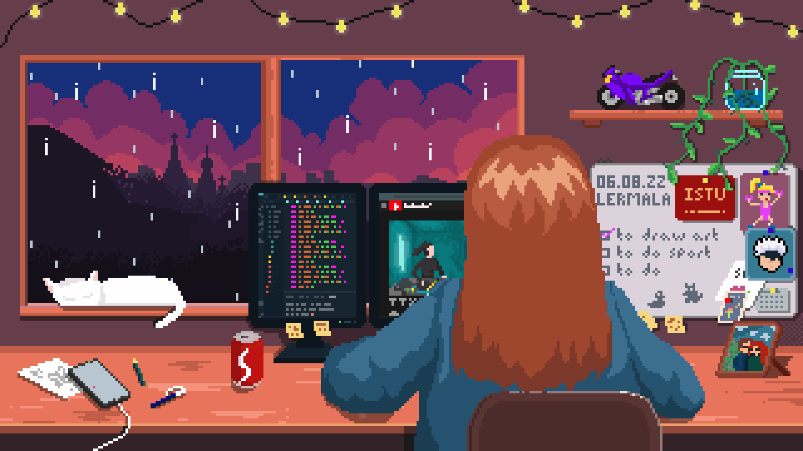
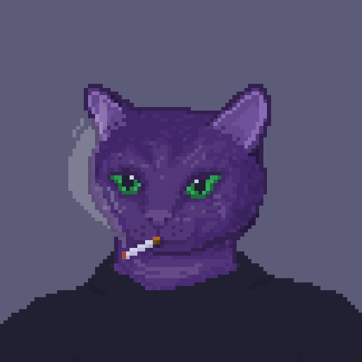

## Быстрое ознакомление

- **Резюме** с моим опытом можно посмотреть и скачать по [ссылке](https://drive.google.com/file/d/1MtXn21gXXs3fYGf7KxJEfuY3WRjsAFGJ/preview).

- **Примеры** моих работ можно посмотреть [тут](../docs/examples/) (примеры документации, схем bpmn, макеты интерфейсов).

- Карту моего опыта (**скиллы и инструменты**) можно посмотреть [по ссылке xmind](https://xmind.app/m/vLdZTG).

Дальше более подробная информация обо мне.

## Обо мне

Меня зовут Колодина Валерия, мне 23 года, живу в г. Иркутск (GMT+8).

Я инженер-аналитик в [ООО «Сибирский центр информационных технологий»](https://isib.ru) уже почти 2 года. Тут успела побывать на разных ролях команды: тестировщик, аналитик, разработчик, руководитель разработки и руководитель проекта. Дальше хочу развиваться как системный аналитик.

В работе ценю искренность с командой и с заказчиком. Всегда ставлю себя на место заказчика и стараюсь подобрать наиболее подходящее решение под его цели. Очень радуюсь, когда мои усилия приносят пользу, - это в работе я люблю больше всего.

Мечтаю побывать в Японии, увидеть северное сияние, а также посетить Диснейлэнд :)

## Опыт работы

<!-- ### Хронология 

1. 13-18 лет - подработка на лето или после школы продавцом в магазинах детской одежды Catimini, магазине игрушек Hello Kitty, сувенирный I'm Siberian.
2. 19-21 лет - делала студенческие работы знакомым с ВУЗа (лабораторные, курсовые, дипломы).
3. 20-21 год - техподдержка в Форусе.
4. 21-23 год - Инженер-аналитик, ИСИБ -->

### Инженер-аналитик, сент 2022-авг 2024
Компания: [ООО «Сибирский центр информационных технологий»](https://isib.ru), Иркутск
Суммарно: 1 год 11 месяцев

#### Задачи

- **Сбор требований**. Интервьюирование клиентов, анализ и формализация требований (ТЗ, схемы bpmn, макеты). Проведение обучения пользователей.
- **Управление проектами по внедрению и ТП СЭД Тезис.** Организация работы команды, постановка и приемка задач. Оценка стоимости, сроков. Общение с заказчиком (госсектор и ЮЛ).
- **Составление проектной документации**. ТЗ, документация REST
API, руководства пользователя и администратора, документация по разработке, внутренняя база знаний по проекту.
- **Разработка**. Управление командой разработки: постановка и
приемка задач разработчиков, код-ревью, выкат доработок в
продакшн. Разработка на Java с использованием Cuba Platform (jmix).
- **Поддержка внутренних сервисов**. Решение вопросов и оптимизация работы в СЭД Тезис. Обучение и курирование коллег, ведение базы знаний. Составление презентаций, дизайн и разработка сайта на Tilda.

#### Почему ушла
Очень любила это место и команду, но не видела дальнейшего развития в этой компании. Команда довольно маленькая, поэтому приходилось делать все подряд (тестирование, аналитика, разработка, техническая поддержка, проджект-менеджмент), из-за этого же были частые переработки и выгорания. Я решила сделать акцент на аналитической работе, поэтому ушла.

<!-- Коммерческие проекты:
- Проект Б - Внедрение и доработка СЭД Тезис в Администрацию Б (окт 2022 - н. в.)
- Проект У - Техподдержка уже внедренного нами СЭД ТЕЗИС в Администрацию У (окт 2022 - н. в.).
- Проект И - Настройка интеграции, аудит процесса "Управление посещениями студентов" и написание ТЗ под доработку Битрикс24 для ВУЗа И.
- Проект А - Аудит системы Тезис и процессов, доработок (внедряли не мы). Техподдержка (фев 2024 - н.в.).

|Название|Описание и мои роли в проекте
|Промежуток|
|-|-|-|
|Проект Б|Внедрение и доработка СЭД Тезис в Администрацию Б. **Роли:** <ul><li>Аналитик (окт 2022-мар 2024)</li><li>Разработчик+руководитель разработки (фев 2024-мар 2024)</li><li>Руководитель проекта и разработки (мар 2024-н.в.)</li></ul>|окт 2022 - н. в.|
|Проект У|Техподдержка уже внедренного нами СЭД ТЕЗИС в Администрацию У. **Роли:** <ul><li>Аналитик (окт 2022-мар 2024)</li><li>Руководитель проекта (мар 2024-н.в.)</li></ul>|окт 2022 - н. в.|
|Проект И|Настройка интеграции, аудит процесса "Управление посещениями студентов" и написание ТЗ под доработку Битрикс24 для ВУЗа И. **Роли:** <ul><li>Руководитель проекта+аналитик (дек 2022-мар 2023)</li></ul>|дек 2022-мар 2023|
|Проект А|Аудит системы Тезис и процессов, доработок (внедряли не мы). Техподдержка **Роли:** <ul><li>Руководитель проекта+аналитик (фев 2024-н.в.)</li></ul>|фев 2024 - н.в.|

Внутренние проекты:

- Техподдержка внутреннего СЭД Тезис (ноя 2022 - н.в.)
- Дизайн (figma) и создание сайта на Tilda. Сайты isibi.ru (мар 2023-июн 2023)
- Создание и заполнение базы знаний с нуля по продукту СЭД Тезис (май 2023 - н. в.) -->

### Консультант СЭДО, янв 2021 - сен 2021
Компания: [ООО РСЦ «Форус»](https://www.forus.ru/), Иркутск
Суммарно: 9 месяцев

#### Задачи

- Консультация клиентов по вопросам использования СЭДО и типового функционала продуктов 1С по телефону/через чат (1С-ЭДО и 1С-Отчетность).
- Разработка инструкций для клиентов и сотрудников.
- В месяц окончания стажировки заняла 2-е место в своем отделе (по количеству зарегистрированных обращений, по количеству закрытых обращений и по
среднему времени обработки), далее в течение следующих 3-х месяцев занимала 1-е место в отделе.

#### Почему ушла

Это была подработка на время учебы в ВУЗе на 3-м курсе и лето. Ушла с началом выпускного курса, чтобы спокойно написать диплом.

<!-- ### Хронология 

1. 13-18 лет - подработка на лето или после школы продавцом в магазинах детской одежды Catimini, магазине игрушек Hello Kitty, сувенирный I'm Siberian.
2. 19-21 лет - делала студенческие работы знакомым с ВУЗа (лабораторные, курсовые, дипломы).
3. 20-21 год - техподдержка в Форусе.
4. 21-23 год - Инженер-аналитик, ИСИБ -->

### Выполнение студенческих работ (2020-2022)
Компания: -
Суммарно: 3 года

#### Задачи

- Делала студенческие работы знакомым с ВУЗа (лабораторные, курсовые, дипломы).
- Проводила видеоуроки для нуждающихся (бесплатно), либо делала вместо некоторых работы, если не хотели или не было времени на самостоятельные работы.

#### Почему ушла
Это была подработка на время учебы. С выпуском из ВУЗа работы делать закончила.

### Продавец-консультант (2015-2019)
Компания: -
Суммарно:  30 мес 
3 мес * 5 лет = 15 мес (летние каникулы)
1 мес * 5 лет = 5 мес (зимние каникулы)
3 мес * 5 лет = 10 мес (после уроков)

#### Задачи

- Периодическая подработка после школы и на все каникулы. Работала в разных магазинах: детская одежда Catimini, магазин игрушек Hello Kitty, сувенирный магазин I'm Siberian.

#### Почему ушла
Это была подработка на время школы. После поступления у меня появилась стипендия, поэтому сразу же ушла с этой подработки. Работать там мне очень не нравилось, т. к. бОльшую часть времени нужно просто сидеть и ждать покупателей (график 10.00-22.00 2/2).

## Мои скиллы

На карте отобразила скиллы, которые имею на текущий момент. Серым отметила то, что использовала в учебных/личных целях.

<iframe src='https://www.xmind.app/embed/vLdZTG/' width='750' height='692' frameborder='0' scrolling='no' allowfullscreen="true"></iframe>

Также можно посмотреть оригинал [по ссылке](https://xmind.app/m/vLdZTG).

## Образование

### Образование

2019-2022 г. окончила бакалавриат по специальности "Информационные системы и технологии" с отличием в [Иркутском политехе (ИРНИТУ)](https://www.istu.edu).

### Доп. образование и сертификации

- Сертификат *«Специалист по внедрению системы управления документами и задачами Тезис»* от ООО «Хоулмонт» № 6BKOYP-048, 2022 г.
- Сертификат *«Разработчик клиентских проектов на базе 2023 системы управления документами и задачами Тезис»* от ООО «Хоулмонт» № 5NGNV2-044, 2022 г.
- Образовательный курс *«Бизнес-презентации в 2021 PowerPoint»* от Changellenge >> Toolkit, 2021 г.
- Образовательный курс *«Введение в язык Java и платформу разработки»* от КРОК, 2021 г.

## Примеры моих работ

Примеры моих работ можно посмотреть [тут](../examples/). Тут есть примеры документаций, схем bpmn, макеты интерфейсов.

## Мои увлечения

- Программирование
- Рисование
- Зал
- Компьютерные игры
- Аниме и манга + японская культура

Ниже более подробно по некоторым пунктам.

### Программирование
У меня есть два сайта, на которых я изучала веб-разработку и одно android-приложение, которое делала в рамках диплома.


  

  

  


### Рисование
Также я увлекаюсь рисованием. Я училась рисовать сама, ниже есть примеры моих работ


  

  

  

  

  
  
  

  



Также одно время очень увлекалась пиксель-артом, но совсем немного :)

## Забавные факты обо мне

- Мой рост 153 см, поэтому часто меня кличут *гномом* или *полторашкой*
- У меня морская болезнь, поэтому меня укачивает в машинах и автобусах, но не укачивает в самолетах :)
- У меня красный диплом и золотая медаль в школе
- Сначала научилась рисовать в paint, а потом уже на бумаге