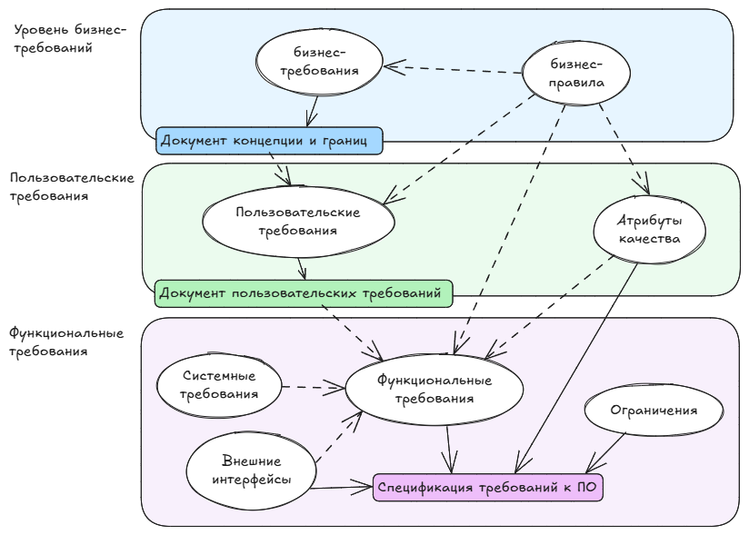
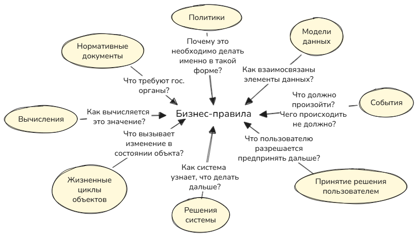




**Требования** - это спецификация того, что должно быть реализовано. В них описано поведение, свойства/атрибуты системы.

На основе "Разработка требований к программному обеспечению" Карл Вигерс и Джой Битти.

## Уровни и типы требований
Требования к ПО состоят из трех уровней:
1. Бизнес-требования
2. Пользовательские требования
3. Функциональные требования

Вдобавок к каждой системе есть свои **нефункциональные требования**.

Список терминов:
| Понятие                     | Определение                                                                                                                                | Пример                                                                                   |
|---------------------------------|------------------------------------------------------------------------------------------------------------------------------------------------|------------------------------------------------------------------------------------------|
| **Бизнес-требование**               | Высокоуровневая бизнес-цель заказчика системы.                                                                                                   | "Увеличить продажи за пределами Росссии на 25% за следующие полгода".                    |
| Бизнес-правило                  | Стандарты, законы, правила, определяющие или ограничивающие определенный аспект бизнеса. По сути это не требование, а источник требований ПО.  |   - Новый клиент должен авансом оплатить 30% гонорара за консультацию. - Одобрение отпусков должно соответствовать политике отпусков отдела управления персоналом.                                                                                       |
| Ограничение                     | Ограничение на выбор вариантов, доступных при проектировании и разработке продукта.                                                            |                                                                                          |
| Внешнее требование к интерфейсу | Описание взаимодействия между системой и внешним миром (другое ПО, пользователи, аппаратура).                                                  |                                                                                          |
| Характеристика (feature)        | Возможности системы, представляющие ценность для пользователя и описаны рядом функциональных требований                                        | Избранные страницы, закладки браузера                                                    |
| **Функциональное требование**       | Описание требуемого поведения системы в определенных условиях.            |                                 |
| **Нефункциональное требование**     | Описание свойства/особенности, которым должно обладать системы или ограничения, которое должна соблюдать система (скорость работы, время отклика, шифрование данных, соответствие стандартам, масштабируемость, интуитивность интерфейса).                              |   система должна обрабатывать транзакции в течение 2 секунд; система должна соответствовать требованиям GDPR для защиты данных; система должна поддерживать растущее число пользователей без снижения производительности.                                                                                   |
| Атрибут качества                | Вид нефункционального требования, описывающего характеристику сервиса/производительности продукта.                                             | Производительность, доступность                                                          |
| Системное требование            | Требование верхнего уровня к продукту, состоящему из многих подсистем, которые могут представлять собой ПО или совокупность ПО и оборудования. Они определяют минимальные и рекомендуемые характеристики аппаратного и программного обеспечения, необходимые для оптимальной работы системы. |  Объем оперативной памяти, тип процессора, требования к ОС, характеристики портов и подключений                                             |
| **Пользовательское требование**     | Задача, которую определенные классы пользователей должны иметь выполнять в системе или требуемый атрибут продукта.                             | Поиск орфографических ошибок, добавление слов в словарь, выбор языка проверки орфографии |


 *Системные* требования определяют, на какой платформе и как должна быть реализована система, а *нефункциональные* — как система должна функционировать с точки зрения качества и условий работы.


### Бизнес-требования
Описывают *почему* организации нужна такая система.

Пример:
- На 25% снизить затраты на сотрудников у стойки в аэропорту.

### Пользовательские требования
Описывают цели или задачи, которые пользователи должны иметь возможность выполнять с помощью разрабатываемого продукта. Включают в себя описания атрибутов или характеристик продукта, которые важны для удовлетворения пользователей.

Пользовательские требования описывают, *что* пользователь должен иметь возможность делать с системой. Тут важно понять, что реальные пользователи хотят достичь с помощью продукта.

Пример:
- Регистрация на рейс с помощью веб-сайта или терминала в аэропорту. В формате пользовательской истории: "Как пассажир я хочу зарегистрироваться на рейс, чтобы можно было сесть на самолет".
- Я как клиент хочу иметь возможность просматривать доступные товары, добавлять их в корзину и оформлять заказ.
- Я как покупатель хочу иметь возможность сортировать и фильтровать товары по цене, рейтингу и популярности.
- Я как покупатель хочу иметь возможность сравнивать товары в магазине по характеристикам (габариты, размер, цена и т.д.).0

### Функциональные требования
Определяют *каким* должно быть поведение продукта в тех или иных условиях. Описываются в форме "должен" или "должна".

Пример:
- При добавлении товаров в корзину должна автоматически рассчитываться суммарная стоимость всех добавленных товаров.
- У пассажира должна быть возможность распечатать посадочные талоны на все рейсы, на которые он зарегистрировался.
- Если в профиле пассажира не указаны предпочтения по выбору места, система резервирования должна сама назначить ему место.
- Система должна позволять пользователям просматривать доступные товары, добавлять их в корзину и оформлять заказ.

### Нефункциональные требования

В дополнение к функциональным требованиям спецификация SRS содержит нефункциональные. Нефункциональные требования могут описывать:
- Атрибуты качества (параметры качества, требования по уровню обслуживания). Например: производительность, доступность, переносимость.
- Внешние интерфейсы - подключения к др. ПО, аппаратным устройствам, пользователям.
- Ограничения - накладывают границы на возможности выбора разработчика при проектировании продукта.

### Бизнес-правила

Если клиент заявляет, что только определенные классы пользователей могут выполнять определенные действия при определенных условиях, он, возможно, описывает бизнес-правило. Вообще это не требования к ПО, но из них можно вывеси функциональные требования, чтобы обеспечить выполнение этих правил.

Типы бизнес-правил:
1. *Факты* - это верные утверждения о бизнесе на определенный момент времени. Примеры: "на каждую посылку нанесен уникальный штрих-код", "книги, размер которых > Х, размещаются в разделе широкоформатных".
2. *Ограничения* определяют, какие операции не может выполнить система и ее пользователи. Примеры: "Посетитель библиотеки может отложить до 10 книг", "При задержке рейса на 1 час клиентам должна выдаваться бесплатная вода", "В веб-приложении не должно быть никаких HTML тегов, не соответствующих стандарту HTML 5".
3. *Активаторы операций* - правила, при определенных условиях инициирующие выполнение определенных действий. Примеры: "Если срок хранения истек, то необходимо уведомить владельца...", "После добавления клиентом товара в корзину отобразить аналогичные товары, которые другие клиенты вместе с этим товаром".
4. *Выводы* (предположительные знание или производные факты) - создают новые факты на основе других фактов, часто записываются в формате "если-то". Примеры: "Если платеж не поступил в течение 30 календарных дней с момента отправка счета, то счет считается просроченным", "Химикаты с токсичностью агента LD50 ниже 5 мг на килограмм массы мыши считаются опасными".
5. *Вычисления* преобразуют существующие данные в новую информацию с использованием математических формул и алгоритмов. Примеры: "общая стоимость заказа вычисляется как ..." "цена единицы товара снижается на 10% при заказе от 6 до 10 единиц, на 20% - при заказе от 11 до 20 единиц".
6. *Термины* - важные для бизнеса слова, фразы и аббревиатуры.

Варианты документирования:
- [Каталог бизнес-правил]()
- Формулирование в функциональные требования, не выделяя отдельный каталог бизнес-правил.
- [Матрица ролей и разрешений]() (как вариант описания ограничений)
- [Таблица принятия решений]() (для описания активаторов решений)
- Модели данных (иногда применяют для описания фактов)

## Разработка и управление требованиями
### Разработка требований
#### Выявление и сбор
Выявление и сбор требований (elicitation). Ключевые действия:
- Определение классов ожидаемых пользователей продукта и других заинтересованных лиц.
- Понимание задач и целей, а также бизнес-целей, которым соответствуют эти задачи.
- Изучение среды, в которой будет использоваться новый продукт.
- Работа с отдельными людьми каждого класса пользователей для понимания их потребностей и ожиданий в отношении качества.

#### Анализ
Анализ требований (analyzing requirements) - получение более точного и обширного понимания требований. Ключевые действия:
- анализ информации от пользователей (отделение их задач от функциональных и нефункциональных и др.)
- распределение требований (по виду требований, по компонентам ПО)
- разложение высокоуровневых требований до нужного уровня детализации
- согласование приоритетов

#### Документирование
Документирование (specification) - преобразование собранных потребностей в письменные требования и диаграммы.

#### Утверждение
Утверждение требований (validation). Ключевые действия:
- проверка задокументированных требований для устранения всех недостатков до принятия требований группой разработки.
- разработка приемочных тестов и критериев приемки.

### Управление требованиями
Действия:
- определение основной версии требований (согласовнных, проверенных и одобренных) обычно для конкретной итерации разработки
- оценка влияния предлагаемых требований
- обсуждение новых обязательств, основанных на оцененном влиянии изменения требований
- определения зависимостей между требованиями
- отслеживание отдельных требований до проектирования
- отслеживание состояния требований на протяжении всего проекта

## Проблемы при работе с требованиями
Многие люди ошибочно считают, что время, потраченное на обсуждение требований - просто отсрочка выпуска продукта. На самом деле, если не уделить должное внимание проработке требований на старте, то в дальнейшем исправление будет стоить все дороже. Возможные выгоды:
- меньше дефектов в требованиях и в готовом продукте
- меньше переделок
- быстрее разработка
- меньше ненужных функций
- ниже стоимость модификации
- меньше недопонимания
- меньше расползание границ проекта
- удовлетворение всех сторон выше

### Недостаточное вовлечение пользователей
Причины:
- Заказчик не понимает, почему важнособрать требования.
- Разработчики считаю, что все знают о потребностях пользователей.
- Трудно добраться до реальных пользователей.
- Бизнес-аналитик может неправильно понять и задокументировать потребности.

Как предотвратить:
- регулярные совещания с пользователями, 
- тщательная проверка пользователями.

### Небрежное планирование
- Неопределенные, плохо понятые требования порождают слишком оптимистичные оценки.
- Недостаточное взаимодействие с пользователями
- Недетализированная спецификация

Как предотвратить:
- Проработка требований с пользователями и рзработчиками.

### Разрастание требований пользователей
Требования могут меняться из-за чего проект выходит за установленные рамки по срокам и по бюджету. Требования *всегда* будут изменяться и расти, поэтому важно заложить доп. ресурсы на это еще на старте.

Как предотвратить:
- уточнить бизнес-цели, стратегическое видение, ограничения и критерии успеха. 
- Приоритетизация новых требований.

### Двусмысленные требования
- Пользователь может инетприировать одно и то же по-разному.
- У разных читателей возникает разное понимание требования.

Как предотвратить:
- Избегать двусмысленных слов и фраз.
- Приглашать различных представителей пользователей для официальной экспертизы.
- Написание варианта тестирования.
- Построение прототипа.

### Требования-"бантики"
Требования-"бантики" - отсутствующие в спецификации функции, добавленные разработчиками. Требования красивых элементов интерфейса, не представляющих ценности для продукта.

Как предотвратить:
- Четкое соблюдение требований спецификации.
- Понимать, почему именно это требование включено в продукт.
- Проверка, входит ли требование в рамки проекта.

### Пропущенные классы пользователей

Как предотвратить:
- После идентфикации убедитесь, что голос каждого услышан.
- Не забудьте о неочевидных пользователях (например о сотрудниках поддержки).
- Возможно есть пользователи, которые не в курсе о существовании проекта.