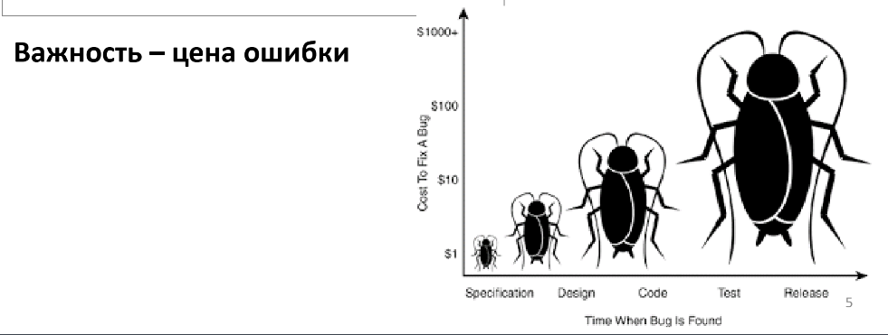
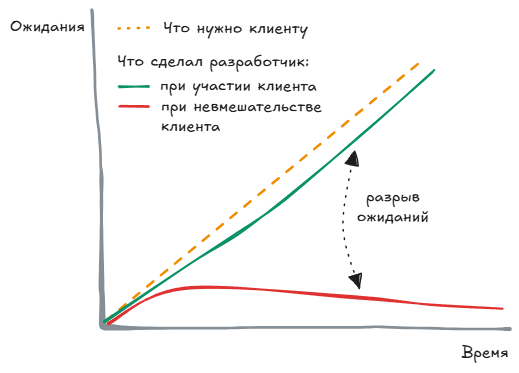






## Введение

Цель этой шпаргалки - дать клиентам/пользователям общее представление о работе с требованиями. Тут разбираются основные вопросы:
- Что такое требования и зачем они нужны
- Роль пользователей в формировании требований
- Процесс и правила работы с требованиями

## Что такое требования

**Требования** — это описание того, что система должна делать или как она должна себя вести. Это основа всего проекта: по ним работает команда, оцениваются сроки и стоимость, и по ним же вы принимаете готовый продукт.

Если представить проект как строительство дома, то требования — это чертёж, без которого строители могут сделать “не то”.

**Заинтересованное лицо (стейкхолдер)** — это любой человек или организация, которые заинтересованы в проекте или влияют на него (прямо или косвенно).

**Конечный пользователь** - пользователи, кто прямо или косвенно взаимодействуют с продуктом.


  Требования — это способ сделать ваши ожидания _понятными и измеримыми_ для команды разработки.


## Примеры требований

**Сценарий**: Компания запускает мобильное приложение, чтобы пользователи могли заказывать еду из ресторанов онлайн.

1. **Бизнес-требования:** _(зачем вообще нужен проект)_ Увеличить количество заказов на 25% в течение 6 месяцев за счёт удобного мобильного приложения для доставки еды.
2. **Пользовательские требования** (какие задачи пользователь будет решать в системе)
   - Пользователь должен иметь возможность оформить заказ.
   - Пользователь должен иметь возможность отслеживать статус доставки в реальном времени.
3. **Функциональные требования** (что должна делать система, чтобы пользователь смог достичь своей цели)
    - Для *"Пользователь должен иметь возможность оформить заказ"*:
      1. Система должна предоставлять каталог ресторанов с фильтрацией по кухне, цене и рейтингу.
      2. Система должна позволять добавлять блюда в корзину и изменять их количество.
      3. Система должна рассчитывать итоговую сумму заказа.
      4. Система должна предоставлять форму оформления заказа (адрес, телефон, комментарий).
    - Для *"Пользователь должен иметь возможность отслеживать статус доставки в реальном времени"*:
      1. Система должна получать от курьера данные о статусе доставки (принят, в пути, доставлен).
      2. Система должна обновлять статус заказа на экране пользователя.
      3. Система должна уведомлять пользователя при изменении статуса.
4. **Нефункциональные требования** (как система должна работать)
   - Приложение должно запускаться не дольше 3 секунд.
   - Интерфейс должен быть доступен на русском и английском языках.


  Нам тут важно сформировать именно **пользовательские требования**. Из них дальше вытекают функциональные и нефункциональны требования.


## Зачем нужны требования?

Мы фиксируем требования, чтобы:
- все участники (вы, аналитик, разработчики, дизайнеры, тестировщики) одинаково понимали, что создаём;
- избежать ошибок и недопонимания на поздних этапах;
- можно было планировать время, бюджет и приоритеты.


  Без зафиксированных требований всё строится на предположениях — и результат почти всегда “не тот, что ожидали”.


## Почему нельзя сразу начать разработку?

Если начать писать код без понимания требований — это как строить дом без проекта: быстро, но с риском, что потом придётся всё переделывать.

Сбор требований занимает немного времени, но экономит недели и месяцы на исправлениях.

## А без нас нельзя?

**Ваша роль — главная**, потому что только вы знаете свой бизнес и то, что действительно важно.

Успех проекта зависит не только от разработчиков, но и от зрелого поведения клиента.
Процесс разработки требований — это двусторонний диалог, где:
- клиент выражает **что нужно** и **почему**;
- аналитик помогает определить **как это можно реализовать**;
- обе стороны **разделяют ответственность** за конечный результат.

Лучший способ минимизировать разрыв ожиданий: организация частых точек контакта с клиентом.

## Как проходит работа с требованиями?

Работа с требованиями - это _процесс_, который будет идти на протяжении всего проекта. Примеры совместной работы с требованиями:
- **Интервью** или **опрос**. Вы 1 на 1 рассказываете текущий процесс работы, ваши задачи, проблемы и ожидания от приложения;
- **Наблюдение рабочего места**. Вы выполняете свои рабочие задачи, аналитик наблюдает.
- **Семинары**. Это совместное обсуждение требований, определение приоритетов требований.
- **Чтение документации**. Все требования мы будем документировать, чтобы ничего не потерять. Вам важно проверять, все ли ваши требования учтены.
- **Тестирование прототипа**. Прототип - это ранняя версия приложения с самыми основными функциями. Мы выдаем вам доступы к прототипу, вы его смотрите, тестируете и даете нам обратную связь.


  Нам важно видеть ваш **реальный процесс**, даже если не соответствует инструкции, регламенту. Наша цель - это сделать продукт, который будет вам помогать. Для этого нам важно понимать ваши текущие проблемы.


**От вас важно:**
- честно рассказывать, как сейчас работает ваш процесс;
- показывать проблемы, с которыми вы сталкиваетесь во время работы;
- объяснять, чего вы хотите достичь;
- давать обратную связь.


  Вам не нужно знать технические детали — это зона ответственности команды разработки. Ваша задача — говорить про **цели, бизнес, пользователей, неудобства, ожидания**.


## Можно ли изменить требование?

**На ранних этапах нельзя знать абсолютно всех требований** и со временем они неизбежно меняются. Утверждение/согласование требований в этом случае означает _согласие на данный момент (этап)_. Тут важно понимать, что требования могут измениться, однако это может потребовать переоценку.

Ваше желание изменить требование будет фиксироваться, проверяться и согласовываться с другими участниками.


  Для подтверждения требований в месте подписи обычно добавляем:

_Подтверждаю, что настоящий набор требований наилучшим образом представляет наше понимание требований к проекту на данный момент и что описанная система удовлетворит наши потребности. Я согласен в будущем вносить изменения требованиям, определенным в проекте. Я понимаю, что изменения могут потребовать переоценки стоимости, ресурсов и сроков сдачи проекта._


## Права и обязанности клиента
### Права клиента

У вас есть право: 
1. Иметь дело с аналитиком, который разговаривает на вашем языке 
2. Иметь дело с аналитиком, хорошо изучившим ваш бизнес и цели, для которых создается система 
3. Потребовать, чтобы аналитик зафиксировал требования в надлежащей форме 
4. Получить подробный отчет о будущих процедурах и результатах процесса фомрулирования требований. 
5. На изменение ваших требований 
6. На взаимное уважение 
7. Знать о вариантах и альтернативах требований и их реализации 
8. Описать характеристики, упрощающие работу с продуктом 
9. Узнать о способах корректировки требований для ускорения разработки за счет повторного использования. 
10. Получить систему, функциональность и качество которой соответствует вашим ожиданиям.

### Обязанности клиента
Клиент обязан: 
1. Ознакомить аналитиков и разработчиков с особенностями вашего бизнеса 
2. Потратить столько времени, сколько необходимо на уточнение требований 
3. Точно и конкретно описать требования к системе 
4. Принимать своевременные решения относительно требований 
5. Уважать определенную разработчиком оценку стоимости и возможности реализации ваших требований 
6. Определять реалистичные приоритеты требований совместно с разработчиками. 
7. Проверять требования и оценивать прототипы 
8. Определить критерии оценки 
9. Своевременно сообщать об изменениях требований 
10. Уважительно относиться к процессам создания требований.

## Итог: у всех одна цель

Когда при работе над проектом нагнетается напряжение, очень легко забыть, что **у всех участников одна единая цель** - создать программный продукт, ценный для бизнеса и отвечающий чаяниям всех участников проекта.
