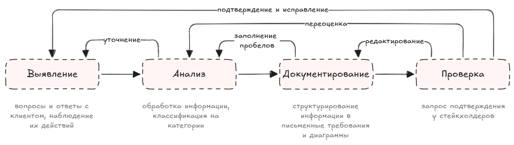
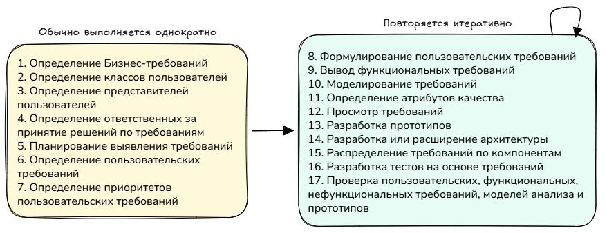
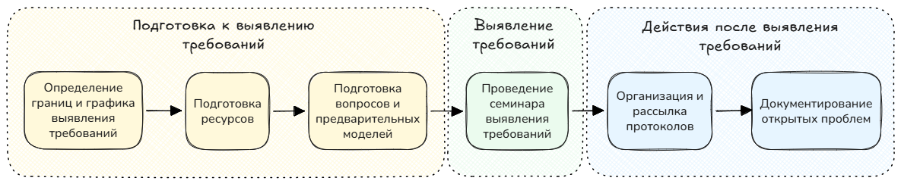
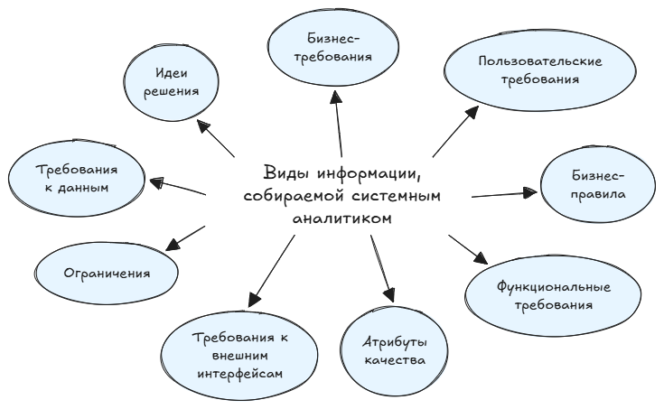
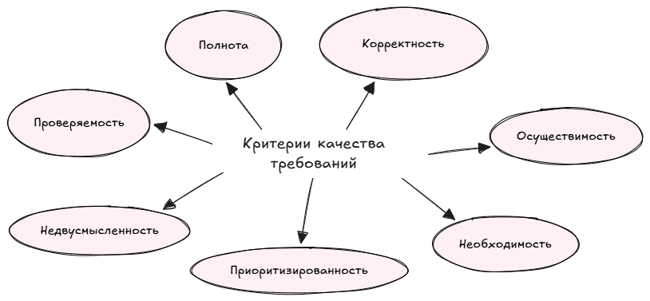
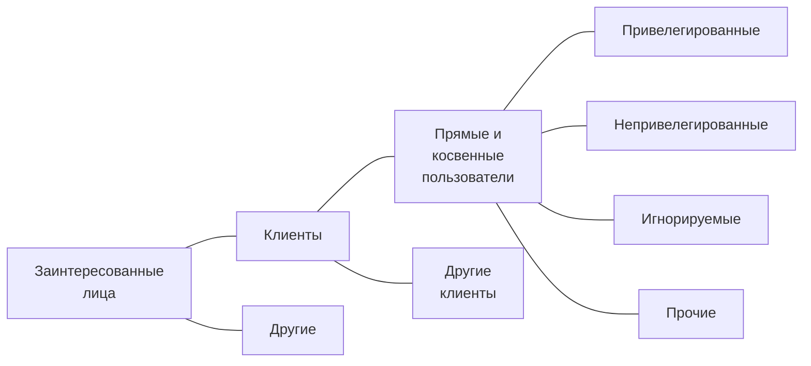
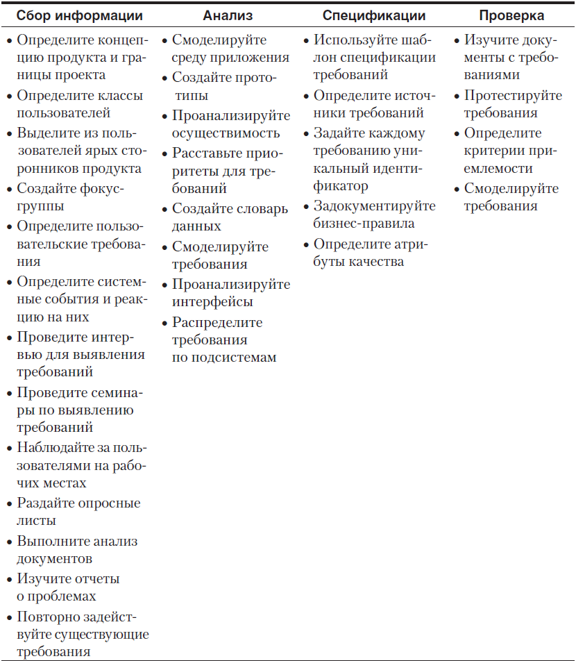

## О разработке требований

Разработка требований состоит из _выявления, анализа, документирования и проверки_. Эти действия выполняются не единожды: процесс сбора цикличен и может быть не последователен. 

Такой процесс продолжается на протяжении всего этапа разработки требований, а иногда и на протяжении и всего проекта (например в проектах agile).

Проекты по разработке ПО разнообразны, поэтому какого-то универсального шаблонного подхода для всех не существует. Однако есть каркас, который с разумными изменениями может подойти для большинства проектов.

Примерные шаги создания требований (п.1-7 выполняются единовременно, остальные - циклично):
1. Определение бизнес-требований
2. Определение классов пользователей
3. Определение представителей пользователей
4. Определение ответственных за принятие решений по требованиям
5. Планирование выявления требований
6. Определение пользовательских требований
7. Определение приоритетов пользовательских требований
8. Формулирование пользовательских требований
9. Вывод функциональных требований
10. Моделирование требований
11. Определение атрибутов качества
12. Просмотр требований
13. Разработка прототипов
14. Разработка или расширение архитектуры
15. Распределение требований по компонентам
16. Разработка тестов на основе требований
17. Проверка пользовательских, функциональных, нефункциональных требований, моделей анализа и прототипов

## 1. Выявление требований
### Методы выявления требований

1. Интервью
2. Семинары
3. Фокус-группы
4. Наблюдение
5. Опросные листы, анкетирование
6. Анализ системных интерфейсов (анализ систем, с которыми взаимодействует система)
7. Анализ пользовательского интерфейса (UI)
8. Анализ документов (инструкций, орг. структуры, шаблоны документов, отчетов)
9. Анализ логов (я смотрю пользовательские сессии и историю изменений, смотрю как карточки заполняются)
10. Опытная эксплуатация

Возможные методы выявления требований в проектах с разными характеристиками:

|                                          | Интервью | Семинары | Фокус-группы | Наблюдение | Опросные листы | Анализ системных интерфейсов | Анализ UI | Анализ документов |
| :---------------------------------------- | :------- | :------- | :----------- | :--------- | :------------- | :--------------------------- | :---------------------------------- | :---------------- |
| ПО для массового рынка                    | +        |          | +            |            | +              |                              |                                     |                   |
| Внутрикорпоративное ПО                    | +        | +        | +            | +          |                | +                            |                                     | +                 |
| Замена существующей системы               | +        | +        |              | +          |                | +                            | +                                   | +                 |
| Обновление существующей системы           | +        | +        |              |            |                | +                            | +                                   | +                 |
| Новое приложение                          | +        | +        |              |            |                | +                            |                                     |                   |
| Реализация коробочного ПО                 | +        | +        |              | +          |                | +                            |                                     | +                 |
| Встроенные системы                        | +        | +        |              |            |                | +                            |                                     | +                 |
| Географически распределенные стейкхолдеры | +        | +        |              |            | +              |                              |                                     |                   |

### Выявление требований пошагово

**Советы по подготовке к выявлению требований:**

1. Определи границы и графика выявления требований. Например заранее составь список вопросов/тем и целей, а также поделись им со стейкхолдерами.
2. Подготовь ресурсы (переговорные, доступы к системам, время участников).
3. Узнай больше о стейкхолдерах.
4. Подготовь вопросы. Тут стоит представить себя новым работником, которому нужно разобраться в задачах и обязанностях. Также подойдет метод исключений: "Что мешает успешно выполнить задачу?", "Назовите 3 вещи, которые больше всего раздражают в системе". Вопросы не должны вводить в тупик и подводить к определенному ответу, вопросы должны выглядеть как разговор, а не опрос.
5. Подготовь предварительные модели. Например заранее составь сценарий использования, а на самой встрече уже скорректируй готовую.

**Советы по выявлению требований:**

1. Объясни стейкхолдерам свои методы. Тут стоит пояснить особенности используемых методов и как они помогут (например варианты использования, схемы бизнес-процессов).
2. Обеспечь качественное протоколирование. В идеале иметь секретаря, который будет вести точный протокол встречи, однако не всегда это возможно. Лучше вести аудио и виедеозаписи встреч (с согласия участников), а также делать пометки и схему от руки.
3. Задействуй физическое пространство. Для вовлечения участников семинара используй маркерную доску, стикеры, проектор. Для удаленной конференции подойдет общая интерактивная доска по типу Miro.

**Советы по действиям после выявления требований:**

1. Рассылка протоколов. После каждого интервью или семинара рассылай заметки и протоколы с просьбой проверить их. Возможно стоит делиться заметками и с другими стейкхолдерами, которые не участвовали во встрече.
2. Документируй открытые проблемы. По ходу выявления требований будут встречаться вещи, требующие дополнительного исследования, а также пробелы в знаниях. Все эти пробелы важно фиксировать и записать вопросы к ним.

## 2. Анализ

### Классификация выявляемой информации

Не следует ожидать, что требования от клиента придут уже организованными, точными и классифицированными. Предоставляемую клиентом информацию аналитик должен уметь самостоятельно классифицировать и четко формулировать. На рисунке ниже приведено 9 категорий предоставляемой клиентом информации:

Часть информации может не попасть точно ни в одну из этих категорий, например:
- требования, которые не относятся к разработке ПО (например: необходимость обучения)
- ограничения проекта (например затраты или ограничения, налагаемые графиком)
- предположения или зависимость
- доп. информация хронологического или описательного характера
- избыточная информация, не несущая доп. ценности

Далее подробнее описано по каждому виду информации.

| Вид информации | Описание | Варианты документирования |
|---|---|---|
| Бизнес-требования | Вся информация, описывающая финансовые, рыночные и коммерческие выгоды, которые заказчик планирует получить от разрабатываемого продукта, относится к *бизнес-требованиям*. | - Контекстная диаграмма - Карта экосистемы - Дерево функций (feature tree) или диаграмма Исикавы - Список событий (event list) - Бэклог (backlog) — в agile-проектах |
| Пользовательские требования | При проектировании ПО для пользователей необходимо понять, что они собираются делать с его помощью. Тут лучше всего использовать *подход, ориентированный на пользователя* или на работу с продуктом. Ориентация на пользователей и ожидаемые варианты использования позволяет избежать создания функций, которые никто не будет применять, а также правильно расставит приоритеты.  Два наиболее часто используемых способа анализа пользовательских требований: *варианты использования* (use cases) и *пользовательские истории* (user story). Эти подходы позволяют сделать акцент на том, что пользователям нужно выполнить, а не спрашивать, что они хотят от системы.  Подробнее об этих подходах [Use case и User story]().  Основные утверждения пользователей о преследуемых ими целях или бизнес-задачах представляют собой пользовательские требования. Сотрудник, который говорит: *"Мне нужно сделать то-то и то-то"*, вероятнее всего описывает конкретный вариант использования. | - Варианты использования - Пользовательские истории - Таблицы «Событие — отклик» - Карта диалоговых окон - Макет интерфейса или технический прототип |
| Бизнес-правила | Если клиент заявляет, что только определенные классы пользователей могут выполнять определенные действия при определенных условиях, он, возможно, описывает бизнес-правило. Вообще это не требования к ПО, но из них можно вывести функциональные требования, чтобы обеспечить выполнение этих правил.    | - Каталог бизнес-правил - Матрица ролей и разрешений - Таблица принятия решений - Модели данных |
| Функциональные требования | Функциональные требования описывают ожидаемое поведение системы при определенных условиях и действиях, которые система позволит выполнить пользователям. Пользователи обычно описывают свои представления о работе системы, однако эти представления важно правильно и точно описать в спецификации. | - Спецификации требований к ПО - Схемы процессов (BPMN, EPC, IDEF0) |
| Атрибуты качества | Утверждения, насколько хорошо система должна выполнять что-то, называется атрибутами качества. Тут используются формулировки: быстрая, легкая, интуитивно понятная, удобная пользователю, устойчивая к сбоям, надежная и эффективная. Эти термины довольно субъективны, поэтому важно, чтобы атрибуты качества были сформулированы четко и поддавались проверке. |  |
| Требования к внешнему интерфейсу | Эти требования описывают связи системы с остальным миром (например другие системы или оборудование). Такие фразы, как *"Должна распознавать сигналы от..."*, *"Должна отправлять уведомления..."*, *"Должна уметь читать файлы формата ..."*. | - Схема взаимодействия (UML-диаграмма активности) |
| Ограничения | Ограничения, касающиеся дизайна и реализации, такие как определенный язык программирования, размеров файлов, определенные элементы интерфейса. Тут важно понимать причину ограничения, поэтому стоит задокументировать и причину обоснования для включения этого ограничения в требования. |  |
| Определения данных | Требования к данным могут включать описание формата, типа данных, допустимые значения или значения по умолчанию для элемента данных или структуры отчета. Тут важно ознакомиться с текущими и желаемыми отчетами. | - Словарь данных - ER-диаграммы - Диаграмма перехода состояний или таблица состояний |
| Идеи решений | Большинство информации, которую пользователи представляют как требования, на самом деле являются идеей решения (и не факт, что это оптимальный вариант). Тут важно «углубляться» в формулировки, чтобы обнаружить реальную потребность и отделить ее от «Мне просто кажется, так удобно».  В формулировке «Затем в *раскрывающемся списке* я выбираю штат, куда хочу отправить посылку» фрагмент *«в раскрывающемся списке»* описывает конкретный элемент интерфейса. Тут важно копнуть глубже и задаться вопросом: *«Почему именно в раскрывающемся списке?»*.  По итогу требование можно сформулировать так: *«Система должна позволять пользователю выбрать штат, куда он хочет отправить посылку»*. | - |

## 3. Документирование

Итог разработки требований - задокументированное соглашение между заинтересованными лицами о создаваемом продукте. Фиксация всех требований вместе в виде структурированного и читабельного материала, который могут проверить все заинтересованные лица гарантирует, что они понимают, на что соглашаются.

Способы представления требований:

- *документация*, в которой используется четко структурированный и аккуратно используемый естественный язык, подробнее о видах документов в разделе [Документация]();
- *графические модели*, иллюстрирующие процессы, состояния системы, отношения данных и др., подробнее о графических моделях и диаграммах в разделе [Моделирование]();
- *формальные спецификации*, где требования определены с помощью математически точных, формальных логических языков.

Существует очень много способов представления требований, много различных нотаций и диаграмм. Есть и универсальные, так и под конкретные узкие задачи. Для удобства выбора я составила [дерево решений с видами моделирования]().


  На самом деле мало кто любит тратить время на документирование, однако затраты на документирование знаний малы по сравнению со стоимостью получения этих знаний в какой-то момент в будущем.


## 4. Проверка
Проверка применяется, чтобы убедиться, что у них есть все требуемые свойства качественных требований. Проверку можно разделить на *верификацию* (соответствуют требования критериям качества) и *валидацию* (соответствуют требования бизнес-целям). Валидацию также называют *утверждением* требованием.

### Критерии качества требований

1. **Полнота**. Каждое требование должно содержать всю информацию, необходимую для его понимания, не оставлять пробелов или недомолвок.
2. **Корректность**. Под корректностью понимается точное соответствие запросам пользователей и бизнеса. Требования должны полностью удовлетворять нужды заинтересованных сторон, которые будут использовать эти требования для достижения конкретных целей.
3. **Осуществимость**. Требование должно быть осуществимо технически при известных ограничениях проекта (ресурсы, сроки, бюджет).
4. **Необходимость**. Каждое требование должно быть четкое обоснование необходимости. Для этого стоит указывать источник требования.
5. **Приоритизированность**. Требования должны быть упорядочены по важности, стабильности и срочности.
6. **Недвусмысленность**. Требования были сформулированы однозначно, без жаргона, аббревиатур и неясных фраз, чтобы не возникало различных трактовок. Рецензирование - хороший способ обнаружить двусмысленность, однако полностью устранить двусмысленность не получится.
7. **Проверяемость**. Проверяемость или тестируемость требований означает их способность быть проверенными через объективные тест-кейсы, которые ясно показывают правильность реализации. Для обеспечения проверяемости стоит задуматься о тестировании требований и включить тестировщика в рецензенты.

Подробнее о критериях с примерами: https://habr.com/ru/articles/842296/ 

### Рецензирование

*Рецензирование требований* (peer review) - это исследование требований на предмет выявления проблем любым другим лицом кроме его автора. Есть неформальное рецензирование, которое может помочь обнаружить формулировки, не соответствующщие характеристикам качественных требований:
- проверка за столом (peer deskcheck);
- коллективная проверка (passaround) ;
- сквозной разбор (walkthrough).

Также есть и формальное рецензирование - *экспертиза* (inspection), в упрощенном варианте - это размещение документа в электронном варианте с возможностью комментирования. Однако экспертиза в формате совещания более продуктивна.

### Прототипы требований

Прототипы - это ценный инструмент проверки требований. Прототипы помогают обнаружить отсутствующие требования до разработки, а также проверить, одинаково ли понимают требования все заинтересованные лица.

Варианты прототипов:
- карта диалоговых окон
- макет интерфейса или технический прототип

### Тестирование требований

Разработка тестов поможет выявить множество проблем с требованиями, даже если ПО еще не готово для тестирования.

*Критерии приемки* (acceptance criteria) и приемочное тестирование являются показателями, удовлетворяет ли продукт задокументированным требованиям. Приемочные тесты фокусируют на нормальных направлениях вариантов использования и их исключениях, а не на более редких альтернативных направления. Приемочные тесты часто оформляют в формате *ПМИ - Программа и методика испытаний* [подробнее о ПМИ]().

В проектах гибкой разработки часто создают приемочные тесты вместо подробных функциональных требований. Каждый тест описывает, как пользовательская история должна работать будучи реализованной в виде ПО.

## Как отобрать пользователей
### Классификация пользователей

Класс пользователей является подмножеством пользователей продукта, которые являются подмножеством клиентов продукта, которые являются подмножеством заинтересованных лиц.

Варианты группировки пользователей:
- по привилегиям доступа и уровню безопасности (рядовой пользователь, админ, гость)
- по задачам, которые им приходится решать при выполнении бизнес-операций
- по используемым функциям
- по частоте использования продукта
- по опыту в предметной области и опыту работы с компьютерными системами
- по используемой платформе (десктоп, ноутбуки, планшеты, смартфоны, специализированные устройства)
- по родному языку
- по виду доступа к системе - прямой или косвенный

Для выделения пользователей стоит обращать внимание на из *задачи*, а не на географию подразделения. У людей, выполняющих одну работу, формируются более или менее аналогичные функциональные требования, независимо от размера и вида подразделения в котором они работают.

Классы пользователей необязательно состоят из людей. Это могут быть программные агенты.

### Определение на практике

Один из полезных подходов называется "от большего к малому":

1. Опрос куратора - кто по его мнению будет использовать систему. Тут методом мозгового штурма нужно придумать как можно больше классов пользователей.
2. Выявление групп со схожими потребностями. Пользователей можно объединить в один класс или рассматривать как несколько подклассов одного крупного класса пользователей. Лучше сделать таких классов не больше 15 шт.

Также в определении классов помогают модели анализа:
- *Контекстная диаграмма*. На диаграмме внешние сущности за пределами системы - это кандидаты на классы пользователей.
- *Структурная схема организации* снижает вероятность пропустить какой-то класс пользователей в организации.

Определенные классы пользователей и их отличительные черты нужно задокументировать в спецификации требований к ПО. Вариант описания классов пользователей:

| Имя                        | Численность пользователей | Описание                                                                                                                                                                                                                                                                   |
| :------------------------- | :------------------------ | :------------------------------------------------------------------------------------------------------------------------------------------------------------------------------------------------------------------------------------------------------------------------- |
| Химики (привилегированный) | ~1000 в 6 зданиях         | Химики посредством системы запрашивают химикаты у поставщиков и со склада. Каждый химик использует систему несколько раз в день… Химикам необходима возможность искать в каталогах поставщиков спец. Хим. Структуры....                                                        |
| Специалист по закупкам     | 5                         | Сотрудники отдела закупок обрабатывают запросы химикатов. Они размещают и отслеживают выполнение заказов поставщиками. Не являются специалистами по химии, поэтому им важно, чтобы поиск в каталогах был максимально простым. Обращаются к системе примерно 25 раз в день. |

### Представители пользователей

Вместо того, чтобы строить предположения о желаниях пользователей, лучше спросить кого-нибудь из них. Для этого полезно создать *фокус-группы*. В фокус-группы важно включить все классы пользователей, а также людей с различным опытом.

Также полезно привлечь особенно активных **сторонников продукта** (product champion) со стороны пользователей. Хорошие сторонники делают очень много для успеха проектов. Их возможные обязанности:
- Планирование. Уточнение границ и ограничений продукта, определение интерфейсов, разработка путей перехода со старых приложений или от ручных операций
- Требования. Сбор требований от других пользователей, разработка сценариев и вариантов использования, определение атрибутов качества и приоритетов, оценка прототипа
- Проверка и утверждение. Рецензирование документов с требованием, создание тестовых данных, выполнение бета-тестирование
- Помощь пользователям. Подготовка части материала для обучения, демонстрация системы коллегам.
- Управление изменениями. участие в принятии решений о внесении изменений, оценка влияния изменений.

Некоторые методы agile включают наличие одного представителя заинтересованных лиц - владельца продукта (product owner). Он определяет концепцию продукта и отвечает за разработку и приоритеты бэклога (backlog) продукта.

## Приемы формулирования требований
todo: Шпаргалка: шаги и приемы разработки требований
