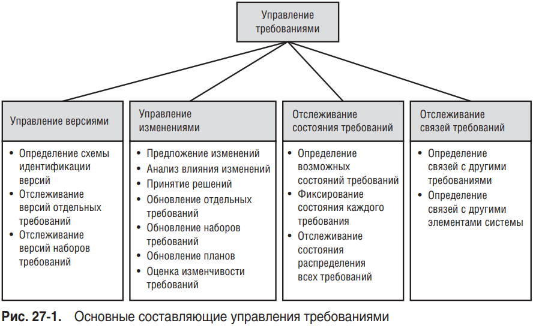
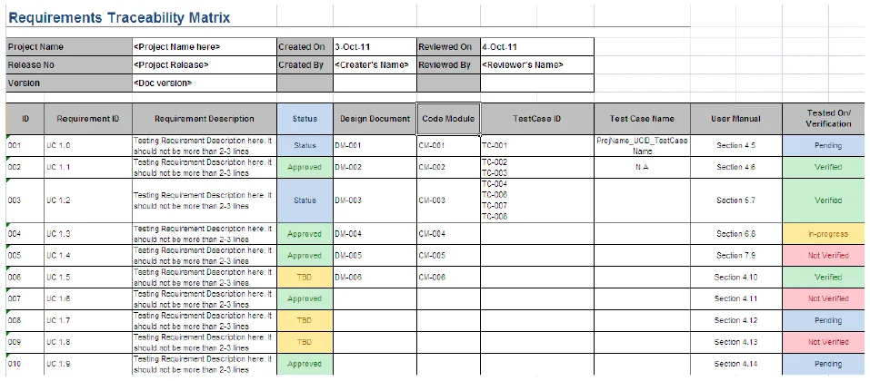
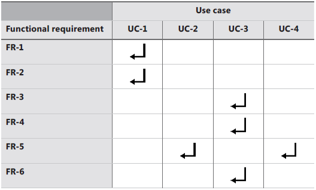
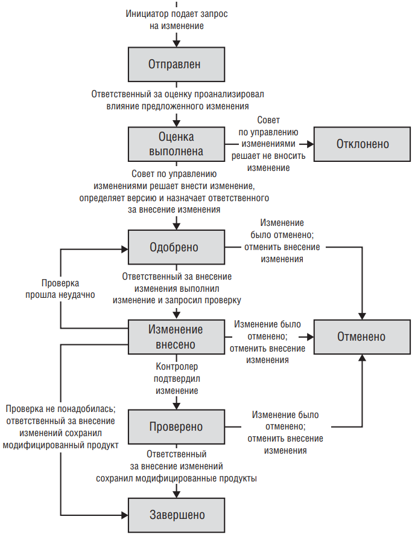
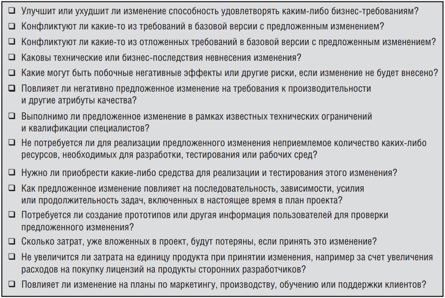

На основе "Разработка требований к программному обеспечению" Карл Вигерс и Джой Битти.

## Почему нужно управлять требованиями

Определить все требования к продукту практически невозможно, а по ходу проекта могут появиться и новые обстоятельства (развитие бизнес-потребности, изменение правил и политики).

Управление требованиями помогает убедиться, что усилия, затраченные на разработку требований, не потрачены в пустую. Эффективное управление требованиями может уменьшить неверные ожидания: стейкхолдеры будут проинформированы о текущем состоянии требований в ходе процесса разработки.


  Определенные изменения требований абсолютно правомочны, неизбежны и даже благоприятны.


## Процесс управления требованиями

Под управлением требованиями подразумевают все действия по обеспечению целостности, точности и своевременности обновления соглашения о требованиях в начале проекта. В управление требованиями включают: *управление версиями, управление изменениями, отслеживание состояния требований и отслеживание связей требований*.

На проекте важно определить, задокументировать и донести до всех участников, каким образом будет проводиться управление требованиями. При определении стоит обратить внимание:
- на инструменты, приемы и соглашения для управления версиями требований;
- на составление требований и их одобрение, определение базовых версий требований
- каким образом предлагаются новые требования/меняются существующие, а также как они обрабатываются, обсуждаются и доводятся до всех стейкхолдеров
- на оценку влияния предложенного изменения, как это изменение скажется на планах и обязательствах проекта
- на атрибуты требований и процедуры отслеживания состояний, а также кто их будет менять
- кто отвечает за обновление информации связей требований и когда это должно делаться
- как отслеживаются и разрешаются проблемы с требованиями
- как эффективно использовать инструменты управления требованиями


  Основную ответственность за управление требованиями несет бизнес-аналитик: от определения механизма хранения требований до отслеживания и координации изменений.


### Управление версиями

На стадии разработки требований (после рецензирования и утверждения) формируется . Последующие изменения разрешается вносить только через определенный в проекте процесс управления изменениями.

Каждая версия требований должна уникальным образом идентифицироваться. У каждого члена команды должен быть доступ к текущей версии требований, а изменения нужно ясно документировать и доводить до всех стейкхолдеров. Каждая версия требований должна содержать историю изменений, дату, причину изменения и автор изменения.

Как организовать управление версиями:
1. Простейший метод: именовать вручную каждую версию спецификации. Сами изменения можно вносить в режиме изменения текста в документах (например в Word есть такая функция).
2. Хранение документов в той же системе контроля версий, что используется для хранения исходного кода. Документы тут можно оформлять как в п.1 или использовать подход .
3. Наиболее надежный метод — это использование СУТр (). Статья, в которой можно ознакомиться с вариантами СУТр [Хабр / Какую систему управления требованиями выбрать: обзор инструментов](https://habr.com/ru/companies/pt/articles/821643/).
4. Jira и Confluence не являются СУТр в чистом виде, но их тоже можно использовать для управления требованиями. Тут поможет плагин [Requirements Yogi](https://www.requirementyogi.com).
5. Использование Excel. В таблицу можно включить идентификатор требования, версию, описание. Добавить ссылки на отдельные файлы.

### Управление изменениями

Для удобства работы с изменениями требований используются *атрибуты* требований. Это позволяет фильтровать, сортировать, оценивать требования и конечно же отслеживать изменения.

Возможные атрибуты требований:
- дата создания
- номер текущей версии требования
- автор
- приоритет
- состояние
- происхождение (источник требования)
- обоснование требования (почему оно включено в продукт)
- номер релиза, на который назначено требование
- контактное лицо или ЛПР по внесению изменений в требование
- критерии приемки, метод проверки

Такие атрибуты можно хранить в СУТр, БД или в обычной таблице.

### Отслеживание состояния

Отслеживание состояния требования позволяет более точно оценивать готовность проекта. Рекомендуемые состояния требований:

| Состояние | Определение |
|---|---|
| Proposed (Предложено) | Требование запрошено уполномоченным лицом. |
| In Progress (Разработка) | Бизнес-аналитик активно работает над требованием. |
| Drafted (Подготовлено) | Написана начальная версия требования. |
| Designed (Разработано)* | Элементы дизайна, в которых отражены функциональные требования, созданы и проверены. |
| Approved (Одобрено) | Требование проанализировано, его влияние на проект оценено, и оно включено в базовую версию. Ключевые заинтересованные лица согласовали требование, а команда разработки обязалась его реализовать. |
| Implemented (Реализовано) | Код, реализующий требование, разработан, написан и протестирован. Установлена связь требования с соответствующими элементами дизайна и кода. Реализация готова к тестированию, ревью и другим видам проверки. |
| Verified (Проверено) | Требование удовлетворяет критериям приёмки, корректность реализации подтверждена. Установлена связь требования с соответствующими тест-кейсами. Требование считается завершённым. |
| Delivered (Выпущено)* | Требование поставлено пользователям в составе релиза и доступно в продуктивной среде. |
| Deferred (Отложено) | Одобренное требование перенесено на более поздний релиз. |
| Deleted (Удалено) | Утверждённое требование удалено из базовой версии. Необходимо указать причины удаления и лицо, принявшее решение. |
| Rejected (Отклонено) | Требование было предложено, но не включено ни в один из будущих релизов. Необходимо указать причины отклонения и лицо, принявшее решение. |

### Отслеживание связей

Отслеживание связей требований или *трассировка требований (tracing requirements)* помогает следить за развитием требования в обоих направлениях — от первоисточника к реализации и наоборот. Чтобы реализовать *отслеживаемость* (traceable), каждое требование должно быть уникально и последовательно идентифицировано, чтобы можно было ссылаться на него однозначно в ходе работы над проектом.

Преимущества:
- обнаружение пропущенных требований (есть ли бизнес-требования без связки с пользовательскими? есть ли пользовательские требования без связки с функциональными?)
- поиск ненужных требований (есть ли функциональные требования без связки с пользовательскими/бизнес-требованиями = ненужные?)
- анализ влияния изменения
- поддержка и обслуживание
- отслеживание проекта
- повторное использование
- тестирование

Для отслеживания связей требований удобно использовать [матрицу трассировки](#матрица-трассировки).

## Матрица трассировки

*Матрица отслеживаемости требований*, которую также называют *матрицей трассировки* (Requirements Traceability Matrix, ) или *матрицей сопоставления требований*, показывает связи между требованиями и другими объектами. Такую матрицу хорошо создать после готовности спецификации и заполнять по мере выполнения работы.

Один из вариантов матрицы:
| Пользовательское требование | Функциональное требование | Элемент дизайна (диаграммы, таблицы, классы и др.) | Элемент кода | Тест |
|--|---|---|---|---|
| UC-28 | catalog.query.sort | Class `catalog` | `CatalogSort()` | search.7 search.8 |
| UC-29 | catalog.query.import | Class `catalog` | `CatalogImport()` `CatalogValidate()` | search.12 search.13 search.14 |

Матрицу трассировки удобно использовать при тестировании - в ней сразу видно требование и тест-кейс, а также ее можно легко подстроить под проект и добавить новые столбцы.

Еще один вариант матрицы - это двусторонняя матрица трассировки. Каждая ячейка указывает на наличие связи и большинство ячеек не заполнены.

Нефункциональные требования не всегда прослеживаются напрямую до кода. Однако некоторые нефункциональные требования создают производные функциональные (например требование целостности для аутентификации инициируют ФТ с помощью паролей или биометрии). В этих случаях следует отслеживать соответствующее функциональное требование в обратном направлении, к их родительским нефункциональным требованиям и в прямом до готового продукта.

### Типы матриц трассировки

1. Прямая трассировка (Forward Traceability). Связывает требования с тестовыми кейсами. Показывает, как требования переходят на следующие стадии разработки — функциональную реализацию и тестирование. Позволяет убедиться, что все требования покрыты тестами и ни одно функциональное требование не пропущено. 
2. Обратная трассировка (Backward Traceability). Работает в обратном направлении — от тестовых кейсов к требованиям. Помогает проверить, что каждый элемент системы соответствует конкретному бизнес-требованию, выявить избыточную работу (элементы, реализованные без соответствующих требований) или тесты, которые не покрывают заявленных возможностей. Особенно полезен при анализе унаследованных систем.
3. Двунаправленная трассировка (Bidirectional Traceability). Объединяет оба подхода — позволяет отслеживать взаимосвязи как в прямом, так и в обратном направлении. Обеспечивает полную видимость связей в проекте, даёт возможность проверять полноту покрытия требований и обоснованность каждого элемента системы.

## Шаблон процесса управления требования

Тут описаны рекомендуемые разделы для регламентирования процесса управления требованиями. Сам процесс включает в себя подачу инициатором запроса на изменение (),

1. Назначение и границы
2. Роли и ответственность
3. Состояние запроса на изменение
4. Входные критерии
5. Задачи
    - 5.1 Оценка запроса на изменение
    - 5.2 Принятие решения об изменении
    - 5.3 Реализация изменения
    - 5.4 Проверка изменения
6. Выходные критерии
7. Отчет о состоянии контроля изменений
Приложение. Атрибуты запросов на изменение

[Скачать шаблон Управления требованиями (Change Control) (на англ.)](/doc-templates/change_control.docx)

### 1. Назначение и границы

Этот раздел описывает:
1. назначение процесса и организационные границы, в которых он применяется
2. существуют ли какие-то специальные виды изменений, которые не подлежат контролю, например изменения в промежуточных продуктах, созданных в ходе проекта
3. термины

### 2. Роли и ответственность

Этот раздел описывает роли и обязанности членов команды, которые участвуют в управлении требованиями. Возможные роли:

| Роль | Описание и обязанности |
|---|---|
| Председатель совета по управлению изменениями | Возглавляет совет по управлению изменениями; как правило, обладает правом принятия окончательного решения, если совет не приходит к согласию; выбирает ответственных за оценку и внесение изменений. |
| Совет по управлению изменениями | Группа, принимающая решение утвердить или отклонить каждое предложенное изменение для определенного проекта. |
| Ответственный за оценку | Лицо, которое председатель совета просит проанализировать влияние предложенного изменения. |
| Ответственный за внесение изменений | Лицо, отвечающее за внесение изменений в продукт после утверждения запроса на изменение. |
| Инициатор | Лицо, подающее новый запрос на изменение. |
| Получатель запросов | Лицо, которому передаются новые запросы на изменение. |
| Контролер | Лицо, определяющее, корректно ли реализовано изменение. |

### 3. Состояние запроса на изменение

Запрос на изменение проходит через определенные состояния на протяжении своего жизненного цикла (см. диаграмму ниже).

### 4. Входные критерии

Основным входным критерием для процесса контроля изменений является запрос на изменение, полученный по утвержденным каналам.

### 5. Задачи

В этом разделе процесса описываются задачи, выполняемые при обработке одного запроса на изменение.

#### 5.1. Оценка запроса на изменение
Оценка запроса на предмет технической выполнимости, затрат и соответствия бизнес-требованиям проекта и ограничениям ресурсов. Ответственный за оценку, и члены совета по управлению изменениями должны также рассмотреть коммерческие и технические последствия отклонения изменения.

Таблица расчета затрат на изменение требования
| Задача | Часы |
|---|---|
| Обновить спецификацию требований или базу данных требований | |
| Разработать и оценить прототип | |
| Создать новые компоненты дизайна | |
| Изменить существующие компоненты дизайна | |
| Разработать новые компоненты пользовательского интерфейса | |
| Изменить существующие компоненты пользовательского интерфейса | |
| Разработать новую пользовательскую документацию и экраны справки | |
| Разработать новую пользовательскую документацию и формы справочной системы | |
| Разработать новый исходный код | |
| Изменить существующий исходный код | |
| Приобрести и встроить стороннее ПО | |
| Изменить файлы и процедуры сборки | |
| Разработать новые модульные тесты и тесты интеграции | |
| Изменить существующие модульные тесты и тесты интеграции | |
| Выполнить модульные тесты и тесты интеграции после реализации | |
| Написать новые системные и приемочные тесты | |
| Изменить системные и приемочные тесты | |
| Изменить автоматизированные средства тестирования | |
| Выполнить регрессионное тестирование | |
| Разработать новые отчеты | |
| Изменить существующие отчеты | |
| Разработать новые элементы базы данных | |
| Изменить существующие элементы базы данных | |
| Разработать новые файлы данных | |
| Изменить существующие файлы данных | |
| Изменить различные планы проекта | |
| Обновить остальную документацию | |
| Обновить матрицу связей требований | |
| Просмотреть измененные продукты | |
| Переработать продукт после рецензирования и тестирования | |
| Другие задачи | |
| Всего затрат | |

#### 5.2 Принятие решения об изменении
Далее уполномоченные члены совета по управлению изменениями решают, утвердить или отклонить запрошенное изменение. Совет по управлению изменениями присваивают каждому одобренному изменению приоритет или назначает дату реализации или же назначает это изменение в определенную итерацию или выпуск. Совет может просто добавить новое требование в бэклог.

#### 5.3. Реализация изменения
После этого ответственные за внесение изменений обновляет рабочие продукты с тем, чтобы реализовать изменение. Используйте
информацию о связях требований, чтобы найти все части системы, затронутые изменениями, и при необходимости обновите информацию о связях в соответствии с этим.

#### 5.4. Проверка изменения
Проверка изменения с помощью тестирования или рецензирования. После этих процедур ответственный за внесение
изменений сохраняет обновленные продукты в соответствующих местах, определенных проектными документами и соглашениями об управлении кодом.

### 6. Выходные критерии
Все перечисленные далее выходные критерии должны быть удовлетворены, чтобы считать процесс управления изменениями должным образом завершенным:
- состояние запроса: «Отклонено», «Закрыто» или «Отменено»;
- все измененные продукты обновлены и сохранены в соответствующих местах;
- все заинтересованные лица оповещены о деталях изменения и текущем состоянии запроса на изменение

### 7. Отчет о состоянии контроля изменений

Описание процедуры создания графиков и отчетов, которые будут использоваться при обобщении содержимого БД контроля изменений. 

### Приложение. Атрибуты запросов на изменение

В табл. перечислены некоторые атрибуты данных, которые можно хранить для каждого запроса на изменение.

| Атрибут | Описание |
|---|---|
| Происхождение изменения | Функциональная область, к которой относится изменение: маркетинг, руководство, клиенты, разработчики или тестировщики. |
| Идентификатор запроса на изменение | Уникальный идентификатор, назначенный запросу. |
| Тип изменения | Тип запроса на изменение, например изменение требования, улучшение или отчет об ошибке. |
| Дата подачи | Дата, когда инициатор отправил запрос на изменение. |
| Дата обновления | Дата последнего изменения запроса. |
| Описание | Текстовое описание запрошенного изменения в свободной форме. |
| Приоритет при реализации | Относительная важность внесения изменения, определенная советом по управлению изменениями: низкий, средний или высокий. |
| Ответственный за внесение изменений | Лицо, отвечающее за внесение изменения. |
| Инициатор | Лицо, подавшее запрос на изменение. |
| Приоритет инициатора запроса | Относительная важность изменения с точки зрения инициатора: низкий, средний или высокий. |
| Планируемый выпуск | Версия продукта или номер сборки, в которую запланировано одобренное изменение. |
| Проект | Название проекта, для которого предлагается изменение. |
| Ответ | Ответ в свободной текстовой форме на запрос об изменении. Со временем ответов может быть несколько; существующие ответы изменять не следует. |
| Состояние | Текущее состояние запроса на изменение. |
| Название | Краткое однострочное описание предложенного изменения. |
| Контролер | Лицо, определяющее, корректно ли реализовано изменение. |