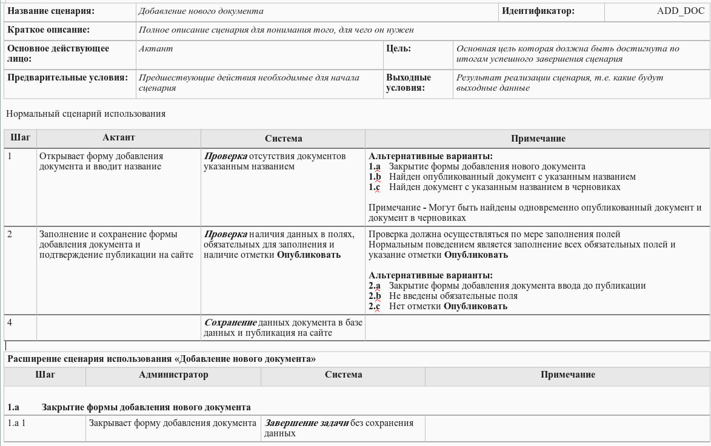
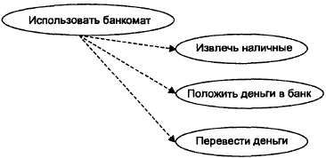
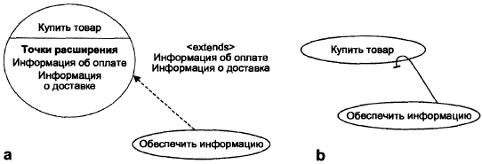
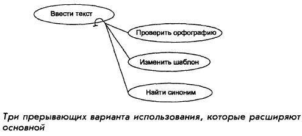
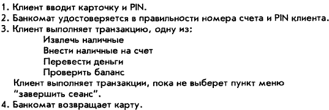
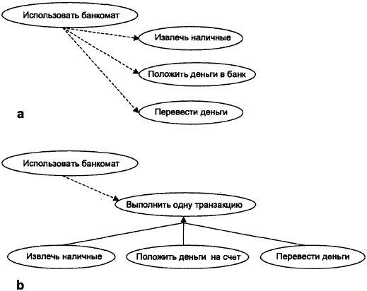
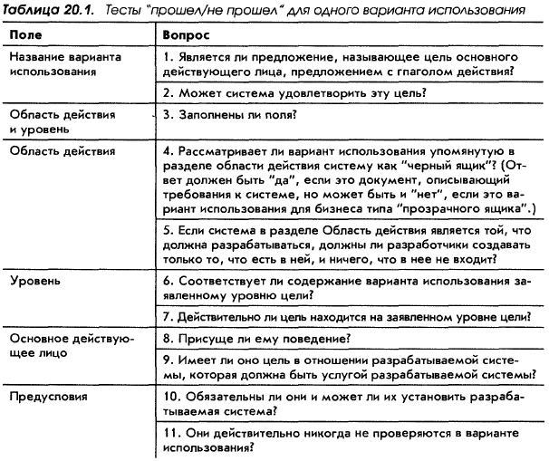
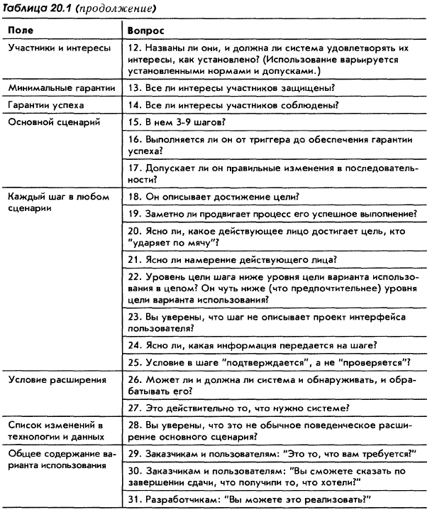

## Введение

Фундаментальная литература:
- Алистер Коберн, «Writing Effective Use Cases» (которые почему-то перевели как «Современные методы описания функциональных требований к системам»), [ссылка на Pre-pub версию на англ.](https://box.cs.istu.ru/public/docs/other/_New/Books/Software%20Development/Writing%20Effective%20Use%20Cases.pdf) 
- Современная методика проектирования и гибкого планирования разработки систем с помощью Use Case от основоположника техники, Ивара Якобсона: [Use Case 2.0 Essentials Practice](http://www.ivarjacobson.com/Software_Use_Case_Essentials/)

Статьи:
- [Двадцать лет с юзкейсами: выжимаем практический опыт / Habr](https://habr.com/ru/companies/qiwi/articles/346438)
- [Усиление методики UseCase данное в книге Алистера Кобёрна / Habr](https://habr.com/ru/articles/468267)
- [Методы формализации требований: Use Case vs User Story / Habr](https://habr.com/ru/amp/publications/825692)

Шаблоны и примеры:
- Шаблон use case by Karl E. Wiegers [use_case_template.doc](https://profinit.eu/wp-content/uploads/2016/03/use_case_template.doc)
- [Use Cases: Diagram & Examples](https://www.inflectra.com/Ideas/Topic/Use-Cases.aspx)
- [Варианты на все случаи жизни: как написать полезный use case](https://practicum.yandex.ru/blog/chto-takoe-use-case-kak-ih-napisat/)

## User story
**User story** (пользовательская история) - это краткое описание использования продукта, составленное с точки зрения пользователя. Оно помогает сосредоточиться на том, что конкретно нужно пользователю.

Строится по шаблону:
- Как **[тип пользователя]**, я хочу **[действие]**, чтобы **[цель]**.

Пример:
- Как руководитель, я хочу видеть все задачи своего подразделения, чтобы иметь возможность оценить и перераспределить нагрузку.
- Как сотрудник техподдержки, я хочу видеть историю обращений клиента, чтобы быстрее и точнее ответить клиенту.
- Как исполнитель, я хочу получать уведомления о поступлении задач, чтобы своевременно увидеть и выполнить задачу.
- Как проверяющий документа, я хочу иметь возможность оставлять комментарии по документу, чтобы создатель документа увидел и исправил замечания.

Обычно User Story представляют лишь один сценарий / альтернативное направление. В Use Case для отображения других вариаций сценария используются *альтернативные потоки (расширения)*. В случае User Story это будет по одной истории на каждый поток, например:
- Как химик я хочу заказать химикат, чтобы выполнять эксперименты.
- Как химик я хочу заказать химикат со склада, чтобы получить его немедленно.
- Как химик я хочу заказать химикат у поставщика, потому что не доверяю чистоте веществ, имеющихся на складе.

## Use case
**Use Case** (сценарий использования) — это подробное описание взаимодействия пользователя с системой для достижения конкретной цели. В отличие от User Story, оно включает описание шагов, альтернативных сценариев и возможных исключений.

Есть несколько вариантов представления Use Case, например:
- **Текстовый формат.** Включает в себя акторов, цели, предусловия, сценарии и постусловия. Этот формат легко читается и понимается, но может быть менее удобным для больших объемов информации.
- **Табличный формат.** Это Текстовое описание, представленное в формате таблицы. Содержит 2 столбца "раздел" (акторы, цели, сценарии) и его описание.
- **Диаграммы Use Case.** В этом случае каждый сценарий представлен в виде отдельного прямоугольника с указанием его имени, а акторы и связи между ними могут быть показаны стрелками. Подробнее почитать можно [вот тут](/docs/sys-anal/formalization/uml/#диаграмма-прецендентов)

### Разделы Use Case

Тут описан *полноформатный* шаблон, но все его элементы нужны не всегда. В некоторых случаях достаточно *свободного* описания, например только раздел "Описание".


  Не всегда нужно описывать каждый раздел. Важно понять задачи пользователя настолько, чтобы разработчики могли начать работу при минимальном риске переделок.


")

Описание разделов:

| №  | Раздел          | Описание            |
|----|-----------------|--------------------------|
| 1  | ID и название   | Номер и краткое имя, определяющее *цель* пользователя.    |
| 2  | Автор                | Имя автора    |
| 3  | Дата создания           | Дата                                      |
| 4  | Основное действующее лицо (актор)     | Основной актор: например, Пользователь, Менеджер, Система                                                       |
| 5  | Дополнительное действующее лицо     | Второстепенные акторы: например, Служба аутентификации, БД                  |
| 6  | Описание     | Краткое текстовое описание цели варианта использования                |
| 7  | Триггер     | Условие-триггер, инициирующее выполнение варианта использования (примечание: инициация будет только после проверки предусловий)   |
| 8  | Предусловия | Что должно присутствовать до начала сценария (пользователь авторизован, есть доступ к данным и т.д.).                             |
| 9  | Постусловия (выходные условия) | Описывают состояние системы после успешного завершения варианта использования |
| 10  | Нормальный поток (основной поток событий)  | Пронумерованный список действий, иллюстрирующий последовательность этапов взаимодействия действующего лица и системы. |
| 11 | Альтернативные потоки (расширение) | Другие *успешные* сценарии |
| 12 | Исключения/Ошибки   | Условия, препятствующие успешному выполнению сценарий (например "нет в наличии", при повторном вводе -> "уже создано"). Сюда не нужно включать общие ошибки по типу разрыва подключения, сбоя устройства.  |
| 13 | Приоритет                 | -                                   |
| 14 | Частота использования              | Редко / Ежедневно / Постоянно и т.п.    |
| 15 | Бизнес-правила              | -                             |
| 16 | Специальные требования        | Нефункциональные требования: скорость работы, безопасность, интерфейс и т.д.               |
| 17 | Предположения        | -              |

### Рекомендации по составлению
Основные рекомендации по составлению:
- Для логически сложного варианта использования можно использовать блок-схемы.
- Не всегда нужно описывать каждый раздел. Важно понять задачи пользователя настолько, чтобы разработчики могли начать работу при минимальном риске переделок.
- При построении диаграммы Use Case не стоит тратить много времени на отношениях `<<include>>` и `<<extend>>`.
- Некоторые Use Case можно связать последовательностью выполнения в один общий вариант использования. В этом случае постусловия одного варианта должны соответствовать предусловиям другого варианта.
- Не использовать конкретные взаимодействия и описания интерфейса. Вместо *"Вводит идентификатор, заполняет поле 1, поле 2, прикрепляет файл"* пишем *"указывает требуемый химикат"*. Слишком быстрый переход к конкретике ограничивает.
- Делать перерывы между выявлениями/корректировками - хотя бы 1 день.
- Сначала работа должна быть направлена в ширину, затем в глубину. 
- Создание концептуальных вариантов тестирования на ранних этапах.
- Use Case описывают "видимое" пользователю поведение системы, и этого недостаточно для написания ПО. Use Case - это помощник для формирования функциональных и нефункциональных требований.
- Use Case не определяет, что должна делать система, если предусловие не выполняется.

### Распространенные ошибки

1. UC описан только с точки зрения актора **без описания поведения системы**.
2. UC описан только с точки зрения системы **без описания поведения актора**.
3. **Слишком много деталей интерфейса**. Например указаны конкретные названия кнопок, полей ("ОК", "Готово").
4. **Слишком низкоуровневое описание**. Шаги, идущие в одном направлении, лучше объединять в один высокоуровневый пункт. Например:
   - *"1. А вводит имя."* и *"2. А вводит адрес"* лучше объединить в  *"1. А вводит персональные данные (имя, адрес ...)"*.
   - *"3. С подключается к ..."* и *"4. С запрашивает ..."* лучше объединить в *"3. С удостоверятся при помощи сервиса ..., что на складе есть..."*
5. Цель и содержание не соответствуют друг другу.
6. Предложения с *"Если"* в основном сценарии. Все *"Если"* стоит переносить в альтернативные варианты (расширение).

## User story vs Use case

|                   | User story                                                                                                                                            | Use case                                                                                                                                  |
|-------------------|-------------------------------------------------------------------------------------------------------------------------------------------------------|-------------------------------------------------------------------------------------------------------------------------------------------|
| **Цель**              | Описать потребности и цели пользователя                                                                                                               | Дать подробное описание взаимодействия пользователя с системой (с учетом предусловий, альтернативных путей и постусловий)                 |
| **Фокус**             | На потребностях и целях пользователя                                                                                                                  | На взаимодействии пользователя с системой                                                                                                 |
| **Для чего подходит** | - для начальной (верхнеуровневой) оценки требований - для планирования работ в рамках итераций/спринтов - для проектов с частым изменением требований | - для сложных бизнес-процессов и сценариев - для сложных проектов с множеством интеграций - проект со строгими регуляторными требованиями |

Эти подходы могут дополнять друг друга

Пример заполнения на основе User story: *«Как руководитель, я хочу видеть все задачи своего подразделения, чтобы иметь возможность оценить нагрузку.»*

1. Название
   - Просмотр задач подразделения руководителем для оценки нагрузки
2. Участники
    - Основной актор: Руководитель подразделения
3. Предусловия
   - Руководитель авторизован и имеет доступ к задачам своего подразделения.
4. Постусловия
   - Руководитель видит актуальный список задач по подразделению и может оценить нагрузку команды.
5. Основной поток событий
    1. Руководитель переходит в раздел «Задачи подразделения».
    2. Система отображает все задачи сотрудников подразделения.
    3. Руководитель анализирует данные и оценивает загрузку.
6. Альтернативные потоки
    - A2. Руководитель применяет фильтры — отображаются только соответствующие задачи.
7. Исключения / Ошибки
   - Нет задач для отображения — система сообщает об этом.
8. Особые требования
   - Интерфейс поддерживает фильтрацию и сортировку по статусу, исполнителю и срокам.
   - Возможность визуализации задач в виде диаграммы Ганта.

## Ситуации когда не подходит ни User story ни Use case

Они не подходят для описания встроенных и других систем реального времени.
При выявлении требований в таком случае создают список внешних событий, на которые должна реагировать системы, и соответствующих вариантов ответной реакции системы.

## Примеры Use case

")

")

")

")

")

")
")

## Памятка по составлению UC
### UC должен быть читабельным

1. Пишем коротко и ближе к делу.
2. Разделяем Use Cases по уровням детализации:
   1. Обобщенный UC (вершина, от которого ветвятся UC)
   2. UC уровня цели пользователя
   3. UC уровня подфункции
3. Именуем UC с помощью коротких глагольных конструкций, объявляющих цель, которую нужно достичь.
4. Начинаем с триггера и продолжаем до тех пор, пока цель не будет достигнута/отвергнута.
5. Используем полные предложения с глагольными конструкциями, которые описывают подлежащие выполнению цели.
6. На каждом шаге действующее лицо и его намерение должны быть четко определены.
7. Не забываем выделять условия отказа и действия по восстановлению. Должно быть ясно, что происходит потом (чтобы не пришлось искать по номерам шагов).
8. Для описания альтернативных шагов применяем расширение. Не пишем предложения с *если* в главном UC.
9. Варианты использования расширения создаем в особых случаях.

### Только одна форма предложения

**Шаги действия** описываем в настоящем времени, с глаголом действия в действительном залоге. Шаг должен описывать, как действующее лицо успешно достигает цели. Примеры:
- Клиент вводит карточку и PIN
- Система удостоверяется в полномочиях клиента и достаточности остатка на счете
- PAF перехватывает ответы с web-сайта и обновляет профиль пользователя.

**Расширения** пишем иначе, чтобы отличать их от шагов действий: используем фрагмент предложения в прошедшем времени и в конце ставим двоеточие. Примеры:
- Тайм-аут ожидания ввода PIN:
- Неверный пароль:
- Файл не найден:
- Пользователь закрыл приложение, не сохранив карточку:
- Обязательные поля не заполнены:

### Связи Use cases

Основной вариант использования *включает* <<include>> вариант использования. Включенный вариант использования описывает цель уровнем ниже по сравнению с основным

*Расширяющий* вариант использования расширяет <<extend>> основной вариант использования. Расширение определяет некоторое внутреннее условие в основном варианте использования и условие запуска. Когда расширение заканчивается, управление получает основной вариант с той точки, где его выполнение прекратилось.

Связь *обобщения* между вариантами использования подразумевает, что дочерний вариант использования содержит все атрибуты, последовательность поведения и точки расширения, определенные в родительском, а также участвуют во всех связях родительского UC.

### Указываем действующее лицо

Не используем страдательный залог, всегда явно указываем действующее лицо. Пусть первое или второе слово предложения будет именем действующего лица. 

Вместо *"Вводится кредитный лимит"* пишем *"Сотрудник вводит кредитный лимит"*.

### Уровень цели должен быть правильным

- Проверяем, верный ли уровень цели: обобщенный, пользователя или подфункции.
- Периодически проверяем, соответствуют ли шаги уровню
- Если в UC более девяти шагов, то ищем шаги, которые можно объединить.
- Задаем вопрос "Почему пользователь делает это?". Ответ на него - это более высокий уровень цели. Это может помочь "сдвинуть" уровни и объединить несколько шагов.

### Никаких деталей интерфейса

Шаг должен описывать **намерение действующего лица, а не просто движения в интерфейсе.**

Антипримеры:
1. Система отображает экран регистрации с полями для имени и пароля пользователя.
2. Пользователь вводит имя и пароль и щелкает по кнопке "ОК".
3. Система проверяет имя и пароль.
4. Пользователь выбирает функцию и щелкает по кнопке "ОК.

### Два итога

Каждый вариант использования имеет два возможных итога: успех и неудачу. Описываем описать оба этих итога.
Шаг действия вызывает подчиненный вариант использования. Для расширений описываем обработку успеха и неудачи в том же расширении.

### Гарантии участникам

В каждом варианте использования указываем всех участников с их интересами (2-5 участника) и следим, чтобы сценарий обращался к этим интересам. Проверяем, во всех ли случаях обработка ошибки защищает все интересы всех участников.

### Чек-лист UC

 
