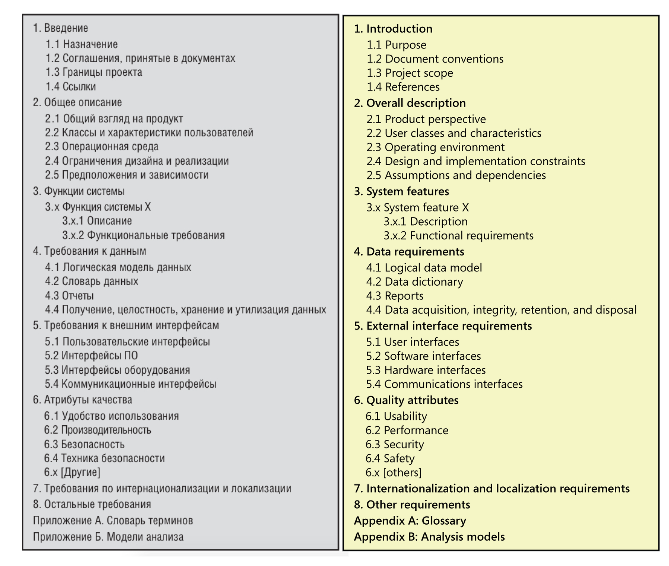

## Введение

На разных этапах проектов составляют документации: техническое задание, инструкции для пользователей, спецификации, документацию на api и др.
У каждого вида своя цель и структура.

Полезные ссылки:
- [Требования ГОСТ на автоматизированные системы в ИБ-проектах. Что изменилось и как это применять?](https://habr.com/ru/companies/angarasecurity/articles/671882/)
- [Стандарты и шаблоны для ТЗ на разработку ПО | Хабр](https://habr.com/ru/amp/publications/328822)
- Разные шаблоны документации и шпаргалки на англ. [Business Analysis Templates & Aides](https://modernanalyst.com/Resources/Templates/tabid/146/Default.aspx)
- [Пример написания функциональных требований к Enterprise-системе | Хабр](https://habr.com/ru/articles/245625)

Разобрать:
- Концепция системы, Технический дизайн, СИС, ЧТЗ, ДИ, ПМИ, Инструкции пользователей
- Спецификация, устав проекта(+)

## Документ о концепциях и границах

**Документ о концепциях и границах** (vision and scope document) собирает бизнес-требования в единый документ. Определяет границы на высоком уровне, а подробности границ представлены базовыми требованиями отдельных выпусков, определенных командой.

**Цель:** Описывает **зачем** создаётся продукт, **кому** он нужен, **какую проблему** решает. Содержит бизнес-цели, границы продукта, ключевых пользователей, высокоуровневые функции.

Другие варианты представления:
- Видение продукта (vision / product Vision)
- Business Requirements Document (BRD)
- Концепция автоматизированной системы (ГОСТ)
- Устав проекта
- Положение о бизнес-задачах
- Документ основных рыночных требований (market requirements documnet, MRD)

**Шаблон:**
1. Бизнес-требования  
    1.1 Исходные данные  
    1.2 Возможности бизнеса  
    1.3 Бизнес-цели  
    1.4 Критерии успеха  
    1.5 Положение о концепции проекта  
    1.6 Бизнес-риски  
    1.7 Предположения и зависимости  
2. Рамки и ограничения проекта  
    2.1 Основные функции  
    2.2 Объем первоначально запланированной версии  
    2.3 Объем последующих версий  
    2.4 Ограничения и исключения  
3. Бизнес-контекст  
    3.1 Профили заинтересованных лиц  
    3.2 Приоритеты проекта  
    3.3 Особенности развертывания  

[Пример_Документ о концепции и границах проекта_Вигерс_Приложение_кафетерий.pdf](https://github.com/OMpric/Requirements_19_20/blob/master/Пример_Документ%20о%20концепции%20и%20границах%20проекта_Вигерс_Приложение_кафетерий.pdf)

Для наглядного представления границ проекта используют:
- Контекстная диаграмма (context diagram)
- Карта экосистемы (ecosystem map)
- Дерево функций (feature tree)
- Список событий (event list)

Пометка для Agile:
- Обычно не создается формальный документ, но выполняется начальная итерация планирования для определения концпеции
- Положение о концепции содержит долгосрочный план — то, чем должен стать продукт по завершению всех итераций.
- Границы каждой итерации состоят из пользовательских историй, выбранных из бэклога на основе приоритетов.
- Бизнес-цели используются для облегчения формирования бэклога.

### Устав проекта

Используется на старте проекта для конкретизации границ и задач проекта. Устав проекта содержит информацию:
1. Название, участники, этапы проекта.
2. Цели, задачи и результаты проекта.
3. Границы проекта. Они определяют, что включается в проект.

[См. пример устава](https://docs.google.com/document/d/1-DNPmvagXqKWZmigKY704kcJgD7yEQ1l/edit?usp=sharing&ouid=108184098033337124968&rtpof=true&sd=true) 

## Спецификация требований

В **спецификация требований к ПО** (Software Requirements Specification — SRS) указываются функции и возможности, которыми должно обладать ПО, а также необходимые ограничения. Самый детальный документ, описывающий **поведение системы**. Не должна содержать подробности дизайна, проектирования, тестирования и управления проектов (за исключением известных ограничений дизайна и реализации).

Другие названия:
- Документ бизнес-требований
- Функциональная спецификация
- Спецификация продукта
- Документ о требованиях

### Советы по разработке

Полезные ссылки:
- [Русский перевод стандарта](https://drive.google.com/file/d/1WkHqTFOVdDuPioLfkMojB_jrifUYbD4G/view)
- Пример [Example Software Requirements Specification (SRS)](https://www.reqview.com/doc/iso-iec-ieee-29148-srs-example)
- Пример [Software Requirements Specification. Amazing Lunch Indicator](https://www.cse.chalmers.se/~feldt/courses/reqeng/examples/srs_example_2010_group2.pdf)

[Скачать шаблон SRS (на англ.)](/doc-templates/srs_template.doc)

## ПМИ
ПМИ - Программа и методика испытаний — это технический документ, который формализует этап тестирования

## Стандарты
По каким стандартами разрабатывается проектная документация?
- СКД, Единая система конструкторской документации (ГОСТ 2);
- ЕСПД, Единая система программной документации (ГОСТ 19);
- КСАС, Комплекс стандартов на автоматизированные системы (ГОСТ 34).

**ТЗ** – техническое задание.

**Частное техническое задание (ЧТЗ)** – это документ, который разрабатывается для конкретной функции или задачи в рамках основного технического задания.

В статье все описано с ссылками: [Требования ГОСТ на автоматизированные системы в ИБ-проектах. Что изменилось и как это применять?](https://habr.com/ru/companies/angarasecurity/articles/671882)

### ГОСТ 34 (КСАС)

- [ГОСТР 59793—2021 КОМПЛЕКС СТАНДАРТОВ НА АВТОМАТИЗИРОВАННЫЕ СИСТЕМЫ. Автоматизированные системы. Стадии создания](https://protect.gost.ru/document1.aspx?control=31&id=241692) и [вариант в цифре](https://rosgosts.ru/file/gost/35/240/gost_r_59793-2021.pdf)
- [ГОСТ 34.201-2020 КОМПЛЕКС СТАНДАРТОВ НА АВТОМАТИЗИРОВАННЫЕ СИСТЕМЫ. Виды, комплектность и обозначение документов при создании автоматизированных систем](https://rosgosts.ru/file/gost/01/040/gost_34.201-2020.pdf)
- [ГОСТ 34.602—2020 КОМПЛЕКС СТАНДАРТОВ НА АВТОМАТИЗИРОВАННЫЕ СИСТЕМЫ. Техническое задание на создание автоматизированной системы](https://rosgosts.ru/file/gost/01/040/gost_34.602-2020.pdf)
- [ГОСТ Р 59795—2021 КСАС. Автоматизированные системы. Требования к содержанию документов](https://rosgosts.ru/file/gost/35/240/gost_r_59795-2021.pdf)
- [ГОСТ Р 59853–2021 КСАС. Автоматизированные системы. Термины и определения](https://rosgosts.ru/file/gost/01/040/gost_r_59853-2021.pdf)

Стадии:
1. Формирование требований к АС
2. Разработка концепции АС
3. Техническое задание
4. Эскизный проект
5. Технический проект
6. Рабочая документация
7. Ввод а действие
8. Сопровождение АС

Рекомендуемые наборы документации по ГОСТ 34 ([источник](https://habr.com/ru/companies/angarasecurity/articles/671882/))

| Наименование документа                             | Код | 1 | 2 | 3 | 4 | 5  |
|----------------------------------------------------|-----|---|---|---|---|----|
| 1) Отчет об обследовании                           | —   |   |   | ☑ | ☑ | ☑  |
| 2) Модель угроз безопасности информации            | —   |   | ☑ | ☑ | ☑ | ☑  |
| 3) Концепция автоматизированной системы            | —   |   |   |   | ☑ | ☑  |
| 4) Техническое задание                             | ТЗ  | ☑ | ☑ | ☑ | ☑ | ☑  |
| 5) Ведомость технического проекта                  | ТП  |   |   | ☑ | ☑ | ☑  |
| 6) Схема структурная комплекса технических средств | С1  |   |   | ☑ | ☑ | ☑  |
| 7) Схема функциональной структуры                  | С2  |   |   | ☑ | ☑ | ☑  |
| 8) Пояснительная записка к техническому проекту    | П2  |   | ☑ | ☑ | ☑ | ☑  |
| 9) Схема автоматизации                             | С3  |   |   |   | ☑ | ☑  |
| 10) Описание автоматизируемых функций            | П3 |   |   |   | ☑ | ☑  |
| 11) Описание информационного обеспечения системы | П5 |   |   |   |   | ☑  |
| 12) Описание комплекса технических средств       | П9 |   |   |   | ☑ | ☑  |
| 13) Описание программного обеспечения            | ПА |   |   |   |   | ☑  |
| 14) Схема организационной структуры              | СО |   |   |   |   | ☑  |
| 15) Описание организационной структуры           | ПВ |   |   |   | ☑ | ☑  |
| 16) План расположения                            | С8 |   |   |   | ☑ | ☑  |
| 17) Схема соединений внешних проводок            | С4 |   |   |   |   | ☑  |
| 18) Таблица соединений и подключений             | С6 |   |   |   |   | ☑  |
| 19) Чертеж установки технических средств         | СА |   |   |   | ☑ | ☑  |
| 20) Программа и методика испытаний                           | ПМ | ☑ | ☑ | ☑ | ☑ | ☑  |
| 21) Ведомость эксплуатационных документов                    | ЭД |   |   | ☑ | ☑ | ☑  |
| 22) Руководство администратора (технологическая инструкция)  | И2 |   | ☑ | ☑ | ☑ | ☑  |
| 23) Руководство пользователя                                 | И3 |   |   | ☑ | ☑ | ☑  |
| 24) Инструкция по эксплуатации комплекса технических средств | ИЭ |   |   |   | ☑ | ☑  |
| 25) Формуляр                                                 | ФО |   |   |   |   | ☑  |
| 26) Паспорт                                                  | ПС |   |   |   | ☑ |    |

ТЗ на АС содержит следующие обязательные разделы:
- общие сведения;
- цели и назначение создания автоматизированной системы;
- характеристика объектов автоматизации;
- требования к автоматизированной системе;
- состав и содержание работ по созданию автоматизированной системы;
- порядок разработки автоматизированной системы;
- порядок контроля и приемки автоматизированной системы;
- требования к составу и содержанию работ по подготовке объекта автоматизации к вводу автоматизированной системы в действие;
- требования к документированию;
- источники разработки.
В ТЗ на АС могут быть включены приложения.
Примечание — В случае отсутствия требований по разделу, соответствующий раздел сохраняется, и в
нем приводится запись об отсутствии требований.

### ГОСТ 19 (ЕСПД)

- [ГОСТ 19.101-77 ЕСПД. ВИДЫ ПРОГРАММ И ПРОГРАММНЫХ ДОКУМЕНТОВ](https://rosgosts.ru/file/gost/35/080/gost_19.101-77.pdf)
- [ГОСТ 19.102-77 ЕСПД. СТАДИИ РАЗРАБОТКИ](https://rosgosts.ru/file/gost/35/080/gost_19.102-77.pdf)
- [ГОСТ 19.103-77 ЕСПД. ОБОЗНАЧЕНИЯ ПРОГРАММ И ПРОГРАММНЫХ ДОКУМЕНТОВ](https://rosgosts.ru/file/gost/35/080/gost_19.103-77.pdf)
- [ГОСТ 19.201-78 ЕСПД. ТЕХНИЧЕСКОЕ ЗАДАНИЕ. Требования к содержанию и оформлению](https://rosgosts.ru/file/gost/35/080/gost_19.201-78.pdf)
- [ГОСТ 19.301-79 ЕСПД. ПРОГРАММА И МЕТОДИКА ИСПЫТАНИЙ. Требования к содержанию и оформлению](https://rosgosts.ru/file/gost/35/080/gost_19.301-79.pdf)

Стадии:
1. Техническое задание
2. Эскизный проект
3. Технический проект
4. Рабочий проект
5. Внедрение

Техническое задание должно содержать следующие разделы:
- введение;
- основания для разработки;
- назначение разработки;
- требования к программе или программному изделию;
- требования к программной документации;
- технико-экономические показатели;
- стадии и этапы разработки;
- порядок контроля и приемки;
- в техническое задание допускается включать приложения.
В зависимости от особенностей программы или программного изделия допускается уточнять содержание разделов, вводить новые разделы или объединять отдельные из них.

## Скачать шаблоны

Шаблоны:
- [Скачать шаблон SRS (на англ.)](/doc-templates/srs_template.doc)
- [Скачать шаблон Use Case (на англ.)](/doc-templates/use_case_template.doc)
- SRS-Template — готовый шаблон (Markdown), который можно адаптировать [Github jam01/SRS-Template](https://github.com/jam01/SRS-Template)
- [Спецификация требований к ПО для Smart School System на русском](https://www.studocu.com/ru/document/english-international-school-moscow/english-language/shablon-srs-efs/107921116?utm_source=chatgpt.com)
- [Скачать шаблон ТЗ/ЧТЗ по ГОСТ_34.602](/doc-templates/ТЗ_ГОСТ_34.602_шаблон.docx)

Примеры:
- Скачать [Документ о концепции и границах проекта (К. Вигерс)](/doc-examples/Вигерс_Концепция.pdf)
- [ГОСТ 34.602-89 Техническое задание на создание автоматизированной системы (пример)](https://www.prj-exp.ru/patterns/pattern_tech_task.php)
- Примеры спецификаций [ensi](https://ensi.tech/resources/examples-fz)