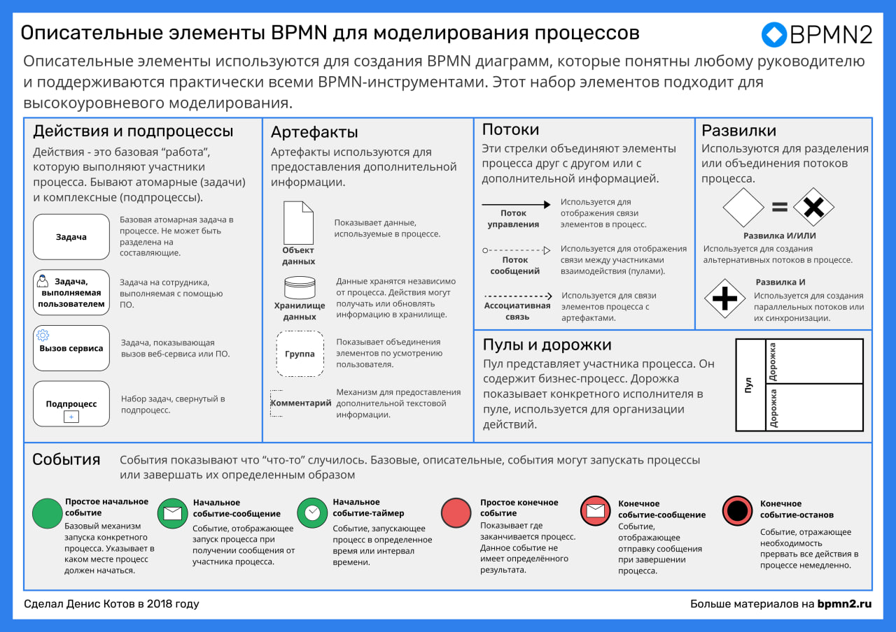
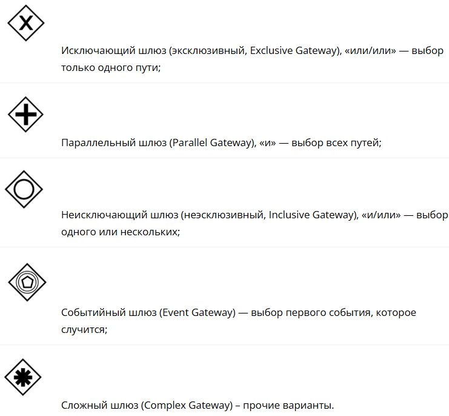
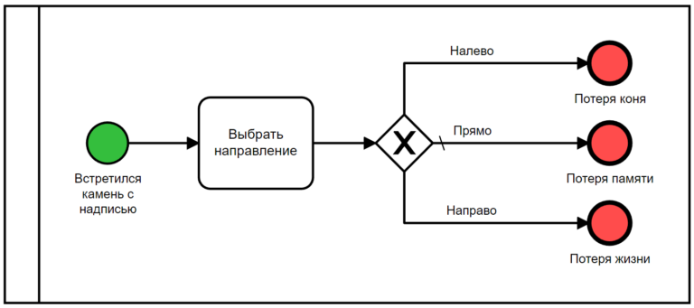
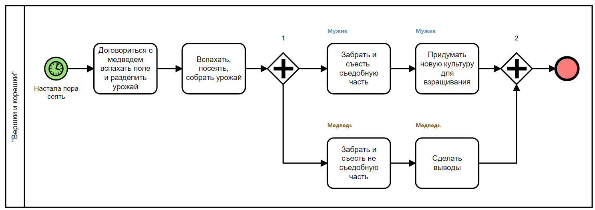
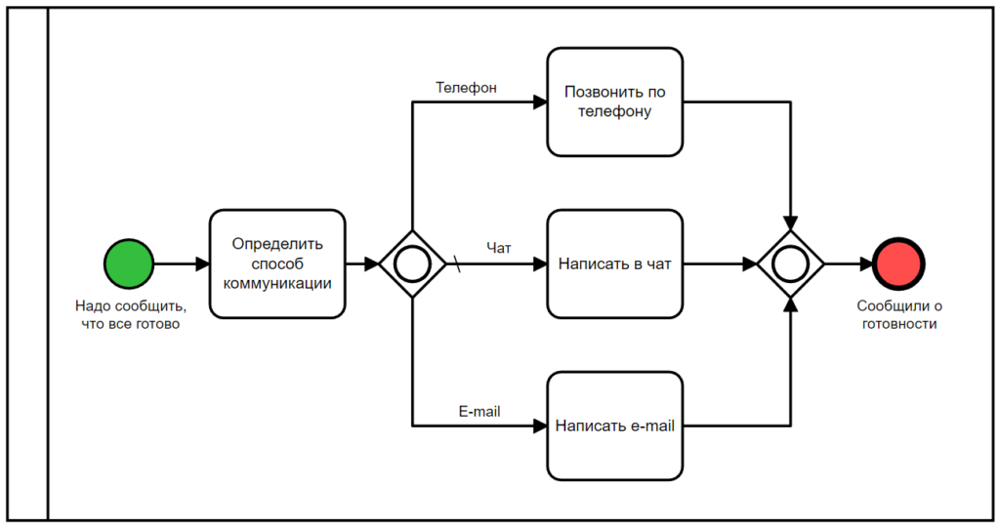
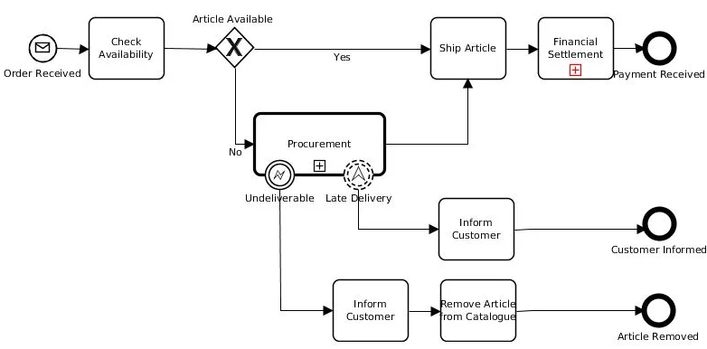
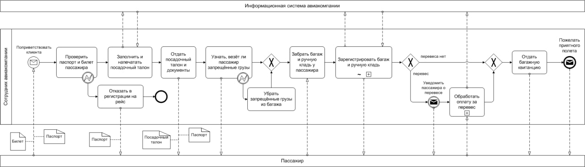

## Полезные ссылки

Полезные ссылки:
- Current BPMN Specification [bpmn.org](https://www.bpmn.org)
- Описание элементов BPMN 2.0 [https://astelica.ru](https://astelica.ru/ru_bpmn_reference)
- Cправочник с основами и примерами [BPMN Quick Guide](https://www.bpmnquickguide.com/view-bpmn-quick-guide)
- Отличный [справочник bpmn 2.0](https://bpmn20.ru) с примерами, еще и очень красивый. Тут есть еще примеры в разделе [Практические примеры](https://bpmn20.ru/docs/docly-documentation/prakticheskie-primery)
- Хорошая статья с удобочитаемыми примерами, алгоритмом построения и рекомендациями https://habr.com/ru/articles/697326/
- Тут описание элементов (использую как справочник). Это перевод, поэтому текст иногда кривоват: https://camundarus.ru/bpmn/reference/ 
- Статья по bpmn, много примеров по оформлению bpmn: https://camundarus.ru/bpmn/examples/ 
- Тут есть описание всех элементов с примерами https://stormbpmn.com/bpmn/elements/ 
- [Нотация BPMN 2.0: ключевые элементы и описание](https://www.comindware.ru/blog/нотация-bpmn-2-0-элементы-и-описание)

Примеры:
- https://camundarus.ru/bpmn/examples/ 
- https://bpmn20.ru/docs/docly-documentation/prakticheskie-primery

Где рисовать:
- https://bpmncat.ru
- https://astelica.ru/ru_online_bpmn_editor

## Элементы нотации

### Шлюзы 
- О каждом шлюзе с примерами https://bpmn2.ru/blog/vse-shluzi-v-bpmn-s-primerami 

#### Эксклюзивный (XOR) 

На данном шлюзе можно выбрать только один путь, по которому процесс пойдет дальше.

#### Параллельный (AND) 

На данном шлюзе процесс распараллеливается и идет одновременно по всем исходящим потокам. 

#### Включительный (OR) 

На данном шлюзе процесс может пойти по одному (обязательно) или нескольким потокам управления. 

## Примеры

")

