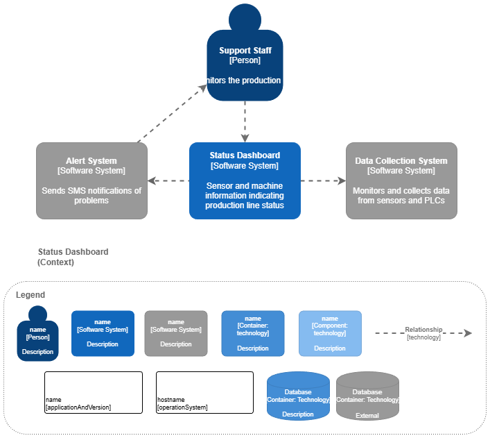
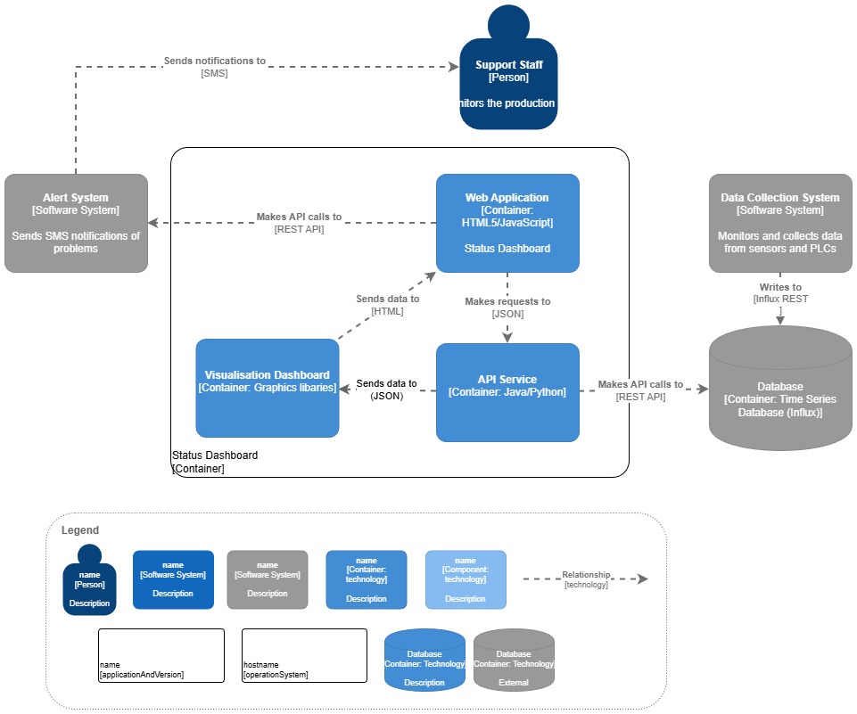
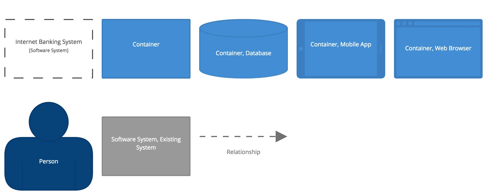
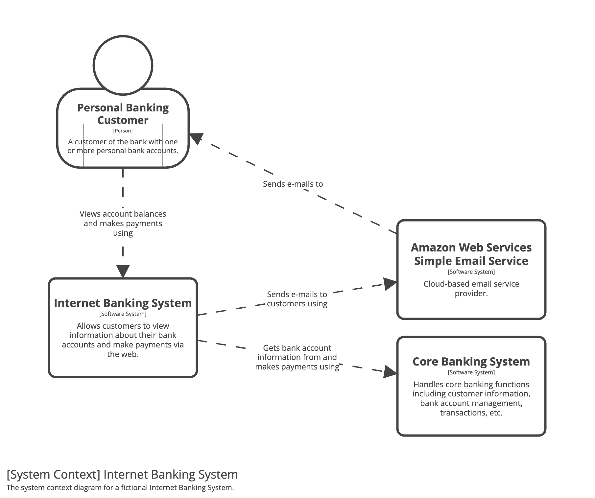
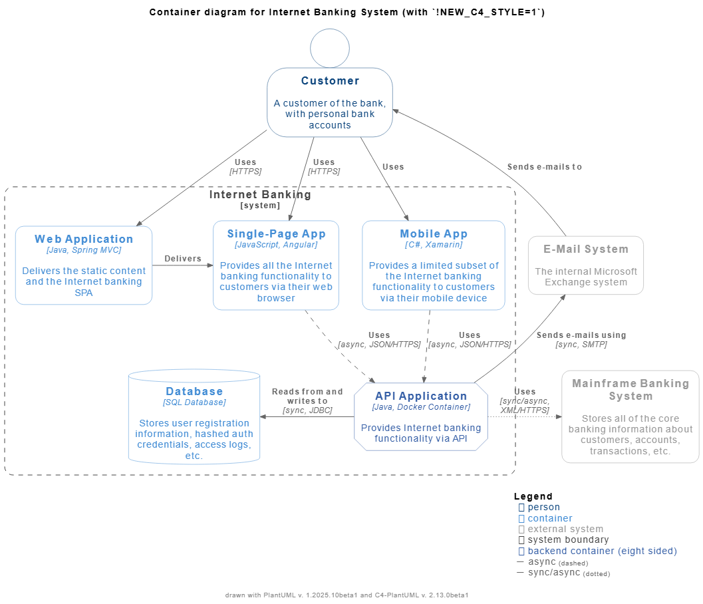
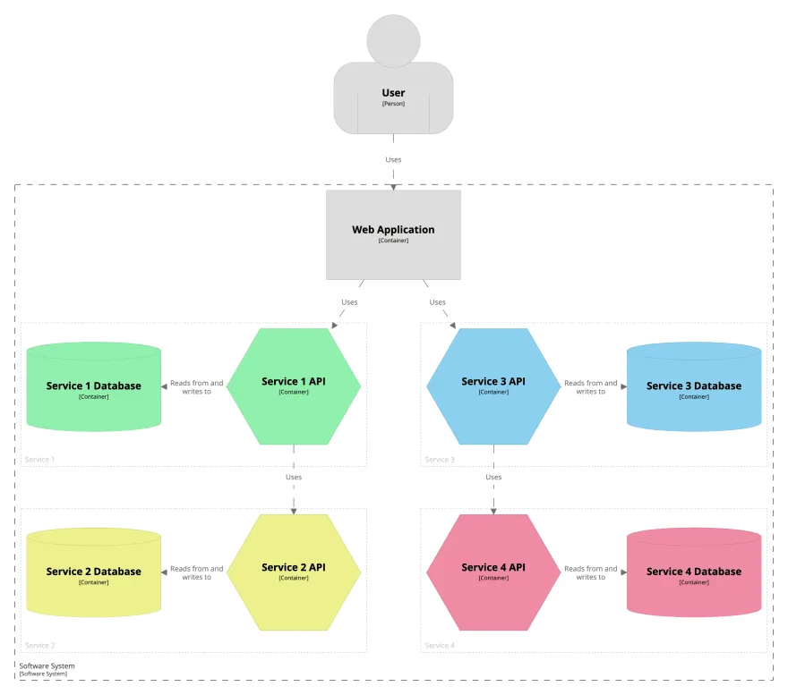

## Введение

Полезные ссылки:
- [Официальный сайт модели c4model.com](https://c4model.com/diagrams). С этого стоит начать знакомство с модели, т.к. это официальный сайт от создателя модели. Тут есть описание каждого уровня модели с примером, поддерживаемые инструменты, чек-лист для проверки диаграммы. Есть [перевод](https://infostart.ru/pm/1540208).
- Описание С4 с разбором каждого уровня на примере GetDelivery + разбор инструментов построения [Хабр / Нотация моделирования архитектуры С4 — примеры диаграмм и инструменты](https://habr.com/ru/articles/778726)
- Тоже описание С4 с разбором каждого уровня на примере Системы заказа лекарств. Также есть практические рекомендации по работе с С4 [Хабр / Как описать большую систему в нотации С4](https://habr.com/ru/companies/nspk/articles/679426)
- Нотация С4 (рекомендации построения на англ.) [c4model.com](https://c4model.com/diagrams/notation)
- Тут кратенько по каждому уровню с примером [Описание архитектуры системы с помощью C4 model](https://bool.dev/blog/detail/c4-model-architecture)
- Документация по построению C4 в PlantUML [github / C4-PlantUML](https://github.com/plantuml-stdlib/C4-PlantUML)
- Тут можно пошагово посмотреть построение С4 на примере MSA [Проектирование микросервисной EDA-архитектуры в icepanel.io](https://babok-school.ru/blog/microservices-patterns-and-c4-diagrams-example)

Примеры:
- Интерактивный пример C4 [Internet Banking System (c4model.com)](https://c4model.com/example/#SystemContext)
- Интерактивный пример C4 [Status Dashboard](https://viewer.diagrams.net/index.html?lightbox=1&highlight=0000ff&edit=_blank&layers=1&page=1&nav=1&title=#Uhttps%3A%2F%2Fraw.githubusercontent.com%2Fjgraph%2Fdrawio-diagrams%2Fmaster%2Fblog%2FC4.drawio#%7B%22pageId%22%3A%22zNMGI6wU0Mi8Qe2H5Q59%22%7D)
- Примеры и шаблоны [диаграмм C4 в PlantUML](https://github.com/plantuml-stdlib/C4-PlantUML/blob/master/samples/C4CoreDiagrams.md)

## Определение

Название C4 происходит от четырёх уровней (4 "C"s): **Context, Container, Component** и **Code**. С каждым уровнем детализация увеличивается. Уровни позволяют представить систему и взаимодействия с ней для разной аудитории.

| Уровень   |  Что показывает     | Для кого         |
| --------- |  ---------------- | ----------- |
| **Context**     | Как система вписывается в окружение (пользователи, внешние системы, границы)    | Бизнес, заказчики, аналитики |
| **Container** | Основные части системы (веб-приложение, мобильное приложение, БД, API) и их взаимодействия | Разработчики, архитекторы    |
| **Component** | Основные модули внутри контейнера и их связи              | Разработчики                 |
| **Code**             | Детали реализации одного компонента                       | Инженеры, разработчики       |



## Уровни

Разберем каждый уровень на примере [Status Dashboard](https://viewer.diagrams.net/index.html?lightbox=1&highlight=0000ff&edit=_blank&layers=1&page=1&nav=1&title=#Uhttps%3A%2F%2Fraw.githubusercontent.com%2Fjgraph%2Fdrawio-diagrams%2Fmaster%2Fblog%2FC4.drawio#%7B%22pageId%22%3A%22zNMGI6wU0Mi8Qe2H5Q59%22%7D)

### Context

Показывает общую картину системного ландшафта: система, ее пользователи и системы, с которыми они взаимодействуют. Фокус на людях и программных системах (а не на технологиях, протоколах и другим деталям низкого уровня).

**Целевая аудитория:** нетехнические (бизнес, заказчики) и технические специалисты

### Container

Показывает простую высокоуровневую структуру ПО и распределение функций между ее частями - **контейнерами**. Контейнер - это приложение или хранилище данных (например, веб-приложение, мобильное приложение, БД, API).

**Целевая аудитория:** Технические специалисты (архитекторы ПО, разработчики, сотрудникам службы поддержки/эксплуатации).

### Component

Контейнеры с предыдущего уровня можно детализировать и разложить на **компоненты**, чтобы описать их связи, функции и детали технологии/реализации.

**Целевая аудитория:** Архитекторы и разработчики ПО.

### Code

Детализация компонента, чтобы показать, как он реализован в виде кода. В идеале эта диаграмма должна создаваться автоматически с использованием IDE или UML-моделирования.

Такой уровень детализации рекомендуется применять только для наиболее важных или сложных компонентов.

**Целевая аудитория:** Архитекторы и разработчики ПО.

## Элементы нотации

## Примеры

