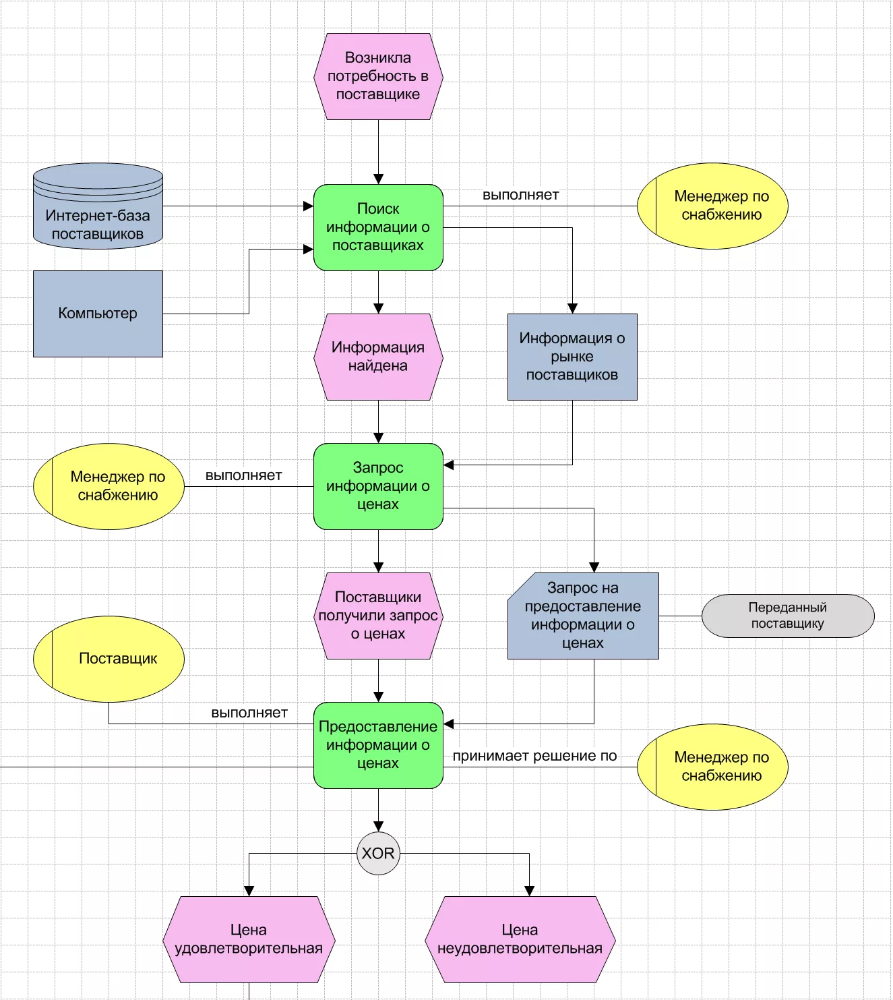
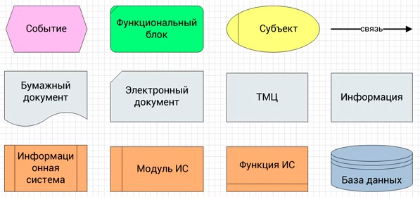
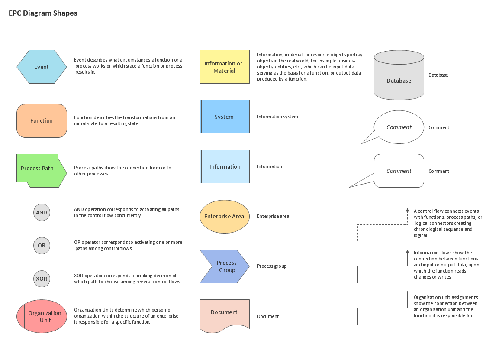
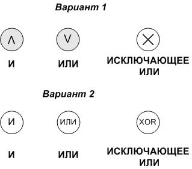
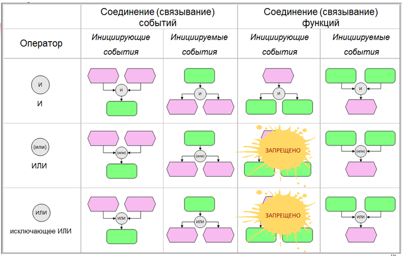

## Полезные ссылки

- [Один пример и три нотации: сравниваем BPMN, EPC и DMN](https://systems.education/bpmn_epc_dmn#epc2)

## О нотации

**EPC** (Event-driven Process Chain — событийная цепочка процессов) — это нотация для моделирования бизнес-процессов, которая фокусируется на чередовании событий и функций. Она позволяет наглядно представить последовательность действий, управляемых событиями, и используется для описания, анализа и оптимизации бизнес-процессов.

## Элементы нотации

### Шлюзы

Типы разветвлений:
- И. Когда произойдут два или более события одновременно;
- ИЛИ. Когда могут произойти одно ли несколько событий, но как минимум одно должно произойти обязательно;
- ИСКЛЮЧАЮЩЕЕ ИЛИ. Либо одно, либо другое. Т.е. два варианта одновременно невозможны.

## Примеры




