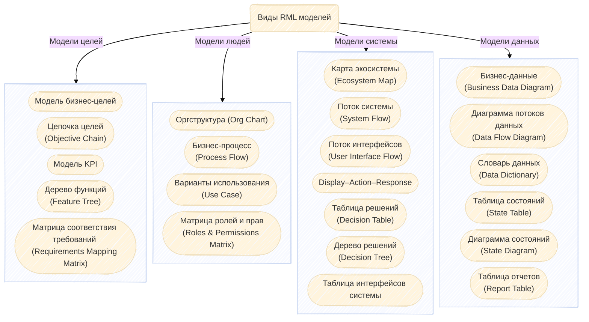

## Введение
> Визуализация – это возможность преодолеть проблему ограниченности нашей краткосрочной памяти.

Полезные ссылки:
- Первоисточник RML (только на англ.) [Visual Models for Software Requirements. Joy Beatty and Anthony Chen][rml]

[rml]: https://www.oreilly.com/library/view/visual-models-for/9780735667730/

## Что это?

**Requirements Modeling Language (RML)** - язык, разработанный специально для визуального моделирования требований. Подробнее о нем можно прочитать в книге [Visual Models for Software Requirements][rml].

При этом RML **не заменяет текстовое описание требований**, а лишь дополняет.

## Категории RML

Модели RML делят на 4 категории, которые суммарно называют **OPSD** (Objectives - цели, People - люди, Systems - система, Data - данные).

Подробнее о составе категорий:


  Если блок подчеркнут, то **это ссылка**. Кликаем на него для подробной инфо.
