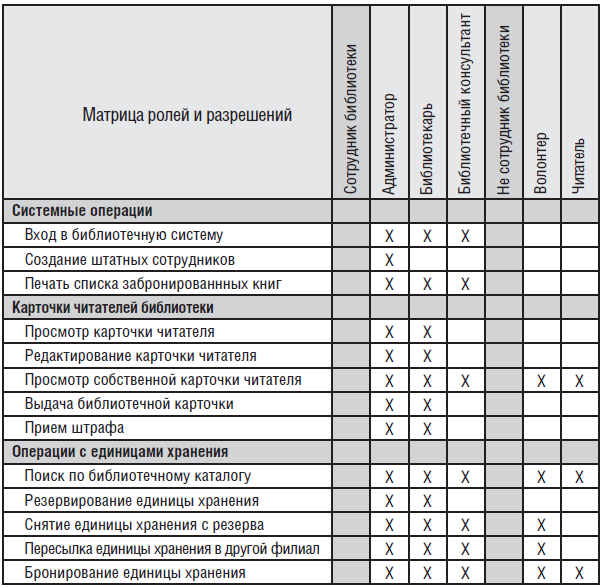
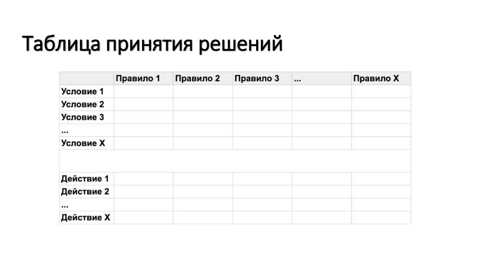
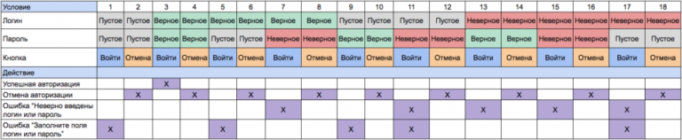
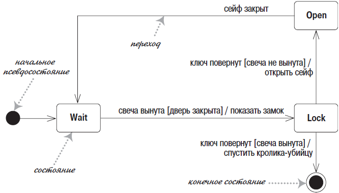
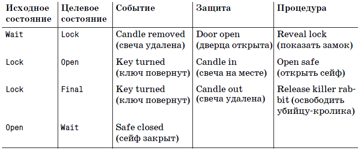
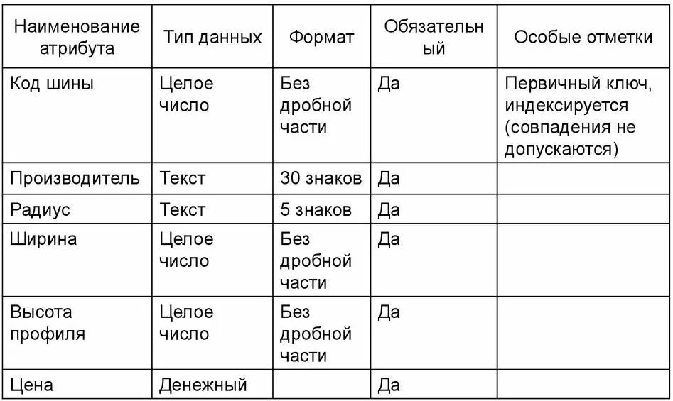
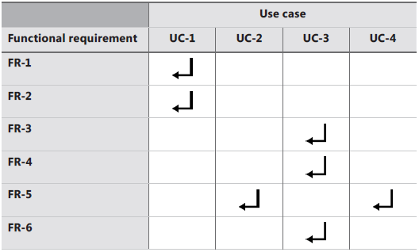
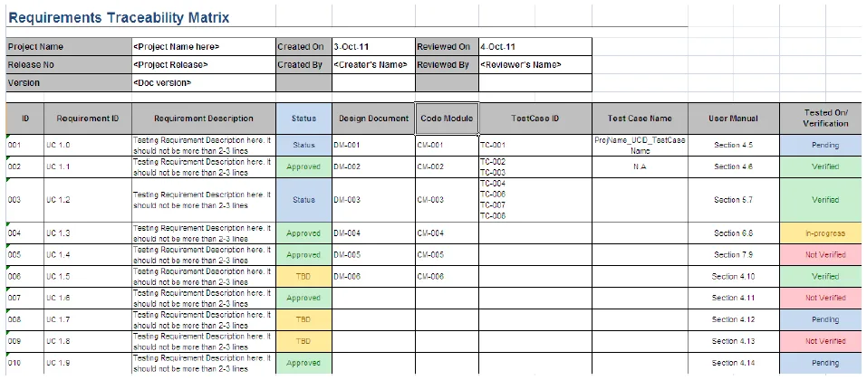

## Матрица ролей и разрешений

Матрица ролей и разрешений или матрица доступа - это вариант описания ограничивающих бизнес-правил.

## Таблица принятия решений

Таблица принятия решений (Decision Table) — это инструмент, который помогает наглядно систематизировать сложную логику: он показывает, какие действия нужно предпринять в зависимости от разных условий. Проще говоря, она превращает набор правил в матрицу, где сразу видно, что к чему приводит.

## Таблица состояний

В дополнение к диаграмме состояний:

## Описание атрибутов

## Матрица трассировки

*Матрица отслеживаемости требований*, которую также называют *матрицей трассировки* (Requirements Traceability Matrix, ) или *матрицей сопоставления требований*, показывает связи между требованиями и другими объектами. Такую матрицу хорошо создать после готовности спецификации и заполнять по мере выполнения работы.

Один из вариантов матрицы:
| Пользовательское требование | Функциональное требование | Элемент дизайна (диаграммы, таблицы, классы и др.) | Элемент кода | Тест |
|--|---|---|---|---|
| UC-28 | catalog.query.sort | Class `catalog` | `CatalogSort()` | search.7 search.8 |
| UC-29 | catalog.query.import | Class `catalog` | `CatalogImport()` `CatalogValidate()` | search.12 search.13 search.14 |

Матрицу трассировки удобно использовать при тестировании - в ней сразу видно требование и тест-кейс, а также ее можно легко подстроить под проект и добавить новые столбцы.

Еще один вариант матрицы - это двусторонняя матрица трассировки. Каждая ячейка указывает на наличие связи и большинство ячеек не заполнены.

Нефункциональные требования не всегда прослеживаются напрямую до кода. Однако некоторые нефункциональные требования создают производные функциональные (например требование целостности для аутентификации инициируют ФТ с помощью паролей или биометрии). В этих случаях следует отслеживать соответствующее функциональное требование в обратном направлении, к их родительским нефункциональным требованиям и в прямом до готового продукта.
