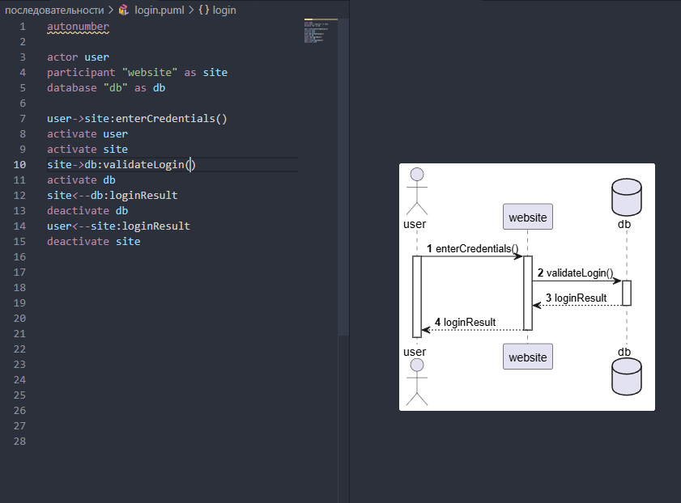

## О PlantUML
[PlantUML](https://plantuml.com/ru) - это универсальный инструмент, позволяющий быстро и просто создавать широкий спектр диаграмм.



### Полезные ссылки:
- Справочник по синтаксису [PlantUML](https://plantuml.com/ru)
- Статья [PlantUML — все, что нужно бизнес-аналитику для создания диаграмм в программной документации / Habr](https://habr.com/ru/articles/416077)
- Сервис для построения sequence-диаграмм [sequencediagram.org](https://sequencediagram.org)

### Что-то кроме UML?
Помимо UML с помощью PlantUML можно отображать:
- [JSON-данные](https://plantuml.com/ru/json) - можно добавлять в UML json-схемы
- [ER-диаграмма (нотация Чена)](https://plantuml.com/ru/er-diagram)
- Регулярные выражения [Regex](https://plantuml.com/ru/regex)
- [Wireframe](https://plantuml.com/ru/salt) - визуализация макетов, элементов интерфейса. Можно добавлять прямо в UML схемы.
- [Диаграмма Ганта](https://plantuml.com/ru/gantt-diagram)

## Примеры диаграмм
### Sequence Diagram

#### Использование фреймов
Запись пациента к врачу через онлайн-регистратуру:

```kroki {_type=plantuml }
@startuml
title Запись пациента к врачу через онлайн-регистратуру

actor "Пациент" as Patient
participant "Регистратура" as Reg
database "База данных" as DB
participant "СМС-сервис" as SMS
participant "Email-сервис" as Mail

Patient -> Reg: Запросить расписание врачей

loop По каждому выбранному дню
    Reg -> DB: Получить доступные слоты
    DB -->> Reg: Список доступных слотов
end

alt Врач доступен
    Patient -> Reg: Выбрать время приёма
    Reg -> DB: Создать запись пациента
    DB -->> Reg: Подтверждение записи

    opt Напоминание включено
        par Отправка уведомлений
            Reg -> SMS: Отправить SMS-напоминание
            SMS -->> Reg: Успешно
        else
            Reg -> Mail: Отправить Email-подтверждение
            Mail -->> Reg: Успешно
        end
    end

    Reg -->> Patient: Запись подтверждена
else Нет доступных слотов
    Reg -->> Patient: Сообщение "Нет свободного времени"
end

@enduml
```

#### Использование teoz true

```kroki {_type=plantuml }
@startuml
hide footbox
!pragma teoz true

actor "Покупатель" as User
participant "Сайт" as Web
participant "Система\nоплаты" as Pay

group Оформление и оплата заказа
    User -> Web: Оформить заказ
    & Web -> Pay: Authorize(amount, card)
    alt Оплата одобрена
        Pay -->> Web: OK(authId)
        & Web -->> User: Заказ подтверждён
        opt Уведомление включено
            Pay -->> User: Уведомление о списании
        end
    else Оплата отклонена
        Pay -->> Web: Error(code)
        & Web -->> User: Ошибка оплаты (попробуйте снова)
    end
end

@enduml
```

### Class diagram
#### Order (разные связи)

```kroki {_type=plantuml }
@startuml
'скрыть атрибуты или методы, если они пусты:
hide empty members 
'скрыть классы без связей:
hide @unlinked 
!pragma layout smetana
'убрать иконки
skinparam classAttributeIconSize 0
'объединение стрелок:
'skinparam groupInheritance 2
'убрать кружочки перед классами
'hide circle
'left to right direction

class Order {
    - client : Client
    + calculate() : Money
}

class Product {
    - weight : Float 
    - barcode : String
}

class OrderLine {
    - priceItem : PriceItem
}
class Client {
    '- orders : Order[]
}

class Service {
    - duration : Int
    - performer : String
    + schedule(date: Date) : void
}

class Catalog {
    - items : CatalogItem[]
    + findByName(name: String) : CatalogItem
}

abstract class PriceItem {
    - id : UUID
    - price : Money
    - name : String
    + getPrice() : Money
    + getName() : String
}
interface DiscountService <<interface>> {
    +count(order: Order) : Money
}

class CouponDiscount {
    +count(order: Order) : Money
}
class SeasonDiscount {
    +count(order: Order) : Money
}

Client "1" -- "*" Order : оформляет
Order "1" *-- "1..*" OrderLine : состоит из
OrderLine "1" --> "1..*" PriceItem : содержит
Catalog "1" o-l- "0..*" PriceItem 

Product -u-|> PriceItem
Service -u-|> PriceItem

DiscountService <|.. CouponDiscount : реализует
DiscountService <|.. SeasonDiscount : реализует
Order .> DiscountService : запрашивает\nстоимость\nскидки

@enduml
```

## Полезности
### Использование кавычек

- <U+00AB> - для открывающих русских кавычек
- <U+00BB> - для закрывающих
- <U+0022> - для универсальных

{}
```yaml

``` 
{}

### Компактная Sequence Diagram

```yaml
hide footbox        # убрать повторение участников внизу
!pragma teoz true   # сделать стрелки в одну линию без смещения; нужные стрелки пометить символом `&`
autonumber          # автонумерация сообщений
```