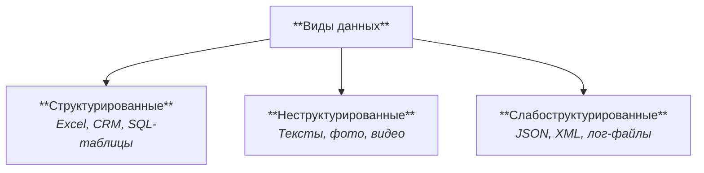

## Введение

Что почитать:
- Тут список и описание рекомендуемых книг: [Книги по SQL: что почитать новичкам и специалистам](https://selectel.ru/blog/books-sql)
- Выжимка про БД: [Базы данных / ensi](https://ensi-platform.gitlab.io/analyst-guides/tools/database)
- [Шпаргалка по SQL (postgres), которая выручает меня на собесах / Habr](https://habr.com/ru/articles/745948)
- [Database Design Guide | Ensi](https://ensi-platform.gitlab.io/guidelines/database)

## Виды данных

В мире есть разные форматы данных и работать с ними можно по-разному. Разделить их можно на 3 вида: структурированные, неструктурированные и слабоструктурированные данные.

В таблице приведено более подробное описание:

|              | Структурированные                                                                                                             | Слабоструктурированные                                                                        | Неструктурированные                                                                                  |
|--------------|-------------------------------------------------------------------------------------------------------------------------------|-----------------------------------------------------------------------------------------------|------------------------------------------------------------------------------------------------------|
| Описание     | Имеют заранее определённую схему и формат хранения; данные организованы по полям и строкам.                                   | Имеют гибкую, неполную структуру; содержат метаданные, описывающие данные.                    | Не имеют фиксированной структуры или схемы; представляют собой «сырые» данные произвольного формата. |
| Структура    | Жёсткая, фиксированная (таблицы, типы данных, связи).                                                                         | Частичная — поля могут меняться, отсутствовать или различаться по типу.                       | Отсутствует или хаотичная; каждый элемент уникален.                                                  |
| Примеры      | SQL-таблицы, Excel, CRM-базы, реляционные БД.                                                                                 | JSON, XML, YAML, лог-файлы, API-ответы, документы MongoDB.                                    | Тексты, фото, видео, аудио, PDF, посты в соцсетях.                                                   |
| Преимущества | + Легко искать, фильтровать, агрегировать;  + высокая точность и целостность;  + простая интеграция с BI-инструментами. | + Гибкость; + можно изменять схему без миграций; + удобно для быстро меняющихся систем. | + Богатая и разнообразная информация;  + подходит для ИИ-моделей и контент-анализа.               |
| Недостатки   | - Негибкость, сложность адаптации под новые типы данных.                                                                      | - Сложнее индексировать и валидировать;  - менее строгая целостность.                      | - Сложный поиск и анализ;  - требуется дополнительная обработка (NLP, CV и т.д.).                 |

Дальше мы в основном будем работать со структурированными данными в формате реляционных баз данных (БД) и SQL-таблиц.

## БД - это?

**База данных (БД)** — это организованная структура, предназначенная для хранения, управления и доступа к связанным данным. Данные хранятся не в виде разрозненных файлов, а в системе, где можно быстро находить, изменять и анализировать информацию по определённым правилам. Пример: база клиентов банка хранит сведения о клиентах, их счетах, операциях и связях между этими объектами.

**Система управления базами данных (СУБД)** — это программное обеспечение, с помощью которого создаются, хранятся, изменяются и управляются базы данных. Функции СУБД:
- Хранение и управление данными — создание, изменение, удаление таблиц и записей.  
- Манипулирование данными — выполнение запросов (чтение, фильтрация, сортировка, агрегация).  
- Обеспечение целостности — контроль связей между таблицами и корректности данных.  
- Управление транзакциями — гарантирует, что операции выполняются полностью или не выполняются вовсе.  
- Разграничение доступа — настройка прав пользователей.  
- Резервное копирование и восстановление — защита данных от потерь.  
- Оптимизация и индексация — повышение скорости запросов.

Базы данных напоминают **таблицы** и состоят из **строк** (записей) и **столбцов** (полей).

Рассмотрим на примере тетради с рецептами. Тетрадь с рецептами  - это *база данных*. Каждый рецепт — это *строка*, а графы вроде "Название", "Ингредиенты", "Время приготовления" — это *столбцы*: 

| ID | Название | Ингредиенты | Время приготовления  |
|----|------|--------|--- |  
| 1 | Яичница | Яйца | 5 мин |
| 2 | Омлет | Яйца, молоко | 10 минут |
| 3 | Селедка под шубой | Селедка, свекла, розовый майонез... |  30 мин|

Но на самом деле тут все немного сложнее и следует понимать [основы реляционной модели]().

## Типы БД

Некоторые типы БД:

| Тип БД | Принцип организации данных | Особенности и применение |
|--------|-----------------------------|---------------------------|
| Реляционные (табличные) | Данные хранятся в таблицах с колонками и строками. Между таблицами устанавливаются связи через ключи. Примеры СУБД: PostgreSQL, MySQL, Oracle, MS SQL Server. | Подходят для структурированных данных, где важны связи и целостность (CRM, бухгалтерия, учёт заказов). |
| NoSQL (нереляционные) | Данные хранятся не в таблицах, а в гибких структурах — документах, графах, ключах или колонках. Примеры СУБД: MongoDB, Redis, Cassandra, Neo4j. | Подходят для больших объёмов, слабоструктурированных или быстро меняющихся данных (Big Data, веб-приложения). |
| Объектно-ориентированные | Данные представлены в виде объектов с атрибутами и методами, как в ООП. Примеры СУБД: db4o, ObjectDB. | Удобны для приложений, где логика хранится в виде объектов (например, инженерные системы). |
| Иерархические | Данные организованы в виде дерева «родитель → потомок». Примеры СУБД: IBM IMS, Windows Registry. | Быстрый доступ при иерархической структуре (например, каталоги, файловые системы). |
| Сетевые | Записи могут иметь несколько связей между собой, образуя граф. Примеры СУБД: IDMS, Raima Database. | Гибче иерархической модели, но сложнее в реализации. Используется в старых корпоративных системах. |

Подробнее обо всех типах можно прочитать в статье [Виды баз данных. Большой обзор типов СУБД / Habr](https://habr.com/ru/companies/amvera/articles/754702)

### SQL vs NoSQL

| Характеристика | SQL (реляционные) | NoSQL (нереляционные) |
|-----------------|-------------------|------------------------|
| Структура | Таблицы с чёткой схемой | Гибкие форматы: документы, графы, ключи |
| Связи | Чётко определены (JOIN) | Часто отсутствуют или реализованы иначе |
| Масштабирование | Вертикальное (усиление сервера) | Горизонтальное (добавление узлов) |
| Язык запросов | SQL | Собственные API или языки |
| Транзакции | ACID — строгая согласованность | Часто BASE — гибкая согласованность |
| Когда использовать | Когда нужны надёжные транзакции, строгие связи, структура данных стабильна (Финансы, CRM, ERP) | Когда структура часто меняется, объёмы огромны, требуется высокая скорость и масштабируемость (Big Data, IoT, аналитика, кеширование) |
| Плюсы и минусы | + Надёжность, согласованность данных. + Мощный язык запросов. − Менее гибкая схема, сложнее масштабировать.  |  + Гибкость структуры и высокая производительность. + Простое горизонтальное масштабирование. − Меньше инструментов для транзакций, сложнее обеспечивать целостность. |

## Моделирование БД

Для визуализации данных и их связей можно использовать . Это хорошо помогает в проектировании и документировании БД. Подробнее о нотациях и правилах моделирования данных в статье [о ER-диаграммах]().