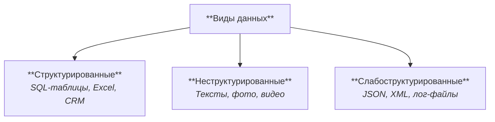
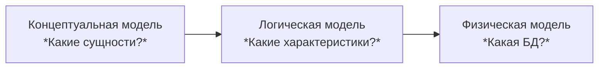
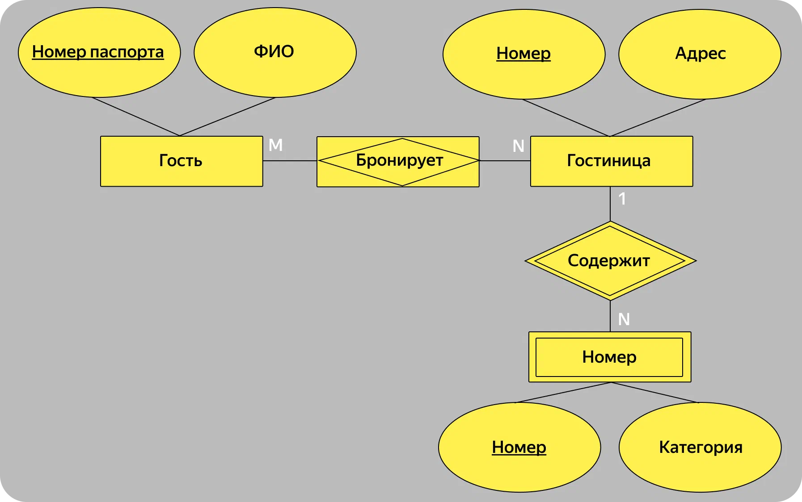
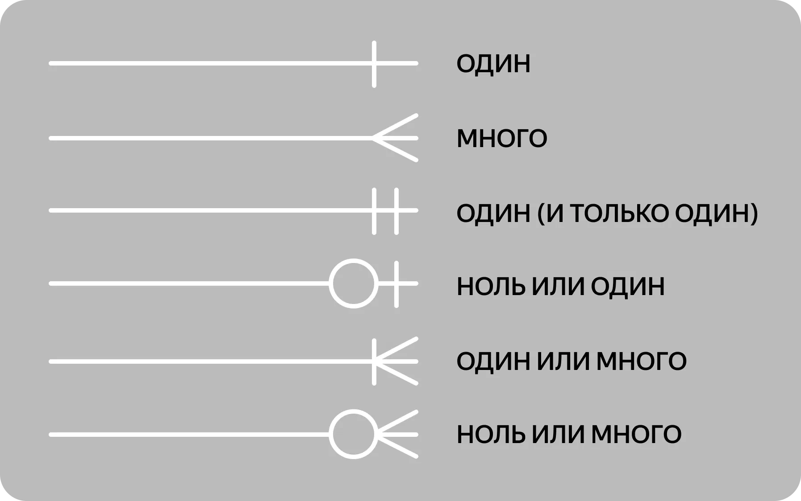
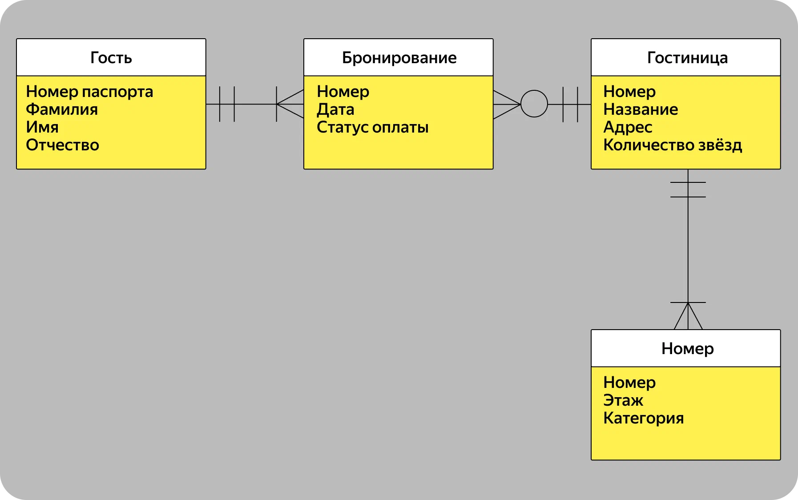

## Введение

Что почитать:
- [ERD | Ensi](https://ensi-platform.gitlab.io/analyst-guides/tools/diagrams/erd)
- Хорошая и простая визуализация о самом основном [Сущности и связи: как и для чего системные аналитики создают ER‑диаграммы | Яндекс Практикум](https://practicum.yandex.ru/blog/chto-takoe-er-diagramma/#tipy)


ERD (Entity-Relationship diagram, диаграмма отношений сущностей)
Диаграммы отношений сущностей (ERD) используется для визуального представления баз данных и показывают, как элементы в базе данных связаны друг с другом. ERD состоит из двух типов объектов - сущностей и отношений.

## Виды данных



Структурированные, неструктурированные и слабоструктурированные данные
|              | Структурированные                                                                                                             | Слабоструктурированные                                                                        | Неструктурированные                                                                                  |
|--------------|-------------------------------------------------------------------------------------------------------------------------------|-----------------------------------------------------------------------------------------------|------------------------------------------------------------------------------------------------------|
| Описание     | Имеют заранее определённую схему и формат хранения; данные организованы по полям и строкам.                                   | Имеют гибкую, неполную структуру; содержат метаданные, описывающие данные.                    | Не имеют фиксированной структуры или схемы; представляют собой «сырые» данные произвольного формата. |
| Структура    | Жёсткая, фиксированная (таблицы, типы данных, связи).                                                                         | Частичная — поля могут меняться, отсутствовать или различаться по типу.                       | Отсутствует или хаотичная; каждый элемент уникален.                                                  |
| Примеры      | SQL-таблицы, Excel, CRM-базы, реляционные БД.                                                                                 | JSON, XML, YAML, лог-файлы, API-ответы, документы MongoDB.                                    | Тексты, фото, видео, аудио, PDF, посты в соцсетях.                                                   |
| Преимущества | + Легко искать, фильтровать, агрегировать; <br>+ высокая точность и целостность; <br>+ простая интеграция с BI-инструментами. | + Гибкость;<br>+ можно изменять схему без миграций;<br>+ удобно для быстро меняющихся систем. | + Богатая и разнообразная информация; <br>+ подходит для ИИ-моделей и контент-анализа.               |
| Недостатки   | - Негибкость, сложность адаптации под новые типы данных.                                                                      | - Сложнее индексировать и валидировать; <br>- менее строгая целостность.                      | - Сложный поиск и анализ; <br>- требуется дополнительная обработка (NLP, CV и т.д.).                 |

## Уровни абстракции

ER-модели бывают разного уровня детализации. И каждый уровень решает свои задачи — от «а что мы вообще строим?» до «где именно поставить сервер».



### Концептуальная модель

**Кратко:** Отражает основные сущности, их атрибуты и связи между ними — без технических деталей.

**Для чего:** Используется на этапе проектирования предметной области, общения с заказчиком. Цель: убедиться, что все понимают проект одинаково.
</br>

```kroki {_type=plantuml }
@startuml
' Концептуальная ERD — без типов и PK/FK
' left to right direction
hide circle
skinparam linetype ortho

entity "Пользователь" as USER {
  ФИО
  email
}

entity "Велосипед" as BIKE {
  код
  статус
}

entity "Аренда" as RENTAL {
  время_начало
  время_конец
}

entity "Оплата" as PAYMENT {
  сумма
  время_оплаты
  способ_оплаты
}

USER   ||--o{ RENTAL  : совершает
BIKE   ||--o{ RENTAL  : используется в
RENTAL ||--o{ PAYMENT : оплачена через
@enduml
```

### Логическая модель

**Кратко:** Добавляет к сущностям атрибуты, типы данных, кардинальности, первичные/внешние ключи, типы связей.

**Для чего:** Используется на этапе логического проектирования БД. Цель: Сделать модель достаточно детальной для проектирования таблицы (без привязки к СУБД).
</br></br>

```kroki {_type=plantuml }
@startuml
'left to right direction
hide circle
skinparam linetype ortho

entity USER {
  +PK user_id : UUID
  --
  name   : STRING
  email  : STRING <<UQ>>
}

entity BIKE {
  +PK bike_id : UUID
  --
  code   : STRING <<UQ>>
  status : STRING  ' available|rented|service
}

entity RENTAL {
  +PK rental_id : UUID
  +FK user_id   : UUID
  +FK bike_id   : UUID
  --
  start  : DATETIME
  end    : DATETIME
  total  : DECIMAL
}

entity PAYMENT {
  +PK payment_id : UUID
  +FK rental_id  : UUID
  --
  amount  : DECIMAL
  paid_at : DATETIME
  method  : STRING  ' card|cash|wallet
}

USER   ||--o{ RENTAL  : совершает
BIKE   ||--o{ RENTAL  : используется в
RENTAL ||--o{ PAYMENT : оплачена через
@enduml
```

### Физическая модель

**Кратко:** Отражает конкретные таблицы, столбцы, индексы, ограничения, типы данных, зависящие от СУБД.

**Для чего:** Используется при реализации БД в конкретной системе (PostgreSQL, MySQL и т.д.). Над ER-моделью физического уровня в большей степени работают архитектор баз данных и разработчики.
</br></br>

```kroki {_type=plantuml }
@startuml
'left to right direction
hide circle
skinparam linetype ortho

entity USER {
  +PK user_id : uuid
  --
  name   : text NOT NULL
  email  : citext UNIQUE NOT NULL
}

entity BIKE {
  +PK bike_id : uuid
  --
  code   : text UNIQUE NOT NULL
  status : text CHECK (status IN ('available','rented','service')) NOT NULL
}

entity RENTAL {
  +PK rental_id : uuid
  +FK user_id   : uuid  -- REFERENCES user(user_id)
  +FK bike_id   : uuid  -- REFERENCES bike(bike_id)
  --
  start  : timestamptz NOT NULL
  end    : timestamptz
  total  : numeric(10,2) CHECK (total>=0) DEFAULT 0
}

entity PAYMENT {
  +PK payment_id : uuid
  +FK rental_id  : uuid  -- REFERENCES rental(rental_id)
  --
  amount  : numeric(10,2) CHECK (amount>=0) NOT NULL
  paid_at : timestamptz
  method  : text CHECK (method IN ('card','cash','wallet')) NOT NULL
}

USER   ||--o{ RENTAL  : совершает
BIKE   ||--o{ RENTAL  : используется в
RENTAL ||--o{ PAYMENT : оплачена через
@enduml
```

## По направлению моделирования

| Тип                        | Суть                                                                           |
| -------------------------- | ------------------------------------------------------------------------------ |
| **Top-Down (нисходящий)**  | Сначала выявляются крупные сущности, затем уточняются связи и атрибуты.        |
| **Bottom-Up (восходящий)** | Сначала описываются детали (атрибуты, таблицы), потом группируются в сущности. |
| **Inside-Out**             | Начинают с "ядра" — ключевых сущностей, затем добавляют периферийные.          |


## Нотации
### Нотация Чена
Прямоугольники изображают множества сущностей, а ромбы — отношений. При участии первых в отношении связь обозначается линией. Пунктир говорит о том, что отношение является необязательным. Овалы обозначают атрибуты. Связь последних с сущностью или отношением показывают линией.




### Нотация Мартина (воронья лапка)
В данной нотации прямоугольником с именем существительным обозначается сущность. Две сущности, которые участвуют в отношении, соединяются линией. Степень конца связи обозначается графически. Если она множественная, на конце ставится «вилка». Также схематичное изображение используют для обозначения модальности. На конце связи ставится кружок, если она является необязательной. Внутри прямоугольника, означающего сущность, указываются атрибуты. Они представлены единственным числом имен существительных, могут сопровождаться уточняющими словами. Среди атрибутов есть ключ сущности. Он представлен не избыточным набором атрибутов, совокупное значение которых для каждого экземпляра сущности является уникальным.

Типы стрелок:






### IDEF1X
### Диаграмма классов UML

## Сущность

Объект, фигурирующая в системе
Атрибуты сущности - ее свойства. Для атрибутов приянто указывать тип данных.

## Отношение

Связи между сущностями

### Типы связей
1:M — один ко многим — если сущности из первого набора участвуют в связи не более одного раза, а сущности из второго набора – многократно (как минимум дважды).
1:1 — один к одному — когда каждая сущность в обоих наборах сущностей участвует в связи не более одного раза.
M:1 — многие к одному — если сущности из первого набора участвуют в связи многократно (как минимум дважды), а сущности из второго набора не более одного раза.
M:M — многие ко многим — если сущности в обоих наборах участвуют в связи многократно (как минимум дважды).


## Инструменты

- draw.io
- PlantUML [в нотации Чена](https://plantuml.com/ru/er-diagram) и [в нотации Мартина (воронья лапка)](https://plantuml.com/ru/ie-diagram)
- Для MySQL можно использовать [MySQL Workbench](https://www.mysql.com/products/workbench) с поддержкой генерации SQL.

## Примеры


