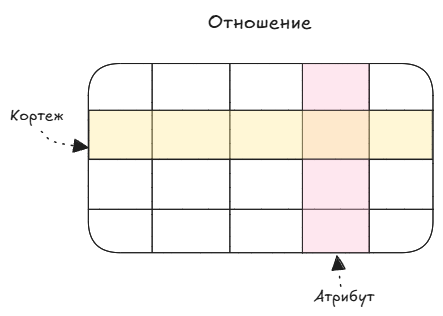
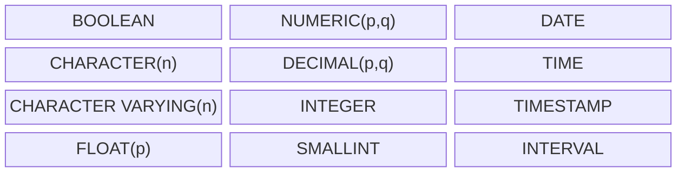
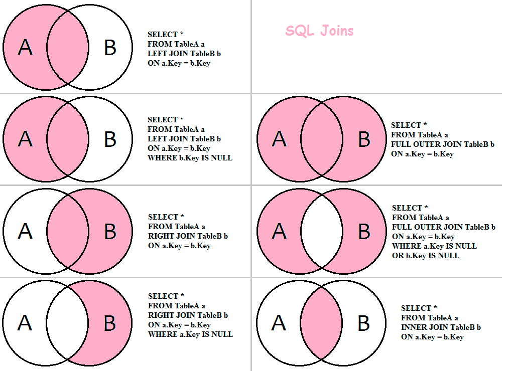
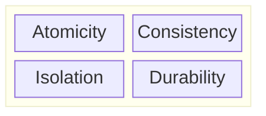

## Введение

Тут идет речь о реляционных базах данных, которые организованы в виде связанных таблиц, также называемых отношениями (relation).

Что почитать:
- Реляционные БД. Все, что нужно знать [Базы данных / ensi](https://ensi-platform.gitlab.io/analyst-guides/tools/database)
- [Шпаргалка по SQL (postgres), которая выручает меня на собесах / Habr](https://habr.com/ru/articles/745948)

## Что это такое

**Реляционная модель** — математическая основа для работы с данными, где информация представлена в виде отношений (relation), то есть множеств строк и столбцов, а операции над ними формально определены.

Реляционная модель определяет не структуру хранения, а отношения между фактами и их логические свойства. Она описывает, какие утверждения истинны в модели мира, а не как они хранятся в памяти.

Её основатель — Эдгар Ф. Кодд, который предложил способ описывать данные и связи между ними строго математически.

Ключевые принципы реляционной модели:
- Все данные представлены в виде отношений (множеств кортежей).
- Операции над данными соответствуют операциям теории множеств и логики.
- Результат любой операции также является отношением (принцип замкнутости).
- Порядок строк и столбцов не имеет значения.
- Каждое значение строго определено и принадлежит своему домену.

## Структура
Реляционные БД организованы в виде связанных таблиц, также называемых отношениями (relation), где кортежи представлены в виде строк, а атрибуты - в виде столбцов.



### Отношения (таблица)

**Отношение (relation)** — это математическое множество кортежей (строк), где каждый кортеж состоит из атрибутов (столбцов). Отношение — понятие математическое; таблица — его физическое воплощение.

Компоненты отношения:

- Заголовок (heading) — структура: имена атрибутов и домены.
- Тело (body) — множество кортежей, соответствующих заголовк

Важные свойства отношений:
- строки (кортежи) уникальны — дубликатов быть не может;
- порядок строк и столбцов не имеет значения;
- каждое значение строго определено (в теории нет аналога SQL-NULL);
- каждое значение принадлежит определённому типу данных (домену).

Эти свойства обеспечивают детерминированность и строгость поведения данных.

Пример таблицы Users:

| ID | Login | Email |  
|----|------|--------|  
| 1 | ivan_123 | ivan@example.com |
| 2 | petr_ | petrrr@example.com |
| 3 | annuta | anya_v@example.com |

На языке SQL:

```SQL
CREATE TABLE Users(
    ID INT PRIMARY KEY,
    Login VARCHAR(100),
    Email VARCHAR(150)
);
```

### Кортежи (строки)

**Кортеж** (строка, запись) - экземпляр данных, который содержит значения для каждого атрибута (столбца).

Кортежи в примере - это строки 1,2,3:
| ID | Login | Email |  
|----|------|--------|  
| 1 | ivan_123 | ivan@example.com |
| 2 | petr_ | petrrr@example.com |
| 3 | annuta | anya_v@example.com |

На языке SQL:
```SQL
INSERT INTO Users (ID, Login, Email) VALUES
    (1, 'ivan_123', 'ivan@example.com'),
    (2, 'petr_', 'petrrr@example.com'),
    (3, 'annuta', 'anya_v@example.com');
```

### Атрибуты (столбцы)

**Атрибут (столбец, поле, колонка)** - именованный столбец отношения (таблицы), принадлежащий определённому домену (типу данных).

Атрибуты в примере - это столбцы ID, Login, Email:
| ID | Login | Email |  
|----|------|--------|  
| 1 | ivan_123 | ivan@example.com |
| 2 | petr_ | petrrr@example.com |
| 3 | annuta | anya_v@example.com |

Можно отдельно добавить атрибут на языке SQL:
```SQL
ALTER TABLE Users ADD Phone VARCHAR(20) NOT NULL;
```

### Домены (типы данных)

**Домен (domain)** или **тип данных** — множество допустимых значений атрибута. это именованное конечное множество значений – всех значений данного типа, например: всех возможных целых чисел, всех возможных строк, всех возможных номеров поставщиков.

Скалярные и нескалярные типы:
- Скалярные — атомарные, не имеющие внутренних компонентов (например, INTEGER, CHAR, DATE).
- Нескалярные — составные, элементы которых сами являются значениями (например, отношение как множество кортежей).

Главное различие — возможность декомпозиции: скалярное значение неделимо, нескалярное — агрегат из скалярных.

Скалярные типы SQL:


```mermaid
block
    columns 3
    BOOLEAN NUMERIC["NUMERIC(p,q)"] DATE
    CHARACTER["CHARACTER(n)"] DECIMAL["DECIMAL(p,q)"] TIME
    VCHAR["CHARACTER VARYING(n)"] INTEGER TIMESTAMP
    FLOAT["FLOAT(p)"] SMALLINT INTERVAL
```


### Ключи
#### Первичные ключи

**Первичный ключ** (Primary Key или PK) — это один или несколько атрибутов (столбцов), значения которых уникальны для каждой записи (строки). Необходим для идентификации кортежей (строк). Например, в ранее созданной таблице Users первичным ключом служит атрибут ID.

Для создания первичного ключа используется ограничение `PRIMARY KEY`:
```SQL
CREATE TABLE Users( 
    ID INT PRIMARY KEY, -- Первичный ключ
    ...
);
```

#### Внешние ключи

Отношения между таблицами устанавливаются с помощью внешних ключей.

**Внешний ключ** (Foreign Key или FK) — это атрибут (или их набор) в одной таблице, которые ссылаются на первичный ключ (или любой другой столбец с уникальными значениями) второй таблицы. Это позволяет связывать данные и поддерживать их целостность.

Для создания внешнего ключа используется ограничение `FOREIGN KEY`:

```SQL
CREATE TABLE Posts( 
    ID INT PRIMARY KEY,
    Text VARCHAR(255).
    Date DATE,
    UserID INT, -- внешний ключ
    FOREIGN KEY (UserID) REFERENCES Users(ID) -- внешний ключ
);
```

#### Составной ключ

**Составной ключ** (Composite Key)  - это ключ, состоящий из нескольких полей, вместе образующих уникальность записи.

#### Суррогатный ключ


## SQL и реляционная модель
**Structured Query Language (SQL)** — стандартный язык для управления реляционными базами данных. Он используется для создания, изменения и удаления сущностей, а также выполнения запросов к данным, включая фильтрацию, сортировку и агрегирование.

**Декларативность** означает, что разработчик описывает что нужно получить, а не как это сделать.
 
Пример:  
```sql
SELECT name, email FROM clients WHERE city = 'Москва';
```

SQL создавался как реализация идей реляционной модели, но фактически стал приближением, а не воплощением теории.
Между SQL и моделью есть фундаментальные противоречия:

| Принцип реляционной модели    | Нарушение в SQL                                                      |
| ----------------------------- | -------------------------------------------------------------------- |
| Все кортежи уникальны         | SQL допускает **дубликаты строк**                                    |
| Нет неопределённых значений   | В SQL присутствует **NULL**                                          |
| Порядок не имеет значения     | SQL сохраняет **порядок вывода**                                     |
| Строгая типизация             | SQL допускает **динамические преобразования типов**                  |
| Операции замкнуты в отношении | В SQL некоторые конструкции (например, курсоры) нарушают замкнутость |

Эти отклонения делают SQL нестрогим логически, но его можно использовать ближе к идеалу, если понимать теорию и сознательно избегать двусмысленных конструкций.
 
### Различайте кортеж и строку

Не путайте логическое понятие кортежа с физическим понятием строки в SQL. Кортеж — это математическое множество имён и значений; Строка — упорядоченная структура с возможными NULL и дубликатами.

### Различайте отношение и таблицу

Не считайте SQL-таблицу “отношением” в теоретическом смысле. SQL-таблицы могут содержать дубликаты, NULL и порядок; Отношение — множество строго определённых кортежей без дубликатов и без порядка. Относитесь к таблице как к переменной-отношению, а к результату запроса — как к отношению-значению.

Отношение — это не таблица и не набор строк, а множество истинных утверждений о мире. Если отношение изменяется, это значит, что изменилась истина в модели данных.

Проектирование и запросы должны описывать, какие утверждения верны, а не как физически хранить или извлекать записи. SQL-код должен быть построен как логическое описание, а не процедурная последовательность.

### Не полагайтесь на порядок строк или столбцов

Не считать порядок строк или столбцов значимым свойством данных. В реляционной модели порядок не существует. Любая операция (JOIN, UNION, SELECT) возвращает множество без порядка. `ORDER BY` допустим только на уровне представления (вывода пользователю), но не в логике запросов.

### Избегайте NULL

NULL нарушает принцип реляционной модели, вводя трёхзначную логику (TRUE, FALSE, UNKNOWN). Пример: WHERE salary > 50000 для записи с salary = NULL не возвращает ни TRUE, ни FALSE.

Это приводит к:
- нелогичным результатам при соединениях и фильтрации;
- некорректным подсчётам агрегатов;
- трудностям при проверке целостности данных.

Рекомендации:
1. Задавайте ограничение `NOT NULL`
2. Делите таблицы — отсутствие данных моделируйте отдельным отношением.  
3. Используйте явные значения по умолчанию (`''`, `0`, `N/A`).  
4. Добавляйте флаги определённости (`HAS_DATE BOOLEAN`, `DATE DATE`).  
5. Контролируйте ввод на полноту и корректность.

### Избегайте дубликатов

**Дубликаты** — одно из главных нарушений реляционной модели. Отношение — это множество кортежей, а множество по определению не содержит повторов. SQL допускает дублированные строки, что приводит к потере логической определённости.

**Основные проблемы дубликатов:**
- Невозможно различать идентичные строки.  
- Соединения (`JOIN`) создают неконтролируемое разрастание результата.  
- `UPDATE` и `DELETE` могут затронуть больше данных, чем нужно.  
- Нарушается идемпотентность — повторный запрос даёт разные результаты.

**Практические приёмы:**
1. Определять первичные ключи (`PRIMARY KEY`).
2. Использовать `UNIQUE` для дополнительных ограничений.  
3. Применять `DISTINCT` при выборках из ненормализованных источников.  
4. Избегать `UNION ALL`, использовать `UNION` без `ALL`. 

### Именование столбцов

- Применяйте спецификацию `AS`, чтобы назначить подходящие имена столбцам, которые в противном случае (а) вообще не имели бы имен или (б) имели бы неуникальные имена.
- Старайтесь давать одинаковые имена столбцам, представляющим одну и ту же информацию.


## Основные принципы

### Целостность данных
Система реляционных БД обеспечивает:
- **Ссылочную целостность** — внешние ключи указывают только на существующие записи. 
- **Доменную целостность** — значения полей соответствуют допустимому типу данных.  
- **Уникальность** — недопустимо дублирование записей с одинаковым первичным ключом.

Целостность поддерживается с помощью **ограничений** (constraints):
- первичный ключ (Primary Key) обеспечивает уникальность каждой записи в таблице;
- внешний ключ (Foreign Key) устанавливает связь между значением в одном столбце и уникальным значением в другом — обычно в иной таблице;
- уникальность (Unique) гарантирует, что все значения в столбце или комбинации столбцов будут уникальными;
- NOT NULL запрещает пустые значения атрибута.

### Математическая основа
Реляционные БД опираются на теорию множеств и реляционную алгебра:  
- таблица — это множество записей (кортежей);  
- операции над таблицами (JOIN, UNION, INTERSECT, SELECT и др.) — это операции над множествами;  
- каждое отношение имеет уникальный набор атрибутов. 

 

### Транзакционность (ACID-принцип)
**Транзакция** - группа операций, выполняемых как единое целое. Либо все изменения применяются, либо ни одно.

Транзакции обладают **свойствами ACID**:
- Атомарность (Atomicity) — все операции выполняются полностью или не выполняются вовсе;  
- Согласованность (Consistency) — база остаётся в согласованном состоянии;  
- Изолированность (Isolation) — параллельные операции не влияют друг на друга;  
- Долговечность (Durability) — после фиксации результат сохраняется даже при сбое.


```mermaid
block
    block:group1
        columns 2
        Atomicity
        Consistency
        Isolation
        Durability 
    end
```

Пример транзакции:
```SQL
BEGIN;
UPDATE Accounts SET Balance = Balance - 100 WHERE AccountID = 1;
UPDATE Accounts SET Balance = Balance + 100 WHERE AccountID = 2;
COMMIT;
```

### Независимость данных
Программы, использующие базу, не зависят от физического способа хранения данных.  
Даже если структура хранения на диске изменится, логическая модель (таблицы, связи, SQL-запросы) остаётся прежней.  

Это свойство называется **логической и физической независимостью данных**.


