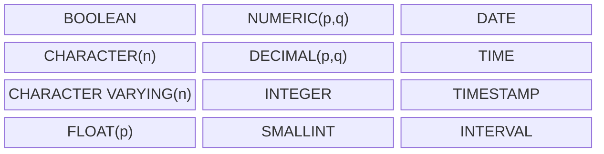
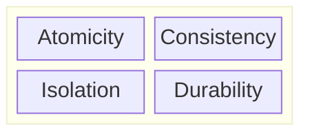

Тут идет речь о реляционных базах данных, которые организованы в виде связанных таблиц, также называемых отношениями (relation).


Что почитать:
- Реляционные БД. Все, что нужно знать [Базы данных / ensi](https://ensi-platform.gitlab.io/analyst-guides/tools/database)
- [Шпаргалка по SQL (postgres), которая выручает меня на собесах / Habr](https://habr.com/ru/articles/745948)

## Что это такое

**Реляционная модель** — математическая основа для работы с данными, где информация представлена в виде отношений (relation), то есть множеств строк и столбцов, а операции над ними формально определены.

Реляционная модель определяет не структуру хранения, а отношения между фактами и их логические свойства. Она описывает, какие утверждения истинны в модели мира, а не как они хранятся в памяти.

Её основатель — Эдгар Ф. Кодд, который предложил способ описывать данные и связи между ними строго математически.

Ключевые принципы реляционной модели:
- Все данные представлены в виде отношений (множеств кортежей).
- Операции над данными соответствуют операциям теории множеств и логики.
- Результат любой операции также является отношением (принцип замкнутости).
- Порядок строк и столбцов не имеет значения.
- Каждое значение строго определено и принадлежит своему домену.

## Структура
Реляционные БД организованы в виде связанных таблиц, также называемых отношениями (relation), где кортежи представлены в виде строк, а атрибуты - в виде столбцов.


### Отношения (таблица)

**Отношение (relation)** — это математическое множество кортежей (строк), где каждый кортеж состоит из атрибутов (столбцов). Отношение — понятие математическое; таблица — его физическое воплощение.

Компоненты отношения:

- Заголовок (heading) — структура: имена атрибутов и домены.
- Тело (body) — множество кортежей, соответствующих заголовк

Важные свойства отношений:
- строки (кортежи) уникальны — дубликатов быть не может;
- порядок строк и столбцов не имеет значения;
- каждое значение строго определено (в теории нет аналога SQL-NULL);
- каждое значение принадлежит определённому типу данных (домену).

Эти свойства обеспечивают детерминированность и строгость поведения данных.

Пример таблицы Users:

| ID | Login | Email |  
|----|------|--------|  
| 1 | ivan_123 | ivan@example.com |
| 2 | petr_ | petrrr@example.com |
| 3 | annuta | anya_v@example.com |

На языке SQL:

```SQL
CREATE TABLE Users(
    ID INT PRIMARY KEY,
    Login VARCHAR(100),
    Email VARCHAR(150)
);
```

### Кортежи (строки)

**Кортеж** (строка, запись) - экземпляр данных, который содержит значения для каждого атрибута (столбца).

Кортежи в примере - это строки 1,2,3:
| ID | Login | Email |  
|----|------|--------|  
| 1 | ivan_123 | ivan@example.com |
| 2 | petr_ | petrrr@example.com |
| 3 | annuta | anya_v@example.com |

На языке SQL:
```SQL
INSERT INTO Users (ID, Login, Email) VALUES
    (1, 'ivan_123', 'ivan@example.com'),
    (2, 'petr_', 'petrrr@example.com'),
    (3, 'annuta', 'anya_v@example.com');
```

### Атрибуты (столбцы)

**Атрибут (столбец, поле, колонка)** - именованный столбец отношения (таблицы), принадлежащий определённому домену (типу данных).

Атрибуты в примере - это столбцы ID, Login, Email:
| ID | Login | Email |  
|----|------|--------|  
| 1 | ivan_123 | ivan@example.com |
| 2 | petr_ | petrrr@example.com |
| 3 | annuta | anya_v@example.com |

Можно отдельно добавить атрибут на языке SQL:
```SQL
ALTER TABLE Users ADD Phone VARCHAR(20) NOT NULL;
```

### Домены (типы данных)

**Домен (domain)** или **тип данных** — множество допустимых значений атрибута. это именованное конечное множество значений – всех значений данного типа, например: всех возможных целых чисел, всех возможных строк, всех возможных номеров поставщиков.

Скалярные и нескалярные типы:
- Скалярные — атомарные, не имеющие внутренних компонентов (например, INTEGER, CHAR, DATE).
- Нескалярные — составные, элементы которых сами являются значениями (например, отношение как множество кортежей).

Главное различие — возможность декомпозиции: скалярное значение неделимо, нескалярное — агрегат из скалярных.

Скалярные типы SQL:




### Ключи
#### Первичные ключи

**Первичный ключ** (Primary Key или PK) — это один или несколько атрибутов (столбцов), значения которых уникальны для каждой записи (строки). Необходим для идентификации кортежей (строк). Например, в ранее созданной таблице Users первичным ключом служит атрибут ID.

Для создания первичного ключа используется ограничение `PRIMARY KEY`:
```SQL
CREATE TABLE Users( 
    ID INT PRIMARY KEY, -- Первичный ключ
    ...
);
```

#### Внешние ключи

Отношения между таблицами устанавливаются с помощью внешних ключей.

**Внешний ключ** (Foreign Key или FK) — это атрибут (или их набор) в одной таблице, которые ссылаются на первичный ключ (или любой другой столбец с уникальными значениями) второй таблицы. Это позволяет связывать данные и поддерживать их целостность.

Для создания внешнего ключа используется ограничение `FOREIGN KEY`:

```SQL
CREATE TABLE Posts( 
    ID INT PRIMARY KEY,
    Text VARCHAR(255).
    Date DATE,
    UserID INT, -- внешний ключ
    FOREIGN KEY (UserID) REFERENCES Users(ID) -- внешний ключ
);
```

#### Составной ключ

**Составной ключ** (Composite Key)  - это ключ, состоящий из нескольких полей, вместе образующих уникальность записи.

#### Суррогатный ключ


## SQL и реляционная модель
**Structured Query Language (SQL)** — стандартный язык для управления реляционными базами данных. Он используется для создания, изменения и удаления сущностей, а также выполнения запросов к данным, включая фильтрацию, сортировку и агрегирование.

**Декларативность** означает, что разработчик описывает что нужно получить, а не как это сделать.
 
Пример:  
```sql
SELECT name, email FROM clients WHERE city = 'Москва';
```

SQL создавался как реализация идей реляционной модели, но фактически стал приближением, а не воплощением теории.
Между SQL и моделью есть фундаментальные противоречия:

| Принцип реляционной модели    | Нарушение в SQL                                                      |
| ----------------------------- | -------------------------------------------------------------------- |
| Все кортежи уникальны         | SQL допускает **дубликаты строк**                                    |
| Нет неопределённых значений   | В SQL присутствует **NULL**                                          |
| Порядок не имеет значения     | SQL сохраняет **порядок вывода**                                     |
| Строгая типизация             | SQL допускает **динамические преобразования типов**                  |
| Операции замкнуты в отношении | В SQL некоторые конструкции (например, курсоры) нарушают замкнутость |

Эти отклонения делают SQL нестрогим логически, но его можно использовать ближе к идеалу, если понимать теорию и сознательно избегать двусмысленных конструкций.

### Проблема NULL и неполных данных
SQL ввёл NULL как средство обозначения отсутствующего значения, но это противоречит логике.
В реляционной теории любое утверждение должно быть либо истинным, либо ложным.
Введение NULL добавляет третье состояние — «неизвестно», что нарушает основы предикатной логики и делает результаты запросов непредсказуемыми.

Пример: WHERE salary > 50000 для записи с salary = NULL не возвращает ни TRUE, ни FALSE.
Это приводит к:

- нелогичным результатам при соединениях и фильтрации;
- некорректным подсчётам агрегатов;
- трудностям при проверке целостности данных.
  

## Основные принципы

### Целостность данных
Система реляционных БД обеспечивает:
- **Ссылочную целостность** — внешние ключи указывают только на существующие записи. 
- **Доменную целостность** — значения полей соответствуют допустимому типу данных.  
- **Уникальность** — недопустимо дублирование записей с одинаковым первичным ключом.

Целостность поддерживается с помощью **ограничений** (constraints):
- первичный ключ (Primary Key) обеспечивает уникальность каждой записи в таблице;
- внешний ключ (Foreign Key) устанавливает связь между значением в одном столбце и уникальным значением в другом — обычно в иной таблице;
- уникальность (Unique) гарантирует, что все значения в столбце или комбинации столбцов будут уникальными;
- NOT NULL запрещает пустые значения атрибута.

### Математическая основа
Реляционные БД опираются на теорию множеств и реляционную алгебра:  
- таблица — это множество записей (кортежей);  
- операции над таблицами (JOIN, UNION, INTERSECT, SELECT и др.) — это операции над множествами;  
- каждое отношение имеет уникальный набор атрибутов. 

 

### Транзакционность (ACID-принцип)
**Транзакция** - группа операций, выполняемых как единое целое. Либо все изменения применяются, либо ни одно.

Транзакции обладают **свойствами ACID**:
- Атомарность (Atomicity) — все операции выполняются полностью или не выполняются вовсе;  
- Согласованность (Consistency) — база остаётся в согласованном состоянии;  
- Изолированность (Isolation) — параллельные операции не влияют друг на друга;  
- Долговечность (Durability) — после фиксации результат сохраняется даже при сбое.



Пример транзакции:
```SQL
BEGIN;
UPDATE Accounts SET Balance = Balance - 100 WHERE AccountID = 1;
UPDATE Accounts SET Balance = Balance + 100 WHERE AccountID = 2;
COMMIT;
```

### Независимость данных
Программы, использующие базу, не зависят от физического способа хранения данных.  
Даже если структура хранения на диске изменится, логическая модель (таблицы, связи, SQL-запросы) остаётся прежней.  

Это свойство называется **логической и физической независимостью данных**.

## Нормализация БД
Нормализация: что это, зачем нужна, 3 формы

Что такое нормализация БД?
Назови первые три нормальные формы?
Что такое денормализация и когда ее использовать?
38.   Знакомы ли вы с нормализацией баз данных?
39.   Задача на нормализацию таблиц базы данных. Дают две таблицы с некоторыми полями. Что в них не так и почему? Как исправить?

## Сложные штуки
### Индексы
- [Как я уронил прод на полтора часа (и при чем тут soft delete и partial index) / Habr](https://habr.com/ru/companies/skyeng/articles/802191)

### Транзакции
### Отношения и кортежи
В чем разница между отношениями-значениями и переменными-отношениями
Значимость предикатов и высказываний
• Важность имен атрибутов
• Важнейшая роль ограничений целостности

## Моделирование
### Модель Чена
В этой системе сущности обозначаются прямоугольниками, а связи — ромбами; прямоугольники и ромбы соединяются линиями

### Воронья Лапка
Система обозначений с применением значка "воронья лапка" (Crow's Foot).
В этой системе сущности также обозначаются прямоугольниками, а связи между сущностями представлены с помощью линий. Связь "один ко многим" или "многие ко многим" представлена с использованием значка "воронья лапка" на одном или обоих концах линии.


## Вопросы

Виды ограничений БД?
Какие способы масштабирования БД можешь назвать?
Какие способы оптимизации БД можешь назвать?
Что такое требования ACID?
Как объяснить бабушке что такое БД.

IV SQL и базы данных
36.   Приходилось ли вам писать sql-запросы? Для чего?
37.   Зачем нужны индексы в таблицах БД?
38.   Знакомы ли вы с нормализацией баз данных?
39.   Задача на нормализацию таблиц базы данных. Дают две таблицы с некоторыми полями. Что в них не так и почему? Как исправить?


40.   Какие виды JOIN запросов вы знаете?
41.   Задача sql. Дают таблицы. Напишите SELECT с такими-то условиями запроса (задача на JOIN).
42.   Задача sql. Дают таблицы. Напишите SELECT с такими-то условиями запроса (задача на GROUP BY).
43.   Даются следующие три операции SQL. Какой будет результат?

TRUNCATE TABLE;
ROLLBACK;
SELECT * FROM TABLE;

44.   Чем TRANCATE отличается от DELETE?
45.   Дается SQL запрос. Назовите все ошибки в синтаксисе, которые вы видите.
46.   Назовите все способы в SQL выбрать данные из первой таблицы, которых нет во второй таблице (NOT IN, NOT EXISTS и др).


47.   Что такое транзакция?
48.   Какими свойствами должна обладать транзакция? (ACID)
49.   Чем отличается UNION от UNION ALL?
50.   Какие типы JOIN вы знаете? Чем LEFT JOIN отличается от FULL JOIN ?
51.   Можете назвать три первые формы нормализации?
52.   Что такое первичный ключ? Каким свойством обладает первичный ключ? Что такое внешний ключ?
53.   Что такое поисковые пути в базах данных?
54.   Какие бывают представления в БД?
55.   Для чего используется HAVING в SQL?


## Рекомендации
### Всегда различайте кортеж и строку

Рекомендация:
Не путайте логическое понятие кортежа с физическим понятием строки в SQL.

Почему:

Кортеж — это математическое множество имён и значений;

Строка — упорядоченная структура с возможными NULL и дубликатами.
Путаница приводит к тому, что программисты думают о таблицах как о “файлах со строками”, а не как об отношениях.

### Всегда различайте отношение и таблицу

Настоятельная рекомендация:
Не считать SQL-таблицу “отношением” в теоретическом смысле.

Аргументы автора:

SQL-таблицы могут содержать дубликаты, NULL и порядок;

отношение — множество строго определённых кортежей без дубликатов и без порядка.
Следовательно, отношения — логические значения, а таблицы — переменные.

Практический совет:
Относитесь к таблице как к переменной-отношению, а к результату запроса — как к отношению-значению.

### Никогда не полагайтесь на порядок строк или столбцов

Настоятельная рекомендация:
Не считать порядок строк или столбцов значимым свойством данных.

Почему:
В реляционной модели порядок не существует.
Любая операция (JOIN, UNION, SELECT) возвращает множество без порядка.
ORDER BY допустим только на уровне представления (вывода пользователю), но не в логике запросов.

Не пишите на SQL код, зависящий от
порядка столбцов. В качестве примеров ситуаций, в которых SQL при-
дает существенное значение упорядочению, назовем следующие:
- SELECT *
- JOIN, UNION, INTERSECT, EXCEPT – особенно, если в последних
трех случаях отсутствует ключевое слово CORRESPONDING
- В списке имен столбцов, если он задан, вслед за определением переменной
кортежа (range variable)
- В списке имен столбцов, если он задан, в CREATE VIEW
- INSERT, если не задан список имен столбцов
- Сравнения с модификаторами ALL и ANY, если степени операндов
больше 1
- Выражения VALUES

Рекомендация: Если степень сравниваемых строк отлична от единицы
(то есть речь не идет о сравнении скаляров), не пользуйтесь операторами
сравнения «<», «<=», «>» и «>=»; они зависят от упорядочения столбцов
слева направо и, следовательно, не имеют прямого аналога в реляцион-
ной модели, да и в любом случае чреваты серьезными ошибками.

#### Схемы упорядочения в SQL

SQL допускает, чтобы результаты запросов имели упорядоченный вид — через оператор `ORDER BY` и механизмы сортировки, встроенные в СУБД.
С точки зрения реляционной теории, это фундаментальное нарушение модели.

Когда SQL позволяет использовать `ORDER BY` внутри запроса, он вмешивает физический аспект (упорядочение) в логическую модель, что делает результат непредсказуемым:

- один и тот же запрос без ORDER BY может возвращать строки в разном порядке на разных СУБД или при разных планах выполнения;
- порядок вывода создаёт у пользователей иллюзию, будто он является частью семантики данных.

**Рекомендация:**
Сортировка не должна быть частью внутренней логики запросов, определяющих реляционные результаты. Например для вывода пользователю или формирования отчёта.
То есть `ORDER BY` допустим на уровне представления, но не на уровне данных.

### Избегайте NULL

**NULL** — NULL нарушает этот принцип реляционной модели, вводя трёхзначную логику (TRUE, FALSE, UNKNOWN).

**Проблемы:**
1. Нарушается двузначная логика: `(A = B)` может быть UNKNOWN.  
2. Непредсказуемость в результатах агрегатов и соединений.  
3. Потеря целостности: ключевые поля могут содержать NULL.  
4. Неопределённость смысла: NULL может означать “неизвестно”, “не применимо”, “ещё не введено”.

**Рекомендации:**
1. Делите таблицы — отсутствие данных моделируйте отдельным отношением.  
2. Используйте явные значения по умолчанию (`''`, `0`, `N/A`).  
3. Добавляйте флаги определённости (`HAS_DATE BOOLEAN`, `DATE DATE`).  
4. Контролируйте ввод на полноту и корректность.


SQL-выражения все равно могут порождать таблицы,
содержащие null. Вот несколько ситуаций, когда null-значения могут
возникать.
- Все «функции множеств
» в SQL, например SUM, возвращают null,
если аргументом является пустое
множество
(за исключением
COUNT и COUNT(*), которые корректно возвращают нуль).
- Если результатом скалярного подзапроса является пустая
таблица,
то эта таблица
приводится к null.
- Если однострочный подзапрос дает пустую
таблицу,
то эта таблица
приводится к строке, содержащей в каждом столбце null. Примеча-
ние: Cтрока из одних null-значений и null-строка – логически
вовсе
не одно и то же (кстати, вот еще одно логическое
различие), и тем не
менее SQL полагает, по крайней мере в некоторых случаях, что они
неразличимы. Но попытка разобраться в таких тонкостях завела бы
нас слишком далеко.
- Внешние соединения и соединения объединением (union join) изна-
чально спроектированы так, что результат включает null-значения.
- Если в выражении CASE опущена фраза ELSE, предполагается, что
фраза ELSE имеет вид ELSE NULL.
- Если x = y, то выражение NULLIF(x,y) возвращает null.
- Оба «ссылочных триггерных действия
» ON DELETE SET NULL и ON

Настоятельные рекомендации:
- Задавайте ограничение NOT NULL
- Не используйте ключевое слово UNKNOWN вообще ни в каких кон-
текстах.
- Не опускайте фразу ELSE в выражении CASE, если нет уверенности,
что она никогда не получит управления.
- Не используйте функцию NULLIF.
- Не пользуйтесь внешними соединениями и не употребляйте ключе-
вых слов OUTER, FULL, LEFT и RIGHT (кроме, быть может, случа-
ев, описанных в разделе «Замечание о внешнем соединении» ниже).
- Не используйте соединение объединением.
- Не употребляйте ключевых слов PARTIAL и FULL в спецификаторе MATCH (они имеют смысл только при наличии null-значений). По тем же причинам не используйте спецификатор MATCH в ограниче-
ниях внешнего ключа и избегайте употребления IS DISTINCT FROM.
(В отсутствие null-значений выражение x IS DISTINCT FROM y экви-
валентно выражению x <> y.)
- Не используйте предикаты IS TRUE, IS NOT TRUE, IS FALSE и IS
NOT FALSE. Причина в том, что если bx – булево выражение, то при
наличии null-значений следующие эквиваленции ложны:
bx IS TRUE ≡ bx
bx IS NOT TRUE ≡ NOT bx
bx IS FALSE ≡ NOT bx
bx IS NOT FALSE ≡ bx
Другими словами, IS TRUE и ему подобные при наличии null-
значений только вводят в заблуждение.
- Наконец, используйте функцию COALESCE для любого скалярно-
го выражения, которое в противном случае могло бы «принять зна-
чение null». (Приношу извинения за кавычки, но фраза «принимать
значение null» внутренне противоречива.)
SELECT S.SNO , ( SELECT COALESCE ( SUM ( ALL QTY ) , 0 )
FROM SP
WHERE SP.SNO = S.SNO ) AS TOTQ
FROM S

#### Замечание о внешнем соединении

**OUTER JOIN** — пример того, как SQL узаконил NULL.  
Он добавляет строки с NULL, создавая видимость фактов, которых нет.  
Это может быть удобно для отчётов, но логически некорректно.

**Вывод:** внешние соединения — инструмент представления, а не часть модели данных.

### Избегайте дубликатов

**Дубликаты** — одно из главных нарушений реляционной модели.  
Отношение — это множество кортежей, а множество по определению не содержит повторов.  
SQL допускает дублированные строки, что приводит к потере логической определённости.

**Основные проблемы дубликатов:**
- Невозможно различать идентичные строки.  
- Соединения (`JOIN`) создают неконтролируемое разрастание результата.  
- `UPDATE` и `DELETE` могут затронуть больше данных, чем нужно.  
- Нарушается идемпотентность — повторный запрос даёт разные результаты.

**Практические приёмы:**
1. Определять первичные ключи (`PRIMARY KEY`).
2. Использовать `UNIQUE` для дополнительных ограничений.  
3. Применять `DISTINCT` при выборках из ненормализованных источников.  
4. Избегать `UNION ALL`, использовать `UNION` без `ALL`. 

### Используйте уникальные, осмысленные имена атрибутов

Рекомендация:
Имена атрибутов должны быть уникальны в пределах каждого отношения и отражать их смысл.

Зачем:

реляционная логика опирается на имена, а не на позиции;

совпадающие имена из разных таблиц делают соединения неочевидными и подверженными ошибкам.

Практика:

при соединениях переименовывайте атрибуты (AS);

следите, чтобы одно имя не обозначало разные домены.

### Именование столбцов
В SQL имена столбцов:
- могут совпадать при соединении таблиц (требуют уточнения через псевдонимы или префиксы);
- могут дублироваться в разных уровнях вложенности запроса;
- не всегда совпадают с логическими доменами (два поля CHAR(20) могут означать разные понятия).

**Рекомендация:**
Применяйте спецификацию `AS`, чтобы назначить подходящие
имена столбцам, которые в противном случае (а) вообще не имели бы
имен или (б) имели бы неуникальные имена.

Старайтесь давать одинаковые имена столбцам, представляющим «одну и ту же информацию»

Разумеется, на эту рекомендацию можно не обращать внимания, если
не возникает необходимости ссылаться на анонимные столбцы или
столбцы с неуникальными именами.

Примеры:
```sql
SELECT DISTINCT S.CITY AS SCITY , P.CITY AS PCITY
FROM S , SP , P
WHERE S.SNO = SP.SNO
AND SP.PNO = P.PNO
```

```sql
SELECT TEMP.*
FROM ( S JOIN P ON S.CITY > P.CITY ) AS TEMP
    ( SNO , SNAME , STATUS , SCITY ,
    PNO , PNAME , COLOR , WEIGHT , PCITY )
```


### В представлениях нет различий между “реальными” и “виртуальными” отношениями
Рекомендация:
Относитесь к представлениям (VIEW) как к полноценным отношениям, а не как к “временным” или “нереальным” объектам.

Причина:
В теории любое отношение, полученное выражением, — полноценное отношение.
Ограничения обновляемости в SQL — лишь следствие неполноты реализации, а не свойства модели.

### Мыслите данными как множествами утверждений, а не файлами записей

Настоятельная рекомендация (центральная мысль главы):
Отношение — это не таблица и не набор строк, а множество истинных утверждений о мире.
Если отношение изменяется, это значит, что изменилась истина в модели данных.

Практический вывод:

проектирование и запросы должны описывать, какие утверждения верны,
а не как физически хранить или извлекать записи;

SQL-код должен быть построен как логическое описание, а не процедурная последовательность.
