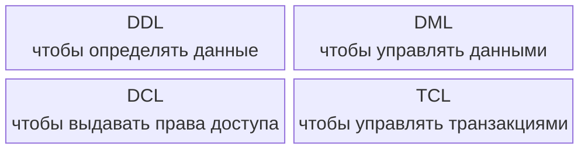

## Введение

Для понимания стоит ознакомиться с [реляционной моделью](), тут в основном информация про синтаксис и порядки SQL (на примере PostgreSQL).

Полезные ссылки:

- Вся основная информация по SQL [Памятка/шпаргалка по SQL / Habr](https://habr.com/ru/articles/564390)
- Примеры запросов для практики [SQL. Занимательные задачки / Хабр](https://habr.com/ru/articles/461567)
- Документация PostgreSQL https://www.postgresql.org/docs/current/ 
- Тут понятным языком в формате уроков с упражнениями [SQL Academy: SQL Интерактивный курс по SQL](https://sql-academy.org/ru/guide)
- https://ensi-platform.gitlab.io/analyst-guides/tools/sql 

## Немного терминологии

SQL оперирует **таблицами**, которые являются частичной и неточной реализацией отношений реляционной модели.
Главные отличия таблиц от отношений:
- Таблицы могут содержать дубликаты строк (не множество, а мультисет).
- Таблицы допускают NULL.
- Таблицы имеют порядок столбцов и, иногда, видимый порядок строк.

Выражение (expression) — это синтаксическая конструкция, вычисляемая до значения.
Оно возвращает результат (число, строку, отношение и т. д.), но не изменяет состояние базы данных.

Предложение (statement) — конструкция, которая выполняет действие: изменяет данные, определяет объекты, управляет транзакцией.
Она не возвращает значение как результат выражения.

**Селектор (selector)** — это предопределённая операция, позволяющая выбрать или извлечь значение определённого типа из его внутренней структуры или контекста.
Пример: для типа DATE селекторами могут быть `YEAR()`, `MONTH()`, `DAY()`, возвращающие отдельные компоненты даты.
Селекторы определяются как часть определения типа.

**Литерал (literal)** — это конкретная запись, обозначающая одно фиксированное значение данного типа.
Например:
- 'London' — литерал типа `CHAR(6)`
- 25 — литерал типа `INTEGER`
- DATE '2025-01-01' — литерал типа `DATE`.

Внешний ключ — логическая зависимость между отношениями, обеспечивающая ссылочную целостность.
Указатель (pointer) — физический механизм, используемый в памяти или на диске для прямого доступа к объекту.
Реляционная модель исключает указатели, потому что она оперирует значениями, а не местами хранения.

Различие:
Внешний ключ выражает логическое соответствие значений,
указатель — физическую ссылку в структуре хранения.
Реляционная модель не использует указатели — только значения.

## Виды запросов

SQL-команды делятся на группы:
- DDL (Data Definition Language) — язык определения данных
- DML (Data Manipulation Language) — язык манипулирования данными
- DCL (Data Control Language) — язык управления доступом
- TCL (Transaction Control Language) — язык управления транзакциями

**DDL**

| Команда    | Назначение                                            | Пример                                           |
| ---------- | ----------------------------------------------------- | ------------------------------------------------ |
| `CREATE`   | Создаёт объекты (таблицы, базы, представления и т.д.) | `CREATE TABLE users (id INT, name VARCHAR(50));` |
| `ALTER`    | Изменяет структуру существующего объекта              | `ALTER TABLE users ADD COLUMN age INT;`          |
| `DROP`     | Удаляет объект                                        | `DROP TABLE users;`                              |
| `TRUNCATE` | Удаляет все данные из таблицы, но оставляет структуру | `TRUNCATE TABLE users;`                          |
| `RENAME`   | Переименовывает объект                                | `ALTER TABLE users RENAME TO clients;`           |


  DDL-команды автоматически фиксируются (autocommit) — отменить через `ROLLBACK` нельзя.


**DML**

| Команда  | Назначение                                        | Пример                                             |
| -------- | ------------------------------------------------- | -------------------------------------------------- |
| `SELECT` | Запрос данных из таблиц                           | `SELECT name, age FROM users WHERE age > 25;` |
| `INSERT` | Вставка данных                                    | `INSERT INTO users (id, name) VALUES (1, 'Alex');` |
| `UPDATE` | Обновление данных                                 | `UPDATE users SET name = 'John' WHERE id = 1;`     |
| `DELETE` | Удаление данных                                   | `DELETE FROM users WHERE id = 1;`                  |
| `MERGE`  | Объединяет `INSERT` и `UPDATE` (в некоторых СУБД) | `MERGE INTO users USING temp_users ON ...`         |


  DML-команды можно отменить или зафиксировать через `ROLLBACK` / `COMMIT`.


**DCL**

| Команда  | Назначение      | Пример                                      |
| -------- | --------------- | ------------------------------------------- |
| `GRANT`  | Назначает права | `GRANT SELECT, INSERT ON users TO analyst;` |
| `REVOKE` | Отзывает права  | `REVOKE INSERT ON users FROM analyst;`      |

**TCL**

| Команда                       | Назначение                              | Пример                   |
| ----------------------------- | --------------------------------------- | ------------------------ |
| `BEGIN` / `START TRANSACTION` | Начало транзакции                       | `BEGIN;`                 |
| `COMMIT`                      | Подтверждение изменений                 | `COMMIT;`                |
| `ROLLBACK`                    | Отмена изменений                        | `ROLLBACK;`              |
| `SAVEPOINT`                   | Создание точки отката внутри транзакции | `SAVEPOINT sp1;`         |
| `RELEASE SAVEPOINT`           | Удаляет точку сохранения                | `RELEASE SAVEPOINT sp1;` |

## Что почитать
- [Изучаем SQL. Вводный курс для разработчиков и администраторов СУБД. Алан Бьюли](https://www.r-5.org/files/books/computers/languages/sql/mysql/Alan_Beaulieu-Learning_SQL-RU.pdf)
- [SQL и реляционная теория. Как грамотно писать код на SQL - 2010.pdf К. Дж. Дейт](https://k0d.cc/storage/books/Databases/SQL/SQL%20и%20реляционная%20теория.%20Как%20грамотно%20писать%20код%20на%20SQL%20-%202010.pdf)

**1. Проектирование и моделирование БД**
- **К. Дейт — “Введение в системы баз данных”**  
  Расширенная версия с упором на нормализацию, зависимости, ключи и проектирование. Учебник старой школы, но логика из него актуальна и для SQL, и для NoSQL-систем.
- **Томас Коннолли, Кэролин Бегг — “Базы данных. Проектирование, реализация и сопровождение”**  
  Самый системный учебник по проектированию. Много примеров ER-диаграмм, проектирования таблиц, зависимостей, нормальных форм и перехода от модели предметной области к физической модели.
- **Ralph Kimball — “The Data Warehouse Toolkit”**  
  Ключевая книга по аналитическому моделированию. Объясняет принципы fact/dimension, схемы «звезда» и «снежинка» — фундамент для любых аналитических систем.
- **Len Silverston — “The Data Model Resource Book” (Vol. 1–3)**  
  Справочник типовых моделей для бизнес-доменов (CRM, финансы, продажи, логистика и т.д.). Полезен, если нужно быстро построить корректную схему под задачу.

**2. Нормализация, связи, целостность**

- **Hector Garcia-Molina, Jeffrey Ullman — “Database Systems: The Complete Book”**  
  Глубокое академическое изложение: нормальные формы, функциональные зависимости, реляционная алгебра, транзакции. Помогает понимать, почему и когда нормализация полезна или избыточна.

- **Bill Karwin — “SQL Antipatterns”**  
  Показывает типичные ошибки моделирования и SQL-запросов. Учит избегать «антипаттернов» при проектировании схем и написании запросов.

**3. Углублённый SQL**

- **Markus Winand — “SQL Performance Explained”**  
  Подробно объясняет, как работает оптимизатор, индексы и почему один и тот же запрос может выполняться в десятки раз медленнее другого.

- **Markus Winand — “Modern SQL”**  
  О современном SQL: CTE, оконные функции, pivot, рекурсивные запросы и современные конструкции, полезные для аналитиков и архитекторов.

- **Itzik Ben-Gan — “T-SQL Window Functions”**  
  Практика аналитических оконных функций — кумулятивные суммы, ранги, скользящие окна, сложные выборки.

**4. ER-диаграммы и концептуальное моделирование**

- **Peter Chen — “The Entity-Relationship Model” (1976)**  
  Короткая оригинальная работа, где впервые описана концепция сущность-связь. Полезна для понимания логики ER-моделей.

- **Joy Beatty, Anthony Chen — “Visual Models for Software Requirements”**  
  Объясняет, как визуализировать данные, сценарии и зависимости. Подходит для аналитиков, описывающих модели данных в документации.

- **Martin Fowler — “UML Distilled”**  
  Краткое руководство по UML, включая диаграммы классов и связей. Удобно для системных аналитиков, которые описывают модели через UML.