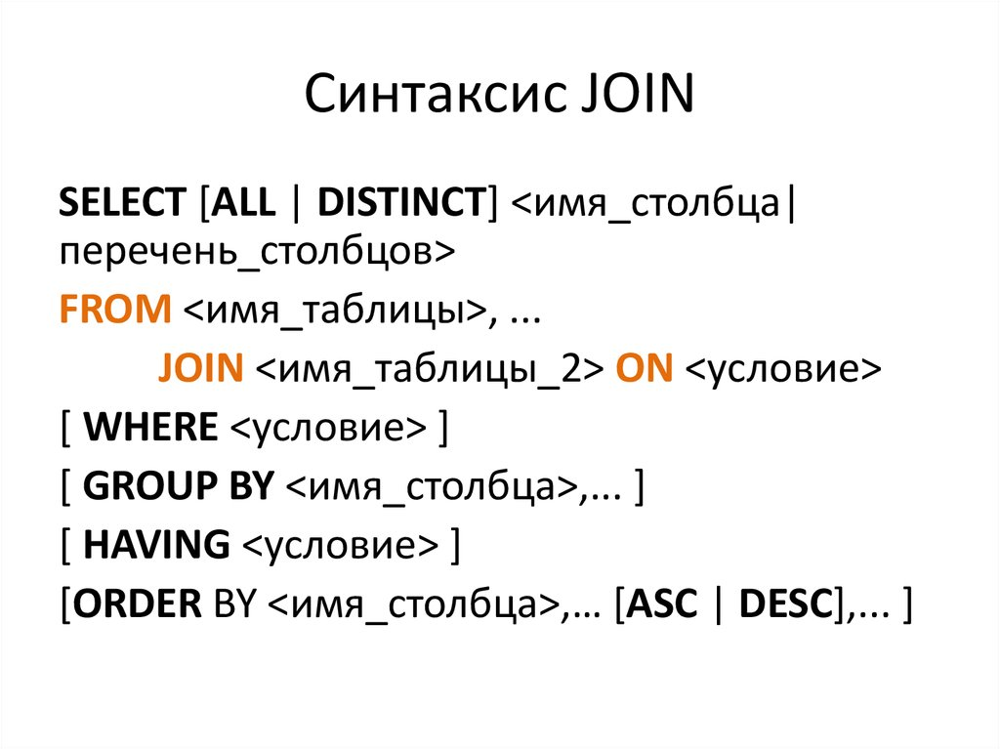
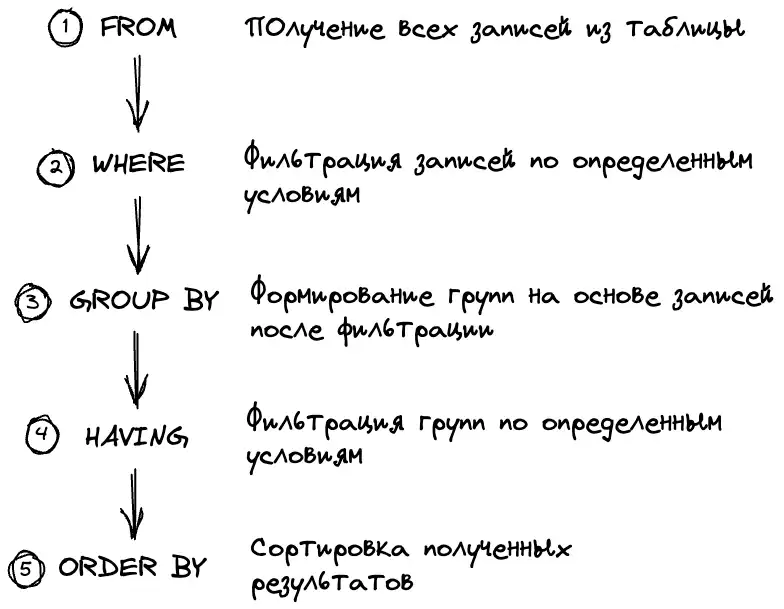
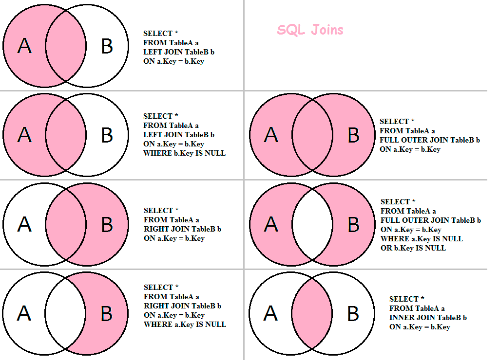

## Как получить данные?
Вместе они выглядят так:

- `SELECT` — выбирает отдельные столбцы или всю таблицу целиком (обязательный);
- `FROM` — из какой таблицы получить данные (обязательный);
- `WHERE` — условие, по которому SQL выбирает данные;
- `GROUP BY` — столбец, по которому мы будут группироваться данные;
- `HAVING` — условие, по которому сгруппированные данные будут отфильтрованы;
- `ORDER BY` — столбец, по которому данные будут отсортированы;





### SELECT ... FROM
тутутут

#### DISTINCT

Для исключение всех дубликатов используется `DISTINCT`, для исключения дубликатов по определенным столбцам используется `DISTINCT ON (...)` .

Синтаксис:
```sql
SELECT DISTINCT field FROM table;
SELECT DISTINCT ON (field) field, field2, field3 FROM table;
```

Например, чтобы получить последний заказ каждого пользователя, можно написать:
```sql
SELECT DISTINCT ON (user_id)
    user_id, order_id, created_at
FROM orders
ORDER BY user_id, created_at DESC;
```

### JOIN ... ON
Очень часто приходится делать выборку из нескольких таблиц, каким-то образом объединяя их. В данной статье вы узнаете основные способы соединения таблиц.

```sql
SELECT поля_таблиц
FROM таблица_1
[INNER] | [[LEFT | RIGHT | FULL][OUTER]] JOIN таблица_2
    ON условие_соединения
[[INNER] | [[LEFT | RIGHT | FULL][OUTER]] JOIN таблица_n
    ON условие_соединения]
```

Виды объединений:
- внутренним `INNER` (по умолчанию)
- внешним `OUTER`, при этом внешнее соединение делится на левое `LEFT`, правое `RIGHT` и полное `FULL`

Примеры:
```sql
-- вывести все столбцы связанной таблицы
SELECT FamilyMembers.* FROM Payments
INNER JOIN FamilyMembers
    ON Payments.family_member = FamilyMembers.member_id
```

 

### WHERE
Предложение `WHERE` используется для фильтрации возвращаемых данных. Оно используется совместно с SELECT, UPDATE, DELETE и другими инструкциями.

```sql
SELECT * FROM Student
WHERE first_name = 'Grigorij' AND EXTRACT(YEAR FROM birthday) > 2000;
```


  Результатом сравнения любого значения с NULL является NULL.



Приоритет логических операторов:
- Сначала — NOT
- Затем — AND
- Потом — XOR
- В конце — OR

#### IS NULL, BETWEEN, IN, LIKE

```sql
-- 0. Операторы
SELECT 90000 > 100000;
SELECT 90000 <= 100000;
SELECT 90000 = 100000;
SELECT 90000 <> 100000; -- или !=

-- 1. IS NULL и IS NOT NULL
SELECT * FROM Teacher WHERE middle_name IS NULL;
SELECT * FROM Teacher WHERE middle_name IS NOT NULL;

-- 2. BETWEEN ... AND ...
SELECT * FROM Payments WHERE unit_price BETWEEN 100 AND 500; -- field >= min AND field <= max

-- 3. IN (...)
SELECT * FROM FamilyMembers WHERE status IN ('father', 'mother');

-- 4. LIKE 
SELECT * FROM Users WHERE email LIKE '%@hotmail.%'; -- % - это последовательность любых символов (от 0 и более)
SELECT * FROM Users WHERE lastname LIKE 'Иванов_'; -- _ - это любой единичный символ
-- 4.1 Найти задачи с прогрессом = 3% (экранирование символа %)
SELECT * FROM Tasks WHERE progress LIKE '3!%' ESCAPE '!'; -- ESCAPE-символ используется для экранирования специальных символов (% и _)
```


  В PostgreSQL шаблоны чувствительны к регистру. Для поиска без учета регистра используйте оператор `ILIKE`


#### Регулярные выражения
Операторы `~` и `~*` в PostgreSQL используются для поиска и обработки строковых данных с помощью регулярных выражений.

Регулярные выражения предоставляют мощные возможности для сложных шаблонов поиска, которые трудно реализовать с помощью оператора `LIKE`.

https://sql-academy.org/ru/guide/operator-regexp

```sql
... WHERE table_field ~ 'pattern';   -- с учетом регистра
... WHERE table_field ~* 'pattern';  -- без учета регистра
```

```sql
SELECT * FROM  Subject WHERE name ~ '[ey]$' -- предметы с окончением «e» или «y»

SELECT * FROM Users WHERE email ~* '@(outlook\.com|live\.com)$' -- эл. адрес оканчивается на «@outlook.com» или «@live.com»
select * from Users where email ~* '@(outlook|live).com$' -- аналогично предыдущему

SELECT * FROM Users WHERE phone_number ~ '^[^28]*$' -- номер не содержит цифр «2» и «8»

SELECT name, phone_number FROM Users WHERE phone_number ~ '^\+7' -- номер начинается на «+7»
```

### GROUP BY 

```sql
SELECT [литералы, агрегатные_функции, поля_группировки]
FROM имя_таблицы
GROUP BY поля_группировки;
```

```sql
-- группы по типу жилья:
SELECT home_type FROM Rooms GROUP BY home_type
```


  При группировке по полю, содержащему `NULL`, все такие строки попадут в одну группу


#### Агрегатные функции

| Функция | Описание |
|--|--|
| SUM(поле_таблицы)	| Возвращает сумму значений |
| AVG(поле_таблицы)	| Возвращает среднее значение |
| COUNT(поле_таблицы)	| Возвращает количество записей |
| MIN(поле_таблицы)	| Возвращает минимальное значение |
| MAX(поле_таблицы)	| Возвращает максимальное значение |


  Агрегатные функции применяются для значений, не равных `NULL`. Исключением является функция `COUNT(*)`.


Синтаксис:

```sql
SELECT [литералы, агрегатные_функции, поля_группировки]
FROM имя_таблицы
GROUP BY поля_группировки;
```

Примеры:

```sql
-- Найдём количество каждого вида жилья
SELECT home_type, COUNT(*) as amount FROM Rooms
GROUP BY home_type;

-- Средняя стоимость каждого вида жилья
SELECT home_type, AVG(price) as avg_price FROM Rooms
GROUP BY home_type;

-- Для каждого жилого помещения найдём самую позднюю дату выезда
SELECT room_id, MAX(end_date) AS last_end_date FROM Reservations
GROUP BY room_id;
```

### HAVING

Используется для фильтрации групп `GROUP BY`.

```sql
SELECT [константы, агрегатные_функции, поля_группировки]
FROM имя_таблицы
WHERE условия_на_ограничения_строк
GROUP BY поля_группировки
HAVING условие_на_ограничение_строк_после_группировки
ORDER BY условие_сортировки
```

Примеры:

```sql
-- Найдём количество каждого вида жилья с условием, что количество превышает 5шт.
SELECT home_type, COUNT(*) as amount FROM Rooms
GROUP BY home_type
HAVING COUNT(*) > 5;

-- Средняя стоимость каждого вида жилья до 30к 
SELECT home_type, AVG(price) as avg_price FROM Rooms
GROUP BY home_type
HAVING AVG(price) <= 30000;

-- Получим минимальную стоимость каждого типа жилья c телевизором. При этом нас интересуют только типы жилья, содержащие как минимум 5 жилых помещений, относящихся к ним
SELECT home_type, MIN(price) as min_price FROM Rooms
WHERE has_tv = True
GROUP BY home_type
HAVING COUNT(*) >= 5;
```

### ORDER BY

Для упорядочивания записей используется конструкция `ORDER BY`.

```sql
SELECT поля_таблиц FROM наименование_таблицы
WHERE ...
ORDER BY столбец_1 [ASC | DESC][, столбец_n [ASC | DESC]]
```

Где ASC и DESC - направление сортировки:
- ASC - сортировка по возрастанию (по умолчанию)
- DESC - сортировка по убыванию

```sql
SELECT name FROM Company ORDER BY name;
```

Для сортировки результатов по двум или более столбцам их следует указывать через запятую.

```sql
SELECT DISTINCT town_from, town_to FROM Trip
ORDER BY town_from, town_to DESC;
```

### Ограничение выборки (LIMIT)

Оператор `LIMIT` позволяет извлечь определённый диапазон записей из одной или нескольких таблиц.

Синтаксис:
```
SELECT поля_выборки
FROM список_таблиц
LIMIT количество_записей_для_вывода [OFFSET количество_пропущенных_записей];
```

Если не указать `OFFSET`, то отсчёт будет вестись с начала таблицы.

```sql
-- вывести строки с 3 по 5
SELECT * FROM Company LIMIT 3 OFFSET 2;
```

## Примеры SQL

Какие компании совершали перелеты на Boeing

```sql
select DISTINCT c.name
from Trip as t
join Company as c ON t.company = c.id
where t.plane = 'Boeing'

--- что равноценно 
select DISTINCT c.name
from Trip as t
join Company as c ON t.company = c.id and t.plane = 'Boeing'
```

Выведите идентификаторы всех рейсов и количество пассажиров на них. Обратите внимание, что на каких-то рейсах пассажиров может не быть. В этом случае выведите число "0".
```sql
SELECT t.id, COUNT(pit.id)
FROM Trip AS t
FULL OUTER JOIN Pass_in_trip AS pit ON pit.trip = t.id
GROUP BY t.id
```

Вывести имена людей, у которых есть полный тёзка среди пассажиров
```sql
select DISTINCT p.name
from Passenger as p
WHERE p.name = (select name from Passenger limit 1)

-- Вариант без подзапроса
SELECT p.name
FROM Passenger as p
GROUP BY p.name
HAVING COUNT(*) > 1;
```

Вывести имена покупателей, каждый из которых приобрёл Laptop и Monitor в марте 2024 года
```sql
SELECT c.name
FROM Customer c
JOIN Purchase p ON c.customer_key = p.customer_key
JOIN Product pr ON p.product_key = pr.product_key
WHERE 1 = 1
	AND pr.name IN ('Laptop', 'Monitor')
	AND EXTRACT(YEAR FROM p.date) = 2024
	AND EXTRACT(MONTH FROM p.date) = 3
GROUP BY c.name
HAVING COUNT(DISTINCT pr.name) = 2; -- оставляет только тех, кто купил оба товара — и Laptop, и Monitor
```

Посчитать количество работающих складов на текущую дату по каждому городу. Вывести только те города, у которых количество складов более 80.
```sql
SELECT city, COUNT(*) as warehouse_count
from Warehouses
where 1=1
and date_close is null
GROUP BY city
HAVING COUNT(*) > 80
```

Вывести для каждого пользователя первое наименование, которое он заказал (первое по времени транзакции). = Первый заказ пользователя
```sql
SELECT DISTINCT ON (user_id) -- оставляет только первую строку для каждого пользователя
    user_id,
    item
FROM Transactions
ORDER BY user_id, transaction_ts ASC; -- сортирует так, чтобы первой бралась самая ранняя транзакция

-- Другой вариант решения без DISTINCT ON
SELECT t.user_id, t.item
FROM Transactions t
WHERE t.transaction_ts = (
    SELECT MIN(t2.transaction_ts)
    FROM Transactions t2
    WHERE t2.user_id = t.user_id
);
```

Посчитайте население каждого региона. В качестве результата выведите название региона и его численность населения.
```sql
select r.name as region_name
    , sum(c.population) as total_population
from Regions r
join Cities c on c.regionId = r.id
GROUP by r.name
```

Вывести всех сотрудников, у кого в работе менее трех задач.

```sql
SELECT e.emp_name, COUNT(*) as task_count
from Employee e
left join Tasks t on t.assignee_id = e.id -- чтобы показать даже тех сотрудников, у которых нет ни одной задачи
GROUP by e.id
HAVING COUNT(t.id) < 3;
```

Вывести кабинеты, которые использовались максимальное количество раз.
```sql
SELECT classroom
FROM Schedule
GROUP BY classroom
HAVING COUNT(*) = (
    SELECT MAX(class_count)
    FROM (
        SELECT COUNT(*) AS class_count
        FROM Schedule
        GROUP BY classroom
    ) AS sub
);
```

Запросы с покупками

```sql
-- вывеси товары, которые были куплены более одного раза
SELECT good_name
from Payments as p 
left join Goods as g on g.good_id = p.good 
GROUP  by good_name
HAVING COUNT(*) > 1;

-- вывести самый дорогой деликатес (delicacies) 
select g.good_name, p.unit_price 
from Payments as p 
join Goods as g on g.good_id = p.good 
join GoodTypes as gt on gt.good_type_id = g.type and good_type_name = 'delicacies'
order by p.unit_price desc
limit 1;

-- Кто и сколько потратил в июне 2005 года
select m.member_name, sum(p.unit_price * p.amount) as costs
from FamilyMembers as m
join Payments as p on p.family_member = m.member_id 
    and DATE_PART('year', date) = 2005
    and DATE_PART('month', date) = 6
group by 1;

-- Товары, не купленные в 2005 году
select good_name 
from Goods as g  
left join Payments as p on g.good_id = p.good and DATE_PART('year', date) = 2005
WHERE payment_id is null;
```

```sql
```

## Условная логика

Когда использовать:

- CASE: Когда нужна сложная условная логика с множественными условиями
- COALESCE: Когда нужно заменить NULL значения на значения по умолчанию
- NULLIF: Когда нужно превратить определенные значения в NULL

### CASE

Синтаксис:

```
CASE
    WHEN условие_1 THEN возвращаемое_значение_1
    WHEN условие_2 THEN возвращаемое_значение_2
    WHEN условие_n THEN возвращаемое_значение_n
    [ELSE возвращаемое_значение_по_умолчанию]
END

-- ИЛИ:
CASE значение
    WHEN сравниваемое_значение_1 THEN возвращаемое_значение_1
    WHEN сравниваемое_значение_2 THEN возвращаемое_значение_2
    WHEN сравниваемое_значение_n THEN возвращаемое_значение_n
    [ELSE возвращаемое_значение_по_умолчанию]
END
```


Пример:
```sql
SELECT name,
CASE
  WHEN SUBSTRING(name, 1, POSITION(' ' IN name) - 1) IN ('10', '11') THEN 'Старшая школа'
  WHEN SUBSTRING(name, 1, POSITION(' ' IN name) - 1) IN ('5', '6', '7', '8', '9') THEN 'Средняя школа'
  ELSE 'Начальная школа'
END AS stage
FROM Class

-- Другой вариант того же запроса
SELECT name,
CASE SUBSTRING(name, 1, POSITION(' ' IN name) - 1)
  WHEN '11' THEN 'Старшая школа'
  WHEN '10' THEN 'Старшая школа'
  WHEN '9' THEN 'Средняя школа'
  WHEN '8' THEN 'Средняя школа'
  WHEN '7' THEN 'Средняя школа'
  WHEN '6' THEN 'Средняя школа'
  WHEN '5' THEN 'Средняя школа'
  ELSE 'Начальная школа'
END AS stage
FROM Class
```

### COALESCE

Функция `COALESCE` - это элегантное решение для работы с NULL значениями. Она возвращает первое не-NULL значение из списка аргументов.

Синтаксис:
```sql
COALESCE(значение1, значение2, ..., значениеN);
```

Пример:

```sql
COALESCE(sum(total), 0); -- если сумма NULL, то вернет 0
```

```sql
select Teacher.first_name, 
    COALESCE(middle_name, 'Empty') as middle_name,
    last_name
from Teacher
```

### NULLIF

Функция `NULLIF` полезна, когда нужно заменить определенное значение на NULL. Это может пригодиться для фильтрации или обработки "пустых" значений.

Синтаксис:
```
NULLIF(значение_1, значение_2);
```

Пример:
```sql

```

## Операции с данными
### INSERT


Для добавления новых записей в таблицу предназначен оператор `INSERT`.
Значения можно вставлять двумя способами:
- перечислением с помощью слова `VALUES`, перечислив их в круглых скобках через запятую;
- c помощью оператора `SELECT`.

Синтаксис:

```
INSERT INTO имя_таблицы [(поле_таблицы, ...)]
VALUES (значение_поля_таблицы, ...) | SELECT поле_таблицы, ... FROM имя_таблицы ...
```

Пример:
```sql
INSERT INTO Goods (good_id, good_name, type)
SELECT (SELECT COUNT(*) + 1 FROM Goods), 'Cheese', (SELECT good_type_id FROM GoodTypes WHERE good_type_name = 'food');
```


```sql
insert into Reviews (id, reservation_id, rating)
SELECT
    (select count(id) + 1 from Reviews),
    (SELECT Reservations.id
        from Reservations
        join Rooms on Rooms.id = Reservations.room_id
        join Users on Users.id = Reservations.user_id
        where address = '11218, Friel Place, New York'
            and Users.name = 'George Clooney'),
    5
```

### UPDATE

Синтаксис: 
```sql
UPDATE table_name
SET column1 = value1, column2 = value2, ...
WHERE condition;
```

Пример:

```sql
UPDATE FamilyMembers
SET member_name = 'Andie Anthony'
WHERE member_name = 'Andie Quincey';
```


### DELETE

Синтаксис:

```sql
DELETE FROM table_name WHERE condition;
```

Пример:
```sql
DELETE FROM FamilyMembers WHERE member_name like '%Quincey';
```

```sql
DELETE FROM Company
where id in 
    (select Company
    from Trip
    GROUP by company
    HAVING count(id) = (
        select MIN(cnt) 
        from (
            select count(*) as cnt 
            from Trip 
            GROUP by company
        )
    )
);
```

#### Удаление записей при многотабличных запросах

Если в `DELETE` запросе используется `USING`, то после него необходимо указать дополнительные таблицы, по которым выбираются удаляемые записи.

Синтаксис:

```sql
DELETE FROM table_name_1
USING table_name_2
WHERE table_name_1.field = table_name_2.field
[AND condition];
```

Пример нужно удалить все бронирования жилья, в котором отсутствует кухня. Тогда запрос будет выглядеть следующим образом:

```sql
DELETE FROM Reservations
USING Rooms
WHERE Reservations.room_id = Rooms.id
AND Rooms.has_kitchen = false;
```

#### Удаление одновременно из нескольких таблиц

В PostgreSQL для удаления из нескольких таблиц одновременно используются отдельные `DELETE` запросы или транзакции:

```sql
BEGIN;
    DELETE FROM Reservations
    USING Rooms
    WHERE Reservations.room_id = Rooms.id
    AND Rooms.has_kitchen = false;

    DELETE FROM Rooms
    WHERE Rooms.has_kitchen = false;
COMMIT;
```
### TRUNCATE

Используется для удаления **всех записей**.

```sql
TRUNCATE TABLE table_name;
```

Однако у оператора `TRUNCATE` есть ряд отличий:

- Не срабатывают триггеры, в частности, триггер удаления
- Удаляет все строки в таблице, не записывая при этом удаление отдельных строк данных в журнал транзакций
- Может сбрасывать счётчик идентификаторов при использовании опции RESTART IDENTITY (по умолчанию используется CONTINUE IDENTITY, и счётчик не сбрасывается)
- Чтобы использовать, необходимы права на изменение таблицы