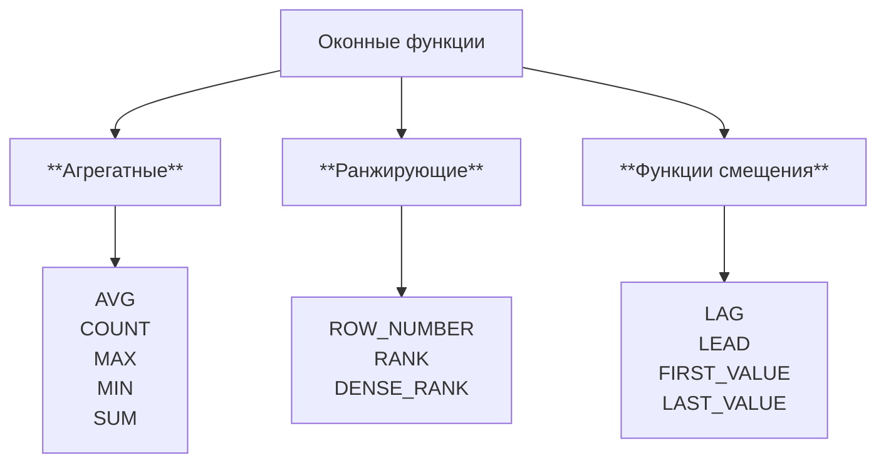

## Подзапросы и обобщенные табличные выражения

### Подзапросы

**Подзапрос** — это выражение SELECT, вложенное в другое SQL-выражение (обычно в `WHERE`, `FROM` или `HAVING`). Обычно выполняется перед основным запросом.

Пример:

```sql
-- Кто и когда последний раз бронировал комнату
SELECT room_id, end_date, u.name
from Reservations as r
join Users as u on r.user_id = u.id 
where 
    end_date = (
        select max(end_date)
        from Reservations as r2
        where r2.room_id = r.room_id
    )
; 
```

Операторы подзапросов:

- С помощью оператора `ALL` мы можем сравнивать отдельное значение с каждым значением в наборе, полученным подзапросом. При этом данное условие вернёт TRUE, только если все сравнения отдельного значения со значениями в наборе вернут TRUE.
- Оператор `IN` проверяет входит ли конкретное значение в набор значений. В качестве такого набора как раз может использоваться подзапрос, возвращающий несколько строк с одним столбцом.
- Условное выражение с `ANY` имеет схожее поведение, но оно возвращает TRUE, если хотя бы одно сравнение отдельного значения со значением в наборе вернёт TRUE.

Пример:

```sql
SELECT (SELECT name FROM company LIMIT 1) AS company_name;

-- Получим список всех бронирований самого дорогого на данный момент жилого помещения
SELECT * FROM Reservations
    WHERE Reservations.room_id = (
        SELECT id FROM Rooms ORDER BY price DESC LIMIT 1
    );

-- 2. ALL
-- для всех ли жилых помещений выполняется условие, что оно дешевле чем 200
SELECT 200 > ALL(SELECT price FROM Rooms);

-- найти имена всех владельцев жилья, которые сами при этом никогда не снимали жилье
SELECT DISTINCT name FROM Users INNER JOIN Rooms
    ON Users.id = Rooms.owner_id
    WHERE Users.id <> ALL (
        SELECT DISTINCT user_id FROM Reservations
    );

-- получить всю информацию о владельцах жилья стоимостью больше 150 условных единиц
SELECT * FROM Users WHERE id IN (
    SELECT DISTINCT owner_id FROM Rooms WHERE price >= 150
);

-- найдём пользователей, которые владеют хотя бы 1 жилым помещением стоимостью более 150.
SELECT * FROM Users WHERE id = ANY (
    SELECT DISTINCT owner_id FROM Rooms WHERE price >= 150
);
```

Выведите названия товаров, которые ещё ни разу не покупались:
```sql
SELECT good_name
FROM Goods
WHERE good_id NOT IN (
    SELECT good
    FROM Payments
);

-- тот же результат через join
SELECT g.good_name
FROM Goods g
LEFT JOIN Payments p ON g.good_id = p.good
WHERE p.good IS NULL;
```

#### Многостолбцовые запросы

```sql
SELECT * FROM Reservations
WHERE (room_id, price) IN (SELECT id, price FROM Rooms);

-- Тот же результат через JOIN
SELECT Reservations.* FROM Reservations
INNER JOIN Rooms
ON Reservations.room_id = Rooms.id
WHERE Reservations.price = Rooms.price;
```

```sql
-- Выведите список комнат (все поля, таблица Rooms), которые по своим удобствам (has_tv, has_internet, has_kitchen, has_air_con) совпадают с комнатой с идентификатором "11".
SELECT *
FROM Rooms
WHERE (has_tv, has_internet, has_kitchen, has_air_con) IN (
		SELECT has_tv,
			has_internet,
			has_kitchen,
			has_air_con
		FROM Rooms
		WHERE id = 11
	);
```

#### Коррелированные подзапросы

Все предыдущие рассматриваемые подзапросы были некоррелированные (независимые). Они могли выполняться автономно от основного запроса и мы могли посмотреть, что они возвращают перед тем, как их результат будет использоваться в основном запросе. Коррелированные же подзапросы ссылаются на один или несколько столбцов основного запроса.

```sql
-- Кто и когда последний раз бронировал комнату
SELECT room_id, end_date, u.name
from Reservations as r
join Users as u on r.user_id = u.id 
where 
    end_date = (
        select max(end_date)
        from Reservations as r2
        where r2.room_id = r.room_id
    )
; 
```

Примеры:
```sql
-- вывести имя и сумму покупок
SELECT FamilyMembers.member_name, (
    SELECT SUM(Payments.unit_price * Payments.amount)
    FROM Payments
    WHERE Payments.family_member = FamilyMembers.member_id
) AS total_spent
FROM FamilyMembers;

-- Вывести имена и цену их самого дорогого купленного товара
SELECT FamilyMembers.member_name,
	(
		SELECT MAX(Payments.unit_price)
		FROM Payments
		WHERE Payments.family_member = FamilyMembers.member_id
	) AS good_price
FROM FamilyMembers;
```


  Следует обратить внимание на то, что использование коррелированных подзапросов может вызвать проблемы с производительностью, особенно если содержащий запрос возвращает много строк, так как коррелированный подзапрос будет выполняться для каждой строки содержащего запроса отдельно.


### Обобщённые табличные выражения (CTE), WITH

Обобщённое табличное выражение или CTE (Common Table Expressions) - это временный результирующий набор данных, к которому можно обращаться в последующих запросах. Для написания обобщённого табличного выражения используется оператор `WITH`.

Синтаксис:
```sql
WITH название_cte [(столбец_1 [, столбец_2 ] …)] AS (подзапрос)
    [, название_cte [(столбец_1 [, столбец_2 ] …)] AS (подзапрос)] …
```

Пример Процент активных пользователей:

```sql
WITH active_users AS ( 
  SELECT rs.user_id,  rm.owner_id 
  FROM Reservations AS rs 
  JOIN Rooms AS rm 
  ON rs.room_id = rm.id 
), 
active_users_unique AS ( 
  SELECT DISTINCT user_id AS id 
  FROM active_users 
  UNION 
  SELECT DISTINCT owner_id AS id 
  FROM active_users 
) 
 
SELECT 
  ROUND(100.0 * COUNT(id) / (SELECT DISTINCT COUNT(id) FROM Users), 2) AS percent 
FROM active_users_unique; 
```


  Выражение с WITH считается «временным», потому что результат не сохраняется где-либо на постоянной основе в схеме базы данных, а действует как временное представление, которое существует только на время выполнения запроса


```sql
-- Создаём табличное выражение Aeroflot_trips, содержащее все полёты, совершенные авиакомпанией «Aeroflot»
WITH Aeroflot_trips AS
    (SELECT plane, town_from, town_to FROM Company
        INNER JOIN Trip ON Trip.company = Company.id WHERE name = 'Aeroflot')

SELECT * FROM Aeroflot_trips;

-- то же выражение Aeroflot_trips, но с переименованными колонками
WITH Aeroflot_trips (aeroflot_plane, town_from, town_to) AS
    (SELECT plane, town_from, town_to FROM Company
        INNER JOIN Trip ON Trip.company = Company.id WHERE name = 'Aeroflot')

SELECT * FROM Aeroflot_trips;

-- несколько табличных выражений
WITH Aeroflot_trips AS
    (SELECT TRIP.* FROM Company
        INNER JOIN Trip ON Trip.company = Company.id WHERE name = 'Aeroflot'),
    Don_avia_trips AS
    (SELECT TRIP.* FROM Company
        INNER JOIN Trip ON Trip.company = Company.id WHERE name = 'Don_avia')

SELECT * FROM Don_avia_trips UNION SELECT * FROM  Aeroflot_trips;
```

#### Работа с рекурсией в CTE
CTE также могут быть использованы для выполнения рекурсивных запросов, которые позволяют итеративно обрабатывать данные, например, для работы с иерархическими структурами данных, такими как «руководитель — подчинённый».

Рекурсивное CTE состоит из двух частей, разделенных оператором `UNION ALL`:
- Начальный набор данных, который не содержит рекурсивных ссылок.
- Рекурсивная часть: запрос, который ссылается на CTE, чтобы продолжить рекурсию.

```sql
WITH RECURSIVE название_cte (столбец_1, столбец_2, ...) AS (
    -- Начальный набор данных
    SELECT столбец_1, столбец_2, ...
    FROM таблица
    WHERE условие

    UNION ALL

    -- Рекурсивная часть
    SELECT столбец_1, столбец_2, ...
    FROM название_cte
    INNER JOIN таблица ON название_cte.столбец = таблица.столбец
    WHERE условие
)

SELECT * FROM название_cte;
```

Пример: иерархия руководителей и подчинённых

```sql
WITH RECURSIVE Subordinates AS (
    -- Начальный набор данных
    SELECT id, name, managerId
    FROM Employees
    WHERE managerId = 1

    UNION ALL

    -- Рекурсивная часть: подчинённые подчинённых
    SELECT e.id, e.name, e.managerId
    FROM Employees e
    INNER JOIN Subordinates s ON e.managerId = s.id
)

SELECT * FROM Subordinates;
```

### Объединение запросов, UNION

https://sql-academy.org/ru/guide/combining-queries

Результаты выполнения SQL запросов можно объединять. Для этого существует оператор `UNION`.

Структура:
```sql
SELECT поля_таблиц FROM список_таблиц ...
UNION [ALL]
SELECT поля_таблиц FROM список_таблиц ... ;
```


```sql
-- Выведите полные имена всех студентов и преподавателей.
SELECT Student.first_name,
	Student.middle_name,
	Student.last_name
FROM Student
UNION
SELECT Teacher.first_name,
	Teacher.middle_name,
	Teacher.last_name
FROM Teacher
```

## Транзакции

Транзакция — это последовательность операций с базой данных, которые выполняются как единое целое.

Каждая явная транзакция в PostgreSQL начинается с использования оператора `BEGIN` или `START TRANSACTION`.

Завершение же транзакции возможно:

- с помощью команды `COMMIT`, которая даёт указание серверу пометить изменения как постоянные и освободить все ресурсы (т.е. блокировки строк), использовавшиеся во время транзакции
- с помощью команды `ROLLBACK`, которая требует от сервера вернуть данные в состояние до начала транзакции. После завершения отката также любые ресурсы, используемые транзакцией, освобождаются.
-  транзакция также может завершиться в результате внешних факторов. Например, если сервер выключается, в этом случае ваша транзакция будет автоматически отменена при перезапуске сервера.

Пример:
```sql
BEGIN; -- Начало транзакции
    -- Списываем деньги, только если баланс достаточный
    UPDATE accounts
    SET user_balance = user_balance - 1000
    WHERE user_id = 1
    AND user_balance >= 1000;

    -- Зачисляем деньги получателю (если он существует)
    UPDATE accounts
    SET user_balance = user_balance + 1000
    WHERE user_id = 2;
COMMIT; -- Применение изменений (или ROLLBACK при ошибке в коде приложения)
```

### Блокировки

Блокировка — это метод ограничения доступа к данным для обеспечения корректной обработки транзакций.

Серверы баз данных используют блокировки, чтобы управлять одновременным доступом к данным, чтобы пока одна транзакция работает с данными, другие транзакции не могли их изменять. Когда данные в базе блокируются, другие пользователи, которые хотят изменить или прочитать эти же данные, должны подождать, пока блокировка не будет снята.

Существует ряд различных стратегий, которые могут использоваться, как именно блокировать ресурс. Сервер может применять блокировку на одном из трёх разных уровней, или гранулярностей.

- Блокировка таблиц. Не позволяет нескольким пользователям одновременно изменять данные в одной таблице.
- Блокировка страниц. Не позволяет нескольким пользователям изменять данные в одной и той же странице (страница — это сегмент памяти, обычно в диапазоне от 2 до 16 Кбайт) таблицы одновременно.
- Блокировка строк. Не позволяет нескольким пользователям одновременно изменять одну и ту же строку в таблице.

### Точки сохранения

В определённых ситуациях вам может потребоваться выполнить откат в транзакции, не отменяя всю проделанную работу. Для этого вы можете установить одну или несколько точек сохранения в рамках транзакции. Это позволяет вам откатиться к конкретной точке в транзакции, а не к её началу.

Пример:
```sql
SAVEPOINT my_savepoint; -- создание точки сохранения
ROLLBACK TO SAVEPOINT; -- возврат к точке
```

## Оконные функции

**Оконные функции** — мощный инструмент языка SQL, позволяющий проводить сложные вычисления по группам строк, которые связаны с текущей строкой.

Оконные функции *вычисляются для каждой строки независимо*, возвращая результат в отдельный столбец. Агрегатные функции с группировкой в свою очередь группируют строки и *применяются к сформированным группам*.

Синтаксис:
```sql
SELECT <window_function>(<column>) -- используемая оконная функция. Например AVG(price).
OVER (
      [PARTITION BY <column>] -- столбец для разделения
      [ORDER BY <column>] -- сортировка строк внутри окна
      [ROWS|RANGE <rows_range>] -- сколько строк брать до и после текущей в окно
) 
-- Если OVER () оставить без параметров, то окном будет выступать вся таблица
```



### PARTITION BY

Пример `PARTITION BY`:

```sql
-- Средняя цена всех комнат
select distinct AVG(price) over () from Rooms; 

-- Средняя цена комнат по типам комнат
select distinct home_type, 
    AVG(price) over (PARTITION BY home_type) 
from Rooms; 

-- Средняя цена комнат по типам комнат с учетом наличия ТВ
select distinct home_type, 
    has_tv,
    AVG(price) over (PARTITION BY home_type, has_tv) 
from Rooms; 
```

### ORDER BY

Пример с `ORDER BY`:

```sql
-- Первый заказ пользователя (по времени транзакции)
SELECT DISTINCT user_id, 
    FIRST_VALUE(item) OVER (PARTITION BY user_id ORDER BY transaction_ts) AS item
FROM Transactions;

-- Первый заказ пользователя (если несколько заказов было в одно и то же время, то вывести из них первый по алфавиту)
SELECT DISTINCT user_id, 
    FIRST_VALUE(item) OVER (PARTITION BY user_id ORDER BY transaction_ts, item) AS item
FROM Transactions;
```

### ROWS|RANGE

Используя синтаксис `ROWS` или `RANGE`, мы можем определить какое именно окно с данными будет передаваться в оконную функцию для вычисления значения для текущей строки. 

Отличие ROWS от RANGE:
- `ROWS` - для точных границ. Определение окна основывается *на физическом положении строк относительно текущей строки*. Например, `1 PRECEDING` означает одну строку до текущей.
- `RANGE` - для динамических границ. Определяет границы окна *на основе значений столбцов*, упорядоченных в соответствии с `ORDER BY` в оконной функции.

Синтаксис:
```sql
ROWS|RANGE BETWEEN <range_start> AND <range_end>
```

Возможные определения границ окна
- `UNBOUNDED PRECEDING`, все строки, предшествующие текущей
- `N PRECEDING`, N строк до текущей строки
- `CURRENT ROW`, текущая строка
- `N FOLLOWING`, N строк после текущей строки
- `UNBOUNDED FOLLOWING`, все последующие строки

Пример: 

```sql
ROWS|RANGE BETWEEN 2 PRECEDING AND CURRENT ROW
ROWS|RANGE BETWEEN CURRENT ROW AND UNBOUNDED FOLLOWING
```

```sql
-- Сумма трёх последних покупок члена семьи
select family_member, date, payment_id,
    (amount*unit_price) as payment_amount,
    SUM(amount*unit_price) OVER (
        PARTITION BY family_member
        ORDER BY date desc
        ROWS BETWEEN CURRENT ROW AND 2 FOLLOWING 
    ) as spending_last_3_payments
from Payments;

```

### Типы оконных функций

Про агрегатные тут отдельно не буду писать.

#### Ранжирующие функции
Ранжирующие функции (подробнее https://sql-academy.org/ru/guide/types-of-windows-functions#ranzhiruyushie-okonnye-funkcii):

| Функция | Описание |
| -- | -- |
| ROW_NUMBER | Возвращает номер строки, используется для нумерации |
| RANK | Возвращает ранг каждой строки. Работает так:<br>1. Сортировка: строки сортируются по столбцам в `ORDER BY` в конструкции `OVER`.<br>2. Присвоение рангов: каждой уникальной строке или группе строк, имеющих одинаковые значения в столбцах сортировки, присваивается ранг. Ранг начинается с 1.<br>3. Одинаковые значения: если у нескольких строк одинаковые значения в столбцах сортировки, они получают одинаковый ранг.<br>4.  Пропуск рангов: после группы строк с одинаковым рангом, следующий ранг увеличивается на количество строк в этой группе. Например, если две строки имеют ранг 2, следующая строка получит ранг 4, а не 3.<br>5.Этот процесс продолжается до тех пор, пока не будут присвоены ранги всем строкам в наборе результатов.  |
| DENSE_RANK | Аналог `RANK`, но она не пропускает ранги и после группы одинаковых значений ранг увеличивается на единицу, а не на количество строк. Например, если две строки имеют ранг 2, следующая строка получит ранг 3, а не 4. |

Пример 1:
```sql
SELECT id,
	home_type,
	price,
	ROW_NUMBER() OVER(PARTITION BY home_type ORDER BY price) AS "row_number",
	RANK() OVER(PARTITION BY home_type ORDER BY price) AS "rank",
	DENSE_RANK() OVER(PARTITION BY home_type ORDER BY price) AS "dense_rank"
FROM Rooms;
```

Пример 2. Вывести место (ранг) жилья в своей категории по цене. Иными словами, какое место в топе дешевых комнат занимает комната.
```sql
select id, home_type, price,
    DENSE_RANK() OVER (
        PARTITION BY home_type
        ORDER BY price
    ) as room_rank 
from Rooms
```

Пример 3. Время, прошедшее с предыдущего вылета (если это первый рейс, то вывести "00:00:00"):
```sql
SELECT company,
	time_out,
	(
		time_out - (
			LAG(time_out, 1, time_out) OVER (
				PARTITION BY Company
				ORDER BY time_out
			)
		)
	) AS time_diff
FROM Trip
```

#### Функции смещения

| Функция | Описание |
| -- | -- |
| LAG | Обращается к данным из предыдущих строк окна. Имеет три аргумента: столбец, значение которого необходимо вернуть, количество строк для смещения (по умолчанию 1), значение, которое необходимо вернуть, если после смещения возвращается значение NULL.|
| LEAD | Обращается к данным из следующих строк. |
| FIRST_VALUE | Возвращает первое значение в окне. |
| LAST_VALUE | Возвращает последнее значение в окне. |

Пример:

```sql
SELECT id,
	home_type,
	price,
	LAG(price) OVER(PARTITION BY home_type ORDER BY price) AS "lag",
	LAG(price, 2) OVER(PARTITION BY home_type ORDER BY price) AS "lag_2",
	LEAD(price) OVER(PARTITION BY home_type ORDER BY price) AS "lead",
	FIRST_VALUE(price) OVER(PARTITION BY home_type ORDER BY price) AS "first_value",
	LAST_VALUE(price) OVER(PARTITION BY home_type ORDER BY price ROWS BETWEEN UNBOUNDED PRECEDING AND UNBOUNDED FOLLOWING) AS "last_value"
FROM Rooms;
```

### Примеры задач

Пример 1. Топ-3 пилота по числу перевезённых пассажиров

```sql
select DISTINCT name,
    SUM(capacity) OVER (PARTITION BY pilot_id) as total_passengers
from Pilots
join Flights on pilot_id = first_pilot_id
join Planes on Flights.plane_id = Planes.plane_id
ORDER by total_passengers desc
limit 3;
```

Пример 2. Топ-5 исполнителей, чьи песни чаще всего входят в топ 10 песен
```sql
WITH artists_counts AS (
    select DISTINCT artists.artist_name, 
        DENSE_RANK() over (order by count(artists.artist_name) desc) as artist_rank
    from artists
    join songs on artists.artist_id = songs.artist_id
    join global_song_rank on global_song_rank.song_id = songs.song_id
    where song_rank <= 10
    group by artists.artist_name
)
select * 
from artists_counts
where artist_rank <= 5
order by artist_rank;
```

Пример 3. Третья транзакция пользователя
```sql
WITH ts AS(
    select user_id, 
        spend, 
        transaction_date,
        ROW_NUMBER() OVER(PARTITION BY user_id order by transaction_date) 
    from transactions
)

select user_id, spend, transaction_date 
from ts
where row_number = 3
```

Пример 4. Модель последнего устройства клиента
```sql
-- решение через оконную функцию LAST_VALUE (или FIRST_VALUE)
select DISTINCT ON (user_id)
    user_id,
    start_date,
    end_date,
    -- FIRST_VALUE(vendor_name) over (PARTITION BY user_id order by start_date desc ) as vendor_name,
    LAST_VALUE(vendor_name) over (
        PARTITION BY user_id 
        order by start_date ROWS BETWEEN UNBOUNDED PRECEDING AND UNBOUNDED FOLLOWING
    ) as vendor_name
from HistoryLog
join Devices on Devices.device_id=HistoryLog.device_id
order by user_id, start_date desc;

-- решение через CTE и ранги
with RankedHistory AS (
    select user_id,
        vendor_name,
        start_date,
        end_date,
        DENSE_RANK() OVER (
            PARTITION BY user_id
            order by start_date desc
        ) as rank
    from HistoryLog
    join Devices on Devices.device_id=HistoryLog.device_id
)
select user_id, vendor_name, start_date, end_date
from RankedHistory where rank = 1
```

Пример 5. Нарастающий итог транзакций (на каждую дату вывести сумму транзакций по данному счёту до данной даты включительно)

```sql
select account_id,
    dt,
    SUM(transaction_amt) OVER(
        PARTITION BY account_id
        ORDER BY dt
        ROWS BETWEEN UNBOUNDED PRECEDING AND CURRENT ROW 
    ) as running_total
from TransactionLog
```

Пример 6. Последние 3 взятые произведения пользователем. Для каждой книги указать сколько раз книгу брали за все время
```sql
-- все книги которые пользователь брал
WITH UserBooks AS (
    select user_id, title as book_title,
        ROW_NUMBER() OVER(
            PARTITION BY user_id
            order by date_taken desc
        ) as row_number,
        COUNT(*) OVER (
            PARTITION BY Books.id
        ) as total_times_taken
    from OperationLogs 
    join BookCopies on BookCopies.id = OperationLogs.copy_id
    join BookEditions on BookEditions.id = BookCopies.edition_id
    join Books on Books.id = BookEditions.book_id
)

SELECT user_id, book_title, total_times_taken
from UserBooks
where row_number <= 3
```