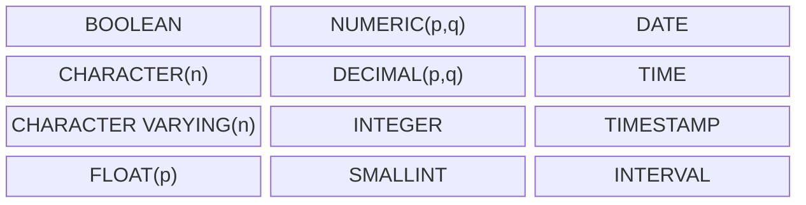

## Создание таблиц

Пример:
```sql
CREATE TABLE Classrooms (
	id SERIAL PRIMARY KEY,
	room_number INTEGER NOT NULL UNIQUE,
	floor INTEGER NOT NULL DEFAULT 1,
	building VARCHAR(50) NOT NULL,
	description TEXT,
	created_at TIMESTAMP DEFAULT CURRENT_TIMESTAMP
);
```

Параметры определения столбцов:
- PRIMARY KEY - Указывает колонку или множество колонок как первичный ключ.
- SERIAL или GENERATED ALWAYS AS IDENTITY - Указывает, что значение данной колонки будет автоматически увеличиваться при добавлении новых записей в таблицу. SERIAL — это сокращение для создания автоинкрементного поля.
- UNIQUE - Указывает, что значения в данной колонке для всех записей должны быть отличными друг от друга.
- NOT NULL - Указывает, что значения в данной колонке должны быть отличными от NULL.
- DEFAULT - Указывает значение по умолчанию.

### Получить описание таблицы

Просмотреть описание таблицы:
```sql
SELECT column_name, data_type, is_nullable, column_default
FROM information_schema.columns
WHERE table_schema = current_schema() AND table_name = 'users';
```

### Доп. параметры

Помимо описания столбцов, при создании таблицы можно дополнительно указать следующие параметры:
- Первичный ключ через запись PRIMARY KEY (id)
- Внешний ключ FOREIGN KEY (company_id) REFERENCES Companies (id)

```sql
CREATE TABLE Users (
    id INTEGER,
    name VARCHAR(255) NOT NULL,
    age INTEGER NOT NULL DEFAULT 18,
    company INTEGER,
    PRIMARY KEY (id),
    FOREIGN KEY (company) REFERENCES Companies (id) ON DELETE RESTRICT ON UPDATE CASCADE
);
```

Для внешнего ключа можно задать действия, которые будут выполняться при удалении и изменении при помощи `ON DELETE` и `ON UPDATE`

Опции `ON DELETE` и `ON UPDATE`:
- `RESTRICT` - запрет удаления связанной строки
- `SET NULL` - внешний ключ становится NULL
- `CASCADE` - связанная строка тоже удаляется/обновляется
- `SET DEFAULT` - для внешнего ключа установится значение по умолчанию

### Добавление столбцов

Синтаксис:
```sql
ALTER TABLE имя_таблицы ADD COLUMN имя_столбца тип_данных [COLLATE правило_сортировки] [ограничение_столбца [...]];
```

Пример:
```sql
ALTER TABLE distributors ADD COLUMN address varchar(30);
ALTER TABLE products ADD COLUMN description text CHECK (description <> '');

-- если нужно добавить колонку с внешним ключом, то используются ограничения
ALTER TABLE orders
ADD CONSTRAINT fk_orders_user
FOREIGN KEY (user_id) REFERENCES users(id);
```

### Удалить

```sql
DROP TABLE [IF EXISTS] имя_таблицы;
```

Для удаления столбца:
```sql
ALTER TABLE table_name DROP COLUMN column_name;
```

## Ограничения (constraints)

**Ограничения (constraints)** — это правила, задаваемые на уровне таблицы или столбца, которые обеспечивают целостность данных.

Основные виды ограничений:

| Ограничение     | Назначение                                                | Где задаётся      |
| --------------- | --------------------------------------------------------- | ----------------- |
| **NOT NULL**    | Запрещает хранить `NULL` в столбце                        | на уровне столбца |
| **DEFAULT**     | Задаёт значение по умолчанию, если значение не указано    | столбец           |
| **UNIQUE**      | Требует уникальных значений в столбце (или их комбинации) | столбец / таблица |
| **PRIMARY KEY** | Уникально идентифицирует запись; не может быть `NULL`     | таблица           |
| **FOREIGN KEY** | Обеспечивает ссылочную целостность между таблицами        | таблица           |
| **CHECK**       | Проверяет логические условия для значений                 | столбец / таблица |

### Создать/добавить
Пример использования ограничений при создании таблицы:

```sql
CREATE TABLE Employees (
    employee_id SERIAL PRIMARY KEY, -- PRIMARY KEY
    email VARCHAR(100) NOT NULL UNIQUE, -- NOT NULL + UNIQUE
    hire_date DATE DEFAULT CURRENT_DATE, -- DEFAULT
    salary NUMERIC(10,2) CHECK (salary > 0), -- CHECK
    age INT CHECK (age BETWEEN 18 AND 65), -- CHECK
    
    -- FOREIGN KEY (связь с отделом)
    department_id INT,
    CONSTRAINT fk_department
        FOREIGN KEY (department_id)
        REFERENCES Departments(department_id)
        ON DELETE SET NULL
        ON UPDATE CASCADE
);
```

Ограничения можно также добавить отдельно:
```sql
-- Добавление ограничения PRIMARY KEY
ALTER TABLE Users
ADD PRIMARY KEY (id);

-- Добавление ограничения FOREIGN KEY
ALTER TABLE Orders
ADD CONSTRAINT fk_user FOREIGN KEY (user_id) REFERENCES Users(id);

-- Добавление ограничения UNIQUE
ALTER TABLE Users
ADD CONSTRAINT uq_email UNIQUE (email);

-- Добавление ограничения CHECK
ALTER TABLE Products
ADD CONSTRAINT chk_price CHECK (price > 0);

-- Добавление ограничения NOT NULL
ALTER TABLE Users
ALTER COLUMN username SET NOT NULL;

-- Добавление значения по умолчанию
ALTER TABLE Orders
ALTER COLUMN status SET DEFAULT 'Pending';
```

### Удалить

Удалить ограничения:
```sql
ALTER TABLE employees DROP CONSTRAINT fk_department;
ALTER TABLE employees DROP CONSTRAINT unique_email;
ALTER TABLE employees DROP CONSTRAINT chk_age;

-- NULL и DEFAULT
ALTER TABLE employees ALTER COLUMN email DROP NOT NULL;
ALTER TABLE employees ALTER COLUMN hire_date DROP DEFAULT;
```

### Узнать какие есть ограничения

Имена ограничений можно узнать командой (в psql):

```sql
SELECT conname FROM pg_constraint WHERE conrelid = 'employees'::regclass;
```

## Работа с типами данных

Скалярные типы SQL:



| Тип данных                    | Описание                                                                | От                         | До                        |
| ----------------------------- | ----------------------------------------------------------------------- | -------------------------- | ------------------------- |
| SMALLINT                      | Целое число малого диапазона (2 байта)                                  | -32 768                    | 32 767                    |
| INTEGER (INT)                 | Целое число стандартного диапазона (4 байта)                            | -2 147 483 648             | 2 147 483 647             |
| BIGINT                        | Целое число большого диапазона (8 байт)                                 | -9 223 372 036 854 775 808 | 9 223 372 036 854 775 807 |
| DECIMAL(p,s), NUMERIC(p,s)    | Точное число с фиксированной точкой (p — всего цифр, s — после запятой) | зависит от p               | зависит от p              |
| REAL                          | Приближённое число с плавающей точкой (4 байта)                         | 6 знаков точности          |                           |
| DOUBLE PRECISION              | Приближённое число с плавающей точкой (8 байт)                          | 15 знаков точности         |                           |
| CHAR(n)                       | Строка фиксированной длины                                              | 1 символ                   | n символов                |
| VARCHAR(n)                    | Строка переменной длины                                                 | 0 символов                 | n символов                |
| TEXT                          | Строка произвольной длины                                               | 0 символов                 | ограничено памятью        |
| DATE                          | Календарная дата                                                        | 4713 г. до н.э.            | 5874897 г. н.э.           |
| TIME [WITHOUT TIME ZONE]      | Время суток без часового пояса                                          | 00:00:00                   | 24:00:00                  |
| TIME WITH TIME ZONE           | Время с часовым поясом                                                  | 00:00:00+00                | 24:00:00+12               |
| TIMESTAMP [WITHOUT TIME ZONE] | Дата и время без пояса                                                  | 4713 г. до н.э.            | 294276 г. н.э.            |
| TIMESTAMP WITH TIME ZONE      | Дата и время с поясом                                                   | 4713 г. до н.э.            | 294276 г. н.э.            |
| BOOLEAN                       | Логический тип (истина/ложь)                                            | TRUE                       | FALSE                     |
| BYTEA                         | Двоичные данные (binary array)                                          | —                          | —                         |
| JSON / JSONB                  | Хранение данных в формате JSON                                          | —                          | —                         |
| UUID                          | Универсальный уникальный идентификатор                                  | —                          | —                         |
| SERIAL                        | Автоинкрементное целое (эквивалент INT + SEQUENCE)                      | 1                          | 2 147 483 647             |
| BIGSERIAL                     | Автоинкрементное большое целое (эквивалент BIGINT + SEQUENCE)           | 1                          | 9 223 372 036 854 775 807 |


### Строки

Несколько встроенных функций для работы со строками:

- LENGTH — возвращает количество символов в строке
- CONCAT — объединение строк
- TRIM — удаляет пробелы в начале и конце строки
- LTRIM — удаляет ведущие пробелы из строки.
- SUBSTRING — извлекает подстроку из строки
- REPLACE — заменяет подстроку в строке
- LOWER — переводит символы строки в нижний регистр
- UPPER — переводит символы строки в верхний регистр
- POSITION — поиск подстроки в строке, возвращая позицию её первого символа `POSITION('academy' IN 'sql-academy')` -> 5

```sql
-- Вывеcти пассажиров с самым длинным ФИО
SELECT full_name
FROM passengers
WHERE LENGTH(full_name) = (
    SELECT MAX(LENGTH(full_name))
    FROM passengers
);
```

### Дата и время

**Основные типы данных**
| Тип                                        | Назначение                     | Пример значения            |
| ------------------------------------------ | ------------------------------ | -------------------------- |
| `DATE`                                     | Только дата (год, месяц, день) | `'2025-10-25'`             |
| `TIME`                                     | Время без даты                 | `'14:30:00'`               |
| `TIME WITH TIME ZONE` (`TIMETZ`)           | Время с часовым поясом         | `'14:30:00+03'`            |
| `TIMESTAMP`                                | Дата и время без пояса         | `'2025-10-25 14:30:00'`    |
| `TIMESTAMP WITH TIME ZONE` (`TIMESTAMPTZ`) | Дата и время с часовым поясом  | `'2025-10-25 14:30:00+03'` |
| `INTERVAL`                                 | Промежуток времени             | `'3 days 04:05:06'`        |

Замечание:
В PostgreSQL часовой пояс не хранится в самом значении TIMESTAMPTZ, но при вводе и выводе применяется конвертация относительно текущей сессии.

**Основные функции и выражения**
| Функция / выражение            | Описание                                           | Пример                                                 |
| ------------------------------ | -------------------------------------------------- | ------------------------------------------------------ |
| `CURRENT_DATE`                 | Текущая дата (тип `DATE`)                          | `SELECT CURRENT_DATE;` → `2025-10-25`                  |
| `CURRENT_TIME`                 | Текущее время                                      | `SELECT CURRENT_TIME;` → `14:32:00.123456+03`          |
| `CURRENT_TIMESTAMP` / `NOW()`  | Текущие дата и время                               | `SELECT NOW();` → `2025-10-25 14:32:00.123456+03`      |
| `LOCALTIMESTAMP`               | Дата и время без пояса                             | `SELECT LOCALTIMESTAMP;`                               |
| `EXTRACT(field FROM source)`   | Извлекает часть даты/времени                       | `SELECT EXTRACT(YEAR FROM NOW());` → `2025`            |
| `DATE_PART('field', source)`   | Аналог `EXTRACT`                                   | `SELECT DATE_PART('hour', NOW());` → `14`              |
| `AGE(timestamp [, timestamp])` | Разница как интервал                               | `SELECT AGE('2025-10-25', '2000-10-25');` → `25 years` |
| `JUSTIFY_INTERVAL(interval)`   | Нормализует интервал (например, 30 дней = 1 месяц) | `SELECT JUSTIFY_INTERVAL('30 days');`                  |
| `MAKE_DATE(y, m, d)`           | Собирает дату из чисел                             | `SELECT MAKE_DATE(2025,10,25);`                        |
| `MAKE_TIME(h, m, s)`           | Собирает время                                     | `SELECT MAKE_TIME(14,30,0);`                           |
| `MAKE_TIMESTAMP(y,m,d,h,m,s)`  | Собирает timestamp                                 | `SELECT MAKE_TIMESTAMP(2025,10,25,14,30,0);`           |
| `TO_CHAR(timestamp, format)`   | Форматирует дату во **времени → строку**           | `SELECT TO_CHAR(NOW(), 'DD.MM.YYYY HH24:MI');` → `25.10.2025 14:30` |
| `TO_DATE(text, format)`        | Преобразует **строку → дату**                      | `SELECT TO_DATE('25-10-2025','DD-MM-YYYY');`                        |
| `TO_TIMESTAMP(text, format)`   | Преобразует **строку → timestamp**                 | `SELECT TO_TIMESTAMP('25-10-2025 14:30','DD-MM-YYYY HH24:MI');`     |
| `GENERATE_SERIES(start, stop [, step])`   | Диапазон дат развернуть на даты.       | `SELECT generate_series('2025-01-01'::date, '2025-01-10'::date, '1 day');`     |

Форматные шаблоны:
- YYYY — год
- MM — месяц
- DD — день
- HH24 — час (24ч)
- MI — минуты
- SS — секунды

**Примеры**

```sql
-- 1. Арифметика дат и времени
SELECT NOW() + INTERVAL '7 days'; -- Дата через 7 дней
SELECT NOW() - INTERVAL '1 hour'; -- На час раньше
SELECT '2025-10-25'::date - '2025-10-20'::date; -- =5 (дней)
SELECT (NOW() + INTERVAL '2 hours')::time; -- Добавить 2 часа и вывести время

-- 2. Преобразование и форматирование
SELECT TO_CHAR(NOW(), 'Dy, DD Mon YYYY HH24:MI');
SELECT TO_DATE('25-10-2025','DD-MM-YYYY');
SELECT TO_TIMESTAMP('25-10-2025 14:30','DD-MM-YYYY HH24:MI');

SELECT EXTRACT(HOUR FROM TIME '14:30:45') -- Извлечение часа из времени = 14

-- 3. Все заказы за последние 3 дня
SELECT *
FROM orders
WHERE order_date >= NOW() - INTERVAL '3 days';

-- 4. Определить возраст (с учетом того, был ли ДР вэтом году или нет)
SELECT EXTRACT(YEAR FROM AGE(NOW(), TIMESTAMP '2003-07-03 14:10:26'));

-- 5. Вывести вылеты, совершенные с 10 ч. по 14 ч. 1 января 1900 г.
SELECT *
FROM flights
WHERE departure_time BETWEEN
      TIMESTAMP '1900-01-01 10:00:00'
  AND TIMESTAMP '1900-01-01 14:00:00';

-- 6. Одно и тоже разными способами
-- Вывести все полеты, совершенные в августе 2023 года
select * from Flights 
WHERE EXTRACT(YEAR FROM flight_date) = 2023 and EXTRACT(MONTH FROM flight_date) = 8 -- способ 1
WHERE flight_date BETWEEN DATE '2023-08-01' AND DATE '2023-08-31' -- способ 2
WHERE flight_date BETWEEN MAKE_DATE(2023, 8, 1) AND MAKE_DATE(2023, 8, 31) -- способ 3
```

- [Postgres Pro Standard : Документация: 17: 9.9. Операторы и функции даты/времени](https://postgrespro.ru/docs/postgrespro/current/functions-datetime)

### Числа

#### Округление

Для округления числовых данных в SQL предусмотрены следующие 4 функции: `CEIL`, `FLOOR`, `ROUND`, `TRUNC`.
- Функции `CEIL`, `FLOOR` направлены на то, чтобы округлять число к ближайшему целому числу в большую и в меньшую сторону соответственно.
- Для округления к ближайшему целому числу есть функция ROUND, которая любое число, десятичная часть которого больше или равна 0.5, округляет в большую сторону, иначе в меньшую. Функция `ROUND` также позволяет округлять число до некоторой части десятичных знаков после запятой. 
- Функция `TRUNC` аналогична функции ROUND, она также способна принимать 2-й необязательный параметр, только вместо округления она просто отбрасывает ненужные цифры.

Примеры:

```sql
SELECT CEIL(69.69) AS ceiling, FLOOR(69.69) AS floor;

SELECT ROUND(69.7171,1), ROUND(69.7171,2), ROUND(69.7171,3);
SELECT ROUND(1691.7,-1), ROUND(1691.7,-2), ROUND(1691.7,-3);

select round(price, -1) from Rooms; -- Округление десятков 9676 --> "9680".

```

#### Работа со знаковыми числами

При работе с числовыми данными, в которых возможно наличие отрицательных значений, могут быть полезными функции SIGN и ABS.

- Функция `SIGN` возвращает значение -1, если число отрицательное, 0, если число нулевое и 1, если число положительное.
- Функция `ABS` возвращает абсолютное значение числа (это модуль числа).

### Деньги

Тут ссылочка на статью.


### Приведение типов, CAST

Синтаксис:

```sql
CAST(value AS TYPE); 
value::TYPE; -- второй вариант
```

Пример:
```sql
CAST(12005.6 AS INTEGER); 
12005.4::INTEGER;
```

### Заполнение пропусков (generate_series)

GENERATE_SERIES — это функция в SQL, которая позволяет создать последовательность значений в заданном диапазоне с определённым шагом. 

Синтаксис:
```sql
GENERATE_SERIES(start, stop [, step])
```

Аргументы:
- start — начальное значение ряда. Может быть переменной, литералом или скалярным выражением типа tinyint, smallint, int, bigint, decimal или numeric.
- stop — конечное значение ряда. Серия останавливается, когда последнее сгенерированное значение шага превышает значение stop.
- step — шаг приращения или убывания между шагами в серии. Может быть положительным или отрицательным, но не может быть равным нулю.

Генерация дат:
```sql
SELECT generate_series('2025-01-01'::date, '2025-01-10'::date, '1 day'); 
```

```sql
SELECT DISTINCT 
generate_series(
        start_date,
        end_date,
        interval '1 day'
    )::date as day
from Reservations
WHERE room_id = 1
order by day
```

### NULL

...

## Представления (VIEW)

Представление — объект базы данных, являющийся результатом выполнения запроса к базе данных, определённого с помощью оператора SELECT, в момент обращения к представлению.

- VIEW
- MATERIALIZED VIEW
- Когда использовать
- Плюсы и минусы


```sql
CREATE OR REPLACE VIEW People AS (
    select first_name, last_name
    from Student
    UNION 
    select first_name, last_name
    from Teacher
)
```

```sql
CREATE OR REPLACE VIEW ViewUsers AS
    SELECT id,
           name,
           CONCAT(SUBSTR(email, 1, 2), '****', RIGHT(email, 4)) AS email
FROM Users;
```

## Хранимые процедуры и функции
### Хранимые функции

**Хранимая функция** — это именованный блок SQL-кода, который принимает параметры, выполняет вычисления и всегда возвращает одно значение определённого типа.

Синтаксис:
```sql
CREATE OR REPLACE FUNCTION function_name(field1 TYPE, field2 TYPE, ...)
RETURNS RETURN_TYPE
LANGUAGE plpgsql
AS $$
DECLARE
    result INT;
BEGIN
    -- логика функции
    RETURN result;
END;
$$;
```

Пример:
```sql
CREATE OR REPLACE FUNCTION is_adult(birth_date DATE)
RETURNS BOOLEAN
LANGUAGE plpgsql
AS $$
BEGIN
    RETURN EXTRACT(YEAR FROM AGE(CURRENT_DATE, birth_date)) >= 18;
END;
$$;

SELECT is_adult('2010-05-15'); 
```

Пример с переменной:
```sql
create or replace FUNCTION get_user_status(input_user_id INT)
RETURNS VARCHAR(20)
language plpgsql
AS $$
DECLARE 
    res_cnt INT := 0;
    status VARCHAR(10) ;
BEGIN 
    select count(id) into res_cnt
    from Reservations
    WHERE user_id = input_user_id;
    
    status := CASE
        WHEN res_cnt > 3 THEN 'VIP'
        WHEN res_cnt >= 1 THEN 'Regular'
        ELSE 'New'
    END;
    return status;
END
$$;
```

### Хранимые процедуры

В отличие от функций, процедуры могут изменять данные, выполнять сложную бизнес-логику, но не могут возвращать значения.

Синтаксис:

```sql
CREATE OR REPLACE PROCEDURE procedure_name(field1 TYPE, field2 TYPE, ...)
LANGUAGE plpgsql
AS $$
BEGIN
    -- логика процедуры
END;
$$;
```

### IF, CASE, WHILE

Пример IF:
```sql
    -- Определяем категорию по возрасту
    IF student_age < 18 THEN
        category := 'Несовершеннолетний';
    ELSIF student_age BETWEEN 18 AND 25 THEN
        category := 'Молодой';
    ELSE
        category := 'Взрослый';
    END IF;
```

Пример CASE:
```sql
    -- Определяем категорию с помощью CASE
    category := CASE
        WHEN student_age < 18 THEN 'Несовершеннолетний'
        WHEN student_age BETWEEN 18 AND 25 THEN 'Молодой'
        ELSE 'Взрослый'
    END;
```

Пример WHILE:
```sql
    WHILE i <= count_subjects LOOP
        INSERT INTO Subject (id, name)
        VALUES
        (
            subject_id + i,
            'Test Subject ' || i
        );

        i := i + 1;
    END LOOP;
```

### Управление

Просмотр существующих функций и процедур (для процедур `routine_type = 'PROCEDURE'`):
```sql
SELECT routine_name, routine_type
FROM information_schema.routines
WHERE routine_type = 'FUNCTION' AND routine_schema = 'public';
```

Удаление:
```sql
DROP FUNCTION IF EXISTS is_adult(DATE);
```

Изменение:
```sql
-- Изменение функции
CREATE OR REPLACE FUNCTION is_adult(birth_date DATE) 
RETURNS BOOLEAN
-- новая реализация

-- Изменение процедуры
CREATE OR REPLACE PROCEDURE add_student(
    student_first_name VARCHAR(50),
    student_last_name VARCHAR(50),
    student_birthday DATE
)
-- новая реализация
```

## События

**Событие** — это задача, которую база данных запускает сама по расписанию. Запланированные события помогают автоматизировать следующие задачи:
- Очистка данных: удаление устаревших записей логов или временных данных
- Обновление статистики: пересчёт агрегированных данных для аналитики
- Генерация отчётов: автоматическое формирование периодических отчётов
- Резервное копирование: создание копий важных данных

В PostgreSQL для автоматического выполнения задач используется расширение **pg_cron**:

```sql
CREATE EXTENSION IF NOT EXISTS pg_cron;
```

Для просмотра всех событий:

```sql
SELECT * FROM cron.job;
```

Для просмотра истории выполнения задач:
```sql
SELECT * FROM cron.job_run_details
ORDER BY start_time DESC
LIMIT 10;
```

### Одноразовое событие

Пример удаления логов старше 30 дней каждый день в 03:00.
```sql
SELECT cron.schedule(
    'cleanup_old_logs',
    '0 3 * * *',
    'DELETE FROM logs WHERE created_at < NOW() - INTERVAL ''30 days'''
);
```

### Повторяющееся событие

Примеры расписаний:

- `'*/5 * * * *'` — каждые 5 минут
- `'0 * * * *'` — каждый час (в начале часа)
- `'0 0 * * *'` — каждый день в полночь
- `'0 0 * * 0'` — каждое воскресенье в полночь
- `'0 9 1 * *'` — первого числа каждого месяца в 9:00

Пример обновления статистики продаж каждый час (в начале каждого часа):
```sql
SELECT cron.schedule(
    'update_statistics_hourly',
    '0 * * * *',
    $$
    UPDATE product_stats SET
        total_sales = (SELECT SUM(amount) FROM orders WHERE product_id = product_stats.product_id),
        last_updated = NOW()
    $$
);
```

### Событие с ограниченным сроком действия

В pg_cron нет встроенной поддержки автоматического завершения задач, но можно включить проверку даты в саму команду:
```sql
SELECT cron.schedule(
    'seasonal_discount',
    '0 0 * * *',
    $$
    UPDATE products
    SET price = price * 0.9
    WHERE category = 'seasonal'
      AND CURRENT_DATE BETWEEN '2025-12-01' AND '2025-12-31'
    $$
);
```

Альтернативно, можно создать задачу на удаление события в конце периода:

```sql
SELECT cron.schedule(
    'remove_seasonal_discount',
    '0 0 1 1 *',  -- 1 января в полночь
    $$SELECT cron.unschedule('seasonal_discount')$$
);
```
