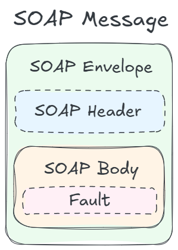
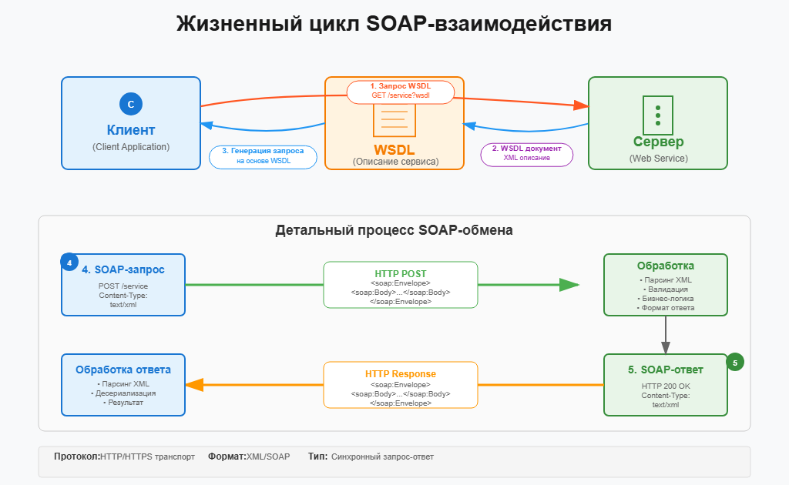
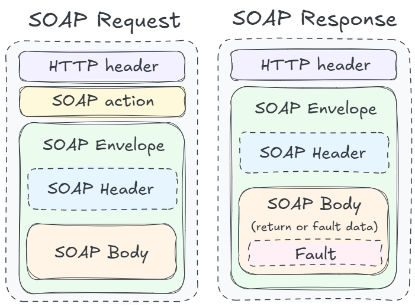

## Введение

Базовый уровень
- [ ] Основы протокола SOAP. Структура сообщения (XML файла). WSDL
- [ ] XSD схема (XML Schema).
- [ ] Понимать документацию с описанными SOAP API.

Продвинутый уровень
- [ ] Расширенные знания протокола SOAP (пространство имен, индикаторы элементов, XSLT, XPATH и т.д.).
- [ ] Проектировать и описывать интеграции SOAP API, XSD схемы.
- [ ] Работать с SOAP UI и Postman (для SOAP).

Что почитать:
- [SOAP API Developer's Guide](https://help.genesys.com/pureconnect/mergedprojects/wh_soap/desktop/structure_of_soap_messages.htm)
- [Спецификация протокола SOAP 1.2 | W3C](https://www.w3.org/TR/soap12-part1)
- [Спецификация языка описания веб-сервисов (WSDL) | W3C](https://www.w3.org/TR/wsdl)

## Основное

**SOAP** (Simple Object Access Protocol) - Протокол обмена сообщениями на основе XML. Имеет строгие стандарты: структура, формат, описание, ошибки — всё формализовано.

Работает поверх HTTP, HTTPS, SMTP или других протоколов.

Плюсы:
- Поддержка WS-Security (цифровые подписи, шифрование)
- Возможность транзакций и надежной доставки
- Подходит для сложных корпоративных интеграций

Минусы:
- Очень "тяжёлый" XML, большой объём данных
- Требует строгое соблюдение схем
- Сложнее тестировать (в отличие от REST JSON API)
- Менее гибкий, хуже подходит для веб-приложений и мобильных клиентов

## Структура SOAP-сообщения

SOAP-сообщение имеет четко заданную структуру в виде XML-документа.
Все SOAP-сообщения обязательно находятся внутри корневого элемента `<Envelope>`.



Структура SOAP сообщения:
1. **Envelope**. Корневой элемент, определяет, что документ является SOAP-сообщением.
2. **Header** *(необязательный)*. Содержит служебную информацию — метаданные, которые не относятся напрямую к содержимому запроса. Примеры: авторизация, шифрование, идентификаторы транзакций, маршрутизация.
3. **Body**. Основная часть сообщения — здесь находятся данные запроса или ответа. Его содержание для всех сервисов может быть разным, это определяется разработчиком сервиса в *WSDL-файле*.
4. **Fault** *(необязательный)*. Используется в ответе, если произошла ошибка при обработке запроса. Может содержать: faultcode — тип ошибки, faultstring — сообщение об ошибке, detail — подробности.

```xml { filename="Пример SOAP-сообщения" }
<soap:Envelope xmlns:soap="http://schemas.xmlsoap.org/soap/envelope/">
  <soap:Header>
    <!-- Метаданные, авторизация, токены -->
    <auth:Token xmlns:auth="http://example.com/auth">ABC123</auth:Token>
  </soap:Header>

  <soap:Body>
    <!-- Метод и параметры запроса -->
    <m:GetWeather xmlns:m="http://example.com/weather">
      <m:City>Москва</m:City>
    </m:GetWeather>
  </soap:Body>
</soap:Envelope>
```


У всех SOAP-сообщений одинаковая структура (Envelope, Header, Body), но содержимое Body уникально для каждой операции, и задаётся WSDL-файлом сервиса.


## WSDL

**WSDL** (Web Services Description Language) — это специальный XML-документ, который описывает веб-сервис: его функции, параметры, форматы сообщений и адрес, по которому его можно вызвать.

Структура:
| Раздел          | Назначение                                                                |
| --------------- | ------------------------------------------------------------------------- |
| **definitions** | Корневой элемент. Определяет пространство имён и общие сведения о сервисе |
| **types**       | Определяет используемые типы данных (через XML Schema / XSD)              |
| **message**     | Описывает входные и выходные сообщения (структуру `<Body>`)               |
| **portType**    | Перечисляет доступные операции (методы сервиса)                           |
| **binding**     | Указывает, как именно реализован сервис (протокол, формат SOAP)           |
| **service**     | Указывает реальный адрес (`endpoint`), куда посылать запросы              |


Пример WSDL

```xml
<definitions xmlns:soap="http://schemas.xmlsoap.org/wsdl/soap/"
             xmlns:tns="http://example.com/weather"
             xmlns:xsd="http://www.w3.org/2001/XMLSchema"
             name="WeatherService"
             targetNamespace="http://example.com/weather">

  <!-- Типы данных -->
  <types>
    <xsd:schema targetNamespace="http://example.com/weather">
      <xsd:element name="GetWeather">
        <xsd:complexType>
          <xsd:sequence>
            <xsd:element name="City" type="xsd:string"/>
          </xsd:sequence>
        </xsd:complexType>
      </xsd:element>
    </xsd:schema>
  </types>

  <!-- Сообщения -->
  <message name="GetWeatherRequest">
    <part name="parameters" element="tns:GetWeather"/>
  </message>
  <message name="GetWeatherResponse">
    <part name="parameters" element="tns:GetWeatherResponse"/>
  </message>

  <!-- Операции -->
  <portType name="WeatherPortType">
    <operation name="GetWeather">
      <input message="tns:GetWeatherRequest"/>
      <output message="tns:GetWeatherResponse"/>
    </operation>
  </portType>

  <!-- Привязка -->
  <binding name="WeatherBinding" type="tns:WeatherPortType">
    <soap:binding style="document"
                  transport="http://schemas.xmlsoap.org/soap/http"/>
    <operation name="GetWeather">
      <soap:operation soapAction="http://example.com/GetWeather"/>
      <input><soap:body use="literal"/></input>
      <output><soap:body use="literal"/></output>
    </operation>
  </binding>

  <!-- Сам сервис -->
  <service name="WeatherService">
    <port name="WeatherPort" binding="tns:WeatherBinding">
      <soap:address location="https://example.com/weather"/>
    </port>
  </service>
</definitions>
```


WSDL-файлы обычно доступны прямо по ссылке https://example.com/service?wsdl


### WSDL и XSD

WSDL и XSD — не одно и то же, но они тесно связаны. Можно сказать, что WSDL использует XSD внутри себя.

- **XSD** (XML Schema Definition) — это схема XML-документа, которая определяет структуру и типы данных: какие элементы могут быть, в каком порядке, какие у них типы (string, int и т. д.).

- **WSDL** (Web Services Description Language) — это описание веб-сервиса,
которое говорит, какие операции есть, как их вызвать и какие сообщения передаются.


WSDL описывает **поведение** сервиса (операции, запросы, ответы).
XSD — **формат данных**, которыми эти операции обмениваются (что именно и как можно передавать).


Пример XSD
```xml
<xsd:schema xmlns:xsd="http://www.w3.org/2001/XMLSchema"
            targetNamespace="http://example.com/weather"
            elementFormDefault="qualified">

  <xsd:element name="GetWeather">
    <xsd:complexType>
      <xsd:sequence>
        <xsd:element name="City" type="xsd:string"/>
      </xsd:sequence>
    </xsd:complexType>
  </xsd:element>

  <xsd:element name="GetWeatherResponse">
    <xsd:complexType>
      <xsd:sequence>
        <xsd:element name="Temperature" type="xsd:int"/>
        <xsd:element name="Condition" type="xsd:string"/>
      </xsd:sequence>
    </xsd:complexType>
  </xsd:element>
</xsd:schema>
```

Пример фрагмента WSDL, использующего XSD

```xml
<definitions xmlns:wsdl="http://schemas.xmlsoap.org/wsdl/"
             xmlns:xsd="http://www.w3.org/2001/XMLSchema"
             xmlns:tns="http://example.com/weather"
             targetNamespace="http://example.com/weather">

  <!-- Подключаем схему типов -->
  <types>
    <xsd:schema>
      <xsd:import namespace="http://example.com/weather"
                  schemaLocation="weather.xsd"/>
    </xsd:schema>
  </types>

  <!-- Определяем операции -->
  <message name="GetWeatherRequest">
    <part name="parameters" element="tns:GetWeather"/>
  </message>

  <message name="GetWeatherResponse">
    <part name="parameters" element="tns:GetWeatherResponse"/>
  </message>

</definitions>
```

Здесь WSDL ссылается на внешний XSD (weather.xsd), чтобы использовать его типы (GetWeather, GetWeatherResponse).

## Как работает SOAP



Процесс взаимодействия (по HTTP):
1. Клиент запрашивает WSDL у сервера GET /service?wsdl 
2. Клиент формирует SOAP-запрос на основе WSDL и отправляет на сервер.
3. Сервер обрабатывает полученный запрос (парсинг, валидация, бизнес-логика) и формирует SOAP-ответ.
4. Клиент получает SOAP-ответ и обрабатывает его.

Пример запроса:

```xml
POST /weather HTTP/1.1
Host: example.com
Content-Type: text/xml; charset=utf-8
SOAPAction: "http://example.com/GetWeather"

<soap:Envelope xmlns:soap="http://schemas.xmlsoap.org/soap/envelope/">
  <soap:Header>
    <auth:Token xmlns:auth="http://example.com/auth">ABC123</auth:Token>
  </soap:Header>
  <soap:Body>
    <m:GetWeather xmlns:m="http://example.com/weather">
      <m:City>Москва</m:City>
    </m:GetWeather>
  </soap:Body>
</soap:Envelope>
```

Пример ответа (успех):

```xml
HTTP/1.1 200 OK
Content-Type: text/xml; charset=utf-8

<soap:Envelope xmlns:soap="http://schemas.xmlsoap.org/soap/envelope/">
  <soap:Header/>
  <soap:Body>
    <m:GetWeatherResponse xmlns:m="http://example.com/weather">
      <m:Temperature>5</m:Temperature>
      <m:Condition>Облачно</m:Condition>
    </m:GetWeatherResponse>
  </soap:Body>
</soap:Envelope>
```

Пример ответа (ошибка):

```xml
HTTP/1.1 500 Internal Server Error
Content-Type: text/xml; charset=utf-8

<soap:Envelope xmlns:soap="http://schemas.xmlsoap.org/soap/envelope/">
  <soap:Body>
    <soap:Fault>
      <faultcode>soap:Client</faultcode>
      <faultstring>City not found</faultstring>
      <detail>
        <m:ErrorCode xmlns:m="http://example.com/weather">404</m:ErrorCode>
      </detail>
    </soap:Fault>
  </soap:Body>
</soap:Envelope>
```




## SOAP vs REST

Чем SOAP отличается от REST?

- **SOAP** (Simple Object Access Protocol) - Протокол обмена сообщениями на основе XML. Имеет строгие стандарты: структура, формат, описание, ошибки — всё формализовано. Работает поверх HTTP, HTTPS, SMTP или других протоколов.
- **REST** (Representational State Transfer) - Архитектурный стиль, основанный на HTTP-принципах и ресурсо-ориентированном подходе. Использует стандартные HTTP-методы: GET, POST, PUT, DELETE и т. д.

|                        | SOAP                                                             | REST                                             |
| :--------------------- | :--------------------------------------------------------------- | :----------------------------------------------- |
| Основной протокол      | Может работать через HTTP, SMTP и др.                            | Обычно только HTTP                               |
| Идентификация ресурсов | Через операции (методы в WSDL)                                   | Через URL-ресурсы                                |
| Описание интерфейса    | WSDL (Web Service Definition Language) — формальный XML-контракт | OpenAPI / Swagger (JSON/YAML-документ)           |
| Структура сообщений    | Строгое тело `<Envelope>`, `<Header>`, `<Body>`                  | Гибкая структура: URL + заголовки + тело запроса |


Пример REST-запроса:

```
GET https://api.bank.ru/accounts/12345/balance
Accept: application/json
```

Пример SOAP-запроса:
```xml
<soap:Envelope xmlns:soap="http://schemas.xmlsoap.org/soap/envelope/">
  <soap:Header/>
  <soap:Body>
    <m:GetWeather xmlns:m="http://example.com/weather">
      <m:City>Москва</m:City>
    </m:GetWeather>
  </soap:Body>
</soap:Envelope>
```