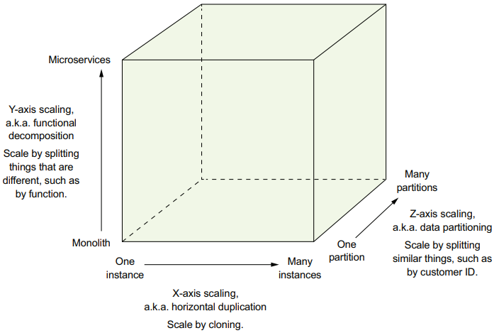
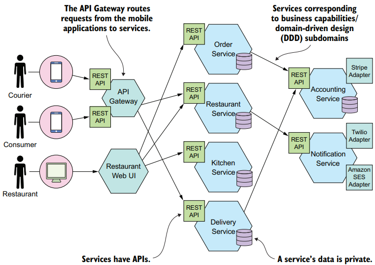
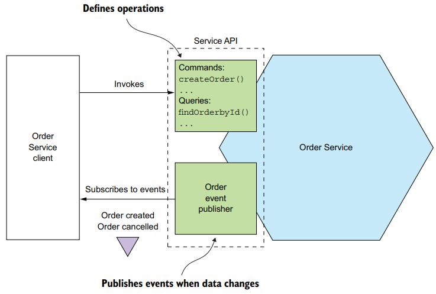
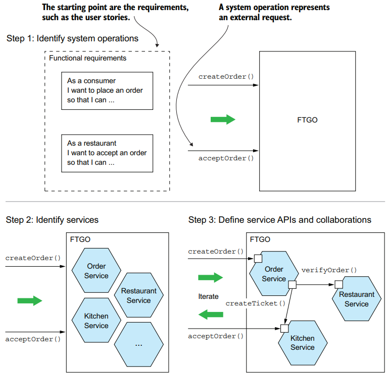
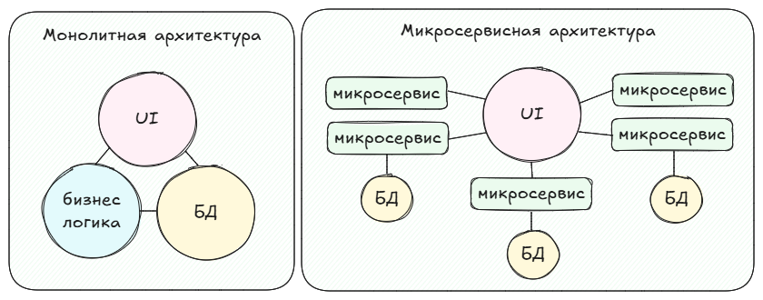

## Введение
- Книга Microservices patterns // Chris Richardson и сайт автора [microservices.io](https://microservices.io)
- [Просто о микросервисах](https://habr.com/ru/companies/raiffeisenbank/articles/346380)
- На основе [Java Microservices: The Basics](https://www.marcobehler.com/guides/java-microservices-a-practical-guide#_java_microservices_the_basics) и его [перевода](https://javarush.com/groups/posts/2660-rukovodstvo-po-mikroservisam-java-chastjh-1-osnovih-mikroservisov-i-ikh-arkhitektura)
- Об архитектуре ПО и других видах ИТ-архитектур [От монолита до микросервисов: как устроена архитектура ПО](https://blog.skillfactory.ru/ot-monolita-do-mikroservisov-kak-ustroena-arhitektura-po)
- [Монолит или микросервисы: какую архитектуру выбрать для нового проекта](https://tproger.ru/articles/monolit-ili-mikroservisy--kak-vybrat-arhitekturu-dlya-novogo-proekta)
- [Microservice Architecture Microservices.io](https://microservices.io/index.html)

## Вопросы и ответы
- [ ] Приходилось ли вам проектировать взаимодействие информационных систем?
- [ ] Что такое корпоративная шина? Приходилось ли работать с корпоративной шиной?
- [ ] Чем корпоративная шина отличается от ETL – инструмента?
- [ ] Чем брокер сообщений отличается от корпоративной шины?
- [ ] К корпоративной шине подключены веб-сервисы. В одном веб-сервисе появились два новых обязательных поля. Что изменится в интеграции?
- [ ] Есть некий UI, нужно написать к нему веб-сервис. Опишите вашу постановку – что в ней будет.
- [ ] Что такое синхронные и асинхронные вызовы?
- [ ] Приходилось ли вам работать с брокерами сообщений?
- [ ] Для чего вы использовали брокер сообщений?
- [ ] Как брокер сообщений гарантирует доставку сообщений?
- [ ] Чем Kafka отличается от RabbitMQ?
- [ ] Есть две системы. Назовите все способы интеграции этих систем.
- [ ] Какие виды/способы интеграции вы знаете?
- [ ] Клиент читает в Kafka два последних сообщения. Как тому же клиенту заново прочитать эти два последние сообщения?
- [ ] Приходилось ли вам проектировать API в нотации OpenAPI/Swagger?
- [ ] Опишите все способы снизить нагрузку на вебсервис.
- [ ] Есть четыре системы, участвующие в последовательном исполнении заказа клиента на выдачу карты: форма заявки на выдачу карты, скоринг, печать карты, логистика. Опишите, как вы их интегрируете между собой.
- [ ] Знакомы ли вы с микросервисами?
- [ ] Что такое Хореография и Оркестрация?
- [ ] Какие достоинства и недостатки микросервисов вы знаете?
- [ ] Расскажите про токен-авторизацию в микросервисах.

## Масштабирование приложения

Рассмотрим модель масштабирования в виде куба - **куб масштабирования**.
Эта модель определяет три направления для масштабирования приложений - X, Y и Z:
- **X-ось** - масштабирование путем клонирования. Запускаются несколько одинаковых экземпляров программы и балансировщик нагрузки распределяет запросы между ними.
- **Z-ось** - деление данных на подмножества (partition). Каждый экземпляр приложения отвечает за определенное подмножество данных. Тут используется маршрутизатор, который по атрибуту запроса (например ID покупателя) определяет нужный экземпляр. Пример: по атрибуту _userID_ определить _экземпляр1_покупатели А-Л_ или _экземпляр2_покупатели М-Я_.
- **Y-ось** - функциональная декомпозиция приложения на сервисы. Сервис — это автономный, независимо развертываемый программный компонент, который реализует определенные полезные функции (например: управление заказами, управление клиентами). Сервисы тоже можно масштабировать осью Х или Z.

## Микросервисная архитектура

**Микросервисная архитектура** (microservices architecture, MSA) - это стиль проектирования, который cтруктурирует приложение в виде набора слабо связанных сервисов, которые развертываются независимо друг от друга.

**Сервис** — это автономный, независимо развертываемый программный компонент, который реализует определенные полезные функции. У сервиса есть API, который инкапсулирует реализацию ("скрывает" реализацию). API определяет операции,
вызываемые клиентами. Существует два типа операций: команды (обновляют данные) и запросы (извлекают данные). При изменении своих данных сервис публикует события (event publisher), на которые могут подписаться его клиенты.

### Слабая связаннось сервисов
Важной характеристикой микросервисной архитектуры является **слабое связывание сервисов**. Все взаимодействие с сервисом происходит *только через API, исключая коммуникацию через базу данных.*

### Роль общих библиотек
Функции, которые с большой вероятностью в дальнейшем будут меняться, можно оформить в виде отдельного сервиса. 
Нужно стараться применять библиотеки для функций, изменение которых маловероятно. Например, в типичном приложении было бы излишним реализовывать класс Money в каждом сервисе. Вместо этого стоит создать библиотеку, с которой будут работать эти сервисы.

### Процесс описания MSA

1. На основе требований к приложению (таких как user stories) определяем операции, выполняемые системой. Системная операция представляет собой запрос, который приложение должно обработать. Например: *createOrder(), acceptOrder()*.
2. Разбиение на сервисы. Тут есть несколько стратегий разбиения: 1. сервисы должны соответствовать бизнес-функциям или 2. организация сервисов вокруг подобластей в контексте предметно-ориентированного проектирования.
3. Описание API для каждого сервиса. Для этого сервисам назначаются все системные операции,
определенные на первом шаге.

<!-- Остановилась на странице 74. -->

## Плюсы и минусы
Микросервисная архитектура может подойти для крупных проектов для упрощения разработки и повышения производительности+отказоустойчивости. Основной принцип такой архитектуры заключается в независимости микросервисов друг от друга. Иными словами - каждый микросервис можно разрабатывать, тестировать, деплоить (и откатывать) независимо друг от друга. Один микросервис - это одна бизнес-функция, что позволяет не размывать границы микросервиса.

Плюсы:
- Гибкая и удобная разработка. Каждый микросервис - это отдельная бизнес-функция.
- Распределение нагрузки, масштабирование проще (и дешевле).
- Изолированность микросервисов. Проще разделять технологии для микросервисов, упрощенный деплой.
- При работе с микросервисом необязательно знать, как работают остальные сервисы (в отличие от монолита).
- Для каждого сервиса можно подобрать более подходящую технологию. Можно добавлять новые функции не изменяя все приложение.

Минусы:
- Сложная архитектура, т. к. нужно продумать взаимодействие сервисов. Сложнее в администрировании, мониторинге, поддержке.
- Коммуникация и обслуживание. Необходимо учитывать ситуации потери запросов/данных.
- Согласованность данных. Некоторые компоненты могут быть несинхронизированы между собой. Например когда несколько сервисов обращаются к одному источнику данных.
- Дебаг. Сложно определить где конкретно вышла ошибка, если взаимодействовало несколько микросервисов. Точек отказа больше.

Если микросервисы независимы друг от друга, то как же они передают друг другу информацию? С монолитом все понятно - там все лежит в одном месте. С микросервисами все иначе. Предположим, у нас есть 2 микросервиса, которые находятся на разных серверах. В таком случае из первого сервиса во второй отправляется запрос, на который обратно приходит ответ. Делается это при помощи технологи HTTP.

## Сравнение с другими архитектурами
### Монолит vs MSA

В отличие от **монолитной** архитектуры, в которой *все компоненты приложения тесно связаны и работают как единое целое*, **микросервисная архитектура** предполагает полную *автономность* каждого компонента. 

Основные отличия этих архитектурных стилей описаны в таблице:

|                    |                                                 Монолит                                                |                                                              Микросервисная (MSA)                            |
|------------------|----------------------------------------------------------------------------------------------------------|-----------------------------------------------------------------------------------------------------------------------------------------------------|
| Принцип построения | Одно большое приложение, все компоненты связаны напрямую.                                                  | Приложение разделено на независимые микросервисы. Каждый микросервис - отдельная бизнес-функция.                                                      |
| Разработка         | Одна база кода, простой процесс разработки и развертывания.                                                | Каждый сервис - отдельный репозиторий со своей БД.                                                                                                      |
| Откат разработки   | При необходимости отката откатывается все приложение, включая и рабочие фичи тоже.                          | Откатить можно только не работающий сервис, остальные остаются.                                                                                       |
| Поддержка          | Проще поддерживать, т. к. архитектура простая и не нужно дополнительно разбирать связи с др. компонентами. | При появлении ошибки нужно сначала понять, в каком из микросервисов она появилась. Также добавляется доп. коммуникация между командами микросервисов. |
| Производительность | При перегрузке в определенной функции приложения может пострадать скорость всего приложения.               | Каждый сервис можно размещать на отдельном сервере, проще (и дешевле) распределить нагрузку.                                                          |
| Гибкость           | Привязка к определенному набору технологий. Новые функции могут повлиять на все приложение.                | Для каждого сервиса можно подобрать более подходящую технологию. Можно добавлять новые функции не изменяя все приложение.                             |

### SOA vs MSA

**Сервис-ориентированная архитектура** (service-oriented architecture, SOA) и **микросервисная архитектура** — это стили проектирования, которые структурируют систему как набор сервисов. Но при более детальном рассмотрении можно обнаружить существенные различия:

| Критерий                  | Сервис-ориентированная архитектура (SOA)                                                                 | Микросервисная архитектура (MSA)                                                                 |
|---------------------------|---------------------------------------------------------------------|------------------------------------------------------------------------------|
| Взаимодействие сервисов   | «Умные» шины (smart pipes), такие как Enterprise Service Bus, с использованием тяжеловесных протоколов (SOAP и другие стандарты WS*) | Примитивные каналы, такие как брокер сообщений или прямое взаимодействие сервисов, с использованием лёгких протоколов (REST или gRPC) |
| Данные                    | Глобальная модель данных и общие базы данных                        | Модель данных и база данных для каждого сервиса                              |
| Типичный сервис           | Более крупное монолитное приложение                                 | Небольшой сервис                                                             |
