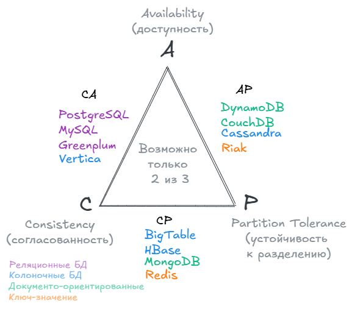

## Введение

Что почитать:
- Разница между REST и SOAP: [Хабр / Различия REST и SOAP](https://habr.com/ru/articles/483204)
- Вебхуки и API [Вебхуки: как получать данные без промедления и опросов API](https://proglib.io/p/vebhuki-kak-poluchat-dannye-bez-promedleniya-i-oprosov-api-2019-11-09)
- Статья [Документация по веб-API ASP.NET Core с использованием Swagger (OpenAPI)](https://learn.microsoft.com/ru-ru/aspnet/core/tutorials/web-api-help-pages-using-swagger?view=aspnetcore-5.0)
- Как посмотреть параметры запроса в панели разработчика [Как анализировать POST запросы в веб-браузере](https://hackware.ru/?p=8973)
- [Коды ответов HTTP](https://ru.wikipedia.org/wiki/Список_кодов_состояния_HTTP)
- Статья [Как пользоваться Postman](https://telegra.ph/Kak-polzovatsya-programmoj-Postman-11-01)

## Что такое интеграция

**Интеграция** — процесс взаимодействия независимых приложений/микросервисов. Основная цель интеграции - обеспечить обмен информацией между приложениями.

### Виды интеграций
Среди видов интеграций систем выделяют:
- Файловый обмен. Обмен файлами (CSV, XML, JSON) через общие каталоги, FTP или облако.
- Общая БД. Системы обращаются напрямую или имеют прямой доступ к данным.
- Интеграция через шину данных ESB (Enterprise Service Bus). Централизованный поток данных, доступный всем системам.
- Вызов метода API. У сервиса есть интерфейс - API (Application Programming Interface), через который другие системы могут к ним обращаться. 
- Интеграция через брокер сообщений. Системы обмениваются сообщениями через посредника - брокер (Kafka, RabbitMQ).

### Архитектурные стили

Архитектурные стили интеграций:

| Вид интеграции                                      | Краткое описание                                                                                                    |
| --------------------------------------------------- | ------------------------------------------------------------------------------------------------------------------- |
| Точечная (Point-to-Point)                       | Каждая система напрямую связана с другой через БД, протоколы, API. Просто, но плохо масштабируется.                                          |
| Шинная (ESB — Enterprise Service Bus)           | Все системы подключены через общую интеграционную шину, которая управляет сообщениями и преобразованием данных. |
| Сервисная (Service-Oriented Architecture, SOA) | Системы предоставляют сервисы (API), которыми пользуются другие системы.                                        |
| Микросервисная интеграция (Microservices Architecture, MSA)  | Каждая функция — отдельный микросервис, взаимодействие через API, брокеры сообщений, события.                   |
| Интеграция через события (Event-Driven Architecture, EDA)                       | Одна система публикует событие (“создан заказ”), другие подписываются.             |
| Интеграция через сообщения (Message-Oriented Architecture)                       | Интеграция через очереди сообщений.             |

### Синхронная и асинхронная интеграция

Взаимодействия между системами бывают:
- синхронные интеграции - запрос уходит и ожидание ответа блокирует программу (например: REST API, SOAP, gRPC);
- асинхронные - запрос уходит и приложение продолжает свои задачи. Когда придет ответ система сама восстановит связь (например: Kafka, RabbitMQ, WebSocket)

Различия их в том, что приложения с асинхронным взаимодействием не ждут ответа после отправки запроса, а могут продолжить выполнять свой основной поток задач.

Схема взаимодействия


На практике оба подхода часто комбинируют. Например, заказ сформируется синхронно, а оповещение дальше улетает асинхронно — чтобы не «висел» веб-интерфейс клиента.

## Контракт взаимодействия

**Контракт** в интеграциях — это формализованное описание взаимодействия между системами. Он определяет формат запросов и ответов, структуру данных, доступные операции, правила обработки ошибок и другие условия взаимодействия. Контракт нужен для обеспечения совместимости и независимого развития систем.

От выбранного типа интеграции (REST, SOAP, события в Kafka, очередь RabbitMQ) меняется и то, как выглядит и кем соблюдается контракт. Примеры:
- REST API: контракт описан через OpenAPI: методы (GET/POST и др.), параметры, структура тела запроса и ответа, эндпоинты. Такой контракт можно даже формально проверить и генерировать по нему код клиента.
- SOAP: контракт прописан через WSDL (Web Services Description Language) — это язык описания веб-сервисов, основанный на XML.
- Kafka/событийные платформы: тут контракт — это схема сообщения, описание топика, форматы полей, правила именования. Если подписчик ждет поле, а его убрали — сообщения станут просто «мусором».
- Очереди (RabbitMQ и др.): похожая ситуация — если структура сообщения поменялась, можно «убить» всех потребителей. Иногда делают так, чтобы сообщество клиентов поддерживало несколько типов сообщений.
- Текстовые спецификации — для простых случаев популярна «таблица в Confluence».

При разработке API выделяют два основных подхода:
- *Contract First* (сначала контракт): предполагает проектирование спецификации API (то есть контракт) до написания кода.
- *Code First* (сначала код): сначала создаётся код, потом на основе реализованной логики генерируется спецификация API.

## Паттерны интеграций

Некоторые из паттернов интеграций:
1. Запрос-ответ (Request-Reply). Паттерн, при котором одна система отправляет запрос и ожидает ответ от другой системы. Используется для синхронного взаимодействия. Примеры: REST API, SOAP, gRPC.
2. Издатель-подписчик (Publish-Subscribe, Pub/Sub). Издатель публикует сообщение в канал, а несколько подписчиков получают его независимо друг от друга. Примеры: Kafka topics, RabbitMQ Pub/Sub.
3. Очередь сообщений (Message Queue). Сообщение помещается в очередь и обрабатывается одним из потребителей. Примеры: RabbitMQ Queue, Amazon SQS.
4. API Gateway. Единая точка входа для клиентов, через которую маршрутизируются запросы к внутренним сервисам. Примеры: Kong, Apigee, Nginx Gateway.
5. Событийно-ориентированная интеграция (Event-Driven Architecture, EDA). Системы взаимодействуют через события и реагируют на изменения состояния.  
6. Сага (Saga). Паттерн управления распределенными транзакциями в микросервисной архитектуре. Виды: оркестрация (orchestration) и хореография (choreography). В оркестрации один центральный "диспетчер" решает, кому и когда что делать. В хореографии же никто никем не командует. Каждый сервис знает свою роль: увидел событие — сделал своё дело, и дальше неважно, кто ещё слушал это событие. Если вернуться к музыке, то в оркестрации дирижёр рулит всем оркестром, а в хореографии — каждый танцует свою партию, доверяя ритму музыки (то есть событиям). Когда использовать что? Оркестрация хороша, когда вы хотите централизованный контроль. Хореография — когда ищете максимальную независимость и гибкость, особенно в больших распределённых системах.

## Связанность систем

- Tight coupling - Системы сильно зависят друг от друга.
- Loose coupling - Системы минимально знают друг о друге.


## Как обеспечить надежность интеграции

Надежность интеграции обеспечивают не одним механизмом, а набором правил: что делать при ошибке, повторе, задержке, дубле, недоступности сервиса и частичной обработке данных.

### CAP-теорема

В CAP говорится, что в распределенной системе возможно выбрать только 2 из 3-х свойств:

- C (consistency) — согласованность. Каждое чтение даст вам самую последнюю запись.
- A (availability) — доступность. Каждый узел (не упавший) всегда успешно выполняет запросы (на чтение и запись).
- P (partition tolerance) — устойчивость к распределению. Даже если между узлами нет связи, они продолжают работать независимо друг от друга.


### Гарантии доставки

Гарантия доставки одного конкретного события определяет, получит ли сервис-получатель (консьюмер) сообщение.

- At-most-once: сообщение будет доставлено не более одного раза (возможна потеря сообщения).
- At-least-once: сообщение может быть доставлено несколько раз, но потеряно не будет.
- Exactly-once: каждое сообщение гарантированно будет обработано ровно один раз (идеальная, но дорогая гарантия).

### Идемпотентность

Повторный запрос или повторная обработка сообщения не должны приводить к ошибочным дублям. Для этого нужно обеспечить операции **идемпотентность** — это свойство, когда повторение одного и того же действия не изменяет результат.

Подробнее можно почитать в статье [Хабр / Идемпотентность: искусство не менять мир дважды](https://habr.com/ru/articles/868382/).

Идемпотентность в HTTP: `GET` `DELETE` `HEAD`, (delete хоть и возвращает разные коды при повторном вызове, но является идемпотентным)
Неидемпотентные: `POST`

По умолчанию некоторые операции в API не являются идемпотентными. Например, операции, которые изменяют состояние ресурсов. Для обеспечения их идемпотентности, в запросах необходимо передавать заголовок Idempotency-Key (или поле operationId в теле). В заголовке следует указать UUID-строку — ее необходимо сформировать самостоятельно. У каждой операции должен быть свой UUID.

```
Idempotency-Key: <UUID>
```

Когда сервис получит запрос с заголовком Idempotency-Key, он проверит, была ли ранее создана операция с таким UUID. Если операция была создана, сервер вернет объект Operation с текущим статусом этой операции. Если операции с таким UUID не найдено, сервис начнет ее выполнение.

Пример:
```
POST /compute/v1/instances/e0m97h0gbq0foeuis03:start
HTTP/1.1
Host: compute.api.cloud.yandex.net
Idempotency-Key: c1700de3-b8cb-4d8a-9990-e4ebf052e9aa
```

## Интеграционные форматы
Онлайн конвертеры:
- [XML -> XSD](https://www.liquid-technologies.com/online-xml-to-xsd-converter) и [XSD -> XML](https://www.liquid-technologies.com/online-xsd-to-xml-converter)
- [JSON -> JSON Schema](https://www.liquid-technologies.com/online-json-to-schema-converter) и [JSON Schema -> JSON](https://www.liquid-technologies.com/online-schema-to-json-converter)

### JSON + JSON Schema

```json
{
    "user": {
        "id": 12345,
        "name": "Иван Петров",
        "email": "ivan.petrov@example.com",
        "isActive": true,
        "createTs": "2025-10-19T22:15:00Z",
        "hobbies": [
            "чтение",
            "рисование"
        ],
        "accounts": [
            {
                "type": "savings",
                "balance": 12500.75,
                "currency": "RUB"
            },
            {
                "type": "credit",
                "balance": -3400.50,
                "currency": "RUB"
            }
        ]
    }
}
```

```json
{
    "$schema": "http://json-schema.org/draft-04/schema#",
    "type": "object",
    "properties": {
        "user": {
            "type": "object",
            "properties": {
                "id": {
                    "type": "integer"
                },
                "name": {
                    "type": "string"
                },
                "email": {
                    "type": "string"
                },
                "isActive": {
                    "type": "boolean"
                },
                "createTs": {
                    "type": "string"
                },
                "hobbies": {
                    "type": "array",
                    "items": [
                        {
                            "type": "string"
                        },
                        {
                            "type": "string"
                        }
                    ]
                },
                "accounts": {
                    "type": "array",
                    "items": [
                        {
                            "type": "object",
                            "properties": {
                                "type": {
                                    "type": "string"
                                },
                                "balance": {
                                    "type": "number"
                                },
                                "currency": {
                                    "type": "string"
                                }
                            },
                            "required": [
                                "type",
                                "balance",
                                "currency"
                            ]
                        },
                        {
                            "type": "object",
                            "properties": {
                                "type": {
                                    "type": "string"
                                },
                                "balance": {
                                    "type": "number"
                                },
                                "currency": {
                                    "type": "string"
                                }
                            },
                            "required": [
                                "type",
                                "balance",
                                "currency"
                            ]
                        }
                    ]
                }
            },
            "required": [
                "id",
                "name",
                "email",
                "isActive",
                "createTs",
                "hobbies",
                "accounts"
            ]
        }
    },
    "required": [
        "user"
    ]
}
```

### XML + XSD
[Что такое XML](https://habr.com/ru/articles/524288)

Из чего состоит XSD?
Основные объекты, из которых состоит XSD-схема:
- элементы (зелёный цвет);
- типы (синий);
- индикаторы порядка (красный).

```xml
<user>
    <id>12345</id>
    <name>Иван Петров</name>
    <email>ivan.petrov@example.com</email>
    <isActive>true</isActive>
    <createTs>2025-10-19T22:15:00Z</createTs>

    <hobbies>
        <hobby>чтение</hobby>
        <hobby>рисование</hobby>
    </hobbies>

    <accounts>
        <account type="savings" currency="RUB">
            <balance>12500.75</balance>
        </account>
        <account type="credit" currency="RUB">
            <balance>-3400.50</balance>
        </account>
    </accounts>
</user>
```

```xsd
<?xml version="1.0" encoding="utf-8"?>
<xs:schema attributeFormDefault="unqualified" elementFormDefault="qualified" xmlns:xs="http://www.w3.org/2001/XMLSchema">
  <xs:element name="user">
    <xs:complexType>
      <xs:sequence>
        <xs:element name="id" type="xs:unsignedShort" />
        <xs:element name="name" type="xs:string" />
        <xs:element name="email" type="xs:string" />
        <xs:element name="isActive" type="xs:boolean" />
        <xs:element name="createTs" type="xs:dateTime" />
        <xs:element name="hobbies">
          <xs:complexType>
            <xs:sequence>
              <xs:element maxOccurs="unbounded" name="hobby" type="xs:string" />
            </xs:sequence>
          </xs:complexType>
        </xs:element>
        <xs:element name="accounts">
          <xs:complexType>
            <xs:sequence>
              <xs:element maxOccurs="unbounded" name="account">
                <xs:complexType>
                  <xs:sequence>
                    <xs:element name="balance" type="xs:decimal" />
                  </xs:sequence>
                  <xs:attribute name="type" type="xs:string" use="required" />
                  <xs:attribute name="currency" type="xs:string" use="required" />
                </xs:complexType>
              </xs:element>
            </xs:sequence>
          </xs:complexType>
        </xs:element>
      </xs:sequence>
    </xs:complexType>
  </xs:element>
</xs:schema>
```