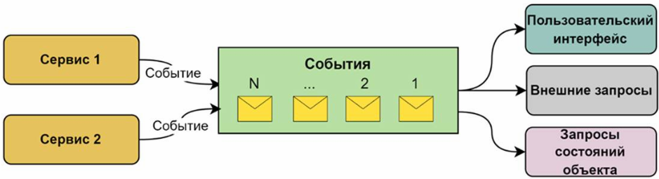
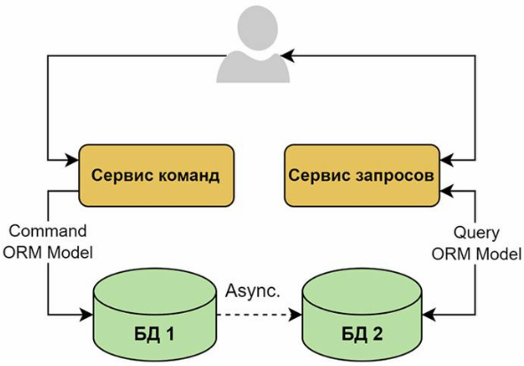
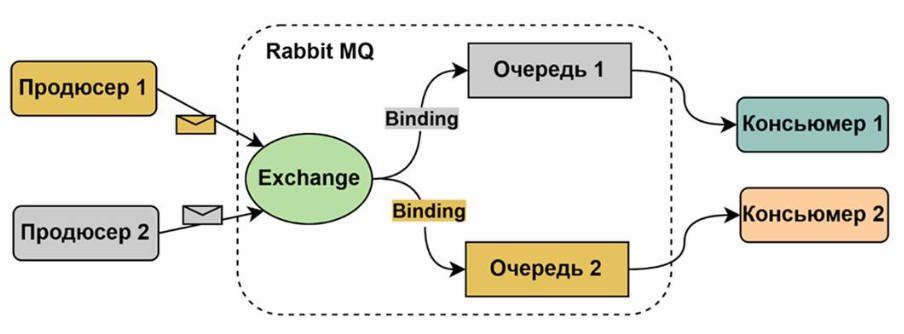
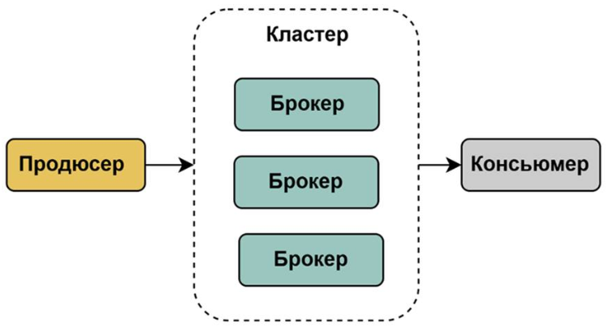
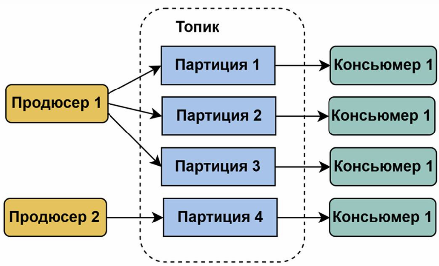

## Паттерны микросервисной архитектуры

### Event Sourcing, ES

Источник: https://t.me/system_analyse/2697

**Поиск событий (Event Sourcing, ES)** - паттерн микросервисной архитектуры, который предполагает вместо хранения объектов и состояний сохранять события, которые изменили состояние объектов. Паттерн рекомендуется использовать при выборе асинхронного взаимодействия.



Как работает Поиск событий:
1. Изменение состояния объекта представляется как **событие**: *EmailConfirmed, AddressChanged*.
2. Все события записываются в **хранилище событий**. События добавляются в конец, в существующие объекты изменения не вносятся.
3. Текущее состояние объекта вычисляется путем воспроизведения всех событий из хранилища по порядку.

### CQRS

**Command Query Responsibility Segregation (CQRS)** - разделение команд и запросов. В рамках паттерна операции изменения данных отделены от операций чтения данных.



## Rabbit MQ

### Основные понятия

**Rabbit MQ** - это брокер сообщений с открытым исходным кодом, который основан на протоколе AMQP (Advanced Message Queuing Protocol).

- Продюсер (Producer) — приложение, которое отправляет сообщения.
- Обменник (Exchange) — получает сообщения от производителей и определяет, в какие очереди их направить.
- Очередь (Queue) — хранит сообщения, ожидающие обработки потребителями
- Потребитель (Consumer) — приложение, которое получает сообщения из очереди и обрабатывает их.
- Привязка (Binding) — связь между обменником и очередью, определяет правило маршрутизации.
- Ключ маршрутизации (Routing key) — атрибут сообщения, который используется для маршрутизации сообщения в нужные очереди

Типы обменников (Exchange types/Exchanges):
- direct — направляет сообщения в очередь, *ключ маршрутизации* которой *точно совпадает* с ключом маршрутизации сообщения.
- headers — направляет сообщения *на основании заголовков*, а не ключей маршрутизации
- fanout — направляет *все сообщения во все очереди*, игнорируя ключи маршрутизации.
- topic — направляет сообщения в одну или несколько очередей на основе соответствия между ключом маршрутизации сообщения и *шаблоном* ключа маршрутизации, заданным для связывания очереди с точкой обмена

### Как работает



Producer -> Exchange -> Queue -> Consumer:
1. **Продюсер** отправляет сообщение в **обменник**.
2. **Обменник** на основе **привязки** распределяет сообщения в ту или иную **очередь**.
3. **Консьюмер** получает сообщения из очереди и обрабатывает их.


### Пример

```bash
Exchange:   tasks.exchange
Routing key: task.created

Properties:
    message_id: 8f42...
    content_type: application/json
    timestamp: ...
    headers:
        event-type: task.created

Body:
{
    "taskId": "12345",
    "title": "Prepare API documentation",
    "createdAt": "2026-08-29T15:20:00Z"
}
```

## Kafka

### Основные понятия

**Apache Kafka** - это распределенный брокер сообщений, работающий в режиме реального времени и способный обрабатывать большие объемы сообщений.

- **Продюсеры** - приложения публикующие сообщения в топики
- **Потребители** - приложения, которые подписываются на топики и читают сообщения из них
- **Брокеры** - серверы Kafka, которые хранят сообщения. Кластер Kafka состоит из одного или нескольких брокеров.
- **Кластер (Cluster)** — группа связанных брокеров, работающих вместе для обеспечения высокой доступности и масштабируемости
- **ZooKeeper** - Сервис координации, используемый для управления кластером, выбора лидера и хранения метаданных
- **Топики** - категория или канал, в который записываются данные
- **Партиции** - топик делится на партиции. Каждая партиция - упорядоченная, неизменяемая последовательность сообщений.
- **Сообщения** - единица данных. Включает: Key (ключ сообщения), Offset (уникальный ИД позиции сообщения в партиции, используется для отслеживания того, какие сообщения Консьюмер уже прочитал), Content, Timestamp



### Как работает



### Пример

```bash
Topic:      tasks
Partition:  3
Offset:     18427
Timestamp:  2026-08-29T15:20:00Z
Key:        12345
Headers:
    event-type: task.created
    source: task-service

Value:
{
    "taskId": "12345",
    "title": "Prepare API documentation",
    "createdAt": "2026-08-29T15:20:00Z"
}
```