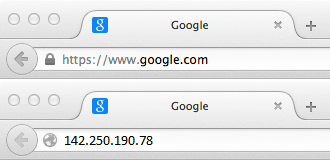
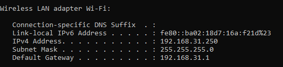
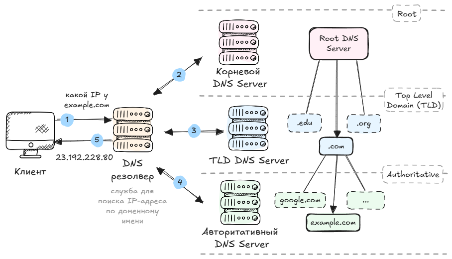
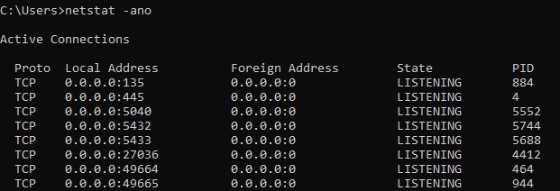
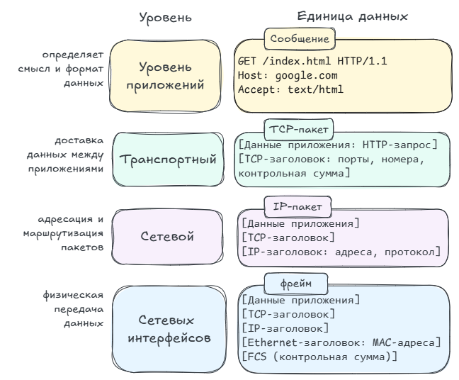
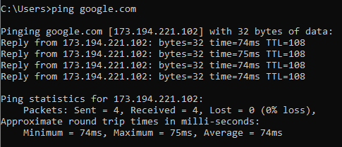
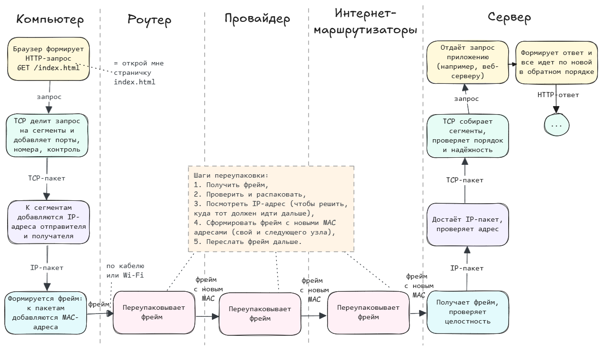

Что почитать:
- Отличное видео [Youtube. Что такое TCP/IP: Объясняем на пальцах](https://www.youtube.com/watch?v=2I1HnSN1H9o) на основе статьи [Протокол TCP/IP или как работает Интернет (для чайников)](http://www.ofnet.ru/osnovy-interneta/tcpip/). После этого становится сильно понятнее - рекомендую.
- [Skillbox. Модель TCP/IP: что это такое и как она работает](https://skillbox.ru/media/code/model-tcpip-chto-eto-takoe-i-kak-ona-rabotaet/) - тут простым языком описан принцип работы TCP/IP.
- Читать чуть посложнее, но зато есть практический пример [Хабр / Протоколы семейства TCP/IP. Теория и практика](https://habr.com/ru/companies/ruvds/articles/759988)

Полезные ссылки:
- [Что такое HTTP и зачем он нужен](https://skillbox.ru/media/code/chto-takoe-http-i-zachem-on-nuzhen/?utm_source=media&utm_medium=link&utm_campaign=all_all_media_links_links_articles_all_all_skillbox) - простым языком объясняется протокол HTTP.
- Мой конспект про [протокол HTTP](/60_networks/http/)
- Подробнее про IPv6 [Oracle / IPv6 Addressing Overview](https://docs.oracle.com/cd/E18752_01/html/816-4554/ipv6-overview-10.html)


## TCP/IP vs OSI

**TCP/IP** и **OSI** — это две модели сетевого взаимодействия, которые описывают, как данные передаются по сети, но они различаются по структуре, назначению и уровню абстракции.

**Основное отличие** в том, что модель OSI - *теоретическая* (эталонная) модель, а TCP/IP *практическая* (реализована в Интернете).

OSI помогает проектировать и понимать, TCP/IP — помогает работать.


## Немножко терминов

**TCP/IP** — это набор сетевых протоколов, который описывает, как компьютеры обмениваются данными в сети (включая Интернет).
Название состоит из двух главных протоколов:
- **TCP** (Transmission Control Protocol) — отвечает за доставку данных;
- **IP** (Internet Protocol) — отвечает за адресацию и маршрутизацию (как данные добираются до нужного компьютера). 

Например google.com имеет IP-адрес `142.250.190.78`




Простая аналогия:
- **IP** — адрес на конверте (куда отправить письмо).
- **TCP** — почтальон, который следит, чтобы письма дошли, не потерялись и пришли по порядку.


### IP-адрес

**IP-адрес** (Internet Protocol address) — это уникальный номер устройства в сети, по которому его можно найти и отправить ему данные.

Форматы IP-адресов:
- IPv4 (старый, но до сих пор основной) — Использует 4 числа от 0 до 255, разделённые точками. Например: `192.168.1.10`
- IPv6 (новый стандарт) — появился из-за нехватки адресов IPv4. Использует 8 групп шестнадцатеричных чисел, разделённых двоеточиями. Например: `2001:0db8:85a3:0000:0000:8a2e:0370:7334`

")

Обычно IP-адрес состоит из 2-х частей:
- Адрес сети — указывает, к какой сети принадлежит устройство.
- Адрес хоста/узла (host) — указывает конкретное устройство в этой сети.

Для разделения этих частей существует **маска подсети**. Маска *показывает границу* между частью IP, которая обозначает сеть, и частью, которая обозначает устройство. Благодаря ей компьютер понимает, кому можно обратиться напрямую, а кому — только через маршрутизатор.  

IP-адреса делятся на:
- Публичный (внешний) или белый. Видим в интернете, выдан провайдером, пример для google.com `142.250.190.78`
- Частный (внутренний) или серый. Используется внутри локальной сети `192.168.1.10`


**NAT** (Network Address Translation) — это технология, которая позволяет нескольким устройствам внутри одной локальной сети использовать один общий внешний IP-адрес для доступа в интернет.

**ISP** (Internet Service Provider) — это интернет-провайдер — компания, которая предоставляет доступ к интернету (в том числе назначает IP-адрес) и управляет маршрутизацией данных.

Можно посмотреть свой IP-адрес и адрес роутера через команду ipconfig





- IPv4 Address - внутренний IP устройства
- Subnet Mask (маска подсети)
- Default Gateway (основной шлюз) - IP роутера


### DNS

IP-адреса в формате цифр сложно запомнить, да и неудобно. Вместо этого мы привыкли использовать домен. Например в браузере вместо IP-адреса `142.250.190.78` мы пишем google.com.

Но как браузер понимает, какой у домена google.com IP-адрес? Для этого существует DNS.

**DNS (Domain Name System)** — это система, которая переводит доменные имена в IP-адреса, чтобы компьютеры могли находить друг друга в интернете.




DNS — это «телефонная книга» интернета.


### Порты и сокеты

Зачем нужны порты и сокеты:
- Многозадачность сети. Позволяет десяткам приложений использовать сеть одновременно (браузер, мессенджер, обновления и т.д.)
- Разделение потоков данных. TCP/UDP понимают, куда направить данные — в браузер, игру, почту и т.д.
- Определение сервиса. Клиент знает, на какой порт идти (HTTP → 80, HTTPS → 443 и т.д.)
- Идентификация соединений. Каждый сокет уникален — можно отличить конкретную сессию среди множества


**Порт** — это номер, который показывает, какое приложение на устройстве должно получить данные.

**Сокет** — это комбинация IP-адреса и порта, то есть конкретная точка подключения в сети. Позволяет операционной системе различать каждое соединение.

Пример:
```yaml
142.250.190.78:80        # <IP-адрес>:<порт> - все вместе это сокет

# 142.250.190.78 — IP сервера google.com
# 80 — порт, на котором работает веб-сервер (HTTP). Обычно не нужно указывать, заполняется по умолчанию.
```

Диапазоны портов:
- 0–1023 - Системные (зарезервированы). Примеры: 80 – HTTP, 443 – HTTPS, 25 – SMTP
- 1024–49151 - Регистрационные (для серверных приложений). Примеры: 3306 – MySQL, 8080 – альтернативный HTTP
- 49152–65535 - Динамические / временные (используются клиентами). Создаются автоматически: когда браузер отправляет запрос, ему система выделяет случайный свободный порт из верхнего диапазона — чтобы отличать соединения между вкладками, приложениями и т.д.

Сокеты можно посмотреть через командную строку:

```bash
netstat -ano
```




Команда `netstat -ano` выводит:
- Proto — протокол: TCP или UDP
- Local Address — IP и порт (локальная сторона сокета)
- Foreign Address — IP и порт удалённого узла
- State — состояние (LISTENING, ESTABLISHED, TIME_WAIT и т.п.)
- PID — идентификатор процесса (какая программа использует этот сокет)



## Уровни TCP/IP

TCP/IP работает по принципу разделения задач на уровни — каждый уровень выполняет свою роль:




Если упростить до метафоры:
- Прикладной — пишет письмо (смысл).
- Транспортный — делит на части и пронумеровывает.
- Сетевой — пишет адрес получателя.
- Канальный — кладёт в конверт и несёт до ближайшей почты.



### Прикладной уровень

**Прикладной уровень** (Application Layer) — самый верхний уровень, отвечает за взаимодействие с пользователем и приложениями.

Что делает:
- Определяет смысл данных — что именно передаётся (страница, письмо, файл и т.д.).
- Формирует сообщения в нужном формате (HTTP-запрос, письмо SMTP, DNS-запрос).
- Организует взаимодействие между приложениями на разных устройствах.
- Использует сетевые службы операционной системы (сокеты) для обмена данными.
- Работает с протоколами высокого уровня: HTTP, HTTPS, DNS, FTP, SMTP и др.

Основные протоколы:

- HTTP / HTTPS     - Передача веб-страниц                       
- FTP / SFTP       - Передача файлов                            
- SMTP, POP3, IMAP - Электронная почта                          
- DNS              - Преобразование доменов в IP-адреса         
- Telnet / SSH     - Удалённый доступ к серверам                
- SNMP            - Мониторинг и управление устройствами в сети

На выходе: сообщение, понятное приложению.

Например HTTP-запрос:

```yaml
GET /index.html HTTP/1.1
Host: example.com
User-Agent: Chrome/122.0
Accept: text/html
```

### Транспортный уровень

**Транспортный уровень** (Transport Layer) обеспечивает *доставку данных* между *приложениями*. Отвечает за целостность, порядок, поток управления и коррекцию ошибок.

Что делает:
- Делит данные приложения на сегменты и собирает их обратно.
- Обеспечивает порядок доставки — собирает сегменты в правильной последовательности.
- Создаёт соединение между отправителем и получателем (для TCP).
- Контролирует надёжность передачи (повторы, подтверждения, контроль ошибок).
- Определяет приложение на целевом устройстве (по портам).
- Регулирует скорость передачи (управление потоком, предотвращение перегрузки).
- Работает по разным типам передачи — надёжная (TCP) или быстрая (UDP).

Основные протоколы:
- TCP (Transmission Control Protocol) - надёжный, гарантирует доставку, проверяет порядок пакетов, повторно запрашивает потерянные (HTTP, SMTP).
- UDP (User Datagram Protocol) - быстрый, без подтверждения, может терять пакеты, нет гарантии доставки (музыка, видео).

На выходе: сегменты с номерами и портами:

```yaml
[TCP-заголовок]
  Source Port: 50000
  Destination Port: 80
  Sequence Number: 1
  Checksum: 0xC23F
[Данные]
  GET /index.html HTTP/1.1
  Host: example.com
```



**Checksum** (контрольная сумма) - это цифровая подпись данных, которая помогает проверить, не повредились ли они при передаче. Контрольные суммы применяются на разных уровнях:
- Ethernet (канальный)     - Проверяет, не искажён ли весь фрейм         `FCS (Frame Check Sequence)`
- IP (сетевой)             - Проверяет целостность IP-заголовка          `Header Checksum`
- TCP / UDP (транспортный) - Проверяет весь сегмент (заголовок + данные) `Checksum`



### Сетевой уровень

**Сетевой уровень** (Internet Layer) — это уровень адресации и маршрутизации, строит маршруты между устройствами по всему интернету.

Что делает:
- Определяет IP-адреса отправителя и получателя.
- Оборачивает транспортные данные (TCP/UDP) в IP-пакет.
- Маршрутизирует пакеты между сетями и выбирает путь.
- Передаёт данные от одной сети к другой (через маршрутизаторы).
- Контролирует TTL, чтобы пакеты не зацикливались.
- Обрабатывает ошибки и отправляет служебные сообщения (через ICMP).
- Определяет MAC-адрес по IP (через ARP/NDP) в локальной сети.

Основные протоколы:
- IP (Internet Protocol) - Основной протокол адресации и маршрутизации.               
- ICMP (Internet Control Message Protocol) - служебные сообщения (ошибки, ping).
- ARP / NDP (Address Resolution Protocol) - Находит MAC-адрес по IP (внутри локальной сети).
- RARP (Reverse ARP) - Находит IP по MAC-адресу (редко используется).

На выходе: IP-пакет, который может пройти через Интернет.

```yaml
[IP-заголовок]
  Source IP: 192.168.1.2
  Destination IP: 93.184.216.34
  TTL: 64
  Protocol: 6 # 6 - TCP
[Данные]
  [TCP-заголовок + HTTP-запрос]
```


**TTL (Time To Live)** — это поле в заголовке IP-пакета, которое определяет,
сколько "шагов" (hop’ов) пакет может сделать по сети, прежде чем его уничтожат.


Можно отправить пакеты командой ping в cmd:

```bash
ping google.com
```




### Канальный/Уровень сетевого доступа

**Уровень сетевого доступа** (Network Access Layer) - это самый нижний уровень. Отвечает за *физическую передачу данных* между устройствами в одной сети — по кабелю, Wi-Fi и т. д.

Что делает:
- Передаёт данные внутри одной локальной сети (например, ПК → роутер).
- Реализует физическую передачу по кабелю или Wi-Fi.
- Формирует фреймы, добавляя MAC-адреса и контрольную сумму.
- Проверяет целостность фрейма при приёме (по FCS).
- Определяет получателя по MAC-адресу.
- Переупаковывает данные при переходе между сетями (меняет MAC-заголовки).

Основные протоколы:
- Ethernet — проводная передача (LAN)
- Wi-Fi (IEEE 802.11) — беспроводная сеть
- PPP (Point-to-Point Protocol) — соединения типа «точка-точка» (например, модемы)
- ARP (Address Resolution Protocol) — сопоставляет IP-адреса и MAC-адреса
- Frame Relay, ATM — технологии каналов связи

На выходе: фрейм — готов к отправке по кабелю или Wi-Fi.

```yaml
[Ethernet-заголовок]
  Destination MAC: 00:1A:2B:3C:4D:5E  
  Source MAC: 7C:D9:5C:8E:AA:01       
  Type: IPv4
[IP-пакет]
[FCS контрольная сумма]
```

## Пример пошагово



{}

### Запрос
1. Пользователь вводит адрес сайта, например google.com.
2. Браузер обращается к DNS-серверу, чтобы узнать IP-адрес для google.com.
3. Браузер формирует запрос (HTTP) к серверу по IP-адресу, чтобы тот отправил нужную страницу.

### TCP-пакет

Далее TCP разбивает HTTP-запрос на небольшие сегменты (TCP-пакеты) и нумерует их.
Также добавляет другую информацию (порты, номера, контрольная сумма).

### IP-пакет

К сегментам (TCP-пакетам) добавляются IP-адреса отправителя и получателя.

### Фрейм (кадр)

Каждый пакет превращается в кадр (фрейм) с MAC-адресами с помощью протоколов передачи по кабелю или по беспроводной сети.

### Сигнал

Сетевая карта (NIC) превращает фрейм в сигнал (для Ethernet в эл. импульсы, Wi-Fi - в радиоволны).

Эти сигналы физически покидают компьютер и отправляются в сеть — обычно к роутеру.

### Цепочка маршрутизаторов

1. Роутер ловит сигнал и собирает обратно байты данных (тот самый фрейм). Если адрес совпадает с его — принимает, если нет — просто игнорирует.
2. Затем проверяет, всё ли пришло без ошибок (по контрольной сумме).
3. Если всё в порядке — роутер распаковывает фрейм и достаёт из него IP-пакет, чтобы решить, куда тот должен идти дальше (например, провайдеру).
4. Роутер формирует фрейм с новыми MAC адресами (свой и следующего узла) и отправляет его следующему устройству.

Этот цикл повторяется по цепочке:
Компьютер → Роутер → Провайдер → Интернет-маршрутизаторы → Сервер


IP-пакет остаётся тот же, но на каждом участке пути его «перепаковывают» в новый фрейм под конкретную сеть.


### Получение сервером

Когда фрейм доходит до сервера, то там по тому же принципу разворачиваются данные в обратном порядке:
1. Сервер получает сигнал, превращает его обратно в байты.
2. Удаляет заголовок фрейма — остаётся IP-пакет.
3. Передаёт его сетевому стеку, где по цепочке поднимается вверх: IP → TCP → HTTP → приложение.

### Ответ

После этого сервер отправляет ответ (например, код страницы HTML), который в обратном порядке приходит пользователю.

Браузер после получения всех пакетов соединяет их в единое целое и показывает готовую страницу.

{}