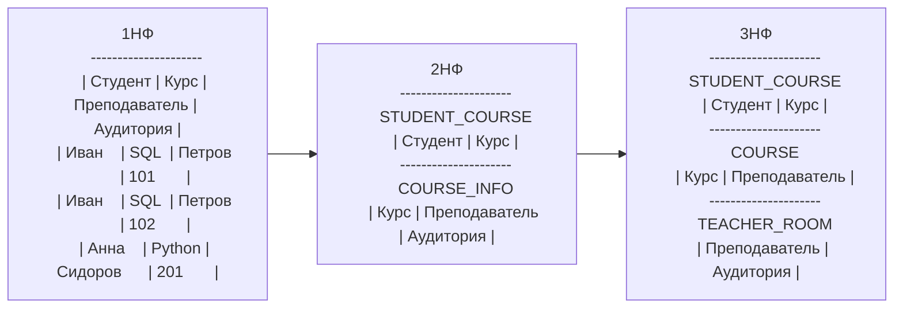

## Введение

Тут идет речь о логическом, а не физическом проектировании БД.

Что почитать:
- [ХАБР | Руководство по проектированию реляционных баз данных (1-3 часть из 15) ](https://habr.com/ru/articles/193136)
- [Хабр | Нормализация отношений. Шесть нормальных форм](https://habr.com/ru/articles/254773)

## Основное

Полный цикл разработки включает концептуальное, логическое и
физическое проектирование базы данных

## По направлению моделирования

| Тип                        | Суть                                                                           |
| -------------------------- | ------------------------------------------------------------------------------ |
| **Top-Down (нисходящий)**  | Сначала выявляются крупные сущности, затем уточняются связи и атрибуты.        |
| **Bottom-Up (восходящий)** | Сначала описываются детали (атрибуты, таблицы), потом группируются в сущности. |
| **Inside-Out**             | Начинают с "ядра" — ключевых сущностей, затем добавляют периферийные.          |


## Этапы проектирование БД


### Концептуальное
Процесс создания модели, используемой на предприятии информации, независящей от любых физических аспектов ее предприятия.


Концептуальное проектирование базы данных абсолютно не зависит от таких подробностей ее реализации, как тип выбранной целевой СУБД, набор создаваемых прикладных программ, используемые языки программирования, тип выбранной вычислительной платформы, а также от любых других особенностей физической реализации.

### Логическое

Процесс создания модели используемой на предприятии информации на основе выбранной модели организации данных, но без учета типа целевой СУБД и других физических аспектов.
реализации.

Концептуальная модель данных, созданная
на предыдущем этапе, уточняется и преобразуется в логическую модель данных.
Логическая модель данных учитывает особенности выбранной модели организа-
ции данных в целевой СУБД (например, реляционная модель).

Если концептуальная модель данных не зависит от любых физических аспек-
тов реализации, то логическая модель данных создается на основе выбранной
модели организации данных целевой СУБД. Иначе говоря, на этом этапе уже
должно быть известно, какая СУБД будет использоваться в качестве целевой -
реляционная, сетевая, иерархическая или объектно-ориентированная. Однако на
этом этапе игнорируются все остальные характеристики выбранной
СУБД, например, любые особенности физической организации ее структур хра-
нения данных и построения индексов.


Для проверки правильности логической модели данных используется метод **нормализации**.

Нормализация гарантирует, что отношения, выведенные из существующей модели данных, не будут обладать избыточностью данных, способной вызвать нарушения в процессе обновления данных после их физической реализации.

### Физическое

**Физическое проектирование БД** - процесс подготовки описания реализации БД на вторичных запоминающих устройствах; на этом этапе рассматриваются основные отношения, организация файлов и индексов, а также все связанные с этим ограничения целостности и средства защиты.

Приступая к физическому проектированию базы данных, прежде всего необходимо выбрать конкретную целевую СУБД.


## CASE-инструменты

Первый этап жизненного цикла приложения базы данных, т.е. планирование
базы данных, может также предусматривать выбор наиболее подходящих инст-
рументов автоматизированного проектирования и создания программ, которые
принято называть CASE-инструментами (Computer-Aided Software Engineering).
В самом широком смысле термин "CASE-инструмент" применим к любым сред-
ствам автоматизированного проектирования и создания программ. Подобные ин-
струменты просто необходимы АД и АБД для достижения максимальной эффек-
тивности их действий по разработке базы данных. CASE-инструменты могут
включать следующие компоненты:
• словарь данных, предназначенный для хранения информации о данных,
используемых в создаваемом приложении;
• инструменты проектирования, обеспечивающие проведение анализа данных;
• инструменты разработки корпоративной модели данных, а также концеп-
туальных и логических моделей данных;
• инструменты, позволяющие создавать прототипы приложений.

## Нормализация

Нормализация представляет собой вариант восходящего подхода
к проектированию базы данных, который начинается с установления связей ме-
жду атрибутами.

**Нормализация** - это метод создания набора отношений с заданными свойствами на основе требований к данным, установленных в некоторой организации.

**Функциональная зависимость.** Описывает связь между атрибутами отноше-
ния. Например» если в отношении R, содержащем атрибуты А и В, атрибут в
функционально зависит от атрибута А (что обозначается как А {В)), то каждое
значение атрибута А связано только с од«им значением атрибутав. (Причем ат-
. рибуты лив могут состоять из одного или нескольких атрибутов.)


**Детерминант.** Детерминантом функциональной зависимости называется атри-
бут или группа атрибутов, расположенная на диаграмме функциональной зави-
симости слева от стрелки.

**Ненормализованная форма (ННФ)** - таблица, содержащая одну или несколько
повторяющихся групп данных.

Нормальные формы (НФ) — это правила организации таблиц в реляционной базе данных, которые помогают:
- устранить дублирование данных,
- избежать аномалий при вставке, обновлении и удалении,
- обеспечить логическую целостность данных.

**Краткая таблица сравнения:**

| Нормальная форма | Что устраняет                 | Основное требование                   |
| ---------------- | ----------------------------- | ------------------------------------- |
| **1НФ**          | Неатомарные значения          | Каждое поле — одно значение           |
| **2НФ**          | Частичные зависимости         | Все атрибуты зависят от *всего* ключа |
| **3НФ**          | Транзитивные зависимости      | Наличие зависимостей только от ключа  |
| **BCNF**         | Сложные аномалии зависимостей | Любой детерминант — суперкюч          |


### Первая нормальная форма (1НФ)

**Первая нормальная форма (1НФ).** Отношение, в котором на пересечении каждой строки и каждого столбца содержится одно и только одно значение.

Определение:
Таблица находится в 1НФ, если:
- все поля атомарны (одно значение в одной ячейке);
- отсутствуют повторяющиеся группы или массивы.

Цель: сделать каждое поле элементарным.

Пример нарушения:
| ID | Имя  | Телефоны             |
| -- | ---- | -------------------- |
| 1  | Иван | 111-22-33, 222-33-44 |

Как исправить (1НФ):
| ID | Имя  | Телефон   |
| -- | ---- | --------- |
| 1  | Иван | 111-22-33 |
| 1  | Иван | 222-33-44 |

### Вторая нормальная форма (2НФ)

Таблица находится во 2НФ, если:
- Таблица уже в 1НФ;
- Все неключевые атрибуты зависят от всего первичного ключа, а не от части составного.

Цель: убрать частичные зависимости от составного ключа.

Пример нарушения:
| (StudentID, CourseID) | StudentName | CourseName |
| --------------------- | ----------- | ---------- |
| 1,10                  | Иван        | SQL        |
| 1,20                  | Иван        | Python     |

Исправление (2НФ):
- Таблица Students(StudentID, StudentName)
- Таблица Courses(CourseID, CourseName)
- Таблица Enrollments(StudentID, CourseID)

### 3НФ

Таблица находится в 3НФ, если:
- Таблица уже в 2НФ;
- Нет транзитивных зависимостей — неключевые поля зависят только от ключа, а не от других неключевых полей.

Цель: убрать зависимость неключевых полей друг от друга.

Пример нарушения (`DeptHead` зависит не от `StudentID`, а от `Department`):
| StudentID | StudentName | Department | DeptHead |
| --------- | ----------- | ---------- | -------- |
| 1         | Иван        | ИТ         | Петров   |

Исправление (3НФ):
- Таблица Students(StudentID, StudentName, Department)
- Таблица Departments(Department, DeptHead)


### Нормальная форма Бойса — Кодда (НФБК)

Таблица находится в НФБК, если:
- Таблица находится в 3НФ;
- Для каждой функциональной зависимости `X → Y`, `X` должно быть суперкючом.

Цель: устранить зависимости, где детерминант не ключевой. Используется, когда даже 3НФ не устраняет все аномалии.

Пример нарушения:
| Course | Teacher | Room |
| ------ | ------- | ---- |
| SQL    | Иванов  | 101  |
| Python | Сидоров | 102  |
| SQL    | Иванов  | 103  |


Исправление (НФБК):
- Таблица Teachers(Teacher, Course)
- Таблица Courses(Course, Room)

### Пример нормализации

Разберем на примере ННФ:

| Студент | Курс   | Преподаватель | Аудитории |
| ------- | ------ | ------------- | --------- |
| Иван    | SQL    | Петров        | 101, 102  |
| Анна    | Python | Сидоров       | 201       |
| Иван    | Python | Сидоров       | 201       |


{}

### 1НФ

Разбиваем неатомарные значения на отдельные строки.

| Студент | Курс   | Преподаватель | Аудитория |
| ------- | ------ | ------------- | --------- |
| Иван    | SQL    | Петров        | 101       |
| Иван    | SQL    | Петров        | 102       |
| Анна    | Python | Сидоров       | 201       |
| Иван    | Python | Сидоров       | 201       |

Достигли: атомарности значений.
Осталась проблема: много повторов, зависимости между неключевыми полями.

### 2НФ

В 1НФ, но есть частичная зависимость — например, Преподаватель и Аудитория зависят от Курс, а не от всего составного ключа (Студент, Курс).

Разделим таблицу:

Таблица STUDENT_COURSE:
| Студент | Курс   |
| ------- | ------ |
| Иван    | SQL    |
| Иван    | Python |
| Анна    | Python |

Таблица COURSE_INFO:
| Курс   | Преподаватель | Аудитория |
| ------ | ------------- | --------- |
| SQL    | Петров        | 101       |
| SQL    | Петров        | 102       |
| Python | Сидоров       | 201       |

Достигли: устранены частичные зависимости.
Осталась проблема: транзитивная зависимость — аудитория зависит от преподавателя, а не только от курса.

### 3НФ

Убираем транзитивную зависимость (Курс → Преподаватель → Аудитория).

Теперь три таблицы:

Таблица STUDENT_COURSE:
| Студент | Курс   |
| ------- | ------ |
| Иван    | SQL    |
| Иван    | Python |
| Анна    | Python |

Таблица COURSE:
| Курс   | Преподаватель |
| ------ | ------------- |
| SQL    | Петров        |
| Python | Сидоров       |

TEACHER_ROOM
| Преподаватель | Аудитория |
| ------------- | --------- |
| Петров        | 101       |
| Петров        | 102       |
| Сидоров       | 201       |

Достигли:
— все неключевые поля зависят только от ключей;
— транзитивных зависимостей нет.

{}

fff



```kroki {_type=plantuml }
@startuml
left to right direction
skinparam linetype ortho
skinparam packageStyle rect
skinparam class {
  BackgroundColor White
  BorderColor Black
}
hide circle

' ===== 1NF =====
package "1НФ" #F7F7F7 {
  class Enrollment <<1NF>> {
    + Student
    + Course
    + Teacher
    + Room
  }
}

' ===== 2NF =====
package "2НФ" #F2FBFF {
  class StudentCourse <<2NF>> {
    + Student
    + Course
  }
  class CourseInfo <<2NF>> {
    + Course
    + Teacher
    + Room
  }

  ' Связи в 2НФ
  StudentCourse "N" --> "1" CourseInfo : by Course
}

' ===== 3NF =====
package "3НФ" #F3FFF2 {
  class StudentCourse3 <<3NF>> {
    + Student
    + Course
  }
  class Course3 <<3NF>> {
    + Course
    + Teacher
  }
  class TeacherRoom <<3NF>> {
    + Teacher
    + Room
  }

  ' Связи в 3НФ
  StudentCourse3 "N" --> "1" Course3 : by Course
  Course3 "1" --> "N" TeacherRoom : by Teacher
}

' ===== Переходы (трансформации) =====
Enrollment ..> StudentCourse : «нормализация к 2НФ»
Enrollment ..> CourseInfo : «нормализация к 2НФ»

StudentCourse ..> StudentCourse3 : «к 3НФ»
CourseInfo ..> Course3 : «к 3НФ (убираем транзитивность)»
CourseInfo ..> TeacherRoom : «к 3НФ (Teacher→Room)»
@enduml
```