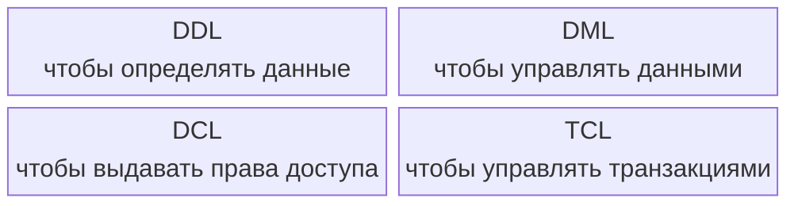
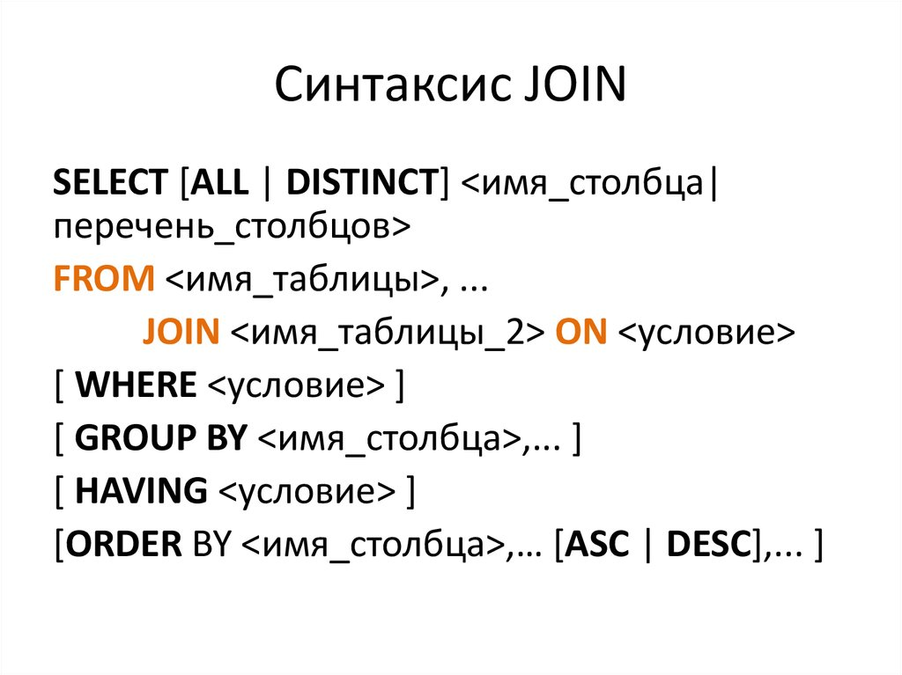
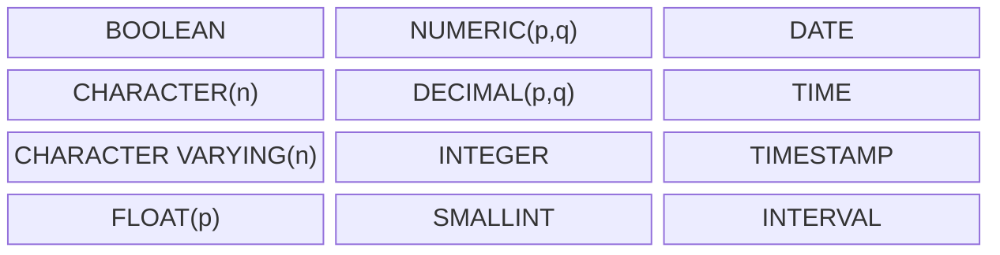

## Введение

Основы реляционной модели и вывела в отдельную главу, тут в основном информация про синтаксис и порядки SQL (на примере PostgreSQL).

Полезные ссылки:

- Вся основная информация по SQL [Памятка/шпаргалка по SQL / Habr](https://habr.com/ru/articles/564390)
- Примеры запросов для практики [SQL. Занимательные задачки / Хабр](https://habr.com/ru/articles/461567)
- Документация PostgreSQL https://www.postgresql.org/docs/current/ 
- Тут понятным языком в формате уроков с упражнениями [SQL Academy: SQL Интерактивный курс по SQL](https://sql-academy.org/ru/guide)
- https://ensi-platform.gitlab.io/analyst-guides/tools/sql 

## Немного терминологии

SQL оперирует **таблицами**, которые являются частичной и неточной реализацией отношений реляционной модели.
Главные отличия таблиц от отношений:
- Таблицы могут содержать дубликаты строк (не множество, а мультисет).
- Таблицы допускают NULL.
- Таблицы имеют порядок столбцов и, иногда, видимый порядок строк.

Выражение (expression) — это синтаксическая конструкция, вычисляемая до значения.
Оно возвращает результат (число, строку, отношение и т. д.), но не изменяет состояние базы данных.

Предложение (statement) — конструкция, которая выполняет действие: изменяет данные, определяет объекты, управляет транзакцией.
Она не возвращает значение как результат выражения.

**Селектор (selector)** — это предопределённая операция, позволяющая выбрать или извлечь значение определённого типа из его внутренней структуры или контекста.
Пример: для типа DATE селекторами могут быть `YEAR()`, `MONTH()`, `DAY()`, возвращающие отдельные компоненты даты.
Селекторы определяются как часть определения типа.

**Литерал (literal)** — это конкретная запись, обозначающая одно фиксированное значение данного типа.
Например:
- 'London' — литерал типа `CHAR(6)`
- 25 — литерал типа `INTEGER`
- DATE '2025-01-01' — литерал типа `DATE`.


Внешний ключ — логическая зависимость между отношениями, обеспечивающая ссылочную целостность.
Указатель (pointer) — физический механизм, используемый в памяти или на диске для прямого доступа к объекту.
Реляционная модель исключает указатели, потому что она оперирует значениями, а не местами хранения.

Различие:
Внешний ключ выражает логическое соответствие значений,
указатель — физическую ссылку в структуре хранения.
Реляционная модель не использует указатели — только значения.

## Виды запросов

SQL-команды делятся на группы:
- DDL (Data Definition Language) — язык определения данных
- DML (Data Manipulation Language) — язык манипулирования данными
- DCL (Data Control Language) — язык управления доступом
- TCL (Transaction Control Language) — язык управления транзакциями



**DDL**

| Команда    | Назначение                                            | Пример                                           |
| ---------- | ----------------------------------------------------- | ------------------------------------------------ |
| `CREATE`   | Создаёт объекты (таблицы, базы, представления и т.д.) | `CREATE TABLE users (id INT, name VARCHAR(50));` |
| `ALTER`    | Изменяет структуру существующего объекта              | `ALTER TABLE users ADD COLUMN age INT;`          |
| `DROP`     | Удаляет объект                                        | `DROP TABLE users;`                              |
| `TRUNCATE` | Удаляет все данные из таблицы, но оставляет структуру | `TRUNCATE TABLE users;`                          |
| `RENAME`   | Переименовывает объект                                | `ALTER TABLE users RENAME TO clients;`           |

> [!NOTE]
> DDL-команды автоматически фиксируются (autocommit) — отменить через `ROLLBACK` нельзя.

**DML**

| Команда  | Назначение                                        | Пример                                             |
| -------- | ------------------------------------------------- | -------------------------------------------------- |
| `SELECT` | Запрос данных из таблиц                           | `SELECT name, age FROM users WHERE age > 25;` |
| `INSERT` | Вставка данных                                    | `INSERT INTO users (id, name) VALUES (1, 'Alex');` |
| `UPDATE` | Обновление данных                                 | `UPDATE users SET name = 'John' WHERE id = 1;`     |
| `DELETE` | Удаление данных                                   | `DELETE FROM users WHERE id = 1;`                  |
| `MERGE`  | Объединяет `INSERT` и `UPDATE` (в некоторых СУБД) | `MERGE INTO users USING temp_users ON ...`         |

> [!NOTE]
> DML-команды можно отменить или зафиксировать через `ROLLBACK` / `COMMIT`.

**DCL**

| Команда  | Назначение      | Пример                                      |
| -------- | --------------- | ------------------------------------------- |
| `GRANT`  | Назначает права | `GRANT SELECT, INSERT ON users TO analyst;` |
| `REVOKE` | Отзывает права  | `REVOKE INSERT ON users FROM analyst;`      |

**TCL**

| Команда                       | Назначение                              | Пример                   |
| ----------------------------- | --------------------------------------- | ------------------------ |
| `BEGIN` / `START TRANSACTION` | Начало транзакции                       | `BEGIN;`                 |
| `COMMIT`                      | Подтверждение изменений                 | `COMMIT;`                |
| `ROLLBACK`                    | Отмена изменений                        | `ROLLBACK;`              |
| `SAVEPOINT`                   | Создание точки отката внутри транзакции | `SAVEPOINT sp1;`         |
| `RELEASE SAVEPOINT`           | Удаляет точку сохранения                | `RELEASE SAVEPOINT sp1;` |


## Как получить данные?
Вместе они выглядят так:

- `SELECT` — выбирает отдельные столбцы или всю таблицу целиком (обязательный);
- `FROM` — из какой таблицы получить данные (обязательный);
- `WHERE` — условие, по которому SQL выбирает данные;
- `GROUP BY` — столбец, по которому мы будут группироваться данные;
- `HAVING` — условие, по которому сгруппированные данные будут отфильтрованы;
- `ORDER BY` — столбец, по которому данные будут отсортированы;




### SELECT FROM
тутутут

#### Ограничение выборки (LIMIT)

Оператор `LIMIT` позволяет извлечь определённый диапазон записей из одной или нескольких таблиц.

```sql
SELECT поля_выборки
FROM список_таблиц
LIMIT количество_записей_для_вывода [OFFSET количество_пропущенных_записей];
```

```sql
-- вывести строки с 3 по 5
SELECT * FROM Company LIMIT 3 OFFSET 2;
```

#### Исключение дубликатов, DISTINCT

```sql
SELECT [DISTINCT] поля_таблиц FROM наименование_таблицы;

SELECT DISTINCT class FROM Student_in_class;
```

### JOIN ON
Очень часто приходится делать выборку из нескольких таблиц, каким-то образом объединяя их. В данной статье вы узнаете основные способы соединения таблиц.

```sql
SELECT поля_таблиц
FROM таблица_1
[INNER] | [[LEFT | RIGHT | FULL][OUTER]] JOIN таблица_2
    ON условие_соединения
[[INNER] | [[LEFT | RIGHT | FULL][OUTER]] JOIN таблица_n
    ON условие_соединения]
```

Виды объединений:
- внутренним `INNER` (по умолчанию)
- внешним `OUTER`, при этом внешнее соединение делится на левое `LEFT`, правое `RIGHT` и полное `FULL`

Примеры:
```sql
-- вывести все столбцы связанной таблицы
SELECT FamilyMembers.* FROM Payments
INNER JOIN FamilyMembers
    ON Payments.family_member = FamilyMembers.member_id

```

### WHERE
Предложение `WHERE` используется для фильтрации возвращаемых данных. Оно используется совместно с SELECT, UPDATE, DELETE и другими инструкциями.

```sql
SELECT * FROM Student
WHERE first_name = 'Grigorij' AND EXTRACT(YEAR FROM birthday) > 2000;
```

> [!note]
> Результатом сравнения любого значения с NULL является NULL.


Приоритет логических операторов:
- Сначала — NOT
- Затем — AND
- Потом — XOR
- В конце — OR

#### IS NULL, BETWEEN, IN, LIKE

```sql
-- 0. Операторы
SELECT 90000 > 100000;
SELECT 90000 <= 100000;
SELECT 90000 = 100000;
SELECT 90000 <> 100000; -- или !=

-- 1. IS NULL и IS NOT NULL
SELECT * FROM Teacher WHERE middle_name IS NULL;
SELECT * FROM Teacher WHERE middle_name IS NOT NULL;

-- 2. BETWEEN ... AND ...
SELECT * FROM Payments WHERE unit_price BETWEEN 100 AND 500; -- field >= min AND field <= max

-- 3. IN (...)
SELECT * FROM FamilyMembers WHERE status IN ('father', 'mother');

-- 4. LIKE 
SELECT * FROM Users WHERE email LIKE '%@hotmail.%'; -- % - это последовательность любых символов (от 0 и более)
SELECT * FROM Users WHERE lastname LIKE 'Иванов_'; -- _ - это любой единичный символ
-- 4.1 Найти задачи с прогрессом = 3% (экранирование символа %)
SELECT * FROM Tasks WHERE progress LIKE '3!%' ESCAPE '!'; -- ESCAPE-символ используется для экранирования специальных символов (% и _)
```

> [!note]
> В PostgreSQL шаблоны чувствительны к регистру. Для поиска без учета регистра используйте оператор `ILIKE`

#### Регулярные выражения
Операторы `~` и `~*` в PostgreSQL используются для поиска и обработки строковых данных с помощью регулярных выражений.

Регулярные выражения предоставляют мощные возможности для сложных шаблонов поиска, которые трудно реализовать с помощью оператора `LIKE`.

https://sql-academy.org/ru/guide/operator-regexp

```sql
... WHERE table_field ~ 'pattern';   -- с учетом регистра
... WHERE table_field ~* 'pattern';  -- без учета регистра
```

```sql
-- Выведем все школьные предметы, название которых оканчивается на букву «e» или «y»:
SELECT * FROM  Subject WHERE name ~ '[ey]$'

-- Найдём всех пользователей, чей адрес электронной почты oканчивается на «@outlook.com» или на «@icloud.com»:
SELECT * FROM Users WHERE email ~ '@(outlook\.com|icloud\.com)$'

-- Найдём всех пользователей, чей номер телефона не содержит цифр «2» и «8»
SELECT * FROM Users WHERE phone_number ~ '^[^28]*$'

-- Найдём всех пользователей, чей номер телефона начинается на «+7»
SELECT name, phone_number FROM Users WHERE phone_number ~ '^\+7'
```

### GROUP BY 

```sql
SELECT [литералы, агрегатные_функции, поля_группировки]
FROM имя_таблицы
GROUP BY поля_группировки;
```

```sql
-- группы по типу жилья:
SELECT home_type FROM Rooms GROUP BY home_type
```

> [!note]
> При группировке по полю, содержащему `NULL`, все такие строки попадут в одну группу

#### Агрегатные функции

| Функция | Описание |
|--|--|
| SUM(поле_таблицы)	| Возвращает сумму значений |
| AVG(поле_таблицы)	| Возвращает среднее значение |
| COUNT(поле_таблицы)	| Возвращает количество записей |
| MIN(поле_таблицы)	| Возвращает минимальное значение |
| MAX(поле_таблицы)	| Возвращает максимальное значение |

> [!note]
> Агрегатные функции применяются для значений, не равных `NULL`. Исключением является функция `COUNT(*)`.

Синтаксис:

```sql
SELECT [литералы, агрегатные_функции, поля_группировки]
FROM имя_таблицы
GROUP BY поля_группировки;
```

Примеры:

```sql
-- Найдём количество каждого вида жилья
SELECT home_type, COUNT(*) as amount FROM Rooms
GROUP BY home_type;

-- Средняя стоимость каждого вида жилья
SELECT home_type, AVG(price) as avg_price FROM Rooms
GROUP BY home_type;

-- Для каждого жилого помещения найдём самую позднюю дату выезда
SELECT room_id, MAX(end_date) AS last_end_date FROM Reservations
GROUP BY room_id;
```

### HAVING

Используется для фильтрации групп `GROUP BY`.

```sql
SELECT [константы, агрегатные_функции, поля_группировки]
FROM имя_таблицы
WHERE условия_на_ограничения_строк
GROUP BY поля_группировки
HAVING условие_на_ограничение_строк_после_группировки
ORDER BY условие_сортировки
```

Примеры:

```sql
-- Найдём количество каждого вида жилья с условием, что количество превышает 5шт.
SELECT home_type, COUNT(*) as amount FROM Rooms
GROUP BY home_type
HAVING COUNT(*) > 5;

-- Средняя стоимость каждого вида жилья до 30к 
SELECT home_type, AVG(price) as avg_price FROM Rooms
GROUP BY home_type
HAVING AVG(price) <= 30000;

-- Получим минимальную стоимость каждого типа жилья c телевизором. При этом нас интересуют только типы жилья, содержащие как минимум 5 жилых помещений, относящихся к ним
SELECT home_type, MIN(price) as min_price FROM Rooms
WHERE has_tv = True
GROUP BY home_type
HAVING COUNT(*) >= 5;
```

### ORDER BY

Для упорядочивания записей используется конструкция `ORDER BY`.

```sql
SELECT поля_таблиц FROM наименование_таблицы
WHERE ...
ORDER BY столбец_1 [ASC | DESC][, столбец_n [ASC | DESC]]
```

Где ASC и DESC - направление сортировки:
- ASC - сортировка по возрастанию (по умолчанию)
- DESC - сортировка по убыванию

```sql
SELECT name FROM Company ORDER BY name;
```

Для сортировки результатов по двум или более столбцам их следует указывать через запятую.

```sql
SELECT DISTINCT town_from, town_to FROM Trip
ORDER BY town_from, town_to DESC;
```


## Позапросы и обобщенные табличные выражения

### Подзапросы

**Подзапрос** — это выражение SELECT, вложенное в другое SQL-выражение (обычно в `WHERE`, `FROM` или `HAVING`). Обычно выполняется перед основным запросом.


- С помощью оператора `ALL` мы можем сравнивать отдельное значение с каждым значением в наборе, полученным подзапросом. При этом данное условие вернёт TRUE, только если все сравнения отдельного значения со значениями в наборе вернут TRUE.
- Оператор `IN` проверяет входит ли конкретное значение в набор значений. В качестве такого набора как раз может использоваться подзапрос, возвращающий несколько строк с одним столбцом.
- Условное выражение с `ANY` имеет схожее поведение, но оно возвращает TRUE, если хотя бы одно сравнение отдельного значения со значением в наборе вернёт TRUE.

Пример:

```sql
SELECT (SELECT name FROM company LIMIT 1) AS company_name;

-- Получим список всех бронирований самого дорогого на данный момент жилого помещения
SELECT * FROM Reservations
    WHERE Reservations.room_id = (
        SELECT id FROM Rooms ORDER BY price DESC LIMIT 1
    );

-- 2. ALL
-- для всех ли жилых помещений выполняется условие, что оно дешевле чем 200
SELECT 200 > ALL(SELECT price FROM Rooms);

-- найти имена всех владельцев жилья, которые сами при этом никогда не снимали жилье
SELECT DISTINCT name FROM Users INNER JOIN Rooms
    ON Users.id = Rooms.owner_id
    WHERE Users.id <> ALL (
        SELECT DISTINCT user_id FROM Reservations
    );

-- получить всю информацию о владельцах жилья стоимостью больше 150 условных единиц
SELECT * FROM Users WHERE id IN (
    SELECT DISTINCT owner_id FROM Rooms WHERE price >= 150
);

-- найдём пользователей, которые владеют хотя бы 1 жилым помещением стоимостью более 150.
SELECT * FROM Users WHERE id = ANY (
    SELECT DISTINCT owner_id FROM Rooms WHERE price >= 150
);
```

Выведите названия товаров, которые ещё ни разу не покупались:
```sql
SELECT good_name
FROM Goods
WHERE good_id NOT IN (
    SELECT good
    FROM Payments
);

-- тот же результат через join
SELECT g.good_name
FROM Goods g
LEFT JOIN Payments p ON g.good_id = p.good
WHERE p.good IS NULL;
```

#### Многостолбцовые запросы

```sql
SELECT * FROM Reservations
WHERE (room_id, price) IN (SELECT id, price FROM Rooms);

-- Тот же результат через JOIN
SELECT Reservations.* FROM Reservations
INNER JOIN Rooms
ON Reservations.room_id = Rooms.id
WHERE Reservations.price = Rooms.price;
```

```sql
-- Выведите список комнат (все поля, таблица Rooms), которые по своим удобствам (has_tv, has_internet, has_kitchen, has_air_con) совпадают с комнатой с идентификатором "11".
SELECT *
FROM Rooms
WHERE (has_tv, has_internet, has_kitchen, has_air_con) IN (
		SELECT has_tv,
			has_internet,
			has_kitchen,
			has_air_con
		FROM Rooms
		WHERE id = 11
	);
```

#### Коррелированные подзапросы

Все предыдущие рассматриваемые подзапросы были некоррелированные (независимые). Они могли выполняться автономно от основного запроса и мы могли посмотреть, что они возвращают перед тем, как их результат будет использоваться в основном запросе. Коррелированные же подзапросы ссылаются на один или несколько столбцов основного запроса.

Примеры:
```sql
-- вывести имя и сумму покупок
SELECT FamilyMembers.member_name, (
    SELECT SUM(Payments.unit_price * Payments.amount)
    FROM Payments
    WHERE Payments.family_member = FamilyMembers.member_id
) AS total_spent
FROM FamilyMembers;

-- Вывести имена и цену их самого дорогого купленного товара
SELECT FamilyMembers.member_name,
	(
		SELECT MAX(Payments.unit_price)
		FROM Payments
		WHERE Payments.family_member = FamilyMembers.member_id
	) AS good_price
FROM FamilyMembers;
```

> [!note]
> Следует обратить внимание на то, что использование коррелированных подзапросов может вызвать проблемы с производительностью, особенно если содержащий запрос возвращает много строк, так как коррелированный подзапрос будет выполняться для каждой строки содержащего запроса отдельно.


### Обобщённые табличные выражения WITH

Обобщённое табличное выражение или CTE (Common Table Expressions) - это временный результирующий набор данных, к которому можно обращаться в последующих запросах. Для написания обобщённого табличного выражения используется оператор `WITH`.

Синтаксис:
```sql
WITH название_cte [(столбец_1 [, столбец_2 ] …)] AS (подзапрос)
    [, название_cte [(столбец_1 [, столбец_2 ] …)] AS (подзапрос)] …
```

> [!note]
> Выражение с WITH считается «временным», потому что результат не сохраняется где-либо на постоянной основе в схеме базы данных, а действует как временное представление, которое существует только на время выполнения запроса

```sql
-- Создаём табличное выражение Aeroflot_trips, содержащее все полёты, совершенные авиакомпанией «Aeroflot»
WITH Aeroflot_trips AS
    (SELECT plane, town_from, town_to FROM Company
        INNER JOIN Trip ON Trip.company = Company.id WHERE name = 'Aeroflot')

SELECT * FROM Aeroflot_trips;

-- то же выражение Aeroflot_trips, но с переименованными колонками
WITH Aeroflot_trips (aeroflot_plane, town_from, town_to) AS
    (SELECT plane, town_from, town_to FROM Company
        INNER JOIN Trip ON Trip.company = Company.id WHERE name = 'Aeroflot')

SELECT * FROM Aeroflot_trips;

-- несколько табличных выражений
WITH Aeroflot_trips AS
    (SELECT TRIP.* FROM Company
        INNER JOIN Trip ON Trip.company = Company.id WHERE name = 'Aeroflot'),
    Don_avia_trips AS
    (SELECT TRIP.* FROM Company
        INNER JOIN Trip ON Trip.company = Company.id WHERE name = 'Don_avia')

SELECT * FROM Don_avia_trips UNION SELECT * FROM  Aeroflot_trips;
```

#### Работа с рекурсией в CTE
CTE также могут быть использованы для выполнения рекурсивных запросов, которые позволяют итеративно обрабатывать данные, например, для работы с иерархическими структурами данных, такими как «руководитель — подчинённый».

Рекурсивное CTE состоит из двух частей, разделенных оператором `UNION ALL`:
- Начальный набор данных, который не содержит рекурсивных ссылок.
- Рекурсивная часть: запрос, который ссылается на CTE, чтобы продолжить рекурсию.

```sql
WITH RECURSIVE название_cte (столбец_1, столбец_2, ...) AS (
    -- Начальный набор данных
    SELECT столбец_1, столбец_2, ...
    FROM таблица
    WHERE условие

    UNION ALL

    -- Рекурсивная часть
    SELECT столбец_1, столбец_2, ...
    FROM название_cte
    INNER JOIN таблица ON название_cte.столбец = таблица.столбец
    WHERE условие
)

SELECT * FROM название_cte;
```

Пример: иерархия руководителей и подчинённых

```sql
WITH RECURSIVE Subordinates AS (
    -- Начальный набор данных
    SELECT id, name, managerId
    FROM Employees
    WHERE managerId = 1

    UNION ALL

    -- Рекурсивная часть: подчинённые подчинённых
    SELECT e.id, e.name, e.managerId
    FROM Employees e
    INNER JOIN Subordinates s ON e.managerId = s.id
)

SELECT * FROM Subordinates;
```

### Объединение запросов, оператор Union

https://sql-academy.org/ru/guide/combining-queries

Результаты выполнения SQL запросов можно объединять. Для этого существует оператор `UNION`.

Структура:
```sql
SELECT поля_таблиц FROM список_таблиц ...
UNION [ALL]
SELECT поля_таблиц FROM список_таблиц ... ;
```


```sql
-- Выведите полные имена всех студентов и преподавателей.
SELECT Student.first_name,
	Student.middle_name,
	Student.last_name
FROM Student
UNION
SELECT Teacher.first_name,
	Teacher.middle_name,
	Teacher.last_name
FROM Teacher
```


## Работа с типами данных

Скалярные типы SQL:



| Тип данных                    | Описание                                                                | От                         | До                        |
| ----------------------------- | ----------------------------------------------------------------------- | -------------------------- | ------------------------- |
| SMALLINT                      | Целое число малого диапазона (2 байта)                                  | -32 768                    | 32 767                    |
| INTEGER (INT)                 | Целое число стандартного диапазона (4 байта)                            | -2 147 483 648             | 2 147 483 647             |
| BIGINT                        | Целое число большого диапазона (8 байт)                                 | -9 223 372 036 854 775 808 | 9 223 372 036 854 775 807 |
| DECIMAL(p,s), NUMERIC(p,s)    | Точное число с фиксированной точкой (p — всего цифр, s — после запятой) | зависит от p               | зависит от p              |
| REAL                          | Приближённое число с плавающей точкой (4 байта)                         | 6 знаков точности          |                           |
| DOUBLE PRECISION              | Приближённое число с плавающей точкой (8 байт)                          | 15 знаков точности         |                           |
| CHAR(n)                       | Строка фиксированной длины                                              | 1 символ                   | n символов                |
| VARCHAR(n)                    | Строка переменной длины                                                 | 0 символов                 | n символов                |
| TEXT                          | Строка произвольной длины                                               | 0 символов                 | ограничено памятью        |
| DATE                          | Календарная дата                                                        | 4713 г. до н.э.            | 5874897 г. н.э.           |
| TIME [WITHOUT TIME ZONE]      | Время суток без часового пояса                                          | 00:00:00                   | 24:00:00                  |
| TIME WITH TIME ZONE           | Время с часовым поясом                                                  | 00:00:00+00                | 24:00:00+12               |
| TIMESTAMP [WITHOUT TIME ZONE] | Дата и время без пояса                                                  | 4713 г. до н.э.            | 294276 г. н.э.            |
| TIMESTAMP WITH TIME ZONE      | Дата и время с поясом                                                   | 4713 г. до н.э.            | 294276 г. н.э.            |
| BOOLEAN                       | Логический тип (истина/ложь)                                            | TRUE                       | FALSE                     |
| BYTEA                         | Двоичные данные (binary array)                                          | —                          | —                         |
| JSON / JSONB                  | Хранение данных в формате JSON                                          | —                          | —                         |
| UUID                          | Универсальный уникальный идентификатор                                  | —                          | —                         |
| SERIAL                        | Автоинкрементное целое (эквивалент INT + SEQUENCE)                      | 1                          | 2 147 483 647             |
| BIGSERIAL                     | Автоинкрементное большое целое (эквивалент BIGINT + SEQUENCE)           | 1                          | 9 223 372 036 854 775 807 |


### Строки

Несколько встроенных функций для работы со строками:

- LENGTH — возвращает количество символов в строке
- CONCAT — объединение строк
- TRIM — удаляет пробелы в начале и конце строки
- LTRIM — удаляет ведущие пробелы из строки.
- SUBSTRING — извлекает подстроку из строки
- REPLACE — заменяет подстроку в строке
- LOWER — переводит символы строки в нижний регистр
- UPPER — переводит символы строки в верхний регистр
- POSITION — поиск подстроки в строке, возвращая позицию её первого символа `POSITION('academy' IN 'sql-academy')` -> 5

```sql
-- Вывеcти пассажиров с самым длинным ФИО
SELECT full_name
FROM passengers
WHERE LENGTH(full_name) = (
    SELECT MAX(LENGTH(full_name))
    FROM passengers
);
```


---

### Дата и время

**Основные типы данных**
| Тип                                        | Назначение                     | Пример значения            |
| ------------------------------------------ | ------------------------------ | -------------------------- |
| `DATE`                                     | Только дата (год, месяц, день) | `'2025-10-25'`             |
| `TIME`                                     | Время без даты                 | `'14:30:00'`               |
| `TIME WITH TIME ZONE` (`TIMETZ`)           | Время с часовым поясом         | `'14:30:00+03'`            |
| `TIMESTAMP`                                | Дата и время без пояса         | `'2025-10-25 14:30:00'`    |
| `TIMESTAMP WITH TIME ZONE` (`TIMESTAMPTZ`) | Дата и время с часовым поясом  | `'2025-10-25 14:30:00+03'` |
| `INTERVAL`                                 | Промежуток времени             | `'3 days 04:05:06'`        |

Замечание:
В PostgreSQL часовой пояс не хранится в самом значении TIMESTAMPTZ, но при вводе и выводе применяется конвертация относительно текущей сессии.

**Основные функции и выражения**
| Функция / выражение            | Описание                                           | Пример                                                 |
| ------------------------------ | -------------------------------------------------- | ------------------------------------------------------ |
| `CURRENT_DATE`                 | Текущая дата (тип `DATE`)                          | `SELECT CURRENT_DATE;` → `2025-10-25`                  |
| `CURRENT_TIME`                 | Текущее время                                      | `SELECT CURRENT_TIME;` → `14:32:00.123456+03`          |
| `CURRENT_TIMESTAMP` / `NOW()`  | Текущие дата и время                               | `SELECT NOW();` → `2025-10-25 14:32:00.123456+03`      |
| `LOCALTIMESTAMP`               | Дата и время без пояса                             | `SELECT LOCALTIMESTAMP;`                               |
| `EXTRACT(field FROM source)`   | Извлекает часть даты/времени                       | `SELECT EXTRACT(YEAR FROM NOW());` → `2025`            |
| `DATE_PART('field', source)`   | Аналог `EXTRACT`                                   | `SELECT DATE_PART('hour', NOW());` → `14`              |
| `AGE(timestamp [, timestamp])` | Разница как интервал                               | `SELECT AGE('2025-10-25', '2000-10-25');` → `25 years` |
| `JUSTIFY_INTERVAL(interval)`   | Нормализует интервал (например, 30 дней = 1 месяц) | `SELECT JUSTIFY_INTERVAL('30 days');`                  |
| `MAKE_DATE(y, m, d)`           | Собирает дату из чисел                             | `SELECT MAKE_DATE(2025,10,25);`                        |
| `MAKE_TIME(h, m, s)`           | Собирает время                                     | `SELECT MAKE_TIME(14,30,0);`                           |
| `MAKE_TIMESTAMP(y,m,d,h,m,s)`  | Собирает timestamp                                 | `SELECT MAKE_TIMESTAMP(2025,10,25,14,30,0);`           |
| `TO_CHAR(timestamp, format)`   | Форматирует дату во **времени → строку**           | `SELECT TO_CHAR(NOW(), 'DD.MM.YYYY HH24:MI');` → `25.10.2025 14:30` |
| `TO_DATE(text, format)`        | Преобразует **строку → дату**                      | `SELECT TO_DATE('25-10-2025','DD-MM-YYYY');`                        |
| `TO_TIMESTAMP(text, format)`   | Преобразует **строку → timestamp**                 | `SELECT TO_TIMESTAMP('25-10-2025 14:30','DD-MM-YYYY HH24:MI');`     |


Форматные шаблоны:
- YYYY — год
- MM — месяц
- DD — день
- HH24 — час (24ч)
- MI — минуты
- SS — секунды

**Примеры**

```sql
-- 1. Арифметика дат и времени
SELECT NOW() + INTERVAL '7 days'; -- Дата через 7 дней
SELECT NOW() - INTERVAL '1 hour'; -- На час раньше
SELECT '2025-10-25'::date - '2025-10-20'::date; -- =5 (дней)
SELECT (NOW() + INTERVAL '2 hours')::time; -- Добавить 2 часа и вывести время

-- 2. Преобразование и форматирование
SELECT TO_CHAR(NOW(), 'Dy, DD Mon YYYY HH24:MI');
SELECT TO_DATE('25-10-2025','DD-MM-YYYY');
SELECT TO_TIMESTAMP('25-10-2025 14:30','DD-MM-YYYY HH24:MI');

SELECT EXTRACT(HOUR FROM TIME '14:30:45') -- Извлечение часа из времени = 14

-- 3. Все заказы за последние 3 дня
SELECT *
FROM orders
WHERE order_date >= NOW() - INTERVAL '3 days';

-- 4. Определить возраст (с учетом того, был ли ДР вэтом году или нет)
SELECT EXTRACT(YEAR FROM AGE(NOW(), TIMESTAMP '2003-07-03 14:10:26'));

-- 5. Вывести вылеты, совершенные с 10 ч. по 14 ч. 1 января 1900 г.
SELECT *
FROM flights
WHERE departure_time BETWEEN
      TIMESTAMP '1900-01-01 10:00:00'
  AND TIMESTAMP '1900-01-01 14:00:00';

-- 6. Одно и тоже разными способами
-- Вывести все полеты, совершенные в августе 2023 года
select * from Flights 
WHERE EXTRACT(YEAR FROM flight_date) = 2023 and EXTRACT(MONTH FROM flight_date) = 8 -- способ 1
WHERE flight_date BETWEEN DATE '2023-08-01' AND DATE '2023-08-31' -- способ 2
WHERE flight_date BETWEEN MAKE_DATE(2023, 8, 1) AND MAKE_DATE(2023, 8, 31) -- способ 3
```


- [Postgres Pro Standard : Документация: 17: 9.9. Операторы и функции даты/времени](https://postgrespro.ru/docs/postgrespro/current/functions-datetime)

---

### Деньги

Тут ссылочка на статью.


## Ограничения (constraints)

**Ограничения (constraints)** — это правила, задаваемые на уровне таблицы или столбца, которые обеспечивают целостность данных.

Основные виды ограничений:

| Ограничение     | Назначение                                                | Где задаётся      |
| --------------- | --------------------------------------------------------- | ----------------- |
| **NOT NULL**    | Запрещает хранить `NULL` в столбце                        | на уровне столбца |
| **DEFAULT**     | Задаёт значение по умолчанию, если значение не указано    | столбец           |
| **UNIQUE**      | Требует уникальных значений в столбце (или их комбинации) | столбец / таблица |
| **PRIMARY KEY** | Уникально идентифицирует запись; не может быть `NULL`     | таблица           |
| **FOREIGN KEY** | Обеспечивает ссылочную целостность между таблицами        | таблица           |
| **CHECK**       | Проверяет логические условия для значений                 | столбец / таблица |

### Создать/добавить
Пример использования ограничений при создании таблицы:

```sql
CREATE TABLE Employees (
    employee_id SERIAL PRIMARY KEY, -- PRIMARY KEY
    email VARCHAR(100) NOT NULL UNIQUE, -- NOT NULL + UNIQUE
    hire_date DATE DEFAULT CURRENT_DATE, -- DEFAULT
    salary NUMERIC(10,2) CHECK (salary > 0), -- CHECK
    age INT CHECK (age BETWEEN 18 AND 65), -- CHECK
    
    -- FOREIGN KEY (связь с отделом)
    department_id INT,
    CONSTRAINT fk_department
        FOREIGN KEY (department_id)
        REFERENCES Departments(department_id)
        ON DELETE SET NULL
        ON UPDATE CASCADE
);
```

Ограничения можно также добавить отдельно:
```sql
ALTER TABLE employees
ADD CONSTRAINT chk_age CHECK (age BETWEEN 18 AND 65);

ALTER TABLE employees
ALTER COLUMN email SET NOT NULL; -- для DEFAULT аналогично

ALTER TABLE employees
ADD CONSTRAINT fk_department
FOREIGN KEY (department_id)
REFERENCES departments(department_id)
ON DELETE SET NULL
ON UPDATE CASCADE;
```

### Удалить

Удалить ограничения:
```sql
ALTER TABLE employees DROP CONSTRAINT fk_department;
ALTER TABLE employees DROP CONSTRAINT unique_email;
ALTER TABLE employees DROP CONSTRAINT chk_age;

-- NULL и DEFAULT
ALTER TABLE employees ALTER COLUMN email DROP NOT NULL;
ALTER TABLE employees ALTER COLUMN hire_date DROP DEFAULT;
```

### Узнать какие есть ограничения

Имена ограничений можно узнать командой (в psql):

```
SELECT conname FROM pg_constraint WHERE conrelid = 'employees'::regclass;
```


## Что почитать:
- [Изучаем SQL. Вводный курс для разработчиков и администраторов СУБД. Алан Бьюли](https://www.r-5.org/files/books/computers/languages/sql/mysql/Alan_Beaulieu-Learning_SQL-RU.pdf)
- [SQL и реляционная теория. Как грамотно писать код на SQL - 2010.pdf К. Дж. Дейт](https://k0d.cc/storage/books/Databases/SQL/SQL%20и%20реляционная%20теория.%20Как%20грамотно%20писать%20код%20на%20SQL%20-%202010.pdf)

**1. Проектирование и моделирование БД**
- **К. Дейт — “Введение в системы баз данных”**  
  Расширенная версия с упором на нормализацию, зависимости, ключи и проектирование. Учебник старой школы, но логика из него актуальна и для SQL, и для NoSQL-систем.
- **Томас Коннолли, Кэролин Бегг — “Базы данных. Проектирование, реализация и сопровождение”**  
  Самый системный учебник по проектированию. Много примеров ER-диаграмм, проектирования таблиц, зависимостей, нормальных форм и перехода от модели предметной области к физической модели.
- **Ralph Kimball — “The Data Warehouse Toolkit”**  
  Ключевая книга по аналитическому моделированию. Объясняет принципы fact/dimension, схемы «звезда» и «снежинка» — фундамент для любых аналитических систем.
- **Len Silverston — “The Data Model Resource Book” (Vol. 1–3)**  
  Справочник типовых моделей для бизнес-доменов (CRM, финансы, продажи, логистика и т.д.). Полезен, если нужно быстро построить корректную схему под задачу.

**2. Нормализация, связи, целостность**

- **Hector Garcia-Molina, Jeffrey Ullman — “Database Systems: The Complete Book”**  
  Глубокое академическое изложение: нормальные формы, функциональные зависимости, реляционная алгебра, транзакции. Помогает понимать, почему и когда нормализация полезна или избыточна.

- **Bill Karwin — “SQL Antipatterns”**  
  Показывает типичные ошибки моделирования и SQL-запросов. Учит избегать «антипаттернов» при проектировании схем и написании запросов.

---

**3. Углублённый SQL**

- **Markus Winand — “SQL Performance Explained”**  
  Подробно объясняет, как работает оптимизатор, индексы и почему один и тот же запрос может выполняться в десятки раз медленнее другого.

- **Markus Winand — “Modern SQL”**  
  О современном SQL: CTE, оконные функции, pivot, рекурсивные запросы и современные конструкции, полезные для аналитиков и архитекторов.

- **Itzik Ben-Gan — “T-SQL Window Functions”**  
  Практика аналитических оконных функций — кумулятивные суммы, ранги, скользящие окна, сложные выборки.

---

**4. ER-диаграммы и концептуальное моделирование**

- **Peter Chen — “The Entity-Relationship Model” (1976)**  
  Короткая оригинальная работа, где впервые описана концепция сущность-связь. Полезна для понимания логики ER-моделей.

- **Joy Beatty, Anthony Chen — “Visual Models for Software Requirements”**  
  Объясняет, как визуализировать данные, сценарии и зависимости. Подходит для аналитиков, описывающих модели данных в документации.

- **Martin Fowler — “UML Distilled”**  
  Краткое руководство по UML, включая диаграммы классов и связей. Удобно для системных аналитиков, которые описывают модели через UML.

---

**5. Для системного аналитика**

- **Karl Wiegers — “Software Requirements”**  
  Показывает, как из требований выделять данные и сущности для дальнейшего моделирования в БД.

- **Shelly / Rosenblatt — “Systems Analysis and Design”**  
  Классическая книга по системному анализу, где проектирование базы данных — важный этап общей модели системы.

---

**6. Для практики**

1. Выбери бизнес-процесс (например, «Оформление заказа» или «Учёт заявок»).  
2. Нарисуй ER-диаграмму (в Draw.io, Miro, Lucidchart или PlantUML).  
3. Пронормализуй данные (1NF → 3NF).  
4. Напиши DDL-скрипт (CREATE TABLE ...).  
5. Составь несколько аналитических запросов.  
6. Проанализируй план выполнения и оптимизируй.


**Совет по развитию**

После этих источников можно переходить к продвинутым темам — архитектуре хранилищ данных (Data Vault, Kimball, Inmon), моделированию витрин и построению аналитических слоёв (dbt, ELT-пайплайны, data marts). Это поможет объединить навыки аналитика и архитектора данных.


## Примеры SQL

Какие компании совершали перелеты на Boeing

```sql
select DISTINCT c.name
from Trip as t
join Company as c ON t.company = c.id
where t.plane = 'Boeing'

--- что равноценно 
select DISTINCT c.name
from Trip as t
join Company as c ON t.company = c.id and t.plane = 'Boeing'
```

Выведите идентификаторы всех рейсов и количество пассажиров на них. Обратите внимание, что на каких-то рейсах пассажиров может не быть. В этом случае выведите число "0".
```sql
SELECT t.id, COUNT(pit.id)
FROM Trip AS t
FULL OUTER JOIN Pass_in_trip AS pit ON pit.trip = t.id
GROUP BY t.id
```

Вывести имена людей, у которых есть полный тёзка среди пассажиров
```sql
select DISTINCT p.name
from Passenger as p
WHERE p.name = (select name from Passenger limit 1)

-- Вариант без подзапроса
SELECT p.name
FROM Passenger as p
GROUP BY p.name
HAVING COUNT(*) > 1;
```

Вывести имена покупателей, каждый из которых приобрёл Laptop и Monitor в марте 2024 года
```sql
SELECT c.name
FROM Customer c
JOIN Purchase p ON c.customer_key = p.customer_key
JOIN Product pr ON p.product_key = pr.product_key
WHERE 1 = 1
	AND pr.name IN ('Laptop', 'Monitor')
	AND EXTRACT(YEAR FROM p.date) = 2024
	AND EXTRACT(MONTH FROM p.date) = 3
GROUP BY c.name
HAVING COUNT(DISTINCT pr.name) = 2; -- оставляет только тех, кто купил оба товара — и Laptop, и Monitor
```

Посчитать количество работающих складов на текущую дату по каждому городу. Вывести только те города, у которых количество складов более 80.
```sql
SELECT city, COUNT(*) as warehouse_count
from Warehouses
where 1=1
and date_close is null
GROUP BY city
HAVING COUNT(*) > 80
```

Вывести для каждого пользователя первое наименование, которое он заказал (первое по времени транзакции). = Первый заказ пользователя
```sql
SELECT DISTINCT ON (user_id) -- оставляет только первую строку для каждого пользователя
    user_id,
    item
FROM Transactions
ORDER BY user_id, transaction_ts ASC; -- сортирует так, чтобы первой бралась самая ранняя транзакция

-- Другой вариант решения без DISTINCT ON
SELECT t.user_id, t.item
FROM Transactions t
WHERE t.transaction_ts = (
    SELECT MIN(t2.transaction_ts)
    FROM Transactions t2
    WHERE t2.user_id = t.user_id
);
```

Посчитайте население каждого региона. В качестве результата выведите название региона и его численность населения.
```sql
select r.name as region_name
    , sum(c.population) as total_population
from Regions r
join Cities c on c.regionId = r.id
GROUP by r.name
```

Вывести всех сотрудников, у кого в работе менее трех задач.

```sql
SELECT e.emp_name, COUNT(*) as task_count
from Employee e
left join Tasks t on t.assignee_id = e.id -- чтобы показать даже тех сотрудников, у которых нет ни одной задачи
GROUP by e.id
HAVING COUNT(t.id) < 3;
```

Вывести кабинеты, которые использовались максимальное количество раз.
```sql
SELECT classroom
FROM Schedule
GROUP BY classroom
HAVING COUNT(*) = (
    SELECT MAX(class_count)
    FROM (
        SELECT COUNT(*) AS class_count
        FROM Schedule
        GROUP BY classroom
    ) AS sub
);
```


```sql
```