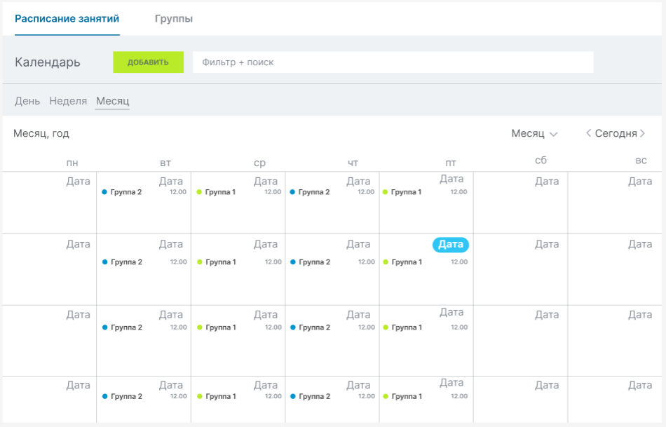
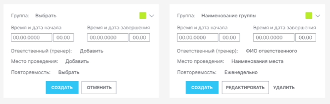
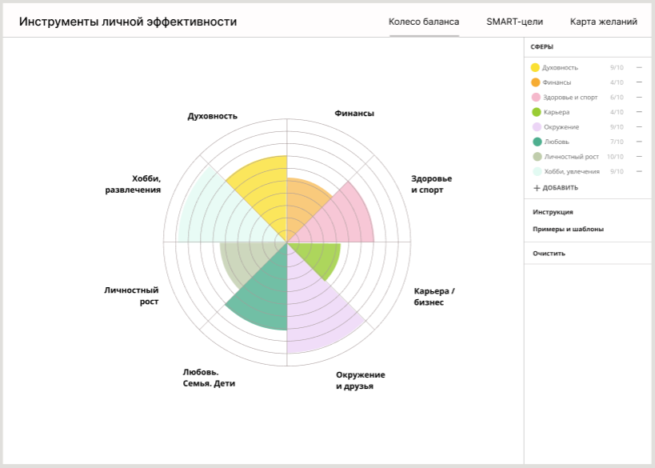
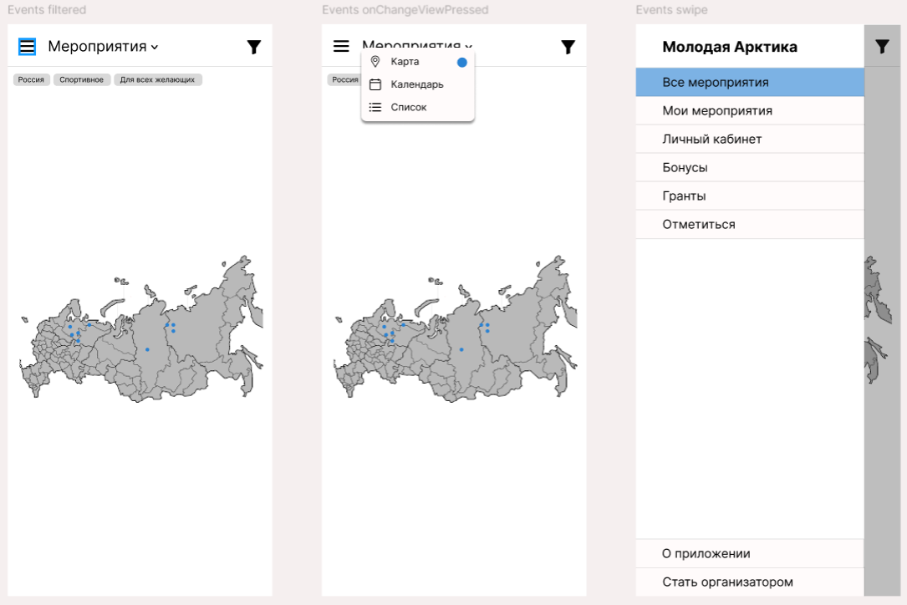

## Модуль Расписание в Битрикс24

Макеты для ТЗ на доработку Битрикс24. Ссылка на ТЗ:

Подробнее: https://www.figma.com/design/cNrLhfLWIEKUyzY9hcUoqQ/%D0%9C%D0%B0%D0%BA%D0%B5%D1%82%D1%8B-%D0%A0%D0%B0%D1%81%D0%BF%D0%B8%D1%81%D0%B0%D0%BD%D0%B8%D1%8F-%D0%91%D0%B8%D1%82%D1%80%D0%B8%D0%BA%D1%81?node-id=0-1&t=784uLVaGejqNVc4N-1

## Сайт "Колесо баланса"

Подробнее: https://www.figma.com/design/yrpYez0nZr4wMvss3hWXOB/life-balance-wheel?node-id=0-1&t=bPJ5poepvf0apQmv-1

Кстати, итог разработки можно посмотреть вот тут: 

## Мобильное приложение для спортивных мероприятий

Делала в рамках хакатона, поэтому макетов совсем немного.

Подробнее: https://www.figma.com/design/u1gFq4j1UTSBpq1n85laQX/Untitled?node-id=0-1&t=wKpTzgNA3cSM7qYc-1

## Сайт для компании

...

Я же потом его собрала на конструкторе Tilda. Ссылка на сайт:
