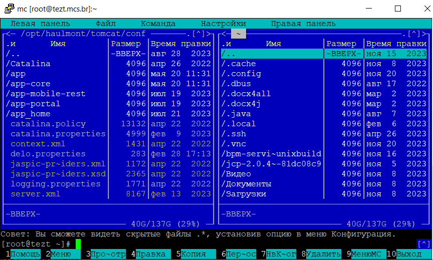
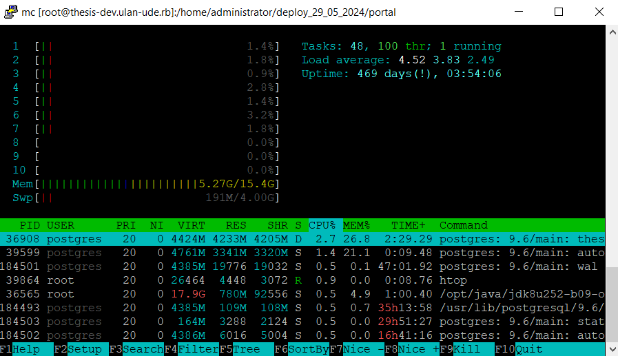
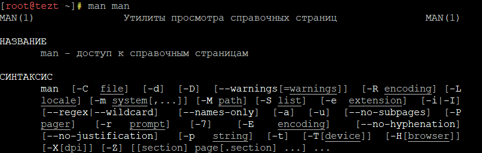

Тут команды, которые мне чаще всего пригождались. За основу взята статья [Основные linux-команды для новичка](https://habr.com/ru/articles/501442/).

## Навигация по папкам

### Вывод текущей папки

```
pwd
```

### Что находится в папке

```
ls -l
```


### Перейти в другую директорию

```
cd /home/student/log ---абсолютный
cd log               ---относительный
```

### Подняться наверх

```
cd ..
cd ../.. ---подняться на 2 уровня наверх
```

## Работа с файлами

### Создать файл/папку

Создать файл
```
touch README.md
```
Создать папку

```
mkdir test
mkdir /home/test   --- создает папку «test» в директории /home, даже если вы сейчас не там
```

### Скопировать файл/папку

Скопировать файл
```
cp README.md /home/lera
cp README.md /home/lera/README_copy.md ---переименовываем
```

Скопировать папку
```
cp -r <путь_к_папке> <путь_к_новому_месту>
cp -r opt/temp /home/lera
```

### Переместить файл/папку

```
mv README.md /home/lera
mv opt/temp /home/lera
```

### Удалить файл/папку

```
rm README.md
rm *  ---удалить все файлы текущей папки
rm -r /home/lera ---удалить папку
```

## Команды для деплоя доработок

### Повышение прав

Не для всего есть доступ. Если доступа нет, то нужно повыситься до админа командой:

```
sudo su
```

### Работа со службами

Остановка и запуск службы:

```
systemctl stop thesis ---остановили
systemctl start thesis ---запустили
systemctl restart thesis ---остановили+запустили одной командой
```

Проверить состояние службы:

```
systemctl status thesis
```

Чтобы выйти из просмотра состояния, нужно нажать `q`.

### Работа с файловым менеджером Midnight Comander

Можно использовать для копирования, переноса файлов.

```
mc
sudo mc ---запуск с правами админа
```

Горячие клавиши для mc:

- `стрелки` - перемещение внутри панелей
- `PageUp` и `PageDown` - прокрутка вверх/вниз
- `PageUp` и `PageDown` - прокрутка вверх/вниз
- `Home` и `End` - перейти в начало/конец списка
- `Tab` - переключить панель
- `F5` - перенести выделенный файл в противоположную панель
- `F10` - выйти из mc



### Посмотреть текущие процессы и нагрузку

```
htop
```

Результат команды:



## Лайфхаки

### Внутреннее руководство Linux

Команда, которая дает информацию по всем командам. Выводим инфо о команде `man`:

```
man man
```



Выйти из команды можно на кнопку `q`.

[См. подробнее о команде man](https://losst.pro/chto-takoe-man)

### Автозаполнение

Клик на `Tab` при наборе наименования папки/файла предложит дозаполнить название из списка. Если кликнуть на `Tab`, ничего не вводя, система начнет перебирать возможные варианты.
Например подойдет для команды `cd s`.

### Как вставить скопированное значение

Привычное `Ctrl + V` тут не сработает: для вставки используется **правый клик мыши** в консоли.