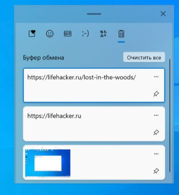

Тут инфо о всех программах, которые мне улучшают жизнь и работу.

## Горячие клавиши Windows

### История буфера обмена

Стандартный буфер, который все привыкли использовать через контекстное меню «Скопировать» и «Вставить» `Ctrl` + `C`, `Ctrl` + `V`, имеет лишь одну «ячейку памяти». его бывает очень мало. Начиная с Windows 10 Microsoft внедрила журнал буфера обмена, который умеет запоминать до 25 элементов. Копировать и вставлять при этом можно текст, ссылки, изображения и другой контент.

Открыть его нажно нажатием `Win` + `W`

Выглядит так:

[Подробнее](https://lifehacker.ru/kak-posmotret-bufer-obmena-windows-10-11/?ysclid=lwhz4dfeo077193900)

### Встроенная запись экрана
Запускается клавишами `Ctrl` + `G`.

Плюсы
- Не нужно доп. ПО.

Минусы
- Записывает в пределах одного окна приложения (не делает запись всего экрана).

## Менеджер паролей

От себя рекомендую 2 менеджера паролей, чтобы не хранить их в текстовом файле или в заметках в телеграм. Обязательно к применению в работе!

### [BitWarden](https://bitwarden.com/)

Использую обычно для личных целей. Устанавливается в браузер как расширение.

Плюсы:

- Простой и красивый.
- Имеет синхронизацию между устройствами, включая мобильное приложение.
- Есть горячие клавиши для автозаполнения на странице.
- Можно разделить пароли по пространствам.

Минусы:

- Подходит только для заполнения в браузере.

### [KeePassXC](https://keepassxc.org/)

Рекомендую использовать в работе - можно задать автоввод для десктопных программ.

Плюсы:

- Можно задать автоввод для десктопных программ.
- Можно делать папки, иконки.
- Есть экспорт и импорт файлов. Подойдет, если хотите поделиться логинами и паролями.

Минусы:

- Интерфейс устарел.

## Скриншотер

Я использую [Скриншотер mail.ru](https://screenshoter.mail.ru). Его преимущества:

- Можно замылить текст.
- Можно ставить поочередность действий на скриншоте.
- Можно выделить фигурами\маркером.

Также рекомендую [Joxy](https://joxi.ru/tour/win).