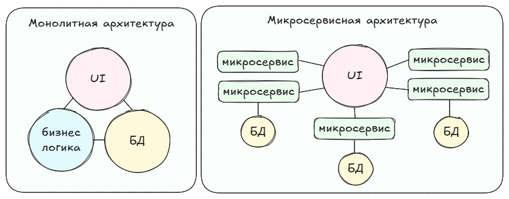
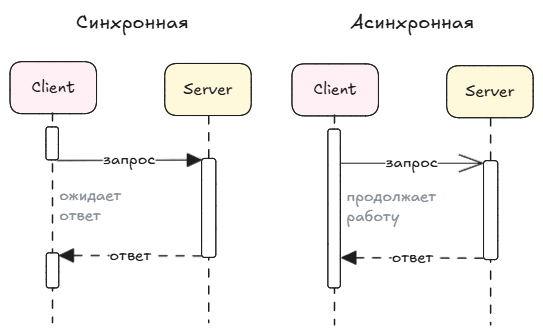

## Монолитная и микросервисная архитектура
Монолитная архитектура - подход, при котором все компоненты приложения тесно связаны и работают как единое целое.

Микросервисная архитектура (MSA - Micro Service Architecture) предполагает полную *автономность* каждого компонента.




|                    |                                                 **Монолит**                                                |                                                                   **Микросервисная**                                                                  |
|:------------------:|:----------------------------------------------------------------------------------------------------------:|:-----------------------------------------------------------------------------------------------------------------------------------------------------:|
| Принцип построения | Одно большое приложение, все компоненты связаны напрямую.                                                  | Приложение разделено на независимые микросервисы. Каждый микросервис - отдельная бизнес-функция.                                                      |
| Разработка         | Одна база кода, простой процесс разработки и развертывания.                                                | Каждый сервис - отдельный репозиторий со своей БД.                                                                                                      |
| Откат разработки   | При небходимости отката откатывается все приложение, включая и рабочие фичи тоже.                          | Откатить можно только не работающий сервис, остальные остаются.                                                                                       |
| Поддержка          | Проще поддерживать, т. к. архитектура простая и не нужно дополнительно разбирать связи с др. компонентами. | При появлении ошибки нужно сначала понять, в каком из микросервисов она появилась. Также добавляется доп. коммуникация между командами микросервисов. |
| Производительность | При перегрузке в определенной функции приложения может пострадать скорость всего приложения.               | Каждый сервис можно размещать на отдельном сервере, проще (и дешевле) распределить нагрузку.                                                          |
| Гибкость           | Привязка к определенному набору технологий. Новые функции могут повлиять на все приложение.                | Для каждого сервиса можно подобрать более подходящую технологию. Можно добавлять новые функции не изменяя все приложение.                             |


Подробнее можно почитать тут:
- [Просто о микросервисах](https://habr.com/ru/companies/raiffeisenbank/articles/346380)
- На основе [Java Microservices: The Basics](https://www.marcobehler.com/guides/java-microservices-a-practical-guide#_java_microservices_the_basics) и его [перевода](https://javarush.com/groups/posts/2660-rukovodstvo-po-mikroservisam-java-chastjh-1-osnovih-mikroservisov-i-ikh-arkhitektura)
- Об архитектуре ПО и других видах ИТ-архитектур [От монолита до микросервисов: как устроена архитектура ПО](https://blog.skillfactory.ru/ot-monolita-do-mikroservisov-kak-ustroena-arhitektura-po)
- [Монолит или микросервисы: какую архитектуру выбрать для нового проекта](https://tproger.ru/articles/monolit-ili-mikroservisy--kak-vybrat-arhitekturu-dlya-novogo-proekta)
- [Microservice Architecture Microservices.io](https://microservices.io/index.html)

### Монолит

Минусы:
- Может быть нагрузка
- При откате неработающей функции работающие функции придется откатить тоже.
- Привязка к определенному набору технологий. Новые функции могут повлиять на все приложение.

Плюсы:
- Одна база кода, простой процесс разработки и развертывания.
- Простая архитектура. При разработке акцент на функциональность, а не на взаимодействие компонентов.
- На старте скорость разработки будет выше, яем у микросервисов. Но с ростом функционала монолита скорость будет снижаться.
- Дебаг проще

### Микросервисная архитектура
Микросервисная архитектура может подойти для крупных проектов для упрощения разработки и повышения производительности+отказоустойчивости. Основной принцип такой архитектуры заключается в независимости микросервисом друг от друга. Иными словами - каждый микросервис можно разрабатывать, тестировать, деплоить (и откатывать) независимо друг от друга. Один микросервис - это одна бизнес-функция, что позволяет не размывать границы микросервиса.

Плюсы:
- Гибкая и удобная разработка. Каждый микросервис - это отдельная бизнес-функция.
- Распределение нагрузки, масштабирование проще (и дешевле).
- Изолированность микросервисов. Проще разделять технологии для микросервисов, упрощенный деплой.
- При работе с микросервиса необязательно знать, как работают остальные сервисы (в отличие от монолита).
- Для каждого сервиса можно подобрать более подходящую технологию. Можно добавлять новые функции не изменяя все приложение.

Минусы:
- Сложная архитектура, т. к. нужно продумать взаимодействие сервисов. Сложнее в администрировании, мониторинге, поддержке.
- Коммуникация и обслуживание. Необходимо учитывать ситуации потери запросов/данных.
- Согласованность данных. Некоторые компоненты могут быть несинхронизированы между собой. Например когда несколько сервисов обращаются к одному источнику данных.
- Дебаг. Сложно определить где конкретно вышла ошибка, если взаимодействовало несколько микросервисов. Точек отказа больше.

Если микросервисы независимы друг от друга, то как же они передают друг другу информацию? С монолитом все понятно - там все лежит в одном месте. С микросервисами все иначе. Предположим, у нас есть 2 микросервиса, которые находятся на разных серверах. В таком случае из первого сервиса во второй отправляется запрос, на который обратно приходит ответ. Делается это при помощи технологи HTTP.

## Интеграции

**Интеграция** — процесс взаимодействия независимых приложений/микросервисов. Основная цель интеграции - обеспечить обмен информацией между приложениями.
Например: заходим на любой сайт, чтобы заказать пиццу. После выбора пиццы нам нужно указать адрес доставки в выпадающем меню.

Естественно, пиццерия не сама составляла список всех адресов

### Интеграционные технологии
#### REST

#### SOAP

### Интеграционные форматы
Онлайн конвертеры:
- [XML -> XSD](https://www.liquid-technologies.com/online-xml-to-xsd-converter) и [XSD -> XML](https://www.liquid-technologies.com/online-xsd-to-xml-converter)
- [JSON -> JSON Schema](https://www.liquid-technologies.com/online-json-to-schema-converter) и [JSON Schema -> JSON](https://www.liquid-technologies.com/online-schema-to-json-converter)

#### JSON + JSON Schema

```json
{
    "user": {
        "id": 12345,
        "name": "Иван Петров",
        "email": "ivan.petrov@example.com",
        "isActive": true,
        "createTs": "2025-10-19T22:15:00Z",
        "hobbies": [
            "чтение",
            "рисование"
        ],
        "accounts": [
            {
                "type": "savings",
                "balance": 12500.75,
                "currency": "RUB"
            },
            {
                "type": "credit",
                "balance": -3400.50,
                "currency": "RUB"
            }
        ]
    }
}
```

```json
{
    "$schema": "http://json-schema.org/draft-04/schema#",
    "type": "object",
    "properties": {
        "user": {
            "type": "object",
            "properties": {
                "id": {
                    "type": "integer"
                },
                "name": {
                    "type": "string"
                },
                "email": {
                    "type": "string"
                },
                "isActive": {
                    "type": "boolean"
                },
                "createTs": {
                    "type": "string"
                },
                "hobbies": {
                    "type": "array",
                    "items": [
                        {
                            "type": "string"
                        },
                        {
                            "type": "string"
                        }
                    ]
                },
                "accounts": {
                    "type": "array",
                    "items": [
                        {
                            "type": "object",
                            "properties": {
                                "type": {
                                    "type": "string"
                                },
                                "balance": {
                                    "type": "number"
                                },
                                "currency": {
                                    "type": "string"
                                }
                            },
                            "required": [
                                "type",
                                "balance",
                                "currency"
                            ]
                        },
                        {
                            "type": "object",
                            "properties": {
                                "type": {
                                    "type": "string"
                                },
                                "balance": {
                                    "type": "number"
                                },
                                "currency": {
                                    "type": "string"
                                }
                            },
                            "required": [
                                "type",
                                "balance",
                                "currency"
                            ]
                        }
                    ]
                }
            },
            "required": [
                "id",
                "name",
                "email",
                "isActive",
                "createTs",
                "hobbies",
                "accounts"
            ]
        }
    },
    "required": [
        "user"
    ]
}
```

#### XML + XSD
[Что такое XML](https://habr.com/ru/articles/524288)

Из чего состоит XSD?
Основные объекты, из которых состоит XSD-схема:
- элементы (зелёный цвет);
- типы (синий);
- индикаторы порядка (красный).

```xml
<user>
    <id>12345</id>
    <name>Иван Петров</name>
    <email>ivan.petrov@example.com</email>
    <isActive>true</isActive>
    <createTs>2025-10-19T22:15:00Z</createTs>

    <hobbies>
        <hobby>чтение</hobby>
        <hobby>рисование</hobby>
    </hobbies>

    <accounts>
        <account type="savings" currency="RUB">
            <balance>12500.75</balance>
        </account>
        <account type="credit" currency="RUB">
            <balance>-3400.50</balance>
        </account>
    </accounts>
</user>
```

```xsd
<?xml version="1.0" encoding="utf-8"?>
<xs:schema attributeFormDefault="unqualified" elementFormDefault="qualified" xmlns:xs="http://www.w3.org/2001/XMLSchema">
  <xs:element name="user">
    <xs:complexType>
      <xs:sequence>
        <xs:element name="id" type="xs:unsignedShort" />
        <xs:element name="name" type="xs:string" />
        <xs:element name="email" type="xs:string" />
        <xs:element name="isActive" type="xs:boolean" />
        <xs:element name="createTs" type="xs:dateTime" />
        <xs:element name="hobbies">
          <xs:complexType>
            <xs:sequence>
              <xs:element maxOccurs="unbounded" name="hobby" type="xs:string" />
            </xs:sequence>
          </xs:complexType>
        </xs:element>
        <xs:element name="accounts">
          <xs:complexType>
            <xs:sequence>
              <xs:element maxOccurs="unbounded" name="account">
                <xs:complexType>
                  <xs:sequence>
                    <xs:element name="balance" type="xs:decimal" />
                  </xs:sequence>
                  <xs:attribute name="type" type="xs:string" use="required" />
                  <xs:attribute name="currency" type="xs:string" use="required" />
                </xs:complexType>
              </xs:element>
            </xs:sequence>
          </xs:complexType>
        </xs:element>
      </xs:sequence>
    </xs:complexType>
  </xs:element>
</xs:schema>
```

### Синхронная и асинхронная интеграция

Взаимодействия между системами бывают:
- синхронные (например: REST API, SOAP, gRPC);
- асинхронные (например: Kafka, RabbitMQ, WebSocket)

Различия их в том, что приложения с асинхронным взаимодействием не ждут ответа после отправки запроса, а могут продолжить выполнять свой основной поток задач.

Схема взаимодействия


### Пагинация
Что почитать:
- [Оптимизация работы с REST API: когда и как использовать пагинацию](https://selectel.ru/blog/pagination)
- [Реализация REST API-метода с пагинацией на примере JSON-Schema и OpenAPI / Habr/ nick_oldman](https://habr.com/ru/amp/publications/846130)

## Вопросы и ответы
56.   Что такое XSD?
57.   Что содержится в XML?
58.   Чем sequence отличается от choice в XSD?
59.   Приходилось ли вам писать XSD?
60.   Что такое пространство имен в XML?
61.   Какими программами вы работали с XML?
62.   Что такое WSDL?
63.   Чем SOAP отличается от REST?
64.   Из чего состоит сообщение в SOAP?
65.   Что содержит HEADER в ответе REST?
66.   Чем отличается ошибка 200 от 201?
67.   Какие методы REST вы знаете?
68.   Чем POST отличается от GET?
69.   Чем PUT отличается от PATCH?
70.   Приходилось ли вам писать JSON? С помощью чего вы писали JSON?
71.   Напишите пример rest-API для книжной библиотеки (напишите методы, эндпоинты и пример JSON).
72.   Что содержит URL в REST запросе?
73.   Как проверить, что сообщение брокера получено в полном объеме?
74.   Знаете ли вы CAP-теорему?
75.   Что такое stateless и stateful, если говорить про сервисы? Rest – это какие сервисы? Что значит stateless сервисы?
76.   Что такое идемпотентность? Почем это важно?
77.   DELETE – идемпотентный метод?
78.   Приходилось ли вам проектировать взаимодействие информационных систем?
79.   Что такое корпоративная шина? Приходилось ли работать с корпоративной шиной?
80.   Чем корпоративная шина отличается от ETL – инструмента?
81.   Чем брокер сообщений отличается от корпоративной шины?
82.   К корпоративной шине подключены веб-сервисы. В одном веб-сервисе появились два новых обязательных поля. Что изменится в интеграции?
83.   Есть некий UI, нужно написать к нему веб-сервис. Опишите вашу постановку – что в ней будет.
84.   Что такое синхронные и асинхронные вызовы?
85.   Приходилось ли вам работать с брокерами сообщений?
86.   Для чего вы использовали брокер сообщений?
87.   Как брокер сообщений гарантирует доставку сообщений?
88.   Чем Kafka отличается от RabbitMQ?
89.   Есть две системы. Назовите все способы интеграции этих систем.
90.   Какие виды/способы интеграции вы знаете?
91.   Клиент читает в Kafka два последних сообщения. Как тому же клиенту заново
прочитать эти два последние сообщения?
92.   Приходилось ли вам проектировать API в нотации OpenAPI/Swagger?
93.   Опишите все способы снизить нагрузку на вебсервис.
94.   Есть четыре системы, участвующие в последовательном исполнении заказа клиента на выдачу карты: форма заявки на выдачу карты, скоринг, печать карты, логистика. Опишите, как вы их интегрируете между собой.
95.   Знакомы ли вы с микросервисами?
96.   Что такое Хореография и Оркестрация?
97.   Какие достоинства и недостатки микросервисов вы знаете?
98.   Расскажите про токен-авторизацию в микросервисах.

### Чем SOAP отличается от REST?