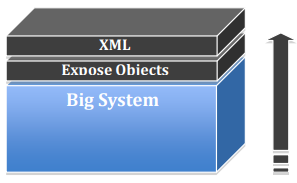
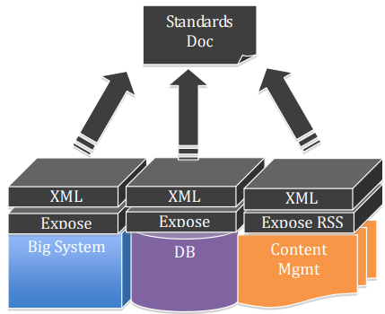
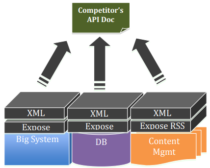
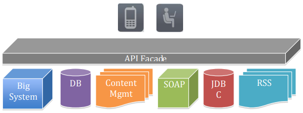

Конспект на основе книги [Web API Design. Crafting Interfaces that Developers Love / Brian Mulloy](https://robinwinslow.uk/api-design-ebook-2012-03.pdf)

Что почитать:
- [Web API Design. Crafting Interfaces that Developers Love / Brian Mulloy](https://robinwinslow.uk/api-design-ebook-2012-03.pdf)
или ее краткую выжимку на русском языке [Разработка web API / Habr](https://habr.com/ru/articles/181988)
- [Best Practices for Designing a Pragmatic RESTful API / Vinay Sahni](https://www.vinaysahni.com/best-practices-for-a-pragmatic-restful-api)

Примеры API:
- [Github](https://docs.github.com/en/rest/issues?apiVersion=2022-11-28#edit-an-issue)

## Существительные — это хорошо; глаголы — это плохо
Главный принцип прагматичного RESTful-дизайна: **сохранять простые вещи простыми.**

### Понятные URL для вызовов API
Для каждого ресурса должно быть **только два базовых URL.** Возьмём простой объект `dog` и создадим для него API. У нас получится два URL:

```yaml
/dogs # коллекция (все собаки)  
/dogs/1234 # конкретный элемент (определённая собака)
```

### Вместо глаголов - HTTP

❌ Для операций вместо глаголов в URL:
```yaml
/getAllDogs
/getDog
/getSittingDogs
/getAllLeashedDog
/newDogForOwner
/getSittingDogsAtPark
```

✅ Используем HTTP-методы `POST`, `GET`, `PUT`, `DELETE`:
```yaml
# для списка собак
POST /dogs
GET /dogs
PUT /dogs
DELETE /dogs

# для конкретной собаки
POST /dogs/1234
GET /dogs/1234
PUT /dogs/1234
DELETE /dogs/1234
```

### Итоги
1. Используем **два базовых URL на ресурс** — для коллекции и для элемента.  
2. Для операций над коллекциями и элементами вместо глаголов в базовом URL использовать **HTTP-методы** (POST, GET, PUT, DELETE).

## Названия ресурсов
### Множественное или единственное число?
Популярные API применяют оба подхода для описания базовых URL. Однако использование **множественного числа** выглядит естественнее и читается интуитивнее. Рассмотрим несколько примеров:

```yaml
/checkins # у Foursquare
/deals # у GroupOn
/Product # у Zappos 
```

Важно **не смешивать оба подхода**, где одни ресурсы названы в единственном числе, а другие — во множественном.  

### Конкретные имена лучше абстрактных
Если смоделировать всё на слишком абстрактном уровне, то API теряет понятность и не даёт представления, что именно можно с ним делать. Например:

```yaml
# слишком абстрактно:
/items
/assets

# конкретно и понятно:
/blogs
/videos
/articles
```

### Уровень абстракции и число ресурсов
Уровень абстракции зависит от конкретного сценария, но важно, чтобы API оставался управляемым и не перегруженным.  
**Лучше держать количество основных ресурсов в пределах 12–24.**  

### Итоги
1. Использовать **множественное число** для имён ресурсов (`/users`, `/orders`).  
2. **Не смешивать** формы — сохраняй единый стиль во всём API (не использовать `/users`, а потом `/Order`).  
3. Использовать **конкретные имена** вместо абстрактных (`/videos` вместо `/assets`).  
4. Поддерживать **управляемое количество ресурсов** — от 12 до 24.  

## Связи и параметры

В этом разделе рассматриваются принципы проектирования API при работе со **связями между ресурсами** и **параметрами**, такими как состояния и атрибуты.

### Связи с другими ресурсами
Ресурсы почти всегда связаны с другими ресурсами. Как просто и понятно выразить эти связи в веб-API? 

Для примера `/dogs` и `/dogs/1234` добавим связь *каждая собака принадлежит владельцу*:

```yaml
GET  /owners/5678/dogs # получить всех собак конкретного владельца
POST /owners/5678/dogs # добавить новую собаку этому владельцу
```

### Глубина связей
При наличии ID конкретного уровня, **нет необходимости включать уровни выше**. Другими словами, структура не должна быть глубже, чем:

```yaml
/resource/identifier/resource
```

Например:
```yaml
/owners/5678/vets/23/dogs/12/food # ❌ плохая практика
/dogs/12/food # ✅ ничего лишнего
```

### Прячем сложное за «?»

В API могут быть различные **состояния**, **фильтры** или **атрибуты**, по которым выполняется выборка.  

Для них используется параметр запроса `?`, не усложняя базовый путь. Например:
```yaml
# получить всех красных собак, которые бегают в парке:
GET /redRunningDogsAtPark # ❌ так не делаем
GET /dogs?color=red&state=running&location=park # ✅ используем параметры
```

### Итоги
1. Не создавать URL глубже, чем `/resource/identifier/resource`.  
2. Для фильтров, состояний и параметров использовать `?`.  
3. Использовать базовый URL для простых и очевидных операций.  
4. Сохранять API интуитивным, упрощая связи между ресурсами.  

## Обработка ошибок
С точки зрения разработчика, потребляющего ваше Web API, всё, что происходит по ту сторону интерфейса — «чёрный ящик».  
Поэтому ошибки становятся ключевым инструментом, обеспечивающим **контекст** и **видимость** того, как пользоваться API.

### Примеры обработки ошибок
Рассмотрим, как три крупных API подходят к обработке ошибок.

#### Facebook
В API Facebook вы всегда получите код 200, означающий «всё в порядке».  
Даже если произошла ошибка, информация о ней помещается в тело ответа.  
```json
// HTTP Status Code: 200   
{"type": "OauthException", 
"message": "(#803) Some of the aliases you requested do not exist: foo.bar"}
```

#### Twilio
Twilio делает это значительно лучше — **соотносит ошибки с корректными HTTP-кодами**.  
Кроме того, в ответе содержится детализированное сообщение об ошибке и ссылка на документацию. 
```json
// HTTP Status Code: 401
{"status": "401", "message": "Authenticate", 
"code": 20003, 
"more_info": "http://www.twilio.com/docs/errors/20003"}
```

#### SimpleGeo
SimpleGeo тоже возвращает коды ошибок, но без какой-либо дополнительной информации в теле ответа — что снижает полезность таких сообщений.  

```json
// HTTP Status Code: 401
{"code": 401, "message": "Authentication Required"}
```
### Что учитывать при проектировании ошибок?
#### Стандартные HTTP-коды
Всего существует более 70 кодов, но мало кто помнит их все [См. список всех HTTP кодов.](https://en.wikipedia.org/wiki/List_of_HTTP_status_codes). Поэтому большинство крупных API используют ограниченный набор кодов.

Например:

- **Google GData:** `200 201 304 400 401 403 404 409 410 500`
- **Netflix:**  `200 201 304 400 401 403 404 412 500`
- **Digg:**  `200 400 401 403 404 410 500 503`

#### Количество HTTP-кодов
Между приложением и API возможны три исхода:

1. Всё прошло успешно — **успех**  
2. Клиент сделал что-то неправильно — **ошибка клиента**  
3. Сервер сделал что-то неправильно — **ошибка сервера**

Для них можно использовать эти коды:

- `200` — OK  
- `400` — Bad Request  
- `500` — Internal Server Error  

Если трёх кодов недостаточно, можно использовать эти:

- `201` — Created  
- `304` — Not Modified  
- `404` — Not Found  
- `401` — Unauthorized  
- `403` — Forbidden  

Если потребуется — добавьте другие, но их общее количество не должно превышать восьми.
Важно, чтобы возвращаемый код можно было **обработать бизнес-логикой приложения** (например, в конструкции if-then-else или switch/case).

#### Информативность
Описание должно быть **подробно и информативно**, включая **подсказки** о причинах ошибки и способах исправления. Хорошо включить **ссылки на документацию**.

Код для машины:  
```yaml
200 – OK  
401 – Unauthorized
```

Сообщение для человека:
```json
{
  "developerMessage": "Подробное, понятное описание проблемы для разработчика с подсказками о том, как её исправить.",
  "userMessage": "Сообщение для конечного пользователя, если нужно отобразить ошибку в интерфейсе.",
  "errorCode": 12345,
  "more_info": "http://dev.teachdogrest.com/errors/12345"
}
```

#### Итоги
- Обработка ошибок — часть интерфейса API. 
- Используйте стандарты HTTP‑статусов и согласованный формат тела ответа.  
- Ошибки должны быть **понятными** и **полезными** — не просто «500 Internal Server Error», а сообщение, которое помогает понять, что пошло не так и как это поправить.
- Если ошибка возникает из‑за неверных данных, укажите, **какое поле** не прошло проверку.  
- Если доступ запрещён или требуется аутентификация — используйте `401 Unauthorized` или `403 Forbidden`, а не просто общий `400 Bad Request`.  
- Не раскрывайте внутреннюю логику сервера или детали реализации — дайте только то, что полезно клиенту.

Пример формата тела ошибки (JSON):

```json
{
  "error": "InvalidField",
  "message": "The 'email' field must be a valid email address",
  "field": "email"
}
```

## Версионирование API

**Никогда не выпускайте API без версии** и делайте так, чтобы указание версии было **обязательным**.

### Примеры
#### Twilio
```yaml
/2010-04-01/Accounts/                 # Twilio
```

Во время компиляции разработчик включает timestamp сборки приложения, и этот штамп отправляется в каждом HTTP-запросе.  
Когда запрос доходит до сервера, Twilio ищет, какая версия API была актуальна на тот момент, и перенаправляет запрос соответствующим образом.  

#### Salesforce.com
```yaml
/services/data/v20.0/sobjects/Account # Salesforce.com
```
Salesforce использует обозначение `v20.0`, размещённое в середине URL.  
Авторы книги положительно оценивают использование префикса `v`, но не рекомендуют добавлять `.0`. 

#### Facebook
```yaml
?v=1.0                                # Facebook
```
Facebook также использует префикс `v`, но делает параметр **необязательным** (`?v=1.0`).  
Это привело к серьёзным проблемам:  
когда Facebook выпустил следующую версию API, все приложения, не указавшие номер версии, сломались и потребовали обновления с добавлением версии вручную.

### Версионирование обязательно!

1. **Всегда** выпускайте API с версией.  
2. Делайте версию **обязательным параметром**.  
3. Указывайте версию с префиксом **`v`** и ставьте её **в начало URL**, чтобы она имела наибольшую область действия: `/v1/dogs`.
4. Используйте **простую порядковую нумерацию** (`v1`, `v2` и т. д.).  
   Не применяйте десятичные значения вроде `v1.2` — это создаёт ложное ощущение детализации.  
5. Поддерживайте **как минимум одну предыдущую версию**.  
    Перед тем как объявить версию устаревшей, дайте разработчикам достаточно времени, чтобы адаптироваться.  

### Где указывать версию и формат: в URL или в заголовках?
Существует мнение, что версию и формат правильнее указывать в HTTP-заголовках.
Однако это часто симптом более глубокой проблемы: вместо единого фасада API компания фактически **выставляет наружу внутреннюю сложность своей системы**.  

Тем не менее, использование заголовков **не является ошибкой** — наоборот, оно может быть даже более правильным решением, поскольку:
- соответствует стандартам HTTP,  
- согласуется с REST-архитектурой Филдинга,  
- решает проблемы совместимости между взаимозависимыми API.

Причина, почему большинство популярных API всё же указывают версию в URL, — это **удобство тестирования API прямо в браузере**.

#### Правила размещения версии
- Если изменение **влияет на логику обработки ответа**, **ставьте версию в URL**, чтобы она была видна.  
- Если параметр **не влияет на логику**, например OAuth-данные — **помещайте их в заголовок**.

Все следующие варианты обращаются к **одному и тому же ресурсу**:

```yaml
GET /dogs/1
Content-Type: application/json

GET /dogs/1
Content-Type: application/xml

GET /dogs/1
Content-Type: application/png
```

Но код, который обрабатывает эти ответы, будет совершенно разным.  
Заголовок, безусловно, — **более корректный подход**, и он остаётся сильным архитектурным решением.


## Частичный ответ и пагинация
**Частичный ответ** (partial response) позволяет возвращать только ту информацию, которая  действительно нужна.

Рассмотрим пример: запрос твита через Twitter API.  
Ответ содержит гораздо больше данных, чем требуется большинству приложений — имя автора, текст, время публикации, число ретвитов и множество метаданных.

Примеры:
```yaml
/people:(id,first-name,last-name,industry) # LinkedIn
/joe.smith/friends?fields=id,name,picture # Facebook
?fields=title,media:group(media:thumbnail) # Google
```

### Опциональные поля - через запятую
Подход Google зарекомендовал себя как простой и эффективный: у них есть опциональный параметр `fields`, через запятую перечисляются имена полей, которые нужно вернуть.
Например, чтобы получить только нужные поля из API собак:

```yaml
/dogs?fields=name,color,location
```

Это также можно использовать, чтобы включать связанные ресурсы — сокращая количество запросов.

### Простая пагинация

Почти всегда **плохая идея — возвращать все ресурсы базы данных за один запрос**.  
Посмотрим, как Facebook, Twitter и LinkedIn решают пагинацию, чтобы получить записи **с 50 по 75**:

| Сервис     | Параметры          | Пример |  
|-------------|--------------------|---------|  
| Facebook    | offset, limit  | `offset=50&limit=25`   |  
| Twitter     | page, rpp (records per page) | `page=3&rpp=25` |  
| LinkedIn    | start, count  | `start=50&count=25` |  

Рекомендуется использовать именно `limit` и `offset`:

```yaml
/dogs?limit=25&offset=50
```

Эта схема:
- привычна большинству разработчиков,  
- поддерживается во многих СУБД,  
- проста и понятна.

### Метаданные
К каждому пагинированному ответу полезно добавлять **метаданные**: текущая страница, сколько всего записей доступно.
Например:

```json
{
  "metadata": {
    "total": 500,
    "limit": 25,
    "offset": 50
  },
  "dogs": [ ... ]
}
```

### Значения по умолчанию
Предусмотрите значения по умолчанию для случаев, когда пользователь не передал в запросе параметры пагинации:
```yaml
limit=10&offset=0
```
Эти значения зависят от объёма данных: если ресурс «тяжёлый», можно вернуть меньше записей;   если «лёгкий» — лимит можно увеличить.

### Итоги
1. Использовать частичный ответ, добавляя параметр `fields` со списком полей через запятую.  
2. Использовать `limit` и `offset` для удобной пагинации.  
3. Добавлять метаданные с количеством записей.  
4. Задавать значения по умолчанию (`limit=10`, `offset=0`).  


## Что насчёт ответов, не связанных с ресурсами?
Иногда API возвращает **ответ, который не представляет собой ресурс** в привычном REST-смысле.

Не все API-ресуры являются записями, которые можно читать, редактировать и удалять. Бывают и API-действия вроде: вычислить, перевести, конвертировать.

Примеры таких случаев:
- расчёт налога, который должен заплатить пользователь;
- перевод текста с одного языка на другой;  
- конвертация валюты.  
Все эти операции **не связаны с данными, извлекаемыми из базы**, а результат представляет собой **действие, а не сущность**.

### Используйте глаголы, а не существительные
В таких случаях допустимо использовать **глаголы в URL**, потому что запрос отражает **действие**, а не обращение к ресурсу.

Например, API для конвертации валют:

```yaml
/convert?from=EUR&to=CNY&amount=100
```

### Обозначать в документации отдельно
В документации нужно **отдельно выделять раздел**, объясняющий, что это **не ресурсные сценарии**, и что в них допускается использование глаголов в URL.

Это поможет разработчикам понять, что такие вызовы — исключение из общего REST-подхода,  
и используются там, где API выполняет **операцию**, а не возвращает объект данных.

Убедитесь, что даже просто глядя на список вызовов в документации можно отличить сущности от действий.


## Поддержка нескольких форматов
Рекомендуется, чтобы API **поддерживал более одного формата**.  
Идея проста: **отправлять данные в одном формате**, но **принимать — в нескольких**.

### Примеры
#### Google Data

```yaml 
?alt=json
```

#### Digg
Digg позволяет указать формат двумя способами:
1. Через **заголовок Accept** — стандартный RESTful-подход.  
2. Через параметр `type` в URL.

```yaml
Accept: application/json
?type=json # если указан параметр type, то он переопределяет заголовок.
```

Обязательно нужно указывать приоритет в документации, чтобы понимать **что происходит при конфликте**.

#### Foursquare
Foursquare предлагает добавлять **расширение в конец URL**:
```yaml
/venue.json
```

### Рекомендуемый синтаксис
Рекомендуется подход Foursquare — он аналогичен привычным файловым расширениям и требует всего один дополнительный символ (`.`):

```yaml
/dogs.json
/dogs/1234.json
```

### Формат по умолчанию
На практике **JSON становится стандартом де-факто** (легко читается, прост в парсинге, поддерживается во всех современных языках и фреймворках).  

Даже если ваш API поддерживает другие форматы (например, XML, CSV, YAML), **JSON должен быть форматом по умолчанию.**

## Именование атрибутов

Есть разные стили, например:  
- Twitter — snake_case `created_at`
- Bing — PascalCase `DateTime`
- Foursquare — camelCase `createdAt`

Рекомендуется использовать camelCase. Такой стиль подходит для JavaScript-разработчиков.


### Поиск
Простой поиск можно смоделировать как обычный RESTful-запрос к ресурсу, например:

```yaml
/dogs?q=red
```

Однако более **сложный поиск по нескольким ресурсам** требует иного подхода.

### Глобальный поиск

Рекомендуется использовать подход, похожий на Google:

```yaml
/search?q=fluffy+fur
```

Здесь:
- `search` — это глагол, обозначающий действие;  
- `?q` — параметр запроса, где указывается поисковая строка.

Такой формат прост и универсален, хорошо ложится на REST-модель.

### Поиск с областью (scoped search)

Для ограничения поиска рамками определённого ресурса, добавляется **контекст (scope)** в путь.

Например, если нужно искать среди собак, принадлежащих пользователю с ID 5678:

```yaml
/owners/5678/dogs?q=fluffy+fur
```

В этом случае **слово “search” в URL опущено** — достаточно параметра `q`, который явно показывает, что выполняется запрос поиска. Такой подход считается **чистым и интуитивным**.  

### Форматирование результатов
Для поиска (а также для любых других действий, не возвращающих ресурс напрямую) можно указать формат ответа, добавив расширение к пути:

```yaml
/search.xml?q=fluffy+fur
```

Это позволяет клиентам запрашивать данные в разных форматах (например, XML, JSON и т. д.) без изменения структуры API.


## Все API-запросы под одним поддоменом

Как это делают крупные платформы:

```yaml
# Facebook использует два разных API
graph.facebook.com
api.facebook.com

# Foursquare использует один API-домен
api.foursquare.com

# Twitter имеет три отдельных API
stream.twitter.com
api.twitter.com
search.twitter.com
```

Легко догадаться, как Facebook и Twitter завели себе по несколько адресов: проще направлять запросы в разные кластеры через DNS, чем через логику. Однако если говорить **о лучшем решении для разработчиков**, то рекомендуется следовать примеру Foursquare.

### Объединяйте все API-запросы под единым поддоменом
Объединение под единым поддоменом:
- выглядит чище и понятнее;
- облегчает документирование;
- упрощает интеграцию для внешних разработчиков;
- делает API более предсказуемым.

Facebook, Foursquare и Twitter имеют **отдельные порталы для разработчиков**:

```yaml
developers.facebook.com
developers.foursquare.com
dev.twitter.com
```

#### Как это организовать?
API-шлюз должен располагаться на поддомене `api.` — например:
```yaml
api.teachdogrest.com
```

А **портал для разработчиков** должен следовать REST-принципу и размещаться по шаблону `developers.yourdomain.com`:
```yaml
developers.teachdogrest.com
```

### Перенаправления (redirect)
Если API-запрос пришёл **из браузера** (а не от клиента API), будет логично перенаправить пользователя на портал с документацией для разработчиков.

Примеры перенаправлений:

```yaml
api.* -> developers.*
dev.* -> developers.*
developer.* -> developers.*
```

## Обработка исключительных ситуаций

Поговорим об **исключениях**, которые могут возникнуть, когда **клиенты не способны корректно работать** со всеми стандартными механизмами.  

Например:
- некоторые клиенты **перехватывают HTTP-коды ошибок**;
- другие **не поддерживают все HTTP-методы** (например, PUT или DELETE).

### Когда клиент перехватывает HTTP-коды ошибок
Может быть ситуация, когда клиент выбрасывает исключение при получении любого кода HTTP, отличного от 200. 

Для таких случаев ребята из Twitter предусмотрели блестящее и простое решение — добавлять параметр `suppress_response_codes`. Если он установлен в `true`, API **всегда возвращает HTTP 200**, даже при ошибках.

Пример запроса:
```yaml
/public_timelines.json?suppress_response_codes=true
```
В результате ошибки будут приходить с кодом 200.

#### Рекомендации

1. Используйте `suppress_response_codes = true`, если клиент не поддерживает ошибки.  
2. Помните, что в этом случае **HTTP-код больше не используется для логики приложения** — он всегда `200`.  
   Клиент должен игнорировать значение HTTP-кода.  
3. Переносите всю информацию о кодах и ошибках **в тело ответа**.

Пример использования:
```yaml
/dogs?suppress_response_codes=true
```

Тело ответа:
```json
200 OK
{
  "response_code": 401,
  "message": "Подробное описание проблемы простыми словами с подсказкой, как её исправить.",
  "more_info": "http://dev.teachdogrest.com/errors/12345",
  "code": 12345
}
```

### Клиент поддерживает не все HTTP-методы

Часто встречается ситуация, когда поддерживаются только `GET` и `POST`,  
а `PUT` и `DELETE` недоступны.  

Чтобы при этом сохранить RESTful-структуру и семантику HTTP-методов, можно использовать подход, применяемый в **Ruby on Rails**:

Сделайте метод **опциональным параметром в URL**, тогда все запросы будут `GET`, но при этом сохранят «богатую» семантику HTTP.

Пример:
```yaml
/dogs?method=post # создание
/dogs  # чтение
/dogs/1234?method=put&location=park # обновление
/dogs/1234?method=delete # удаление
```

⚠️ **Предупреждение:**

Использование `GET` для действий, изменяющих данные (`POST` или `DELETE`),  
может быть **опасным**.  

Если такие URL окажутся на веб-странице, веб-краулеры (например, Googlebot) могут случайно создать или удалить большое количество данных.

## Аутентификация и OAuth
### Как это реализовано у крупных сервисов

| Сервис  | Используемая схема аутентификации |
|----------|----------------------------------|
| **PayPal**  | Собственный Permissions Service API |
| **Facebook** | **OAuth 2.0** |
| **Twitter**  | **OAuth 1.0a** |

Стоит отметить, что **PayPal** внедрил свой проприетарный «трёхступенчатый» механизм разрешений **ещё до появления стандарта OAuth**.

### Что рекомендуется использовать

Используйте **актуальную версию протокола OAuth — 2.0**.

Преимущества OAuth 2.0:
- Повышает **уровень безопасности**;  
- Улучшает **опыт конечного пользователя**;  
- Упрощает **жизненный цикл доступа** (создание, обновление, отзыв токенов);  
- Является **широко поддерживаемым стандартом** с готовыми библиотеками для большинства языков и платформ.

### Чего не стоит делать

Не создавайте что-то **«похожее на OAuth, но со своими особенностями»**.  
Это будет **серьёзным препятствием** для разработчиков, так как они **не смогут использовать стандартные OAuth-библиотеки** на своём языке.  

Поддерживайте совместимость с официальным стандартом — это упростит жизнь всем, кто будет работать с вашим API.

## Примеры запросов и ответов
Ниже показано, как могут выглядеть типичные запросы и ответы RESTful API для ресурса `dogs`.

### Создать собаку

Создадим коричневую собаку по имени Al:
```yaml
POST /dogs?name=Al&furColor=brown
```
Ответ:
```yaml
200 OK
{
  "dog": {
    "id": "1234",
    "name": "Al",
    "furColor": "brown"
  }
}
```

### Изменить собаку

Переименуем Al в Rover.
```yaml
PUT /dogs/1234?name=Rover
```
Ответ:
```yaml
200 OK
{
  "dog": {
    "id": "1234",
    "name": "Rover",
    "furColor": "brown"
  }
}
```

### Получить данные о собаке

```yaml
GET /dogs/1234
```
Ответ:
```yaml
200 OK
{
  "dog": {
    "id": "1234",
    "name": "Rover",
    "furColor": "brown"
  }
}
```

### Получить список всех собак
```yaml
GET /dogs
```
Ответ:
```yaml
200 OK
{
  "dogs": [
    {
      "dog": {
        "id": "1233",
        "name": "Fido",
        "furColor": "white"
      }
    },
    {
      "dog": {
        "id": "1234",
        "name": "Rover",
        "furColor": "brown"
      }
    }
  ],
  "_metadata": [
    {
      "totalCount": 327,
      "limit": 25,
      "offset": 100
    }
  ]
}
```

### Удалить собаку
```yaml
DELETE /dogs/1234
```
Ответ:
```yaml
200 OK
```

Эти примеры показывают, как CRUD-операции (Create, Read, Update, Delete) реализуются в рамках RESTful API.  
Каждое действие — это сочетание **HTTP-глагола** и **понятного пути ресурса**, что делает API предсказуемым и удобным для разработчиков.

## Болтливые API

Иногда API становится **чрезмерно “болтливым”** — для отображения простого интерфейса требуется десятки или сотни запросов к серверу.

### Оставайтесь RESTful, но добавляйте ярлыки

1. Сначала спроектируйте API по REST‑принципам — определите ресурсы, коллекции, связи.  
2. Затем добавьте **ярлыки (shortcuts)** для частых и тяжёлых сценариев.

Например, если вы знаете, что 80% запросов требуют составного ответа, сделайте отдельный метод или параметр, который возвращает **комбинированный результат**.  

Главное — **не заменяйте RESTful‑дизайн ярлыками**, а **дополняйте** его ими.

### Используйте синтаксис частичного ответа

Этот подход помогает избежать создания дополнительных URL и снизить количество запросов к серверу. Запрос, возвращающий имя владельца и имена его собак:
```yaml
/owners/5678?fields=name,dogs.name 
```

## SDK как дополнение к API

Часто возникает вопрос: нужно ли предоставлять SDK вместе с API?

SDK не требуется, если API (разработчики смогут использовать API напрямую):
- последователен и стандартизирован;
- хорошо документирован;
- предоставляет примеры кода —

Лучше дополнить API SDK‑пакетом в случаях, когда:
- создание интерфейса требует глубоких знаний предметной области;
- использование API вызывает сложности даже при простых сценариях (как у Twitter, где основной объект — короткое сообщение).

Другие причины дополнить API SDK-пакетом:
1. **Ускоряет внедрение** на конкретной платформе  
   (например, Objective‑C SDK для iPhone).  
   Это особенно полезно для разработчиков, осваивающих язык или экосистему.
2. **Упрощает интеграцию**  
   — если ключевые сценарии сложны или требуют клиентской обработки.
3. **Снижает риск неэффективного кода**  
   — SDK обеспечивает правильные обращения к API, уменьшая нагрузку на сервис.
4. **Повышает качество документации**  
   — создание SDK заставляет разработчиков API писать хорошие примеры и описания.  
   Примеры:  
   - [Yahoo! SDK](http://developer.yahoo.com/social/sdk/)  
   - [PayPal SDK](https://cms.paypal.com/us/cgi-bin/?cmd=_rendercontent&content_ID=developer/library_download_sdks)
5. **Продвигает API** в конкретном сообществе разработчиков  
   — размещение SDK на GitHub или в маркетплейсе увеличивает вовлечённость.

## Паттерн фасада API (The API Façade Pattern)

- Как выстроить архитектуру API правильно?
- Как следовать лучшим практикам, при этом предоставляя доступ к внутренним системам и сохраняя гибкость?
- Как развивать API, не ломая его стабильность?

### Проблема: внутренние системы слишком сложны

Бэкенд‑системы, на которых держится бизнес, часто слишком сложны, чтобы открывать их напрямую внешним разработчикам. Они надёжны, проверены временем, но часто:

- построены на устаревших технологиях;
- не всегда совместимы со стандартами Web (HTTP);
- содержат взаимозависимости;
- медленно развиваются, не поспевая за изменениями мобильных и веб‑приложений.

Основная задача — не просто сделать API к одной системе, а **создать API, объединяющий несколько связанных систем в единое, удобное решение для разработчиков.**


### Антипаттерны

#### 1. Подход «Снизу вверх»

В этом подходе разработчик просто **открывает внутренние объекты** системы, добавляя поверх слой XML или SOAP.



**Плюсы:**
- Быстрое создание версии 1.0.
- Команда уже знает внутренние структуры системы.

**Минусы:**
- Внутренние объекты слишком детализированы и **плохо понятны внешним разработчикам**.  
- Происходит **разглашение внутренней архитектуры**, что опасно.  
- API становится **жёстко привязанным к реализации системы**, теряя гибкость.

Вывод: построение API «снизу вверх» делает его **избыточно сложным и негибким**.

#### 2. Подход «Комитета по стандартам»

Разные отделы и владельцы систем собираются вместе и создают единый документ, описывающий схемы, URL и протоколы. Все согласовывают стандарты и начинают разработку по ним.



**Плюсы:**
- Быстрый старт версии 1.0.
- Создаётся ощущение единства и общей стратегии.
- Удобно для крупных организаций с множеством участников.

**Минусы:**
- Процесс очень медленный — согласование и реализация занимают время.
- Может привести к посредственному дизайну из‑за компромиссов.

#### 3. Подход «Копирка» (Copy‑Cat)

Используется, когда компания опаздывает на рынок, а конкурент уже выпустил API.  
Разработчики просто копируют чужой дизайн.



**Плюсы:**
- Быстрое создание версии 1.0.
- Разработчики уже знакомы с похожим API конкурента.

**Минусы:**
- Теряется уникальность и ценность продукта.
- API выглядит как второсортная копия, не отражающая особенности вашей платформы.

### Решение — Паттерн фасада API

Лучшее решение начинается с принципов **продуктового мышления**:

> Ваш API — это продукт. Он должен быть **надёжным**, **релевантным** и **уникальным**.

Product Manager определяет общую стратегию API, а архитектор реализует её в виде фасада.

### Что такое фасад API

Фасад API — это **виртуальный слой**, который отделяет внешний интерфейс от внутренней реализации. Он обеспечивает единое, понятное и стабильное представление API для разработчиков и конечных пользователей.



Фасад изолирует приложение и разработчика от внутренней сложности систем.  
Благодаря этому можно **разбить сложную задачу** на несколько простых.

> «Используйте фасад, когда хотите предоставить простое API к сложной подсистеме.  
> Подсистемы со временем становятся всё сложнее.»  
> — *Design Patterns, Erich Gamma et al.*

### Реализация

Фасад API создаётся в три шага:

1. Спроектируйте идеальный API.  
   Определите:
   - URL‑адреса;
   - параметры запросов;
   - структуру ответов и заголовков;
   - формат данных.  
   Дизайн должен быть **самодостаточным и логичным**.
2. Реализуйте прототип с фиктивными данными (stubs).  
   Это позволит разработчикам тестировать и давать обратную связь даже до интеграции с реальными системами.
3. Интегрируйте фасад с внутренними системами.  
   Настройте посредничество между фасадом и реальными хранилищами данных.


### Преимущества

- **Разделение проблем:** одно большое задание превращается в три управляемые части.  
- **Гибкость:** проще адаптироваться к разным сценариям — внутренним, партнёрским, публичным.  
- **Единообразие:** фасад может реализовывать:
  - пагинацию;
  - сортировку и фильтрацию;
  - аутентификацию и авторизацию;
  - версионирование.  

- **Ускорение разработки:** каждая команда понимает, на каком уровне она работает.  
- **Ориентация на разработчика:** API проектируется **для удобства внешних разработчиков**,  
  а не внутренних систем.