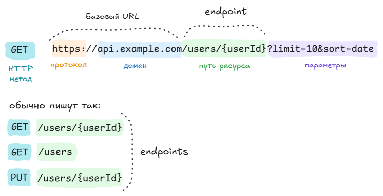
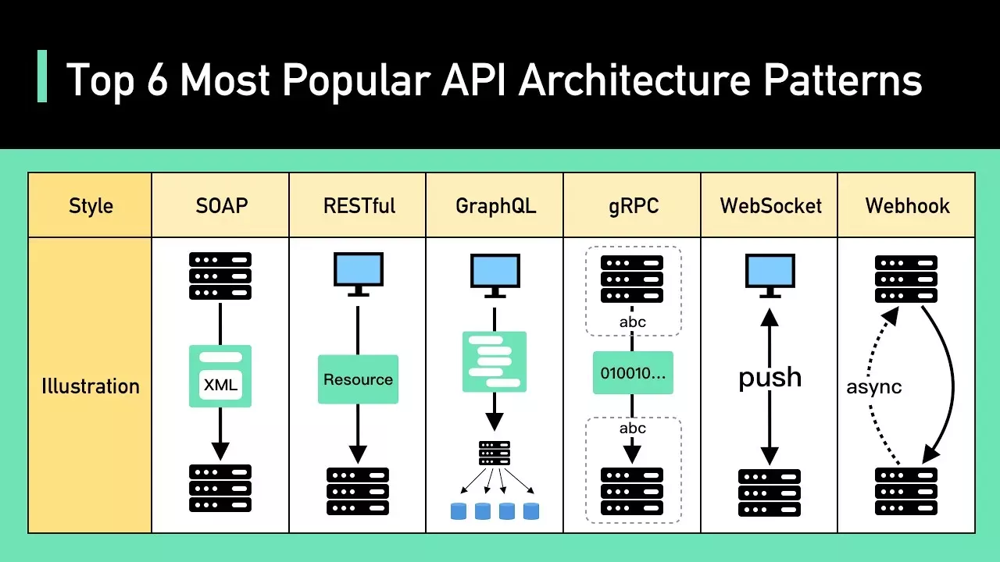
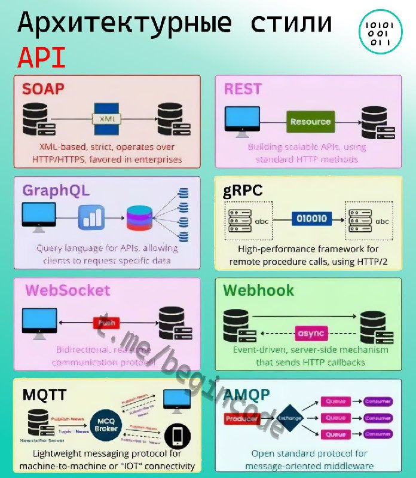
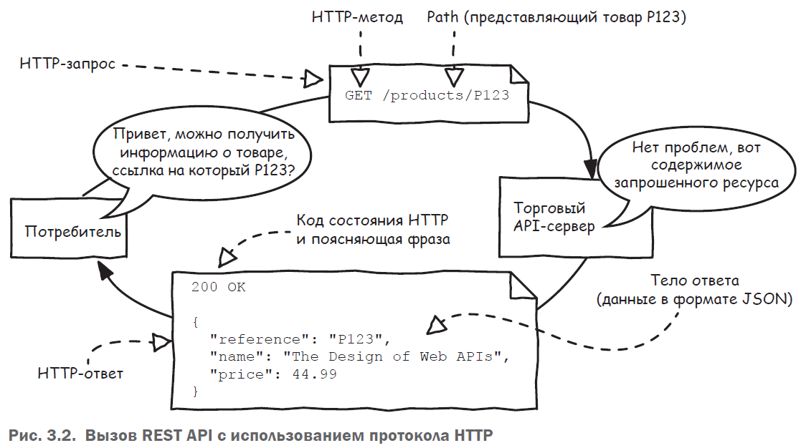

 


Для изучения этой главы нужно понимать протокол HTTP. Ознакомиться можно вот тут: [Протокол HTTP](/docs/network-tech/protocol-http/)

**Необходимые знания:**
- [X] [Основы протокола HTTP](/docs/network-tech/protocol-http/)
- [ ] Формат представления данных JSON [дока на изучение](https://timeweb.com/ru/community/articles/format-json)
- [ ] Спецификация OpenAPI https://swagger.io/specification/
- [ ] Типы данных ([JSON](https://schoolsw3.com/js/js_json_datatypes.php), [OpenAPI](https://swagger.io/docs/specification/data-models/data-types/))

## Введение

**Что почитать:**
- [Курс по документированию REST API](https://starkovden.github.io)
- https://nuancesprog.ru/p/11310/ - сравнение архитектурных стилей API
- Простым языком о REST 
- https://habr.com/ru/post/590679/ - обзорная статья “REST для аналитиков”. Внутри есть видео на 2 часа!
- RestFul Api Patterns 
- API Design Patterns for REST https://blog.stoplight.io/api-design-patterns-for-rest-web-services
- [Как спроектировать архитектуру API с API-брокерами: инструменты, стили, принципы и выгоды для бизнеса, стремящегося к скорости, безопасности и масштабируемости](https://www.kt-team.ru/blog/api-broker-architecture-design-benefits)

Программы, которые могут понадобиться:
- Текстовый редактор с поддержкой синтаксиса JSON. Например, Sublime Text
- HTTP Client Например, Postman или Insomnia
- WYSIWYG для OpenAPI, например Stoplight Studio
- Линтер OpenAPI. Например Stoplight Spectral
- Swagger-ui
- Форматтер-валидатор JSON [jsonformatter](https://jsonformatter.org/)

## Основные термины

**API** (Application Programming Interface - программный интерфейс приложения) — набор правил и методов, позволяющий одной программе взаимодействовать с другой.

**Ресурс (Resource)** — сущность, с которой работает API (например, user, order, product).

**Route (Path)** - Часть URL, описывающая путь к ресурсу (/users/{id}/posts).

**URI / URL / URN** - Строки, определяющие адрес или имя ресурса.

HTTP Method - HTTP-метод, который описывает действие: GET, POST, PUT, PATCH, DELETE.

Request (запрос) - Сообщение, которое клиент отправляет серверу.

Response (ответ) - Сообщение, которое сервер возвращает клиенту.

Header (заголовок) - Метаданные запроса или ответа (например, Content-Type, Authorization).

Body (тело запроса) - Основное содержимое (например, JSON с данными пользователя).

**CRUD** — Create, Read, Update, Delete. Четыре основных действия которые можно произвести над ресурсом.
  - **Create** - POST /users - создание пользователя
  - **Read** - GET /users/1 - получение
  - **Update** - PUT /users/1 - обновление всех полей
  - **Update** - PATCH /users/1 - частичное обновление
  - **Delete** - DELETE /users/1

**API Specification** — артефакт, получившийся в процессе проектирования API и описывающий то, *как API должно работать*.

**RESTFul** web service — сервис имеющий API реализованное в архитектурном стиле REST.
**API Documentation** — артефакт описывающий то, как API *уже работает*.

Ресурс – это функциональная концепция. Например, /products/{productId}
распознает конкретный товар в каталоге товаров. Этот путь идентифицирует ресурс товара.

### Endpoint

[Что такое эндпоинт и как он работает?](https://skyeng.ru/it-industry/it/endpoint-chto-eto-takoye-i-dlya-chego-on-ispolzuyetsya)

**Endpoint** (конечная точка или эндпоинт) — "точка входа" в API, через которую можно этот ресурс запросить, создать, изменить или удалить. Обычно endpoint — URL-адрес, по которому отправляются HTTP-запросы.

Как это может выглядеть в API:
| HTTP-запрос |	Конечная точка	| Действие	|
| -- | ---| -----	|
| GET	| /users |	Получить пользователей|
| POST	| /users |	Создать нового пользователя	|
| GET	| /users/{userId} |	Получить пользователя по идентификатору	|
| PUT	| /users/{userId} |	Обновить пользователя по идентификатору |
| DELETE	| /users/{userId} |	Удалить пользователя по идентификатору |

## Типы API

- **Открытые (Public) API**: также известные как общедоступные API. Это API воспользоваться может любой желающий (иногда после
регистрации).
- **Партнерские (Partner) API**: для доступа к этому типу АPI требуются определенные права или лицензии, потому что они недоступны для
всех.
- **Внутренние (Internal) API**: также известные как частные АPI, только внутренние системы предоставляют этот тип API, который,
следовательно, менее известен и часто предназначен для использования внутри компании. Компания использует этот тип АPI среди
различных внутренних команд, чтобы иметь возможность улучшать свои продукты и услуги.

## Архитектурные стили API

- Описание с примерами на sequence-диаграмме [Хабр / Архитектурный стиль или протокол? Что нужно знать аналитику для работы с API](https://habr.com/ru/articles/863592)

Стили:

- **RPC** (Remote Procedure Call - Удаленный вызов процедуры) — это спецификация, которая позволяет удаленно выполнять функцию в другом контексте. RPCрасширяет понятие локального вызова процедуры, но помещает его в контекст HTTP API.
- **SOAP** — это высоко-стандартизированный протокол веб-коммуникаций, основанный на формате XML.
- **REST (Representational State Transfer)** — самоописательный архитектурный стиль API, определяемый набором архитектурных ограничений и предназначенный для широкого внедрения многими потребителями API.
- **GraphQL** — это синтаксис, который описывает, как сделать точный запрос данных. Реализация GraphQL стоит того, если задействована модель данных приложения с большим количеством сложных сущностей, ссылающихся друг на друга.

### REST

REST – это архитектурный стиль для создания распределённых систем, таких как веб-сервисы.

Основные принципы:
- **Ресурсы**. Всё представлено как ресурсы, идентифицируемые через URI.
- **HTTP-методы**. Используются стандартные методы (GET, POST, PUT, DELETE) для работы с ресурсами.
- **Отсутствие состояния**. Каждый запрос самодостаточен и не зависит от предыдущих.
- **Кешируемость**. Ответы могут быть кешированы для повышения производительности.
- **Единообразие интерфейса**. Стандартизированные взаимодействия между клиентом и сервером (например, через JSON).

## Типы интеграций

## Проектирование
Сначала мы должны идентифицировать ресурсы (функциональные
концепции) и их связь (как они организованы). Затем нужно определить
доступные действия для каждого ресурса, их параметры и результаты.
Как только это будет сделано, мы сможем перейти к фактическому про-
ектированию программного интерфейса, создав пути к ресурсам и вы-
брав HTTP-методы для обозначения действий.

### План проектирования

План проектирования API
Общий план:
1. Осознаем какой тип API мы проектируем и в каком архитектурном стиле;
2. Кто будет потребителем API? Есть ли у них какие-то специфические требования?
Актуально например для API для МП.
3. А где собственно Design Guide под наше API? Находим или организуем;
4. Осознаем в каком формате от нас ждут спецификацию. JSON в документе? OAS?
Другое?
5. Отвечаем на вопросы: Реализована ли эта апишка в Ensi? Имеет ли смысл её брать за
основу или проектируем всё с нуля потому что требования сильно другие?
6. Приступаем к проектированию конкретных эндпоинтов
     1. Отвечаем на вопросы: Реализован ли этот эндпоинт в Ensi? Имеет ли смысл его
     брать за основу или проектируем всё с нуля потому что требования сильно
     другие?
     2. Разбираемся с названиями и типами полей, для этого надо понять с какими
     сущностями мы работаем и где они описаны
     3. Непосредственно проектируем API в виде JSON/OAS3
     4. Отправляем то что сделали на ревью разработчику и возможно еще кому-то