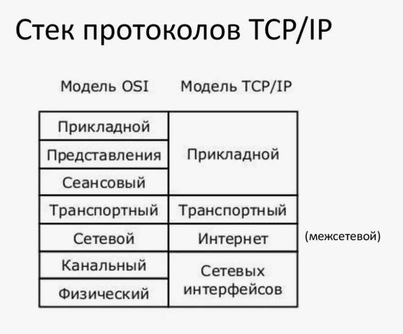

Рекомендуемая литература

[Сети для самых маленьких](https://linkmeup.gitbook.io/sdsm) - тут можно подробнее ознакомиться с сетевыми технологиями, протоколами.

Знание сетевых технологий (TCP/IP, основные протоколы сетевого взаимодействия)

## Какие темы стоит разобрать

1. Топологии — шина умерла (но есть в USB), звезда (коммутаторы), кольцо (иногда встречается у крупных) и частично/полно связная (всякие беспроводные и междупровайдерские сети чаще всего). Сказать про ужас «петля в сети». Провода — собственно коаксиал (очень интересно узнать, как же сейчас кабельные операторы в этот убогий коаксиал умудряются запихивать огого сколько HDTV каналов и мегабит 10+ интернета), витая пара, оптика. Хорошо бы еще про всякую экзотику типа Infiniband.
2. Ethernet, wi-fi n/ac, коммутаторы, чуток про сотовую связь.
3. Протокол IP, маршрутизация, маршрутизаторы, маски
4. Протоколы TCP/UDP, NAT
5. Чуть-чуть про vpn, ssl
6. Самые распространённые протоколы — rdp, imap, smtp, http(s), telnet, ssh, ftp. Tftp вообще вынести на лабу с сетевой загрузкой.
Всё, это максимум почти для всех, кроме радиофака. В реальной жизни большего не потребуется.

## Терминология

**Виртуализация** — обособление части логических ресурсов вычислительной системы для выполнения изолированных процессов (или их совокупности) на одном и том физическом устройстве. [См. подробнее](https://blog.skillfactory.ru/glossary/virtualizatsiya/).

**Гипервизор** — это программа (по сути, тоже ОС), с помощью которой осуществляются создание и управление виртуальной средой, распределение ресурсов между основной и гостевой ОС, их изоляция друг от друга.

## Основные семейства протоколов

- Модель OSI
- TCP/IP

Отличия

