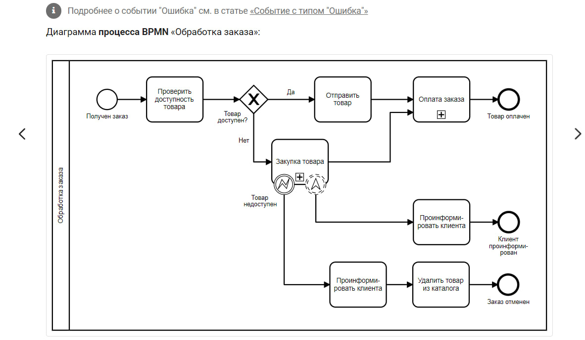
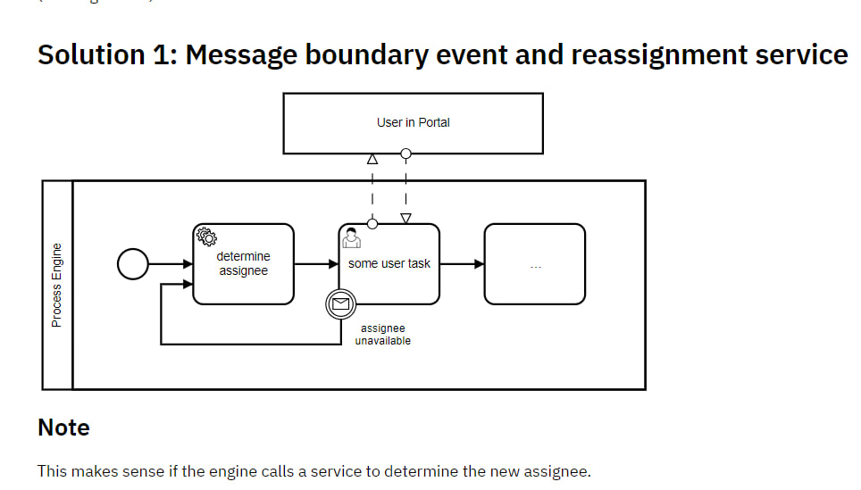

## Полезные ссылки

- [Введение в BPMN, optimacons](https://www.optimacons.info/kb/course.php?LESSON_ID=63). На сайте заходим в **База знаний** - **BPMN**. Понятный и удобный справочник bpmn с примерами.
- [bpmn.org | en](https://www.bpmn.org)
- [Оф. документация по BPMN 2.0 | en](https://www.omg.org/spec/BPMN/2.0/PDF)
- [Примеры BPMN с сайта bpmn.org | en](https://www.omg.org/cgi-bin/doc?dtc/10-06-02)
- [Bpmn quick guide | en](https://www.bpmnquickguide.com/view-bpmn-quick-guide/)
- [Хорошая статья с удобочитаемыми примерами, алгоритмом построения и рекомендациями](https://habr.com/ru/articles/697326/)
- [Примеры camunda | en](https://camunda.com/bpmn/examples/). Есть [перевод](https://camundarus.ru/bpmn/examples/), но он немного кривоват.

## Элементы нотации

## Примеры из интернета

### Процесс посадки пассажира в самолет

Примеры есть еще вот тут:
- https://camundarus.ru/bpmn/examples/

### Обработка заказа

### Доставка пиццы

### Выполнение заказа

### Определение утверждающего с LDAP

### Approver as Collapsed Pools

### Граничное событие с переназначением
Message boundary event and reassignment service

## РАЗОБРАТЬ

https://www.comindware.ru/blog/%D0%BD%D0%BE%D1%82%D0%B0%D1%86%D0%B8%D1%8F-bpmn-2-0-%D1%8D%D0%BB%D0%B5%D0%BC%D0%B5%D0%BD%D1%82%D1%8B-%D0%B8-%D0%BE%D0%BF%D0%B8%D1%81%D0%B0%D0%BD%D0%B8%D0%B5/
