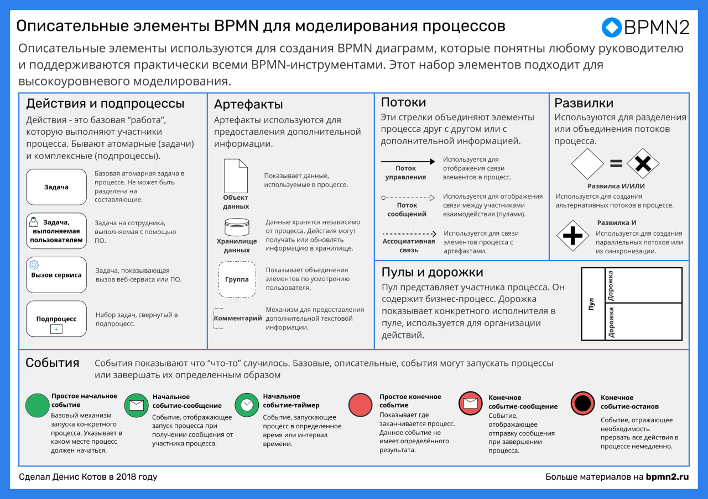
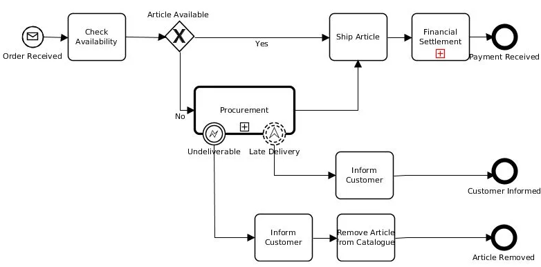

## Полезные ссылки

- Current BPMN Specification [bpmn.org](https://www.bpmn.org)
- Cправочник с основами и примерами [BPMN Quick Guide](https://www.bpmnquickguide.com/view-bpmn-quick-guide)
- Хорошая статья с удобочитаемыми примерами, алгоритмом построения и рекомендациями https://habr.com/ru/articles/697326/
- Отличный [справочник bpmn optimacons](https://www.optimacons.info/kb/course.php?LESSON_ID=63) с примерами, еще и очень красивый. Тут есть еще отличные примеры в разделе [Практические примеры](https://www.optimacons.info/kb/course.php?LESSON_ID=119)
- Тут описание элементов (использую как справочник). Это перевод, поэтому текст иногда кривоват: https://camundarus.ru/bpmn/reference/ 
- Статья по bpmn, много примеров по оформлению bpmn: https://camundarus.ru/bpmn/examples/ 
- Тут есть описание всех элементов с примерами https://stormbpmn.com/bpmn/elements/ 

## Элементы нотации

### Шлюзы 
- О каждом шлюзе с примерами https://bpmn2.ru/blog/vse-shluzi-v-bpmn-s-primerami 

#### Эксклюзивный (XOR) 
#### Параллельный (AND) 
#### Включительный (OR) 
#### Событие

## Примеры

Процесс посадки пассажира в самолет

Примеры есть еще вот тут:
- https://camundarus.ru/bpmn/examples/

## РАЗОБРАТЬ

https://www.comindware.ru/blog/%D0%BD%D0%BE%D1%82%D0%B0%D1%86%D0%B8%D1%8F-bpmn-2-0-%D1%8D%D0%BB%D0%B5%D0%BC%D0%B5%D0%BD%D1%82%D1%8B-%D0%B8-%D0%BE%D0%BF%D0%B8%D1%81%D0%B0%D0%BD%D0%B8%D0%B5/
