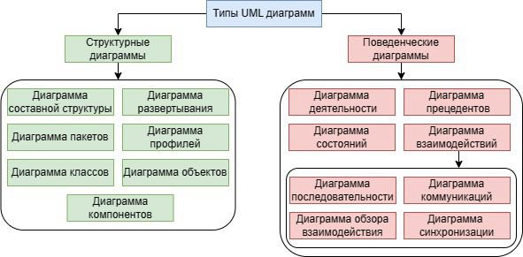
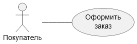

## О нотации UML. Типы UML

Диаграммы взаимодействия (interaction diagrams) описывают взаимодействие групп объектов в различных условиях их поведения.
UML определяет диаграммы взаимодействия нескольких типов, из которых
наиболее употребительными являются диаграммы последовательности.



Что почитать:
- [UML. Основы, Мартин Фаулер](https://k0d.cc/storage/books/UML/uml_osnovy_3-e_izd.pdf)
- [Unified Modeling Language Specification](https://www.omg.org/spec/UML/2.2/Superstructure/PDF)
- Хорошая статья с примерами [UML: что это за язык моделирования, зачем нужен, как создавать диаграммы на Unified Modeling Language / Skillbox Media](https://skillbox.ru/media/code/yazyk-uml-chto-eto-takoe-i-zachem-on-nuzhen/)


## Типы диаграмм
### Диаграмма классов


### Диаграмма последовательности

Обычно диаграмма последовательности описывает один сценарий. На
диаграмме показаны экземпляры объектов и сообщения, которыми
обмениваются объекты в рамках одного прецедента (use case).

Общая проблема диаграмм последовательности заключается в том,
как отображать циклы и условные конструкции. Прежде всего надо
усвоить, что диаграммы последовательности для этого не предназначе
ны. Подобные управляющие структуры лучше показывать с помощью
диаграммы деятельности или собственно кода. Диаграммы последова
тельности применяются для визуализации процесса взаимодействия
объектов, а не как средство моделирования алгоритма управления.

Если вызывающий объект посылает синхронное сообщение (synchro
nous message), то он должен ждать, пока обработка сообщения не будет
закончена, например при вызове подпрограммы. Если вызывающий
объект посылает асинхронное сообщение (asynchronous message), то
он может продолжать работу и не должен ждать ответа. Асинхронные
вызовы можно встретить в многопоточных приложениях и в промежу
точном программном обеспечении, ориентированном на сообщения.
Асинхронность улучшает способность к реагированию и уменьшает
количество временных соединений, но сложнее в отладке.

Диаграммы последовательности следует применять тогда, когда тре
буется посмотреть на поведение нескольких объектов в рамках одного
прецедента. Диаграммы последовательности хороши для представле
ния взаимодействия объектов, но не очень подходят для точного опре
деления поведения.
Если вы хотите посмотреть на поведение одного объекта в нескольких
прецедентах, то примените диаграмму состояния (глава 10). Если же
надо изучить поведение нескольких объектов в нескольких прецеден
тах или потоках, не забудьте о диаграмме деятельности (глава 11).

Полезные ссылки:
- [Шпаргалка по PlantUML](https://plantuml.com/ru/sequence-diagram)
- [Основные элементы и примеры](https://habr.com/ru/articles/814769)
- [Проектирование Sequence-диаграмм: руководство для системных аналитиков](https://habr.com/ru/articles/924396)
- https://zenuml.com/blog
- [Сервис для построения sequence-диаграмм](https://sequencediagram.org)
- [Самоучитель UML, Александр Леоненков](https://uml.methodologies.ru)
- https://vaiti.io/kak-sozdavat-sequence-diagrammy-s-pomoshhyu-plantuml-i-pochemu-bazovyj-skil-analitikov-mozhet-prigoditsya-ne-tolko-im


#### Примеры
- [Tomcat диаграммы](https://tomcat.apache.org/tomcat-9.0-doc/architecture/startup.html)
  


Вариант диаграммы последовательности для моделирования телефонного разговора


### Диаграмма прецендентов
Полезные ссылки:
- [USE CASE — что это, из чего состоит и как избежать ошибок при написании](https://academy.mediasoft.team/article/use-case-chto-eto-iz-chego-sostoit-i-kak-izbezhat-oshibok-pri-napisanii)
- https://rb.ru/stories/use-case
- https://testengineer.ru/use-cases-quick-guide


Один из вариантов последующего уточнения диаграммы вариантов использования для примера рассматриваемой системы продажи



### Диаграмма состояний

https://shesterov.by/tpost/n26iurdac1-uml-state-machine-diagram 


### Диаграмма развертывания


### Диаграмма классов


## PlantUML
[PlantUML](https://plantuml.com/ru) - это универсальный инструмент, позволяющий быстро и просто создавать широкий спектр диаграмм.


Полезные ссылки:
- Справочник по синтаксису [PlantUML](https://plantuml.com/ru)
- Статья [PlantUML — все, что нужно бизнес-аналитику для создания диаграмм в программной документации / Habr](https://habr.com/ru/articles/416077)
- Сервис для построения sequence-диаграмм [sequencediagram.org](https://sequencediagram.org)

Помимо UML с помощью PlantUML можно отображать:
- [JSON-данные](https://plantuml.com/ru/json) - можно добавлять в UML json-схемы
- [ER-диаграмма (нотация Чена)](https://plantuml.com/ru/er-diagram)
- Регулярные выражения [Regex](https://plantuml.com/ru/regex)
- [Wireframe](https://plantuml.com/ru/salt) - визуализация макетов, элементов интерфейса. Можно добавлять прямо в UML схемы.
- [Диаграмма Ганта](https://plantuml.com/ru/gantt-diagram)

### Использование кавычек

- <U+00AB> - для открывающих русских кавычек
- <U+00BB> - для закрывающих
- <U+0022> - для универсальных

{}
```yaml

``` 
{}