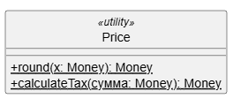
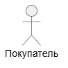
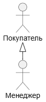
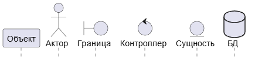
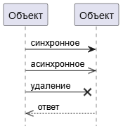
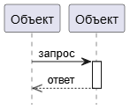

## О нотации UML. Типы UML

Диаграммы взаимодействия (interaction diagrams) описывают взаимодействие групп объектов в различных условиях их поведения.
UML определяет диаграммы взаимодействия нескольких типов, из которых
наиболее употребительными являются диаграммы последовательности.

Что почитать:
- [UML. Основы, Мартин Фаулер](https://k0d.cc/storage/books/UML/uml_osnovy_3-e_izd.pdf)
- [Unified Modeling Language Specification](https://www.omg.org/spec/UML/2.2/Superstructure/PDF)
- Хорошая статья с примерами [UML: что это за язык моделирования, зачем нужен, как создавать диаграммы на Unified Modeling Language / Skillbox Media](https://skillbox.ru/media/code/yazyk-uml-chto-eto-takoe-i-zachem-on-nuzhen/)
- [Диаграмма Деятельности и Диаграмма Состояний / Habr](https://habr.com/ru/articles/907808)

## Типы диаграмм

Сводная таблица типов UML диаграмм:

| №  | Название                                                | Краткое описание                                                                       | Для чего подходит                                                                                                  |
|----|---------------------------------------------------------|----------------------------------------------------------------------------------------|--------------------------------------------------------------------------------------------------------------------|
| 1  | Диаграмма классов (Class Diagram)                       | Показывает классы, их атрибуты, методы и связи (наследование, ассоциации, композиции). | Для описания структуры данных и кода.                                                                              |
| 2  | Диаграмма прецедентов (Use Case Diagram)                | Отображает взаимодействие акторов (пользователей, систем) с системой через сценарии.   | Для определения функционала и ролей (например на этапе анализа требований).                                        |
| 3  | Диаграмма последовательности (Sequence Diagram)         | Показывает обмен сообщениями между объектами во времени.                               | Для визуализации взаимодействия объектов в рамках одного прецедента (API-взаимодействия, процессы запроса–ответа). |
| 4  | Диаграмма активности (Activity Diagram)                 | Иллюстрирует потоки управления и данных, аналог блок-схемы.                            | Для описания бизнес-процессов, алгоритмов, логики функций, циклов.                                                 |
| 5  | Диаграмма состояний (State Machine Diagram)             | Описывает состояния объекта и переходы между ними по событиям.                         | Для описания поведения одного объекта в нескольких прецендентах, жизненные циклы сущностей.                        |
| 6  | Диаграмма компонентов (Component Diagram)               | Отображает структуру системы: модули, библиотеки, сервисы и их зависимости.            | При проектировании архитектуры, микросервисов, модульных приложений.                                               |
| 7  | Диаграмма развёртывания (Deployment Diagram)            | Показывает, где и как размещены компоненты (серверы, устройства, контейнеры).          | При проектировании инфраструктуры и DevOps-документации.                                                           |
| 8  | Диаграмма пакетов (Package Diagram)                     | Группирует классы и элементы в логические пакеты, показывает зависимости.              | Для визуализации модульной структуры и декомпозиции больших систем.                                                |
| 9  | Диаграмма коммуникации (Communication Diagram)          | Аналог последовательности, но фокусируется на структуре связей между объектами.        | Когда важно показать сеть взаимодействий, а не их порядок.                                                         |
| 10 | Диаграмма объектов (Object Diagram)                     | Отображает конкретные экземпляры классов и их связи в момент времени.                  | Для тестирования моделей, демонстрации примеров данных и связей.                                                   |
| 11 | Диаграмма взаимодействия (Interaction Overview Diagram) | Комбинирует элементы активности и последовательности для сложных сценариев.            | Для высокоуровневого описания процессов с вложенными взаимодействиями.                                             |
| 12 | Диаграмма времени (Timing Diagram)                      | Отображает изменения состояний или сигналов во времени.                                | Для систем реального времени, встраиваемых и аппаратных решений.                                                   |

### Диаграмма классов

Диаграмма классов описывает типы объектов системы и различного
рода статические отношения, которые существуют между ними. На
диаграммах классов отображаются также свойства классов, операции
классов и ограничения, которые накладываются на связи между объектами.

Что почитать:
- [ФСИС_семинар-5_Диаграмма-классов.pdf](https://imlearning.ru/netcat_files/file/FSIS/ФСИС_семинар-5_Диаграмма-классов.pdf)

#### Элементы

Элементы:
Класс
Абстрактный класс
Интерфейс
Перечисления «enumeration»

Производные свойства (derived properties) могут вычисляться на основе других значений.

Типы отношений:
- Ассоциация – это непрерывная линия между двумя классами, направленная от исходного класса к целевому классу.
- Двунаправленная ассоциация – это пара свойств, связанных в противоположных направлениях. Класс Car (Автомобиль) имеет свойство owner:Person[1], а класс Person (Личность) имеет свойство cars:Car[*].
- Обобщение
- Зависимость Считается, что между двумя элементами существует зависимость, если изменения в определении одного элемента (сервера) могут вызвать изменения в другом элементе (клиенте).
- Агрегация и композиция

Кратность
Кратность свойства обозначает количество объектов, которые могут
заполнять данное свойство. Чаще всего встречаются следующие кратности:
- 1 (Заказ может представить только один клиент.)
- 0..1 (Корпоративный клиент может иметь, а может и не иметь единственного торгового представителя.)
- * (Клиент не обязан размещать заказ, и количество заказов не ограничено. Он может разместить ноль или более заказов.)

| Название | Описание | Обозначение |
|-----------|-----------|-------------|
| Класс | Основная структурная единица, описывающая сущность системы. Включает в себя: - атрибуты (свойства), - методы (операции, функции). | Прямоугольник, разделённый на три секции: 1. Имя класса. 2. Атрибуты. Синтаксис: `видимость имя: Тип кратность = значениеПоУмолчанию {строкаСвойств}` 3. Операции. Синтаксис: `видимость имя (параметры) : возвращаемыйТип {строкаСвойств}`   Знаки видимости: `+` public, `-` private, `#` protected. |
| Абстрактный класс | Класс, не создаваемый напрямую, служит базой для наследников. | Имя класса выделено курсивом или помечено `{abstract}`. |
| Статический класс | Класс, в котором есть только статические поля и методы и на основе которого не создаются объекты. | Имя класса подчеркнуто или помечено `<<utility>>`.  |
| Интерфейс | Определяет набор операций без реализации. | Прямоугольник с пометкой `<<interface>>`. |
| Отношение (связь) | Тип связи между классами. | Есть разные виды, о них ниже. |
| Пакет | Логическая группа классов, объединённых по смыслу. | Папка (прямоугольник с загнутым верхним уголком), внутри — диаграмма или список классов. |
| Ограничение | Условие или правило. | Запись в фигурных скобках: `{constraint}` рядом с элементом или связью. |

Связи:

| Название связи | Описание | Обозначение |
|----------------|-----------|-------------|
| Ассоциация | Указывает, что свойство класса содержит ссылку на экземпляр другого класса. | Сплошная линия между классами, может иметь стрелки. На линии указывается кратность (`1..1`, `0..*`, `1..*`, `0..1`).  |
| Агрегация | «Часть–целое», где часть может существовать независимо от целого. | Пустой ромб у стороны целого.  |
| Композиция | «Жёсткая» агрегация: часть не существует без целого. | Закрашенный ромб у стороны целого. |
| Обобщение (наследование) | Один класс наследует свойства и операции другого. | Сплошная линия с пустым треугольником на конце (от потомка к родителю).  |
| Реализация (интерфейс) | Класс реализует интерфейс. | Пунктирная линия с пустым треугольником к интерфейсу.  |
| Зависимость (использование) | Один элемент использует другой временно (например, как параметр метода). | Пунктирная стрелка от зависимого к используемому.  |
| Ассоциация с ролью | Имена ролей уточняют участие в связи. | Подпись у концов линии: `клиент`, `менеджер`, `контракт`. |

Пример использования этих связей на общей диаграмме:

#### Примеры

### Диаграмма прецендентов

#### Элементы

Таблица компонентов:

| Название         | Описание     | Обозначение |
|------------------|--------------|-------------|
| Актор | Внешний участник: человек, система или устройство, взаимодействующие с системой. | Фигурка актора (или прямоугольник с <>), имя — существительным (Пользователь, Система оплаты). Располагается вне границы системы.  |
| Прецедент (Use Case) | Функциональность/сценарий, выполняемый системой по запросу актора. | Овал с названием в инфинитиве (Оформить заказ, Просмотреть отчёт). Размещается внутри границы системы.  |
| Граница системы | Ограничивает область ответственности системы. | Прямоугольник с названием системы (вверху), внутри — овалы прецедентов. |
| Отношения | Для отображения связей между прецендентами и акторами. | Есть несколько видов связей, их описание приведено ниже. |

Виды связей:

| Название    | Описание                                                                     | Обозначение |
|--------------|------------------------------------------------------------------------------|--------------|
| Ассоциация | Участие актора в прецеденте. | Сплошная линия между актором и прецедентом. Стрелку обычно не ставят; направление общения можно указать стрелкой при необходимости.  |
| Включение | Обязательное повторно используемое поведение: один прецедент всегда вызывает другой. | Пунктирная стрелка с <<include>>, направлена от вызывающего к включаемому прецеденту. Названия прецедентов — глаголы в инфинитиве.  |
| Расширение | Необязательное/условное добавление поведения к базовому прецеденту. | Пунктирная стрелка с <<extend>>, направлена от расширяющего к базовому прецеденту. При необходимости обозначают extension points в базовом прецеденте.  |
| Обобщение акторов | Наследование ролей: специализированный актор наследует права/поведение базового. | Сплошная линия со стрелкой-треугольником к родительскому актору (`Child → Parent`).  |
| Обобщение прецедентов | Общая логика вынесена в базовый прецедент; варианты уточняют/расширяют поведение. | Сплошная линия со стрелкой-треугольником к базовому прецеденту (`Specific → General`).  |

#### Примеры
Полезные ссылки:
- [Использование диаграммы вариантов использования UML при проектировании программного обеспечения / Habr](https://habr.com/ru/articles/566218)
- [USE CASE — что это, из чего состоит и как избежать ошибок при написании](https://academy.mediasoft.team/article/use-case-chto-eto-iz-chego-sostoit-i-kak-izbezhat-oshibok-pri-napisanii)
- https://rb.ru/stories/use-case
- https://testengineer.ru/use-cases-quick-guide

### Диаграмма последовательности

Полезные ссылки:
- [Шпаргалка по PlantUML](https://plantuml.com/ru/sequence-diagram)
- [Основные элементы и примеры](https://habr.com/ru/articles/814769)
- [Проектирование Sequence-диаграмм: руководство для системных аналитиков](https://habr.com/ru/articles/924396)
- https://zenuml.com/blog
- [Сервис для построения sequence-диаграмм](https://sequencediagram.org)
- [Самоучитель UML, Александр Леоненков](https://uml.methodologies.ru)
- https://vaiti.io/kak-sozdavat-sequence-diagrammy-s-pomoshhyu-plantuml-i-pochemu-bazovyj-skil-analitikov-mozhet-prigoditsya-ne-tolko-im

#### Элементы

| Название         | Описание                                                                                                                                                                                                                                                               | Обозначение                                                                                                                                                                                         |
|------------------|------------------------------------------------------------------------------------------------------------------------------------------------------------------------------------------------------------------------------------------------------------------------|-----------------------------------------------------------------------------------------------------------------------------------------------------------------------------------------------------|
| Участник         | Объект, компонент или актор, участвующий во взаимодействии.                                                                                                                                                                                                            | Прямоугольник с именем участника, расположенный в верхней части диаграммы; от него вниз идёт линия жизни. Некоторые виды участников: - Объект (participant) - компонент системы  - Актор (actor) - внешний участник, пользователь  - Граница (boundary) - точка взаимодействия системы с внешним миром (экранная форма, интерфейс)  - Контроллер (control) - управляет потоком и логикой системы (обработчик, программный компонент)  - Сущность (entity) - бизнес-объект, таблица БД, класс системы  - База данных (database) - хранилище данных                                                                                            |
| Линия жизни      | Вертикальная пунктирная линия, отражающая существование объекта во времени.                                                                                                                                                                                            | Пунктирная вертикальная линия, исходящая от участника.                                                                                                                                              |
| Сообщение        | Передача информации или вызов операции между участниками.                                                                                                                                                                                                              | Горизонтальная стрелка между линиями жизни. Типы стрелок: - сплошная с треугольником (синхронное),  - сплошная с галочкой (асинхронное),  - пунктирная обратная (возврат),  - сплошная с крестиком (удаление). |
| Активация      | Период, когда объект выполняет действие или метод.  | Узкий прямоугольник на линии жизни, отображающий активное выполнение.  |
| Фреймы (группировка)      | Объект, предназначенный для компоновки сообщений (ветвление, цикл, параллель и др.). Основные операнды и для чего их использовать: - `alt` - показать альтернативные кейсы - `opt` - показать дополнительное, необязательное действие - `par` - показать параллельные действия - `loop` - показать цикл, повторы действий - `group` - скомпоновать действия по смыслу (для компоновки участников можно использовать box) - `ref` - ссылка на другую диаграмму| Блок рамки с пометкой в левом верхнем углу. Для отображения условия используются квадратные скобки, например `[если статус = "оплачен"]`  |

#### Примеры
- [Примеры Tomcat диаграмм](https://tomcat.apache.org/tomcat-9.0-doc/architecture/startup.html)

Вариант диаграммы последовательности для моделирования телефонного разговора

### Диаграмма активности

Что почитать:
- [What is Activity Diagram?](https://www.visual-paradigm.com/guide/uml-unified-modeling-language/what-is-activity-diagram/)
- [Activity Diagrams - Unified Modeling Language (UML)](https://www.geeksforgeeks.org/system-design/unified-modeling-language-uml-activity-diagrams/)
- Элементы см. вот [тут](https://ensi-platform.gitlab.io/analyst-guides/tools/diagrams/uml/activity-diagram)

Диаграмма активностей (видов деятельности) отображает динамические аспекты поведения системы. Эта диаграмма представляет собой блок-схему, которая наглядно показывает, как поток управления переходит от одной деятельности к другой.

Диаграммы деятельности – это технология, позволяющая описывать
логику процедур, бизнес-процессы и потоки работ. Во многих случаях
они напоминают блоксхемы, но принципиальная разница между диа
граммами деятельности и нотацией блоксхем заключается в том, что
первые поддерживают параллельное процессы.

#### Декомпозиция операции
Диаграмма, разбитая на вложенную деятельность (subactivities).
Операции могут быть реализованы или как вложенные деятельности или как методы классов. Вложенную деятельность можно обозначить с помощью символа «граблей». Вызов метода отображается с помощью синтаксиса имя-класса::имя-метода. Можно также вставить в символ операции фрагмент кода, если поведение представлено не единственным вызовом метода.

#### Разделы
Можно разбить диаграмму деятельности на разделы (partitions), чтобы показать, кто что делает, то есть какие операции выполняет тот
или иной класс или подразделение.

#### Сигналы
Временной сигнал (time signal) приходит по прошествии времени. Такие сигналы могут означать конец месяца в отчетном периоде или приходить каждую секунду в контроллере реального времени.

Мы можем как принимать сигналы, так и посылать их. Это полезно,
когда мы посылаем сообщение, а затем должны ожидать ответа, перед
тем как продолжить.

#### Потоки и ребра
**Поток** (flow) и **ребро** (edge) употребляются для обозначения связи между двумя операциями. При возникновении трудностей с разводкой линий можно воспользоваться **разъемами** (connectors), которые позволят вам не рисовать линии на всем их протяжении.

#### Контакты и преобразования
Процедуры, как и методы, могут иметь параметры. Показывать на диаграмме деятельности информацию о параметрах не обязательно, но при
желании можно отобразить параметры с помощью **контактов** (pins).

### Диаграмма состояний

https://shesterov.by/tpost/n26iurdac1-uml-state-machine-diagram 

### Диаграмма развертывания

