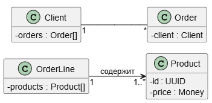

## О нотации UML. Типы UML

Диаграммы взаимодействия (interaction diagrams) описывают взаимодействие групп объектов в различных условиях их поведения.
UML определяет диаграммы взаимодействия нескольких типов, из которых
наиболее употребительными являются диаграммы последовательности.


Что почитать:
- [UML. Основы, Мартин Фаулер](https://k0d.cc/storage/books/UML/uml_osnovy_3-e_izd.pdf)
- [Unified Modeling Language Specification](https://www.omg.org/spec/UML/2.2/Superstructure/PDF)
- Хорошая статья с примерами [UML: что это за язык моделирования, зачем нужен, как создавать диаграммы на Unified Modeling Language / Skillbox Media](https://skillbox.ru/media/code/yazyk-uml-chto-eto-takoe-i-zachem-on-nuzhen/)
- [Диаграмма Деятельности и Диаграмма Состояний / Habr](https://habr.com/ru/articles/907808)

## Типы диаграмм

Сводная таблица типов UML диаграмм:

| №  | Название                                                | Краткое описание                                                                       | Для чего подходит                                                                                                  |
|----|---------------------------------------------------------|----------------------------------------------------------------------------------------|--------------------------------------------------------------------------------------------------------------------|
| 1  | Диаграмма классов (Class Diagram)                       | Показывает классы, их атрибуты, методы и связи (наследование, ассоциации, композиции). | Для описания структуры данных и кода.                                                                              |
| 2  | Диаграмма прецедентов (Use Case Diagram)                | Отображает взаимодействие акторов (пользователей, систем) с системой через сценарии.   | Для определения функционала и ролей (например на этапе анализа требований).                                        |
| 3  | Диаграмма последовательности (Sequence Diagram)         | Показывает обмен сообщениями между объектами во времени.                               | Для визуализации взаимодействия объектов в рамках одного прецедента (API-взаимодействия, процессы запроса–ответа). |
| 4  | Диаграмма активности (Activity Diagram)                 | Иллюстрирует потоки управления и данных, аналог блок-схемы.                            | Для описания бизнес-процессов, алгоритмов, логики функций, циклов.                                                 |
| 5  | Диаграмма состояний (State Machine Diagram)             | Описывает состояния объекта и переходы между ними по событиям.                         | Для описания поведения одного объекта в нескольких прецендентах, жизненные циклы сущностей.                        |
| 6  | Диаграмма компонентов (Component Diagram)               | Отображает структуру системы: модули, библиотеки, сервисы и их зависимости.            | При проектировании архитектуры, микросервисов, модульных приложений.                                               |
| 7  | Диаграмма развёртывания (Deployment Diagram)            | Показывает, где и как размещены компоненты (серверы, устройства, контейнеры).          | При проектировании инфраструктуры и DevOps-документации.                                                           |
| 8  | Диаграмма пакетов (Package Diagram)                     | Группирует классы и элементы в логические пакеты, показывает зависимости.              | Для визуализации модульной структуры и декомпозиции больших систем.                                                |
| 9  | Диаграмма коммуникации (Communication Diagram)          | Аналог последовательности, но фокусируется на структуре связей между объектами.        | Когда важно показать сеть взаимодействий, а не их порядок.                                                         |
| 10 | Диаграмма объектов (Object Diagram)                     | Отображает конкретные экземпляры классов и их связи в момент времени.                  | Для тестирования моделей, демонстрации примеров данных и связей.                                                   |
| 11 | Диаграмма взаимодействия (Interaction Overview Diagram) | Комбинирует элементы активности и последовательности для сложных сценариев.            | Для высокоуровневого описания процессов с вложенными взаимодействиями.                                             |
| 12 | Диаграмма времени (Timing Diagram)                      | Отображает изменения состояний или сигналов во времени.                                | Для систем реального времени, встраиваемых и аппаратных решений.                                                   |

### Диаграмма классов


### Диаграмма прецендентов

#### Элементы
| Элемент                | Описание                                       | Обозначение                                                                                                                             |
|------------------------|------------------------------------------------|-----------------------------------------------------------------------------------------------------------------------------------------|
| Актор                  | Участник взаимодействия, группы пользователей. |                                                                                                                            |
| Варианты использования | Действия, которые акторы могут выполнять.      | Эллипс с надписью, внутри которого содержится краткое имя варианта использования (существительное или глагол) с пояснительными словами. |
| Отношения              | Связывают акторов и варианты испьзования.      |                                                                                                                                         |
| Границы системы        |                                                | Прямоугольный блок, который окружает все варианты использования системы.                                                                |

#### Примеры
Полезные ссылки:
- [Использование диаграммы вариантов использования UML при проектировании программного обеспечения / Habr](https://habr.com/ru/articles/566218)
- [USE CASE — что это, из чего состоит и как избежать ошибок при написании](https://academy.mediasoft.team/article/use-case-chto-eto-iz-chego-sostoit-i-kak-izbezhat-oshibok-pri-napisanii)
- https://rb.ru/stories/use-case
- https://testengineer.ru/use-cases-quick-guide


Один из вариантов последующего уточнения диаграммы вариантов использования для примера рассматриваемой системы продажи


### Диаграмма последовательности

Полезные ссылки:
- [Шпаргалка по PlantUML](https://plantuml.com/ru/sequence-diagram)
- [Основные элементы и примеры](https://habr.com/ru/articles/814769)
- [Проектирование Sequence-диаграмм: руководство для системных аналитиков](https://habr.com/ru/articles/924396)
- https://zenuml.com/blog
- [Сервис для построения sequence-диаграмм](https://sequencediagram.org)
- [Самоучитель UML, Александр Леоненков](https://uml.methodologies.ru)
- https://vaiti.io/kak-sozdavat-sequence-diagrammy-s-pomoshhyu-plantuml-i-pochemu-bazovyj-skil-analitikov-mozhet-prigoditsya-ne-tolko-im
- [Примеры Tomcat диаграмм](https://tomcat.apache.org/tomcat-9.0-doc/architecture/startup.html)
  


Вариант диаграммы последовательности для моделирования телефонного разговора


### Диаграмма активности

Что почитать:
- [What is Activity Diagram?](https://www.visual-paradigm.com/guide/uml-unified-modeling-language/what-is-activity-diagram/)
- [Activity Diagrams - Unified Modeling Language (UML)](https://www.geeksforgeeks.org/system-design/unified-modeling-language-uml-activity-diagrams/)
- Элементы см. вот [тут](https://ensi-platform.gitlab.io/analyst-guides/tools/diagrams/uml/activity-diagram)

Диаграмма активностей (видов деятельности) отображает динамические аспекты поведения системы. Эта диаграмма представляет собой блок-схему, которая наглядно показывает, как поток управления переходит от одной деятельности к другой.

Диаграммы деятельности – это технология, позволяющая описывать
логику процедур, бизнес-процессы и потоки работ. Во многих случаях
они напоминают блоксхемы, но принципиальная разница между диа
граммами деятельности и нотацией блоксхем заключается в том, что
первые поддерживают параллельное процессы.


#### Декомпозиция операции
Диаграмма, разбитая на вложенную деятельность (subactivities).
Операции могут быть реализованы или как вложенные деятельности или как методы классов. Вложенную деятельность можно обозначить с помощью символа «граблей». Вызов метода отображается с помощью синтаксиса имя-класса::имя-метода. Можно также вставить в символ операции фрагмент кода, если поведение представлено не единственным вызовом метода.


#### Разделы
Можно разбить диаграмму деятельности на разделы (partitions), чтобы показать, кто что делает, то есть какие операции выполняет тот
или иной класс или подразделение.


#### Сигналы
Временной сигнал (time signal) приходит по прошествии времени. Такие сигналы могут означать конец месяца в отчетном периоде или приходить каждую секунду в контроллере реального времени.


Мы можем как принимать сигналы, так и посылать их. Это полезно,
когда мы посылаем сообщение, а затем должны ожидать ответа, перед
тем как продолжить.


#### Потоки и ребра
**Поток** (flow) и **ребро** (edge) употребляются для обозначения связи между двумя операциями. При возникновении трудностей с разводкой линий можно воспользоваться **разъемами** (connectors), которые позволят вам не рисовать линии на всем их протяжении.


#### Контакты и преобразования
Процедуры, как и методы, могут иметь параметры. Показывать на диаграмме деятельности информацию о параметрах не обязательно, но при
желании можно отобразить параметры с помощью **контактов** (pins).


### Диаграмма состояний

https://shesterov.by/tpost/n26iurdac1-uml-state-machine-diagram 


### Диаграмма развертывания


## PlantUML
[PlantUML](https://plantuml.com/ru) - это универсальный инструмент, позволяющий быстро и просто создавать широкий спектр диаграмм.



Полезные ссылки:
- Справочник по синтаксису [PlantUML](https://plantuml.com/ru)
- Статья [PlantUML — все, что нужно бизнес-аналитику для создания диаграмм в программной документации / Habr](https://habr.com/ru/articles/416077)
- Сервис для построения sequence-диаграмм [sequencediagram.org](https://sequencediagram.org)

Помимо UML с помощью PlantUML можно отображать:
- [JSON-данные](https://plantuml.com/ru/json) - можно добавлять в UML json-схемы
- [ER-диаграмма (нотация Чена)](https://plantuml.com/ru/er-diagram)
- Регулярные выражения [Regex](https://plantuml.com/ru/regex)
- [Wireframe](https://plantuml.com/ru/salt) - визуализация макетов, элементов интерфейса. Можно добавлять прямо в UML схемы.
- [Диаграмма Ганта](https://plantuml.com/ru/gantt-diagram)

### Использование кавычек

- <U+00AB> - для открывающих русских кавычек
- <U+00BB> - для закрывающих
- <U+0022> - для универсальных

{}
```yaml

``` 
{}