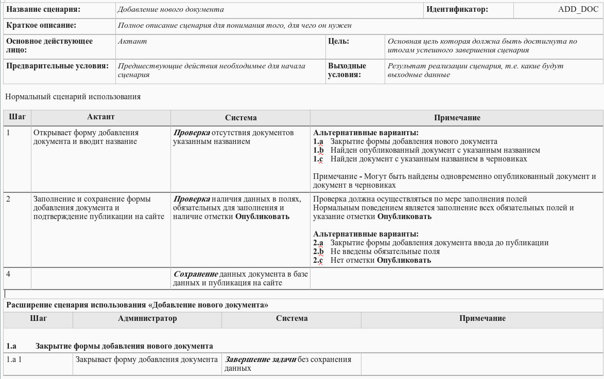

## Основное

Сводная таблица:
|                   | User story                                                                                                                                            | Use case                                                                                                                                  |
|-------------------|-------------------------------------------------------------------------------------------------------------------------------------------------------|-------------------------------------------------------------------------------------------------------------------------------------------|
| Цель              | Описать потребности и цели пользователя                                                                                                               | Дать подробное описание взаимодействия пользователя с системой (с учетом предусловий, альтернативных путей и постусловий)                 |
| Фокус             | На потребностях и целях пользователя                                                                                                                  | На взаимодействии пользователя с системой                                                                                                 |
| Для чего подходит | - для начальной (верхнеуровневой) оценки требований - для планирования работ в рамках итераций/спринтов - для проектов с частым изменением требований | - для сложных бизнес-процессов и сценариев - для сложных проектов с множеством интеграций - проект со строгими регуляторными требованиями |

Что почитать:
- [Методы формализации требований: Use Case vs User Story / Habr](https://habr.com/ru/amp/publications/825692)
- [Двадцать лет с юзкейсами: выжимаем практический опыт / Habr](https://habr.com/ru/companies/qiwi/articles/346438)
- [Усиление методики UseCase данное в книге Алистера Кобёрна / Habr](https://habr.com/ru/articles/468267)

## User story
**User story** (пользовательская история) - это краткое описание использования продукта, составленное с точки зрения пользователя. Оно помогает сосредоточиться на том, что конкретно нужно пользователю. 

Строится по шаблону:
- Как **[тип пользователя]**, я хочу **[действие]**, чтобы **[цель]**.

Пример:
- Как руководитель, я хочу видеть все задачи своего подразделения, чтобы иметь возможность оценить и перераспределить нагрузку.
- Как сотрудник техподдержки, я хочу видеть историю обращений клиента, чтобы быстрее и точнее ответить клиенту.
- Как исполнитель, я хочу получать уведомления о поступлении задач, чтобы своевременно увидеть и выполнить задачу.
- Как проверяющий документа, я хочу иметь возможность оставлять комментарии по документу, чтобы создатель документа увидел и исправил замечания.

## Use case
**Use Case** (сценарий использования) — это подробное описание взаимодействия пользователя с системой для достижения конкретной цели. В отличие от User Story, оно включает описание шагов, альтернативных сценариев и возможных исключений.

### Форматы описания

Есть несколько форматов описания Use Case, например:
- **Текстовый формат.** Включает в себя акторов, цели, предусловия, сценарии и постусловия. Этот формат легко читается и понимается, но может быть менее удобным для больших объемов информации.
- **Табличный формат.** Это Текстовое описание, представленное в формате таблицы. Содержит 2 столбца "раздел" (акторы, цели, сценарии) и его описание.
- **Диаграммы Use Case.** В этом случае каждый сценарий представлен в виде отдельного прямоугольника с указанием его имени, а акторы и связи между ними могут быть показаны стрелками.

Элементы текстового и табличного Use Case (шаблон):

| №  | Раздел                             | Описание                                                                                                                        |
|----|------------------------------------|---------------------------------------------------------------------------------------------------------------------------------|
| 1  | ID                                 | Номер сценария, например UC-001                                                                                                  |
| 2  | Название Use Case                  | Название сценария                                                                                                               |
| 3  | Автор                              | Имя автора                                                                                                                      |
| 4  | Дата создания/обновления           | Дата                                                                                                                            |
| 5  | Цель                               | Цель, которую хочет достичь пользователь.                                                                                       |
| 6  | Участники (Actors)        | Основной актор: например, Пользователь, Менеджер, Система Второстепенные акторы: например, Служба аутентификации, БД |
| 7  | Предусловия                        | Что должно быть выполнено до начала сценария — пользователь авторизован, есть доступ к данным и т.д.                            |
| 8  | Постусловия                        | Что должно быть достигнуто после выполнения сценария — данные сохранены, заказ оформлен и т.д.                                  |
| 9  | Основной поток событий (описание)  | Шаги взаимодействия: 1. Действие пользователя → Реакция системы 2. Действие пользователя → Реакция системы                  |
| 10 | Альтернативные потоки (расширение) | A1. Условие → Альтернативное поведение системы A2. Условие → Альтернативное поведение системы                                  |
| 11 | Исключения/Ошибки                  | Неожиданные ситуации, которые прерывают выполнение сценария — сбой сети, ошибка данных и т.п.                                   |
| 12 | Частота использования              | Редко / Ежедневно / Постоянно и т.п.                                                                                            |
| 13 | Особые требования                  | Нефункциональные требования: скорость работы, безопасность, интерфейс и т.д.                                                    |
| 14 | Связанные сценарии                 | Перечень других Use Case, связанных с данным                                                                                    |

Полезные ссылки:
- Пример шаблона от Profinit [use_case_template.doc](https://profinit.eu/wp-content/uploads/2016/03/use_case_template.doc)
- [Use Cases: Diagram & Examples](https://www.inflectra.com/Ideas/Topic/Use-Cases.aspx)
- [Варианты на все случаи жизни: как написать полезный use case](https://practicum.yandex.ru/blog/chto-takoe-use-case-kak-ih-napisat/)

#### Текстовый
Пример заполнения на основе User story: *«Как руководитель, я хочу видеть все задачи своего подразделения, чтобы иметь возможность оценить нагрузку.»*

1. Название
   - Просмотр задач подразделения руководителем
2. Цель
   - Получить информацию о загруженности сотрудников подразделения и при необходимости перераспределить или скорректировать задачи.
3. Основные участники
    - Основной актор: Руководитель подразделения
    - Второстепенные акторы: Система управления задачами (CRM Битрикс24)
4. Предусловия
   - Руководитель авторизован и имеет доступ к задачам своего подразделения.
   - В системе заведены актуальные задачи, назначенные на сотрудников.
5. Постусловия
   - Руководитель видит актуальный список задач по подразделению и может оценить нагрузку команды.
6. Основной поток событий
    1. Руководитель входит в систему.
    2. Переходит в раздел «Задачи подразделения».
    3. Система отображает все задачи сотрудников подразделения с фильтрацией по статусу, срокам и приоритету.
    4. Руководитель анализирует данные и оценивает загрузку.
7. Альтернативные потоки
    - A1. Нет задач для отображения — система сообщает об этом.
    - A2. Применены фильтры — отображаются только соответствующие задачи.
8. Исключения / Ошибки
   - Ошибка авторизации, недоступность сервера, сбой при загрузке данных из базы данных.
9. Особые требования
   - Интерфейс поддерживает фильтрацию и сортировку по статусу, исполнителю и срокам.
   - Возможность визуализации задач в виде диаграммы Ганта.

#### Табличный
Пример заполнения текстового в табличном формате:

| № | Раздел                      | Описание                                                                                                                                                                                                                                              |
|---|-----------------------------|-------------------------------------------------------------------------------------------------------------------------------------------------------------------------------------------------------------------------------------------------------|
| 1 | Название                    | Просмотр задач подразделения руководителем                        |
| 2 | Цель                        | Получить информацию о загруженности сотрудников подразделения и при необходимости перераспределить/скорректировать задачи                                                                                                                                                                 |
| 3 | Основные участники | Основной актор: Руководитель подразделения Второстепенные акторы: Система управления задачами (CRM Битрикс24)
| 4 | Предусловия                 | Руководитель авторизован и имеет доступ к задачам своего подразделения. В системе заведены актуальные задачи, назначенные на сотрудников.                                                                                                             |
| 5 | Постусловия                 | Руководитель видит актуальный список задач по подразделению и может оценить нагрузку команды.                                                                                                                                                         |
| 6 | Основной поток событий      | 1. Руководитель входит в систему. 2. Переходит в раздел «Задачи подразделения». 3. Система отображает все задачи сотрудников подразделения с фильтрацией по статусу, срокам и приоритету. 4. Руководитель анализирует данные и оценивает загрузку. |
| 7 | Альтернативные потоки       | A1. Нет задач для отображения — система сообщает об этом. A2. Применены фильтры — отображаются только соответствующие задачи.                                                                                                                        |
| 8 | Исключения / Ошибки         | Ошибка авторизации, недоступность сервера, сбой при загрузке данных из БД.                                                                                                                                                                            |
| 9 | Особые требования           | Интерфейс поддерживает фильтрацию и сортировку по статусу, исполнителю и срокам. Возможность визуализации в диаграмме Ганта.                                                                                   |

#### Диаграмма UML
Подробнее почитать можно [вот тут](/docs/sys-anal/formalization/uml/#диаграмма-прецендентов)

### Примеры
Пример из комментариев к [статье](https://habr.com/ru/articles/468267)

