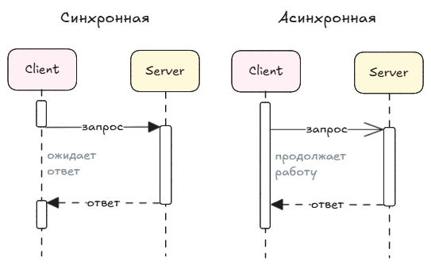

интеграционных технологий и форматов данных (REST, SOAP, XML, JSON);

## Интеграционные технологии
### REST

### SOAP

## Интеграционные форматы
### XML
### JSON

## Синхронная и асинхронная интеграция

Есть два вида интеграций:
- синхронная
- асинхронная

Схема взаимодействия

## REST API
