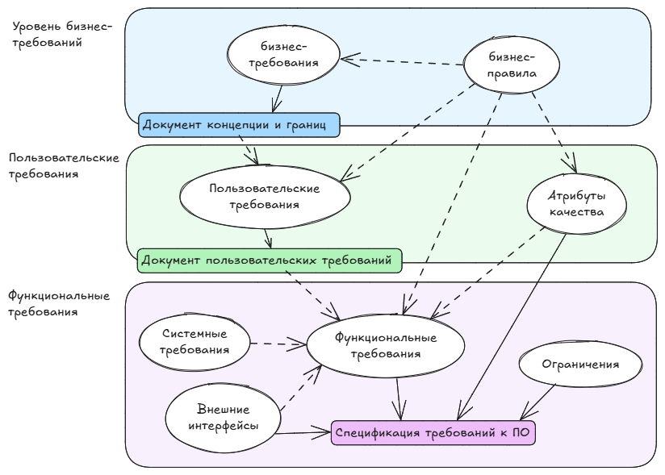

**Требования** - это спецификация того, что должно быть реализовано. В них описано поведение, свойства/атрибуты системы.

На основе "Разработка требований к программному обеспечению" Карл Вигерс и Джой Битти.

## Уровни и типы требований
Требования к ПО состоят из трех уровней:
1. Бизнес-требования
2. Пользовательские требования
3. Функциональные требования

Вдобавок к каждой системе есть свои **нефункциональные требования**.

Список терминов:
| Понятие                     | Определение                                                                                                                                | Пример                                                                                   |
|---------------------------------|------------------------------------------------------------------------------------------------------------------------------------------------|------------------------------------------------------------------------------------------|
| Бизнес-требование               | Высокоуровневая бизнес-цель заказчика системы                                                                                                  | "Увеличить продажи за пределами Росссии на 25% за следующие полгода".                    |
| Бизнес-правило                  | Стандарты, законы, правила, определяющие или ограничивающие определенный аспект бизнеса. По сути это не требование, а источник требований ПО.  |                                                                                          |
| Ограничение                     | Ограничение на выбор вариантов, доступных при проектировании и разработке продукта.                                                            |                                                                                          |
| Внешнее требование к интерфейсу | Описание взаимодействия между системой и внешним миром (другое ПО, пользователи, аппаратура).                                                  |                                                                                          |
| Характеристика (feature)        | Возможности системы, представляющие ценность для пользователя и описаны рядом функциональных требований                                        | Избранные страницы, закладки браузера                                                    |
| Функциональное требование       | Описание требуемого поведения системы в определенных условиях.                                                                                 |                                                                                          |
| Нефункциональное требование     | Описание свойства/особенности, которым должно обладать системы или ограничения, которое должна соблюдать система.                              |                                                                                          |
| Атрибут качества                | Вид нефункционального требования, описывающего характеристику сервиса/производительности продукта.                                             | Производительность, доступность                                                          |
| Системное требование            | Требование верхнего уровня к продукту, состоящему из многих подсистем, которые могут представлять собой ПО или совокупность ПО и оборудования. |                                                                                          |
| Пользовательское требование     | Задача, которую определенные классы пользователей должны иметь выполнять в системе или требуемый атрибут продукта.                             | Поиск орфографических ошибок, добавление слов в словарь, выбор языка проверки орфографии |

### Бизнес-требования
Описывают *почему* организации нужна такая система.

Пример:
- На 25% снизить затраты на сотрудников у стойки в аэропорту.

Документы:
- Документ о концепции и границах (vision and scope document)
- Устав проекта (project charter)
- Вариант использования (business case)
- Документ рыночных требований (market requirements document)

### Пользовательские требования
Описывают цели или задачи, которые пользователи должны иметь возможность выполнять с помощью разрабатываемого продукта. Включают в себя описания атрибутов или характеристик продукта, которые важны для удовлетворения пользователей.

Пользовательские требования описывают, *что* пользователь должен иметь возможность делать с системой. Тут важно понять, что реальные пользователи хотят достичь с помощью продукта.

Пример:
- Регистрация на рейс с помощью веб-сайта или терминала в аэропорту. В формате пользовательской истории: "Как пассажир я хочу зарегистрироваться на рейс, чтобы можно было сесть на самолет".

Документы:
- Варианты использования
- Пользовательские истории
- Таблицы "Событие - отклик"

### Функциональные требования
Определяют *каким* должно быть поведение продукта в тех или иных условиях. Описываются в форме "должен" или "должна".

Пример:
- У пассажира должна быть возможность распечатать посадочные талоны на все рейсы, на которые он зарегистрировался.
- Если в профиле пассажира не указаны предпочтения по выбору места, система резервирования должна сама назначить ему место.

Документы:
- Спецификации требований к ПО (software requirements specification, SRS)

### Нефункциональные требования

В дополнение к функциональным требованиям спецификация SRS содержит нефункциональные. Нефункциональные требования могут описывать:
- Атрибуты качества (параметры качества, требования по уровню обслуживания). Например: производительность, доступность, переносимость.
- Внешние интерфейсы - подключения к др. ПО, аппаратным устройствам, пользователям.
- Ограничения - накладывают границы на возможности выбора разработчика при проектировании продукта.

## Разработка и управление требованиями

тут рисунок 
### Разработка требований
#### Выявление и сбор
Выявление и сбор требований (elicitation). Ключевые действия:
- Определение классов ожидаемых пользователей продукта и других заинтересованных лиц.
- Понимание задач и целей, а также бизнес-целей, которым соответствуют эти задачи.
- Изучение среды, в которой будет использоваться новый продукт.
- Работа с отдельными людьми каждого класса пользователей для понимания их потребностей и ожиданий в отношении качества.

#### Анализ
Анализ требований (analyzing requirements) - получение более точного и обширного понимания требований. Ключевые действия:
- анализ информации от пользователей (отделение их задач от функциональных и нефункциональных и др.)
- распределение требований (по виду требований, по компонентам ПО)
- разложение высокоуровневых требований до нужного уровня детализации
- согласование приоритетов

#### Документирование
Документирование (specification) - преобразование собранных потребностей в письменные требования и диаграммы.

#### Утверждение
Утверждение требований (validation). Ключевые действия:
- проверка задокументированных требований для устранения всех недостатков до принятия требований группой разработки.
- разработка приемочных тестов и критериев приемки.

### Управление требованиями
Действия:
- определение основной версии требований (согласовнных, проверенных и одобренных) обычно для конкретной итерации разработки
- оценка влияния предлагаемых требований
- обсуждение новых обязательств, основанных на оцененном влиянии изменения требований
- определения зависимостей между требованиями
- отслеживание отдельных требований до проектирования
- отслеживание состояния требований на протяжении всего проекта

## Проблемы при работе с требованиями
Многие люди ошибочно считают, что время, потраченное на обсуждение требований - просто отсрочка выпуска продукта. На самом деле, если не уделить должное внимание проработке требований на старте, то в дальнейшем исправление будет стоить все дороже. Возможные выгоды:
- меньше дефектов в требованиях и в готовом продукте
- меньше переделок
- быстрее разработка
- меньше ненужных функций
- ниже стоимость модификации
- меньше недопонимания
- меньше расползание границ проекта
- удовлетворение всех сторон выше

### Недостаточное вовлечение пользователей
Причины:
- Заказчик не понимает, почему важнособрать требования.
- Разработчики считаю, что все знают о потребностях пользователей.
- Трудно добраться до реальных пользователей.
- Бизнес-аналитик может неправильно понять и задокументировать потребности.

Как предотвратить:
- регулярные совещания с пользователями, 
- тщательная проверка пользователями.

### Небрежное планирование
- Неопределенные, плохо понятые требования порождают слишком оптимистичные оценки.
- Недостаточное взаимодействие с пользователями
- Недетализированная спецификация

Как предотвратить:
- Проработка требований с пользователями и рзработчиками.

### Разрастание требований пользователей
Требования могут меняться из-за чего проект выходит за установленные рамки по срокам и по бюджету. Требования *всегда* будут изменяться и расти, поэтому важно заложить доп. ресурсы на это еще на старте.

Как предотвратить:
- уточнить бизнес-цели, стратегическое видение, ограничения и критерии успеха. 
- Приоритетизация новых требований.

### Двусмысленные требования
- Пользователь может инетприировать одно и то же по-разному.
- У разных читателей возникает разное понимание требования.

Как предотвратить:
- Избегать двусмысленных слов и фраз.
- Приглашать различных представителей пользователей для официальной экспертизы.
- Написание варианта тестирования.
- Построение прототипа.

### Требования-"бантики"
Требования-"бантики" - отсутствующие в спецификации функции, добавленные разработчиками. Требования красивых элементов интерфейса, не представляющих ценности для продукта.

Как предотвратить:
- Четкое соблюдение требований спецификации.
- Понимать, почему именно это требование включено в продукт.
- Проверка, входит ли требование в рамки проекта.

### Пропущенные классы пользователей

Как предотвратить:
- После идентфикации убедитесь, что голос каждого услышан.
- Не забудьте о неочевидных пользователях (например о сотрудниках поддержки).
- Возможно есть пользователи, которые не в курсе о существовании проекта.

## Методы сбора требований

1. Анкетирование
2. Интервью
3. Переписка (составление ТЗ с редактированием с 2х сторон)
4. Изучение существующей системы, инструкций, орг. структуры, шаблоны документов, отчетов. 
5. Наблюдать (я смотрю пользовательские сессии и историю изменений, смотрю как карточки заполняются)
6. Авторский надзор, обучение. Во время такого надзора сидя с пользователями понимаешь насколько это подходит их процессу.
7. Опытная эксплуатация.

## Вопросы
21.   Какие группы требований вы знаете?
22.   Что входит в нефункциональные требования?
23.   Каким критериям должны соответствовать требования?
24.   Вам аналитик принес список требований. Как вы их оцените?
25.   Приходилось ли вам писать Use cases? Как пишутся Use cases?
26.   Приходилось ли вам писать User story?
27.   Вы продаете кофейные аппараты. Я заказчик.  Какие вопросы вы зададите потенциальному заказчику, который хочет купить кофейный аппарат в офис? (заказчик при этом на все вопросы отвечает «не знаю»)
28.   С какими группами заинтересованных лиц вы общались?

## Примеры
- [Примеры функциональных заданий сервисов ensi](https://ensi.tech/resources/examples-fz)