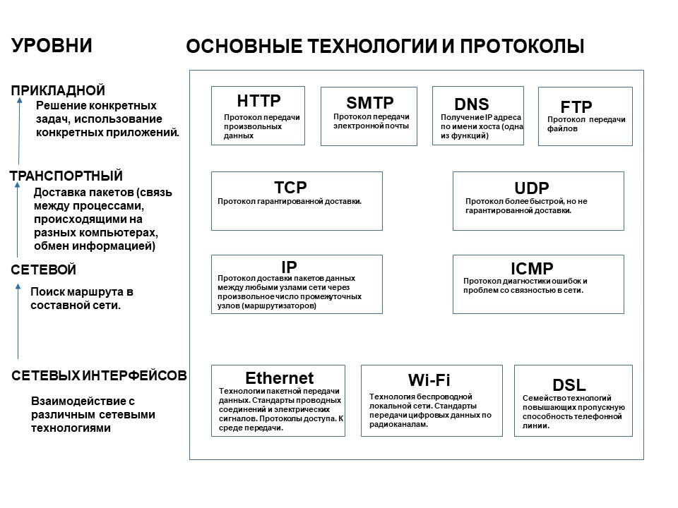

Источники информации: 
- [Youtube. Что такое TCP/IP: Объясняем на пальцах](https://www.youtube.com/watch?v=2I1HnSN1H9o) - отличное видео на основе статьи [Протокол TCP/IP или как работает Интернет (для чайников)](http://www.ofnet.ru/osnovy-interneta/tcpip/). После этого становится сильно понятнее - рекомендую.
- [Skillbox. Модель TCP/IP: что это такое и как она работает](https://skillbox.ru/media/code/model-tcpip-chto-eto-takoe-i-kak-ona-rabotaet/) - тут простым языком описан принцип работы TCP/IP.
- [Что такое HTTP и зачем он нужен](https://skillbox.ru/media/code/chto-takoe-http-i-zachem-on-nuzhen/?utm_source=media&utm_medium=link&utm_campaign=all_all_media_links_links_articles_all_all_skillbox) - простым языком объясняется протокол HTTP.

## Что такое TCP/IP

**Модель TCP/IP** — это стек протоколов, которые задают правила передачи данных по Сети.

**TCP (Transmission Control Protocol)** отвечает за обмен данными. Он управляет их отправкой и следит за тем, чтобы они дошли до получателя в целости.

**IP (Internet Protocol)** отвечает за адресацию. Его задача — связывать друг с другом устройства и нарезать данные на пакеты для удобной отправки. Чтобы протокол мог быстро найти дорогу от одного компьютера к другому, придумали IP-адреса — уникальные идентификаторы, которые есть у каждого устройства в Сети.

Эти два протокола работают в связке: IP строит маршрут, а TCP контролирует, чтобы всё передавалось правильно.

В составе стека есть и другие известные протоколы передачи данных – UDP, FTP, ICMP, IGMP, SMTP. Они представляют собой частные случаи применения технологии: например, у SMTP единственное предназначение заключается в отправке электронных писем. 

## Уровни модели
Всего выделяют 4 уровня – канальный (интерфейсный), межсетевой, транспортный и прикладной.

- **канальный уровень** — отвечает за взаимодействие по сетевому оборудованию, например по Ethernet-кабелю или Wi-Fi;
- **межсетевой уровень** — помогает отдельным сетям общаться друг с другом;
- **транспортный уровень** — отвечает за передачу данных между устройствами, например, по протоколам TCP и UDP;
- **прикладной уровень** — помогает приложениям общаться друг с другом с помощью интерфейсов или API.

### Канальный (сетевой интерфейс)
Для чего нужен: устанавливать физическое соединение между устройствами в локальной сети с помощью радиоволн и проводов.

Примеры протоколов: Ethernet, Wi-Fi, Bluetooth.

Как работает: данные делятся на небольшие кусочки (фреймы) и передаются между устройствами. Каждый фрейм содержит часть передаваемой информации и служебные данные.

Чтобы понять, куда отправлять фреймы, используют адресацию канального уровня — MAC-адреса. Это уникальные физические адреса устройств — по ним протоколы канального уровня определяют отправителей и получателей.

Ещё одна важная задача канального уровня — проверять, что данные передаются безошибочно. Для этого протоколы используют свои средства проверки:

- Если возникла ошибка, устройство отправляет фрейм обратно, а второе устройство передаёт его ещё раз.
- Если всё прошло удачно, то фрейм передаётся на следующий уровень для обработки.

### Межсетевой
Для чего нужен: строить маршруты между устройствами по всему интернету — этот процесс называется маршрутизацией.

Примеры протоколов: IP, ICMP, ARP.

Как работает: IP-протокол вычисляет местонахождение устройств по их IP-адресам, а также строит до них кратчайшие пути и делит данные на пакеты.

Чтобы определить, где находится получатель и как построить путь к нему, IP обращается к системе DNS — она знает IP-адреса всех устройств в интернете.

Когда адрес получен, передаваемый файл разбивается на небольшие части — пакеты. Они содержат фрагменты данных и служебную информацию, например IP-адреса отправителя и получателя.

После этого начинается передача пакетов по маршрутизаторам и коммутаторам. Но процессом отправки занимается уже следующий уровень — транспортный.

### Транспортный

Для чего нужен: передавать данные по маршруту, построенному на предыдущем уровне.

Примеры протоколов: TCP, UDP.

Как работает: устанавливает надёжное соединение между устройствами, а затем следит за передачей данных по нему и исправляет ошибки.

Главных протокола здесь два:

- TCP (Transmission Control Protocol) — гарантирует передачу всех данных без потерь. Полезен при отправке текстовых файлов.
- UDP (User Datagram Protocol) — не гарантирует передачу данных без потерь, но обеспечивает хорошую скорость. Полезен при просмотре видео или прослушивании музыки в интернете.

### Прикладной
Для чего нужен: настраивать связи между приложениями — например, между браузером и серверным софтом.

Примеры протоколов: HTTP, FTP, SMTP.

Как работает: использует различные протоколы и сервисы, которые помогают приложениям обмениваться данными по интернету.

На прикладном уровне хранятся протоколы для всего, что нужно человеку: отправки имейлов, веб-браузинга, передачи файлов и удалённого доступа. Вот некоторые из них:

- HTTP (Hypertext Transfer Protocol) — самый популярный протокол для передачи данных по интернету.
- FTP (File Transfer Protocol) — ещё один известный протокол, заточенный под передачу файлов. Порт 20/21
- SMTP (Simple Mail Transfer Protocol) — протокол для отправки электронных писем.
- SSH (Secure Shell) - протокол, позволяющий производить удалённое управление операционной системой и туннелирование TCP-соединений (например, для передачи файлов). Порт 22

Этот уровень нужен, чтобы упростить пользователям передачу данных по интернету. Именно с его помощью программисты и обычные пользователи взаимодействуют с моделью TCP/IP.

#### Порты и сокеты - что это и зачем они нужны
Процессы, работающие на прикладном уровне, «общаются» с транспортным, но они видны ему как «черные ящики» с зашифрованной информацией. Зато он понимает, на какой IP-адрес адресованы данные и через какой порт надо их принимать. Этого достаточно для точного распределения пакетов по сети независимо от месторасположения хостов. Порты с 0 до 1023 зарезервированы операционными системами, остальные, в диапазоне от 1024 до 49151, условно свободны и могут использоваться сторонними приложениями.

Комбинация IP-адреса и порта называется **сокетом** и используется при идентификации компьютера. Если первый критерий уникален для каждого хоста, второй обычно фиксирован для определенного типа приложений. Так, получение электронной почты проходит через 110 порт, передача данных по протоколу FTP – по 21, открытие сайтов – по 80.

## Как работает TCP/IP
Процесс пошагово:

1. Вы нажимаете на ссылку или вводите адрес сайта в строке браузера.
2. Браузер создаёт HTTP-запрос к серверу, чтобы тот отправил вам нужную страницу.
3. Протокол IP с помощью системы DNS находит сервер, где лежит страница, и разбивает её на пакеты.
4. Далее в игру вступает TCP — он устанавливает надёжное соединение между компьютером и сервером и следит, чтобы пакеты не потерялись по дороге.
5. Браузер склеивает пакеты воедино и рендерит страницу.