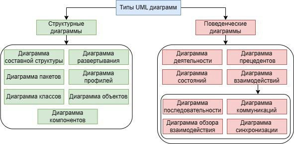
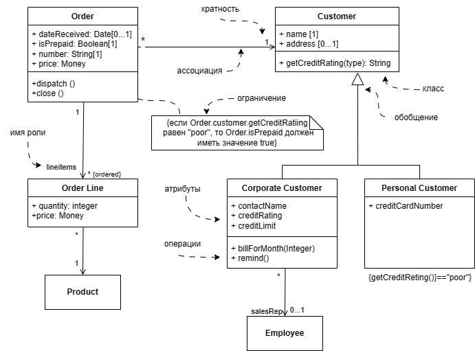

## О нотации UML. Типы UML

что это за язык моделирования, зачем нужен, как создавать диаграммы на Unified Modeling Language / Skillbox Media

Типы диаграмм

Хорошая статья с примерами по Uml:

[UML: что это за язык моделирования, зачем нужен, как создавать диаграммы на Unified Modeling Language / Skillbox Media](https://skillbox.ru/media/code/yazyk-uml-chto-eto-takoe-i-zachem-on-nuzhen/)

## Диаграмма классов

## Примеры Use Case

