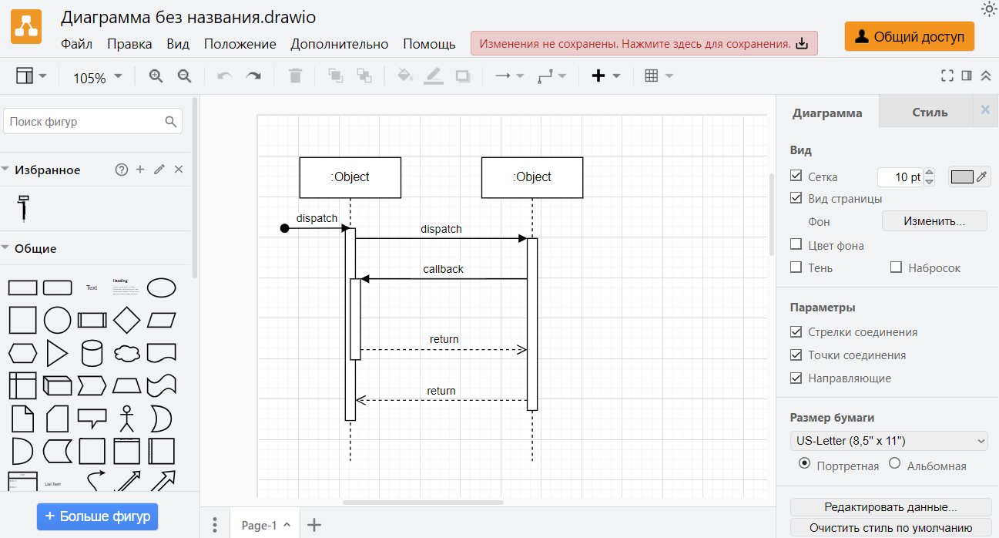

Тут инфо о всех программах, которые мне улучшают жизнь и работу.

## Горячие клавиши Windows

### История буфера обмена

Стандартный буфер, который все привыкли использовать через контекстное меню «Скопировать» и «Вставить» `Ctrl` + `C`, `Ctrl` + `V`, имеет лишь одну «ячейку памяти». его бывает очень мало. Начиная с Windows 10 Microsoft внедрила журнал буфера обмена, который умеет запоминать до 25 элементов. Копировать и вставлять при этом можно текст, ссылки, изображения и другой контент.

Открыть его можно нажатием `Win` + `W`

Выглядит так:

[Подробнее](https://lifehacker.ru/kak-posmotret-bufer-obmena-windows-10-11/?ysclid=lwhz4dfeo077193900)

### Встроенная запись экрана
Запускается клавишами `Ctrl` + `G`.

Плюсы
- Не нужно доп. ПО.

Минусы
- Записывает в пределах одного окна приложения (не делает запись всего экрана).

## Менеджер паролей

От себя рекомендую 2 менеджера паролей, чтобы не хранить их в текстовом файле или в заметках в телеграм. Обязательно к применению в работе!

### [BitWarden](https://bitwarden.com/)

Использую обычно для личных целей. Устанавливается в браузер как расширение.

Плюсы:

- Простой и красивый.
- Имеет синхронизацию между устройствами, включая мобильное приложение.
- Есть горячие клавиши для автозаполнения на странице.
- Можно разделить пароли по пространствам.

Минусы:

- Подходит только для заполнения в браузере.

### [KeePassXC](https://keepassxc.org/)

Рекомендую использовать в работе - можно задать автоввод для десктопных программ.

Плюсы:

- Можно задать автоввод для десктопных программ.
- Можно делать папки, иконки.
- Есть экспорт и импорт файлов. Подойдет, если хотите поделиться логинами и паролями.

Минусы:

- Интерфейс устарел.

## Скриншотер

Я использую [Скриншотер mail.ru](https://screenshoter.mail.ru). Его преимущества:

- Можно замылить текст.
- Можно ставить поочередность действий на скриншоте.
- Можно выделить фигурами\маркером.

Также рекомендую [Joxy](https://joxi.ru/tour/win).

## Планировщики и органайзеры
### Notion
Notion - очень многофункциональный сервис. Я использую его для заметок/конспектов, планирования задач, структуризации любой информации с возможностью планировать ее в календаре (можно интегрировать с гугл календарем или с календарем notion).

Примеры моего использования:

- Задачи на день по шаблону

- Заметки и конспекты

Общая страница:

Пример конспекта:

- Просмотр информации о собеседованиях. Я настроила себе таблицу, канбан-доску и календарь:



   
   
   



- Список желаний



   
   



Это некоторые из вариантов его использования. Из него можно сделать базу знаний и даже crm-систему :)

[Статья, где можно подробнее почитать про Notion | Habr](https://habr.com/ru/articles/541182/)

### Календарь Notion
Для работы использую Битрикс24 для планирования задач на день. Все, что не относится к работе я записываю в Notion Calendar. Использую его, т. к. он классно сочетается с моими задачами и пространствами в Notion.

Notion выглядит вот так:

- [Ссылка на Notion Calendar](https://calendar.notion.so/)
- [Ссылка на Google Calendar](https://calendar.google.com/)

## Схемы и макеты

### draw.io
Использую для составления диграмм без нотаций и для UML диаграмм. Много шаблонов, очень простой в использовании.

Ссылка: https://app.diagrams.net/

### camunda
Использую для bpmn схем.

Ссылка: https://modeler.cloud.camunda.io

### Figma

Использую для отрисовки прототипов, макетов интерфейса, дизайна.

Ссылка: https://www.figma.com

### Miro

Интерактивная доска. Есть много разных шаблонов. Основное преимущество - удобно работать в команде.

Ссылка: https://miro.com/ru/

### Xmind

Xmind — это инструмент для построения интеллект-карт и проведения мозговых штурмов.

Ссылка: https://xmind.app

### Рисовалка excalidraw

Тут можно нарисовать простые и красивые схемки. Больше подходит для неформализованных схем и и презентаций. Есть мой любимый стиль "от руки".

Ссылка: https://excalidraw.com

## Docs-as-code и разработка
### git

Подробнее о git: https://git-scm.com/book/ru/v2/

### VS Code
Подойдет для составления openApi документации, uml схем через planUML, редактирования каких-то файлов разметки (md, xml, json, html, xsd и любые другие).

Очень быстрый, простой, бесплатный и имеет кучу расширений, даже draw.io в него можно встроить.

{}
- Project Manager - для сохранения папок в проекты для удобного открытия их через VS Code.
- GitHub Markdown Preview - для просмотра файла md в реальном времени.
- Markdown All in One - все, что может пригодится при сосздании md файлов.
- Markdown PDF - для экспорта md файла в pdf.
- Russian - Code Spell Checker - для проверки правильности русского текста.
- OpenAPI (Swagger) Editor.
- IntelliJ IDEA Keybindings - для тех, кто привык к горячим клавишам InteliJ IDEA.
- XML.
- json.
{}

Подробнее: https://code.visualstudio.com

### InteliJ IDEA

IDE для разработки на Java и Kotlin.

Подробнее: https://www.jetbrains.com/ru-ru/idea

