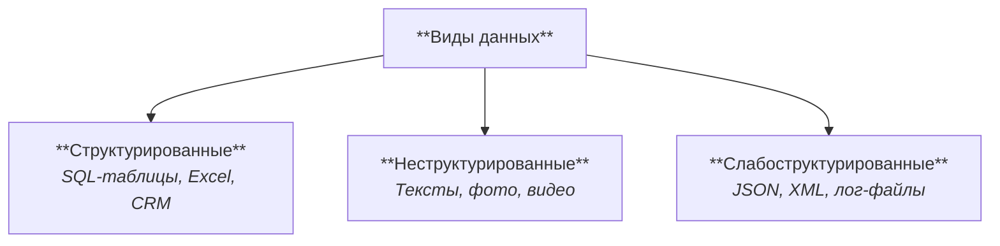
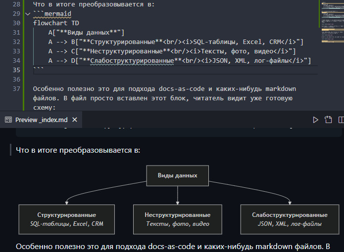
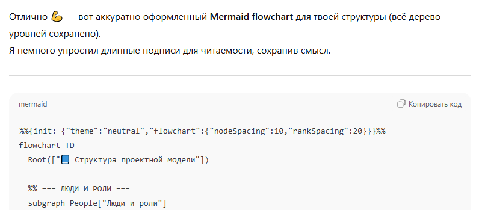
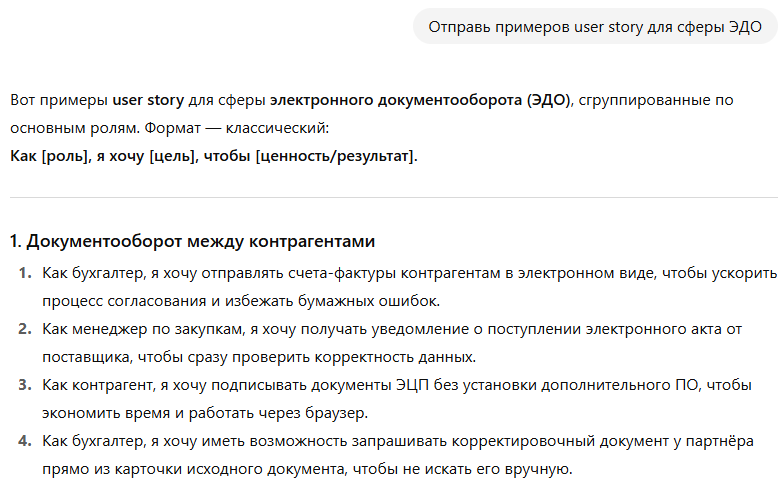
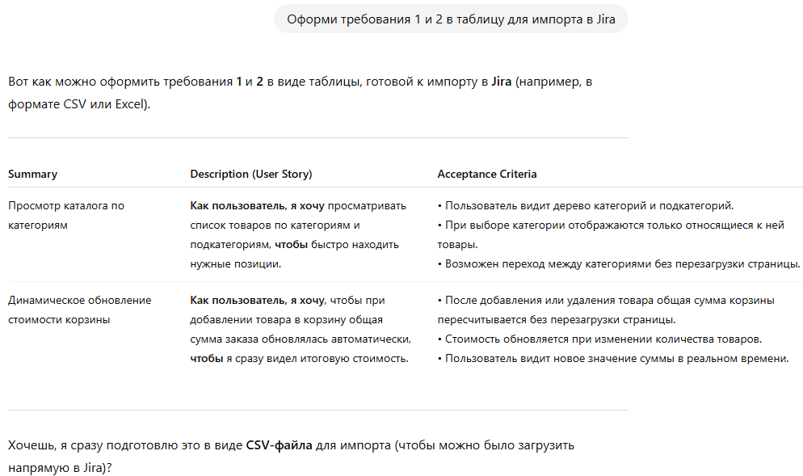
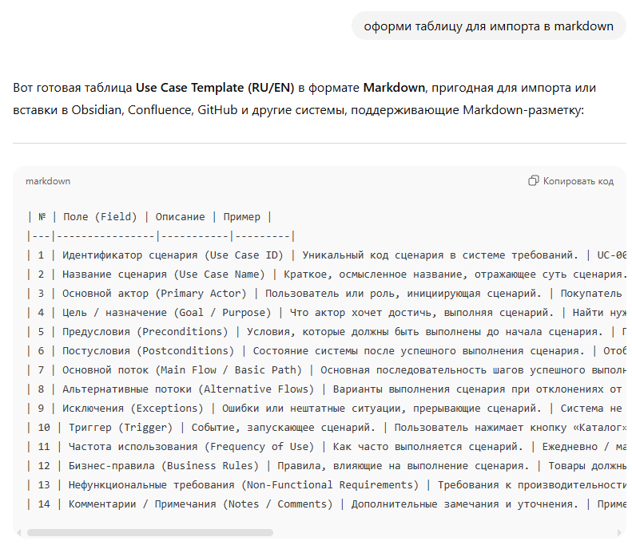
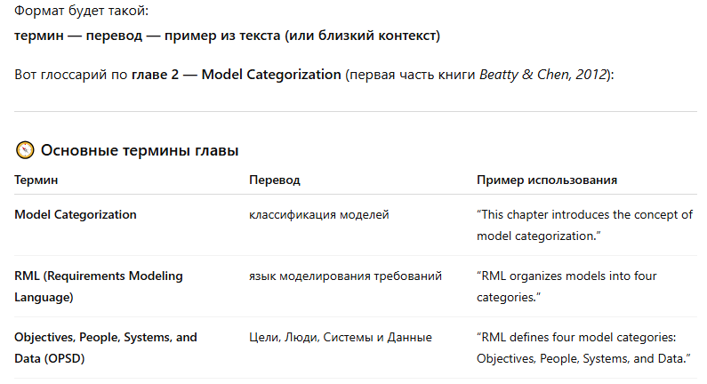
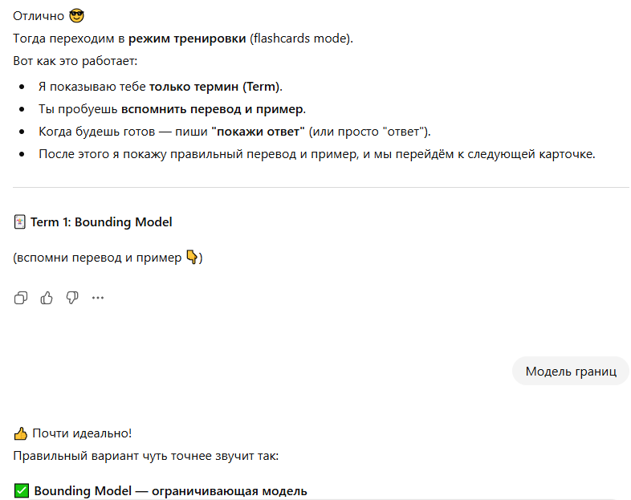

Библиотека промтов для ChatGPT на русском языке https://prompt1.ru/

## Простая визуализация mermaid

Для упрощения восприятия часто требуется визуализировать что-то: диаграммы, таблицы, блок-схемы.

Чтобы не рисовать вручную и не генерировать целую картинку (с чем могут возникнуть проблемы), можно очень просто попросить:

```
сделай mermaid flowchart (или PlantUML). 
От блока Виды данных идет три стрелки к: Структурированные, неструктурированные и слабоструктурированные. 
В каждом блоке курсивом указаны примеры, жирным шрифтом выделено название блока
```

Получим:
```
flowchart TD
    A["**Виды данных**"]
    A --> B["**Структурированные**<br/><i>SQL-таблицы, Excel, CRM</i>"]
    A --> C["**Неструктурированные**<br/><i>Тексты, фото, видео</i>"]
    A --> D["**Слабоструктурированные**<br/><i>JSON, XML, лог-файлы</i>"]
```

Что в итоге преобразовывается в:


Особенно полезно это для подхода docs-as-code и каких-нибудь .markdown файлов. В файл просто вставлен блок mermaid, читатель видит уже готовую схему:



Нет проблем с хранением картинок, и с таких схем можно копировать текст, что иногда весьма полезно.

## Текст в структуру


Ответ:



После уточнений получили диаграмму

## Формализация требований
### User story

Можно использовать для старта формирований требований или чтобы больше разобраться в предметной области.



Их потом можно подготовить для импорта в Jira:



### Markdown



## Английский

Его можно использовать не только для перевода, но и для обучения.

**Пример:** Мне понадобилось прочитать книгу на английском, но там много незнакомых мне слов и терминов. Чтобы облегчить процесс, можно загрузить в него файл книги и просить составить глоссарий:



А потом вместе с ним можно интерактивно повторить слова в режиме тренировки:



Я еще сохраняю все слова файлик, если вдруг понадобится куда-то загрузить.