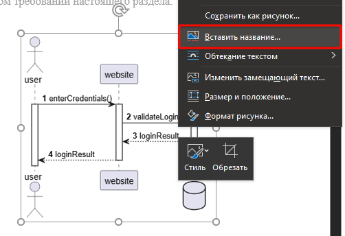
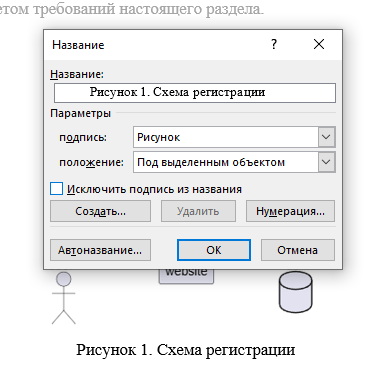
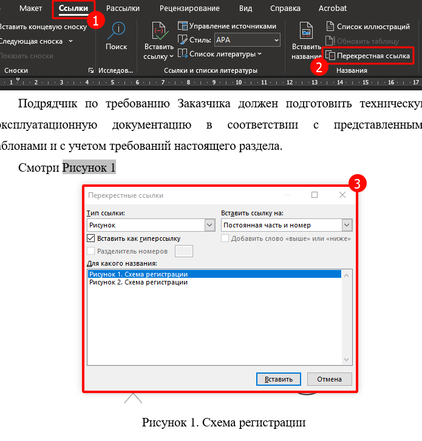

## Введение

Тут хранятся шпаргалки по работе с Word.

Полезные ссылки:
- [Повышаем эффективность работы с Word / Хабр, aririkatoku](https://habr.com/ru/articles/651801/)
- [Список горячих клавиш Word](https://support.microsoft.com/ru-ru/accessibility/word/keyboard-shortcuts-in-word)

## Горячие клавиши

Полный список см. [Список горячих клавиш Word](https://support.microsoft.com/ru-ru/accessibility/word/keyboard-shortcuts-in-word)

- `Ctrl` + `Alt` + `S` - разделение окна документа
- `Ctrl` + `E` - выравнивание содержимого по центру страницы
- `SHIFT` + `F3` - изменение регистра букв
- `F4` – повтор последнего действия
- `Alt` + `двойной клик в любом поле таблицы` – выделить таблицу

## Автонумерация рисунков и таблиц
### Вставка подписи с номером

ПКМ по рисунку -> "Вставить название" (либо вкладка "Ссылки" -> "Вставить название"):

В окошке заполняем название, выбираем подпись и положение, тут можно сделать зависимость от номера главы в "Нумерация":

По итогу под рисунком появилось название с номером, который не нужно будет вписывать и править вручную.

Следующие рисунки можно нумеровать также, либо копированием:
1. Вставили название для одного рисунка.
2. Скопировали сформированное название с номером.
3. Вставили под другой рисунок.
4. Обновили

### Ссылка на номер рисунка

Вкладка "Ссылки" -> "Перекрестная ссылка" -> Заполняем тип, выбираем название:

### Обновление номеров и ссылок

При изменении нумерации главы или порядка рисунков номера сразу не обновляются. Для их обновления есть несколько вариантов:
- выделили номер и нажали `F9` 
- перешли в режим печати `Ctrl` + `P` и вернулись


  Переход в режим печати `Ctrl` + `P` - это самый быстрый и удобный способ обновить сразу все номера и ссылки.


#### Склонение и формат ссылки

Если ссылка должна быть формата "Рис. N" / "см. Рис. N" / "на рисунке N":

1. Вставляем перекрестную ссылку вида "Постоянная часть и номер" (вставится "Рисунок 1").
2. Выделяем слово "Рисунок" (без номера!) и нажимаем `Ctrl` + `Shift` + `H`.
3. Слово "Рисунок" скроется и останется только номер, вручную дописываем нужное.

## Рамка для страниц (ГОСТ)

Задаем поля:
1. Вкладка «Макет» → «Поля» → «Настраиваемые поля»
2. Левое: 30 мм (или 2,5–2,9 см). Правое, верхнее, нижнее: по 5 мм (0,5 см). Размер бумаги — А4, а ориентация — книжная.

Рисуем рамку:
1. Вкладка «Конструктор» (или «Макет») → «Границы страниц».
2. Заполняем
   - Тип «Рамка».
   - Стиль сплошная.
   - Ширина 1,5–2,25 пт
3. Нажмите кнопку «Параметры».
   - Относительно текста «От края страницы».
   - Установите отступы: Слева: 20–25 пт, остальные 0–3 пт.
   - Применить к «Всему документу».

Добавление колонтитулов
1. Дважды кликните по нижней части любой страницы, чтобы войти в режим редактирования нижнего колонтитула.
2. Нажмите «Вставка» → «Таблица».
    - Для полного штампа (форма 1 для первого листа) потребуется таблица примерно 9 столбцов и 8–10 строк. 
    - Для - последующих листов (форма 2а) — 9 столбцов и 4–5 строк.
3. Настройте размеры ячеек:
    - Высота строк: обычно 5–7 мм для стандартных граф, 10–15 мм для графы «Наименование».
    - Ширина столбцов: например, для графы «Лист» — узкая, для «Изменение» — более широкая.
4. Объедините ячейки согласно образцу штампа.
5. Впишите названия граф (например, «Лист», «Изм.», «Н.конт.»).