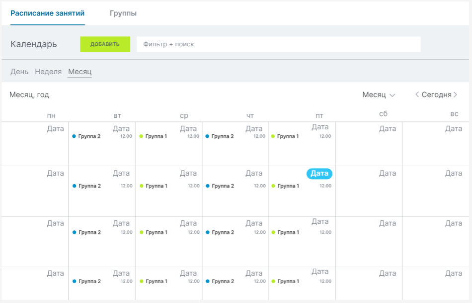
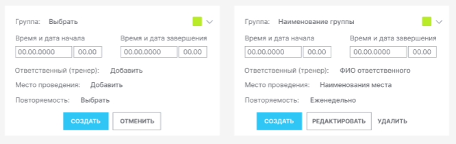
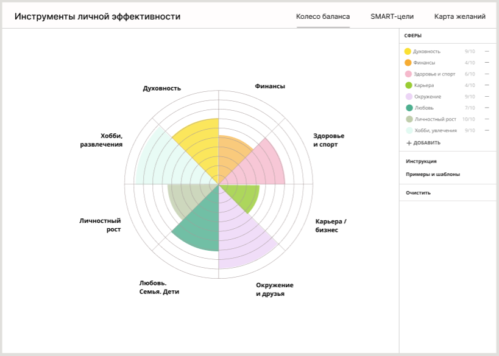
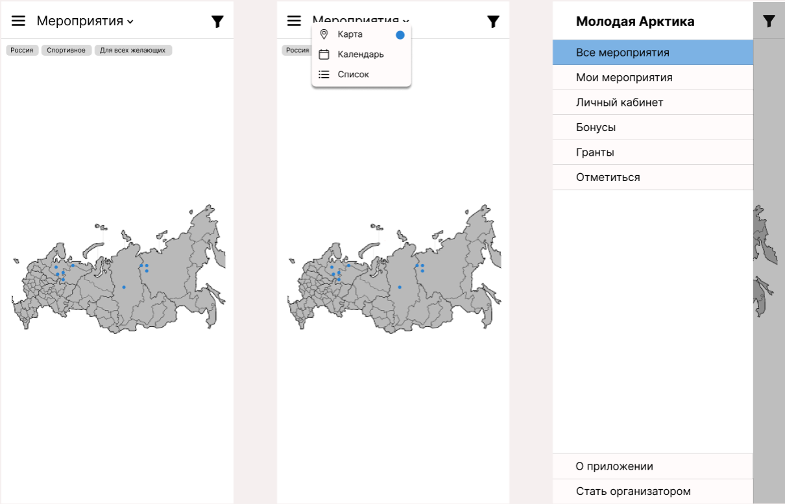
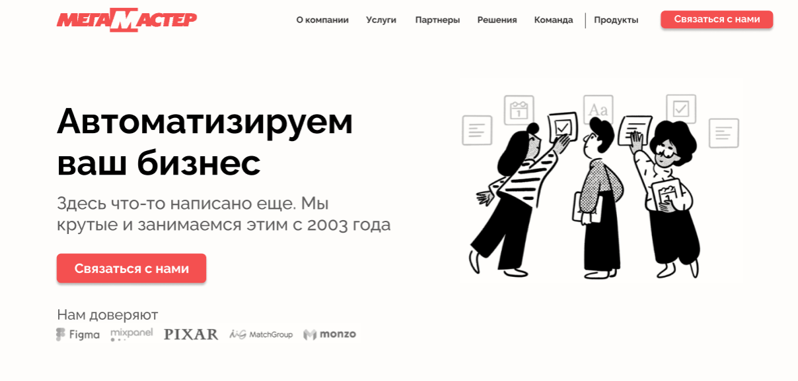
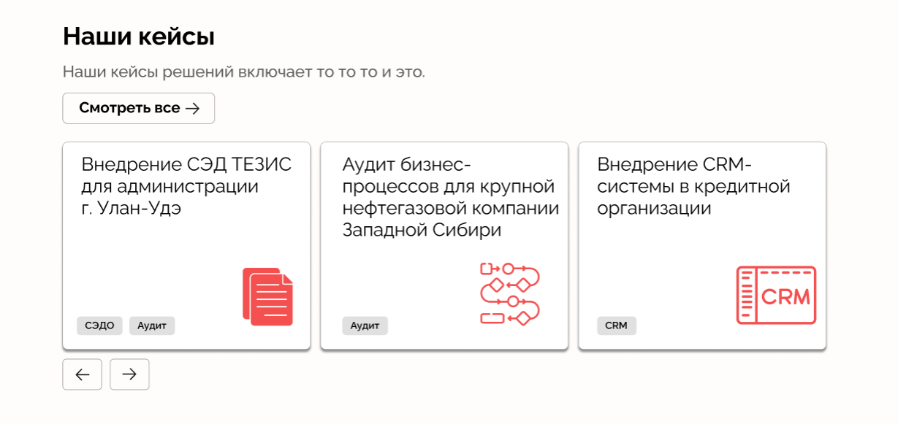

## Модуль "Расписание" в Битрикс24

Макеты для ТЗ на доработку Битрикс24 для заказчика. Само ТЗ можно посмотреть вот [тут](https://docs.google.com/document/d/1iYqMeKInD1UD3DEYQCHrmjCOa7D8U53c/edit)

Подробнее: https://www.figma.com/design/cNrLhfLWIEKUyzY9hcUoqQ/%D0%9C%D0%B0%D0%BA%D0%B5%D1%82%D1%8B-%D0%A0%D0%B0%D1%81%D0%BF%D0%B8%D1%81%D0%B0%D0%BD%D0%B8%D1%8F-%D0%91%D0%B8%D1%82%D1%80%D0%B8%D0%BA%D1%81?node-id=0-1&t=784uLVaGejqNVc4N-1

## Сайт "Колесо баланса"

Колесо баланса - это техника для анализа и планирования жизни. Ее суть заключается в построении круга и разделении его на секторы - сферы жизни. Каждой сфере ставится оценка и закрашивается соответствующая часть сектора. После того, как все сферы заполнены, можно оценить "круглость" построенного колеса. Чем колесо округлее, тем сбалансированее жизнь.

Делала для себя.

Подробнее: https://www.figma.com/design/yrpYez0nZr4wMvss3hWXOB/life-balance-wheel?node-id=0-1&t=bPJ5poepvf0apQmv-1

Итоговый сайт можно посмотреть по ссылке https://lermala.github.io/wheel_of_life/ 

Сайт делала я, исходный код можно посмотреть вот тут https://github.com/lermala/wheel_of_life 

## Мобильное приложение для спортивных мероприятий

Делала в рамках хакатона, поэтому макетов совсем немного.

Подробнее: https://www.figma.com/design/u1gFq4j1UTSBpq1n85laQX/Untitled?node-id=0-1&t=wKpTzgNA3cSM7qYc-1

## Сайт для компании

Делала как внутреннюю задачу:

Подробнее: https://www.figma.com/design/tCziI6KnBdygMiaoxIurhF/%D0%9C%D0%B0%D0%BA%D0%B5%D1%82-%D0%98%D0%A1%D0%98%D0%91?node-id=0-1&t=1OZSXUsj330xewbl-1

Я же потом его собрала на конструкторе Tilda. Ссылка на сайт: https://megamaster38.tilda.ws 