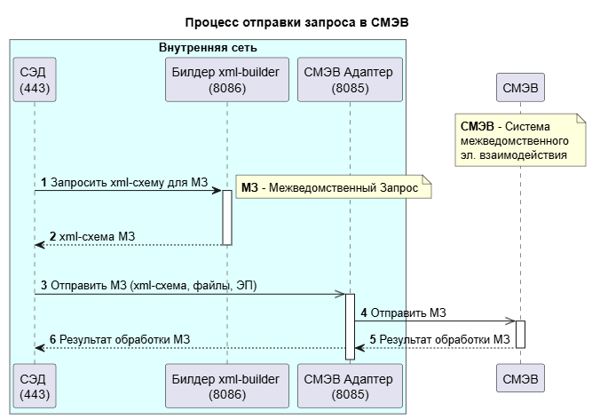

## Диаграммы последовательности
### Авторизация на сайте


{}
```yaml
autonumber

actor user
participant "website" as site
database "db" as db

user->site:enterCredentials()
activate user
activate site
site->db:validateLogin()
activate db
site<--db:loginResult
deactivate db
user<--site:loginResult
deactivate site
``` 
{}

### Процесс отправки запроса в СМЭВ


{}
```yaml
@startuml
title "Процесс отправки запроса в СМЭВ"

autonumber
!pragma teoz true

box "Внутренняя сеть" #LightCyan
participant "СЭД \n(443)" as sed
participant "Билдер xml-builder \n(8086)" as builder
participant "СМЭВ Адаптер \n(8085)" as adapter
end box

participant "СМЭВ" as smev

note over of smev 
**СМЭВ** - Система 
межведомственного 
эл. взаимодействия
end note 

sed -> builder++ : Запросить xml-схему для МЗ
note right: **МЗ** - Межведомственный Запрос
|||
sed <-- builder-- : xml-схема МЗ
|||
sed ->> adapter++ : Отправить МЗ (xml-схема, файлы, ЭП)
'sed <-- adapter : Сообщение об ошибке
adapter ->> smev++: Отправить МЗ
smev --> adapter --: Результат обработки МЗ
& adapter --> sed --: Результат обработки МЗ

@enduml
``` 
{}

### Работа с ОГ
На сайте можно подать обращение гражданина (ОГ). Эти обращения автоматически передаются в СЭД и создаются карточки входящих ОГ. При создании запускается процесс регистрации на пользователя, указанного в шаблоне для интеграции в СЭД (Шаблон для интеграции).

ОГ передаются с уникальным кодом "Уникальный идентификатор с сайта" (это поле скрыто для пользователей). На сайт обратно передается состояние в случае (см. класс TaskChangedListener):
- Принято к исполнению - если создано поручение на основании ОГ.
- Завершено - если поручение по ОГ завершено (ExtTask.isFinished(task))


{}
```yaml
@startuml
autonumber

title "Процесс получения обращения гражданина (ОГ) с сайта"

participant "СЭД" as sed
participant "Сайт" as site
actor "Работник по ОГ" as user

sed->>site++:GET /appeal/getAppeals
activate sed
sed<<--site--:список ОГ

loop 3. для каждого ОГ
    autonumber 3.1 
    sed->sed: saveResponse(appeal)
    note right 
        (=создать входящий ОГ)
    end note
    
    sed->user:назначить ОГ
    activate user
    ref over user 
        Процесс обработки ОГ, 
        полученного с сайта
    end ref
    site<<-sed++:GET /appeal/getSuccessOg{id}
    site-->>sed--:OK
    deactivate sed
end
@enduml
``` 
{}


{}
```yaml
@startuml
autonumber
'!pragma teoz true
'skinparam sequenceMessageAlign right
title "Процесс обработки обращения гражданина (ОГ), полученного с сайта"

participant "СЭД" as sed
participant "Сайт" as site
actor "Работник по ОГ" as user
participant "Поручение" as task

ref over sed
Процесс получения 
ОГ с сайта
end ref
sed -> user: назначить ОГ
activate sed
activate user
user->task **: создать поручение\nnew ExtTask()
activate task
task-->>sed: поручение создано
site<-sed++:PUT /appeal/sendStatus{id, status}\nstatus=Принято к исполнению
site-->sed--: OK
user->task:завершить поручение
deactivate user
task-->>sed: поручение завершено
deactivate task
site<-sed++:PUT /appeal/sendStatus{id, status}\nstatus=Завершено
site-->sed--: OK
deactivate sed

@enduml
``` 
{}

## Диаграммы прецендентов
### СЭД. Общий функционал

{}
```yaml
@startuml
left to right direction
skinparam packageStyle rectangle

actor "Пользователь" as User

rectangle "СЭД. Общие функции" {
    (Авторизоваться) as UC_Auth
    (Зайти по\nделегированию) as UC_Delegate
    (Открыть карточку*) as UC_Open
    (Посмотреть список\nдоступных карточек*) as UC_Watch
    (Создать карточку*) as UC_Create
    (Создать карточку\nна основании) as UC_CreateSub
    (Создать карточку\nпо шаблону) as UC_CreateByTemplate
    (Создать шаблон\nкарточки*) as UC_CreateTemplate
    (Вывести список\nв Excel) as UC_Excel
    (Найти карточку*) as UC_Search
    (Найти карточку\nпо атрибутам) as UC_SearchAttr
    (Найти карточку\nпо тексту) as UC_SearchFts
    (Оставить\nкомментарий\nв карточке*) as UC_Comment
    (Получить уведомление) as UC_RecieveNotif

    note right of (UC_Open) 
        Под __**карточкой**__ здесь и далее подразумеваются:
        * для просмотра - все доступные карточки
        в рамках группы доступа
        * для создания - все доступные типы карточек 
        (ОГ, МУ, документы, поручения) в рамках ролей
    endnote
}

' Связи акторов с прецедентами
User -- UC_Auth
User -- UC_Delegate
User -- UC_Create
User -- UC_CreateTemplate
User -- UC_Watch
User -- UC_Search
User -- UC_Open
User -- UC_Comment
User -- UC_RecieveNotif

' Вложенные связи
UC_Watch ..> UC_Excel : <<extend>>
UC_Search ..> UC_SearchAttr : <<extend>>
UC_Search ..> UC_SearchFts : <<extend>>
UC_Create ..> UC_CreateSub : <<extend>>
UC_Create ..> UC_CreateByTemplate : <<extend>>

@enduml
``` 
{}
### СЭД. Работа с МУ


{}
```yaml
@startuml
left to right direction
skinparam packageStyle rectangle

actor "Делопроизводитель" as Secretary
actor "Исполнитель (СПА)" as Executor

Secretary -|> Executor

rectangle "СЭД. Блок МУ" {
    (Получить Вх.МУ с сайта) as UC_CreateFromSite
    (Создать Вх.МУ) as UC_Create
    (Зарегистрировать Вх.МУ) as UC_Register
    (Редактировать Вх.МУ) as UC_Update
    (Поручить\nотв. исполнителю) as UC_SendToWork
    (Проверить ответ\nИсх.МУ) as UC_Check

    (Отправить на доработку) as UC_SendToRemake
    (Принять поручение) as UC_ApproveTask

    (Подготовить ответ\n =выполнить поручение) as UC_Execute
    (Отправить на\nсогласование) as UC_Send
    (Создать Исх.МУ) as UC_CreateResponse
    (Сделать запрос\nв СПА/Организацию) as UC_Request
    (Сделать\nмежведомственный\nзапрос) as UC_RequestSmev
}

' Связи акторов с прецедентами
Secretary -- UC_Create
Secretary -- UC_Register
Secretary -- UC_SendToWork
Secretary -- UC_Check
Secretary -- UC_CreateFromSite

Executor -- UC_Execute
Executor -- UC_Request
Executor -- UC_RequestSmev

' Вложенные связи
UC_Create ..> UC_Update : <<extend>>
UC_Check ..> UC_ApproveTask : <<extend>>
UC_Check ..> UC_SendToRemake : <<extend>>
UC_Execute <.. UC_CreateResponse : <<include>>
UC_Execute <.. UC_Send : <<include>>

@enduml

``` 
{}

## Диаграммы состояний
### Публикация МПА

{}
```yaml
@startuml
hide empty description

state "Опубликовать" as wait
state "Снято\nс публикации" as cancel

[*] -> wait
wait : do/ заполнить в МПА:\nназвание,издание,№
wait : exit/ клик на "Опубликовать"
wait -> Опубликование : данные\nзаполнены
Опубликование --> Опубликован : отправлено\nна публикацию
Опубликование : do/ POST /mpa/send{mpa}
Опубликование : do/ POST /mpa/sendMpaFiles{files}
Опубликован --> cancel : размещение\nнеактуально/\nошибочно
Опубликован -> [*]  : размещено\nна сайте
cancel --> [*] : удалено\nс сайта
wait <- cancel : повторить\nопубликование
cancel : entry/ клик на "Отменить публикацию" 
cancel : do/ DELETE /mpa/remove{url} 

@enduml
``` 
{}

### Состояния поручения

{}
```yaml
@startuml
hide empty description

title Состояния поручения

state "Новое" as new
state "В процессе" as inProcess
state "Отменено" as canceled
state "Завершено" as finished

[*] -> new
new --> inProcess

state inProcess {
    inProcess : entry/ клик на кнопку "Поручить" в РК поручения
    state "Назначено" as assigned
    state "В работе" as inWork
    state "Возвращено\nисполнителем" as returned
    state "Контролируемое\nпоручение" as controlling

    state isAuthor <<choice>> 

    [*] --> isAuthor
    isAuthor --> inWork : [создатель=автор]
    isAuthor --> assigned : [создатель!=автор]
    assigned --> inWork : принято\nв работу
    assigned --> controlling : выполнено\n[контролер\nназначен]
    'assigned -l-> returned : запрос переноса/\nуточнение/\nотказ
    returned <- assigned : запрос\nпереноса сроков/\nуточнение/\nотказ
    returned -> assigned : корректировка\nзавершена
    inWork --> controlling : выполнено\n[контролер\nназначен]
    'inWork --> finished : [контролер\nне назначен]

    state controlling {
        controlling : exit/ принято контролером
        state "На контроле" as onControl
        state "На доработке" as onCorrection
        onCorrection : exit/ клик на "Выполнено"

        onCorrection -l-> onControl : [замечания\nустранены]
        onControl -> onCorrection : [есть\nзамечания]
    }

    controlling --> [*] : принято\nконтролером
    inWork --> [*] : выполнено\n[контролер\nне назначен]
}

inProcess --> finished : процесс\nзавершен
inProcess --> canceled : процесс\nотменен
canceled --> [*] : процесс\nотменен
finished --> [*] : процесс\nзавершен

@enduml
``` 
{}

### Статусы исходящего документа

{}
```yaml
@startuml
hide empty description
title Статусы исходящего документа

state "Новый" as new
state "Отменен" as rejected
state "Зарегистрирован" as registered
state "Процесс запущен" as inProcess

[*] -> new

state inProcess {  
    state "Согласование ИСХ" as agreement
    state "На доработке" as onRevision
    state "На регистрации" as onRegistration

    state agreement {
        state "На утверждении" as onApproval
        state "На согласовании" as onAgreement
        state "Согласован" as agreed
        state "Утвержден" as approved

        new -> onAgreement : [согласующий\nуказан]
        new -> onApproval : [согласующий\nне указан]
        onAgreement --> onApproval : [утверждающий\nуказан]
        onAgreement --> agreed : [утверждающий\nне указан]
        onApproval --> approved
    }

    agreement --> onRevision : [есть\nзамечания]
    agreement <-- onRevision : [замечания\nустранены]
    agreed --> onRegistration
    approved --> onRegistration
    onRegistration --> registered : заполнен рег.номер, дата, дело
}

registered -> [*] : обработка завершена успешно
inProcess --> rejected : [процесс\nотменен]
rejected -> [*] : обработка\nотменена

@enduml
``` 
{}

## Диаграммы активностей
### Алгоритм работы нумератора
Алгоритм формирования регистрационного номера документов, ОГ, МУ


{}
```yaml
@startuml

title "Формирование регистрационного номера документов, ОГ, МУ"

start

:regNo="" (рег. номер);
floating note left : Формат нумератора:\n[префикс][номер]/[код подразделения]/[год]\nПримеры: Вх-1/07/22, Ис.ОГ-1/07/22
:regNo += префикс;
:regNo += getNextNum();
note left 
    **Важно!** Номер формируется в рамках
    **подразделения и вида документа.**

    У каждого подразделения свой 
    порядок документов.
endnote
:regNo += разделитель (/);

if (Код подразделения указан?) then (Да)
    if (Канцелярский вид документа) then (Входящий)
    :подразделение = адресат;
    else (Исходящий)
        :подразделение = отправитель;
    endif
    :regNo += код подразделения;
else (Нет)
    :regNo += код организации;
endif

:regNo += разделитель (/);
:regNo += год создания в формате YY;

stop

@enduml
``` 
{}

## Диаграммы развертывания

{}
```yaml

``` 
{}